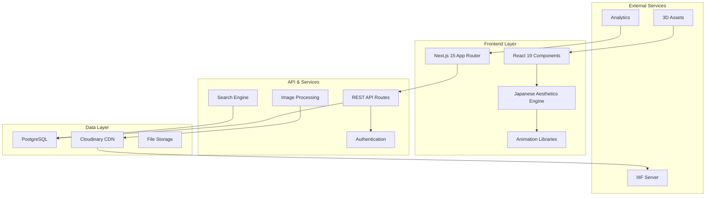
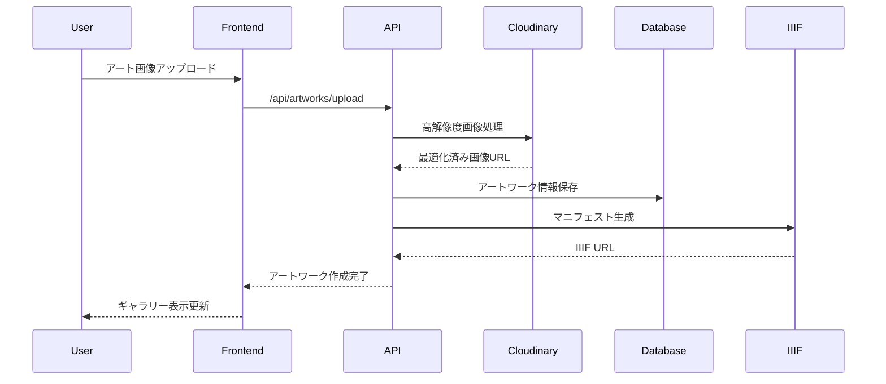

# 技術設計書

## 概要

Artistic Blog Siteは、日本の美学原理（間・侘寂・簡素）をNext.js 15とReact 19の最新技術に融合させた、アート愛好家とクリエイターのための高品質なブログプラットフォームです。IIIF準拠の画像配信、Three.jsによる3D仮想展示、豊富なCSSアニメーション、カスタムイラストレーションを統合し、没入的なアート体験を提供します。

## 要件対応関係

### 設計コンポーネントトレーサビリティ

各設計コンポーネントは特定の要件に対応しています：

- **画像管理・表示システム** → REQ-1: ビジュアルコンテンツ管理システム & アニメーション統合
- **日本美学デザインシステム** → REQ-2: 日本美学デザインシステム & CSSアニメーション
- **3D仮想展示エンジン** → REQ-3: バーチャル展示空間機能
- **アクセシビリティ統合** → REQ-4: ユーザー体験とアクセシビリティ
- **パフォーマンス最適化層** → REQ-5: パフォーマンスと技術要件
- **セキュリティ認証基盤** → REQ-6: セキュリティとプライバシー
- **コミュニティ機能** → REQ-7: コミュニティとソーシャル機能
- **教育プラットフォーム** → REQ-8: 教育とワークショップ機能
- **アニメーションエンジン** → REQ-9: 統合CSSアニメーションライブラリ活用
- **イラストレーション統合** → REQ-10: 最新ライブラリ統合とイラストレーション活用

### ユーザーストーリーカバレッジ

- ユーザーストーリー1（アーティスト）: 高品質画像表示とアニメーション効果によるArtworkViewerとGallerySystemで対応
- ユーザーストーリー2（デザイナー）: 日本美学の技術実装とCSSアニメーションライブラリ統合で対応
- ユーザーストーリー3（キュレーター）: Three.jsベースの3D仮想展示空間で対応
- ユーザーストーリー4（多様なユーザー）: アクセシビリティとローカライゼーション機能で対応
- ユーザーストーリー5（開発者）: 最適化されたパフォーマンス設計で対応

## アーキテクチャ

### システム全体構成



### 技術決定の根拠

**Next.js 15 App Router選択理由**:
- Server Componentsによる高品質アート画像のサーバーサイド最適化
- ISRとSSGによる美術コンテンツの高速配信
- 自動画像最適化によるWebP/AVIF変換で美術品の鮮明表示
- Turbopackによる開発効率と日本美学コンポーネントの高速開発

**React 19選択理由**:
- 新しいSuspenseとConcurrencyによる大容量アート画像の効率的処理
- useTransitionを活用したギャラリー画面遷移の最適化
- アニメーションライブラリとの統合における状態管理の向上

## テクノロジースタック

### フロントエンド技術スタック

```typescript
// 主要技術構成
{
  "framework": "Next.js 15.x",
  "runtime": "React 19.x",
  "language": "TypeScript 5.x",
  "styling": "Tailwind CSS 4.x",
  "animations": [
    "Framer Motion",    // 高レベルアニメーション
    "React Spring",     // 物理ベースアニメーション
    "GSAP",            // タイムラインアニメーション
    "Lottie",          // ベクターアニメーション
    "Anime.js"         // 軽量アニメーション
  ],
  "3d": ["Three.js", "React Three Fiber", "@react-three/drei"],
  "ui": ["Radix UI", "shadcn/ui", "Headless UI"],
  "images": ["Next.js Image", "Sharp", "Cloudinary"],
  "state": ["Zustand", "TanStack Query"],
  "forms": ["React Hook Form", "Zod"]
}
```

### アーキテクチャ決定根拠

**アニメーションライブラリ統合戦略**:
- **Framer Motion**: コンポーネントレベルのジェスチャーとページ遷移
- **GSAP**: 複雑なタイムラインとスクロールトリガー
- **React Spring**: 物理演算によるナチュラルなアニメーション
- **Lottie**: イラストレーターと連携したベクターアニメーション
- **CSS Modules**: パフォーマンス重視のマイクロインタラクション

**最新ライブラリ採用理由**:
- **TanStack Query**: サーバー状態管理とキャッシュ最適化
- **Zustand**: 軽量でシンプルなクライアント状態管理
- **Radix UI**: アクセシブルなプリミティブコンポーネント
- **Drizzle ORM**: 型安全なデータベース操作

## データフロー

### アート画像処理フロー



### 日本美学テーマ適用フロー

```mermaid
graph LR
    A[季節検出] --> B[カラーパレット選択]
    B --> C[コンポーネントテーマ適用]
    C --> D[アニメーション調整]
    D --> E[レイアウト計算]
    E --> F[Ma(間)適用]
    F --> G[最終レンダリング]
```

## コンポーネントとインターフェース

### 主要コンポーネント構成

#### 1. 画像表示コンポーネント群

```typescript
// components/art/ArtworkViewer.tsx
interface ArtworkViewerProps {
  artwork: {
    id: string;
    title: string;
    artist: string;
    imageUrl: string;
    highResUrl?: string;
    iiifManifest?: string;
    metadata: ArtworkMetadata;
    colorPalette?: string[];
  };
  viewMode: 'gallery' | 'detail' | 'comparison' | 'virtual';
  enableDeepZoom?: boolean;
  enableColorExtraction?: boolean;
  enableAnimations?: boolean;
}

// components/art/Gallery.tsx - スタガードアニメーション対応
interface GalleryProps {
  artworks: Artwork[];
  layout: 'masonry' | 'grid' | 'carousel' | 'timeline';
  animationType: 'stagger' | 'wave' | 'spiral' | 'organic';
  enableMa?: boolean; // 間（Ma）適用
}
```

#### 2. 日本美学コンポーネント群

```typescript
// components/japanese/MaLayout.tsx - 間（Ma）の実装
interface MaLayoutProps {
  spacing: 'minimal' | 'comfortable' | 'generous' | 'expansive';
  breathingRoom: boolean;
  children: ReactNode;
}

// components/japanese/SeasonalTheme.tsx - 季節テーマ
interface SeasonalThemeProps {
  season: 'spring' | 'summer' | 'autumn' | 'winter';
  autoDetect?: boolean;
  culturalCalendar?: boolean;
}

// components/japanese/WabiSabiAnimation.tsx - 侘寂表現
interface WabiSabiAnimationProps {
  element: ReactNode;
  imperfectionLevel: 'subtle' | 'moderate' | 'pronounced';
  temporalEffect: 'aging' | 'weathering' | 'natural';
}
```

#### 3. 3D仮想展示コンポーネント群

```typescript
// components/three/VirtualGallery.tsx
interface VirtualGalleryProps {
  exhibition: {
    id: string;
    title: string;
    artworks: Artwork[];
    environment: 'modern' | 'traditional' | 'zen' | 'industrial';
  };
  controls: 'orbit' | 'fps' | 'guided' | 'vr';
  lighting: 'museum' | 'gallery' | 'dramatic' | 'natural';
  enableVR?: boolean;
  enableAR?: boolean;
}
```

#### 4. アニメーションエンジンコンポーネント

```typescript
// components/animations/AnimationOrchestrator.tsx
interface AnimationOrchestratorProps {
  children: ReactNode;
  library: 'framer' | 'gsap' | 'spring' | 'lottie' | 'css';
  globalSettings: {
    respectReducedMotion: boolean;
    performanceMode: 'smooth' | 'performance' | 'battery';
    japaneseTiming: boolean; // 日本的タイミング調整
  };
}

// 統合アニメーションAPI
class AnimationManager {
  static staggeredFadeIn(elements: Element[], delay: number): Promise<void>
  static scrollTriggeredReveal(element: Element, options: ScrollOptions): void
  static seasonalTransition(from: Season, to: Season): Promise<void>
  static maBasedLayout(container: Element, spacingType: MaSpacing): void
}
```

### API設計

#### REST APIエンドポイント

```typescript
// API Routes構成
interface APIRoutes {
  // アートワーク管理
  'GET /api/artworks': { query: ArtworkFilters } => Artwork[]
  'POST /api/artworks': { body: CreateArtworkDto } => Artwork
  'GET /api/artworks/[id]': { params: { id: string } } => Artwork
  'PUT /api/artworks/[id]': { body: UpdateArtworkDto } => Artwork
  
  // 画像処理・最適化
  'POST /api/images/upload': { body: FormData } => UploadResponse
  'GET /api/images/[id]/palette': => ColorPalette
  'GET /api/images/[id]/iiif': => IIIFManifest
  
  // 3D展示
  'GET /api/exhibitions/virtual': => VirtualExhibition[]
  'GET /api/exhibitions/[id]/3d-assets': => ThreeJSAssets
  
  // 日本美学
  'GET /api/themes/seasonal': { query: { date?: string } } => SeasonalTheme
  'GET /api/colors/traditional': => JapaneseColorPalette
  
  // アニメーション
  'GET /api/animations/presets': => AnimationPreset[]
  'POST /api/animations/custom': { body: AnimationConfig } => AnimationId
}
```

#### GraphQL Schema補完

```graphql
type Artwork {
  id: ID!
  title: String!
  artist: Artist!
  images: [ArtworkImage!]!
  metadata: ArtworkMetadata!
  colorPalette: [String!]!
  iiifManifest: String
  createdAt: DateTime!
  updatedAt: DateTime!
}

type VirtualExhibition {
  id: ID!
  title: String!
  artworks: [Artwork!]!
  environment: ExhibitionEnvironment!
  lighting: LightingSetup!
  interactiveElements: [InteractiveElement!]!
}

type JapaneseAesthetic {
  ma: MaConfiguration!
  wabiSabi: WabiSabiSettings!
  kanso: KansoConfiguration!
  seasonalTheme: SeasonalTheme!
}
```

## データモデル

### データベーススキーマ設計

```sql
-- アートワークテーブル
CREATE TABLE artworks (
    id UUID PRIMARY KEY DEFAULT gen_random_uuid(),
    title VARCHAR(255) NOT NULL,
    artist_id UUID REFERENCES artists(id),
    description TEXT,
    technique VARCHAR(100),
    medium VARCHAR(100),
    dimensions VARCHAR(100),
    year_created INTEGER,
    culture VARCHAR(100),
    period VARCHAR(100),
    high_res_url TEXT NOT NULL,
    thumbnail_url TEXT NOT NULL,
    iiif_manifest_url TEXT,
    color_palette JSONB,
    metadata JSONB,
    tags TEXT[],
    is_featured BOOLEAN DEFAULT false,
    visibility VARCHAR(20) DEFAULT 'public',
    created_at TIMESTAMP WITH TIME ZONE DEFAULT NOW(),
    updated_at TIMESTAMP WITH TIME ZONE DEFAULT NOW()
);

-- アーティストテーブル
CREATE TABLE artists (
    id UUID PRIMARY KEY DEFAULT gen_random_uuid(),
    name VARCHAR(255) NOT NULL,
    name_kanji VARCHAR(255),
    biography TEXT,
    birth_year INTEGER,
    death_year INTEGER,
    nationality VARCHAR(100),
    art_movements TEXT[],
    profile_image_url TEXT,
    cultural_context JSONB,
    created_at TIMESTAMP WITH TIME ZONE DEFAULT NOW()
);

-- 仮想展示テーブル
CREATE TABLE virtual_exhibitions (
    id UUID PRIMARY KEY DEFAULT gen_random_uuid(),
    title VARCHAR(255) NOT NULL,
    title_kanji VARCHAR(255),
    description TEXT,
    curator_id UUID REFERENCES users(id),
    environment_type VARCHAR(50),
    lighting_config JSONB,
    camera_positions JSONB,
    interactive_elements JSONB,
    start_date TIMESTAMP WITH TIME ZONE,
    end_date TIMESTAMP WITH TIME ZONE,
    is_active BOOLEAN DEFAULT true,
    created_at TIMESTAMP WITH TIME ZONE DEFAULT NOW()
);

-- 展示作品関連テーブル
CREATE TABLE exhibition_artworks (
    id UUID PRIMARY KEY DEFAULT gen_random_uuid(),
    exhibition_id UUID REFERENCES virtual_exhibitions(id),
    artwork_id UUID REFERENCES artworks(id),
    position_x FLOAT,
    position_y FLOAT,
    position_z FLOAT,
    rotation_x FLOAT DEFAULT 0,
    rotation_y FLOAT DEFAULT 0,
    rotation_z FLOAT DEFAULT 0,
    scale FLOAT DEFAULT 1.0,
    display_order INTEGER,
    lighting_config JSONB,
    created_at TIMESTAMP WITH TIME ZONE DEFAULT NOW()
);

-- 日本美学設定テーブル
CREATE TABLE japanese_aesthetics (
    id UUID PRIMARY KEY DEFAULT gen_random_uuid(),
    entity_type VARCHAR(50), -- 'user', 'exhibition', 'artwork'
    entity_id UUID,
    ma_spacing VARCHAR(20) DEFAULT 'comfortable',
    wabi_sabi_level VARCHAR(20) DEFAULT 'subtle',
    kanso_minimalism BOOLEAN DEFAULT true,
    seasonal_theme VARCHAR(20),
    traditional_colors JSONB,
    created_at TIMESTAMP WITH TIME ZONE DEFAULT NOW()
);

-- ワークショップテーブル
CREATE TABLE workshops (
    id UUID PRIMARY KEY DEFAULT gen_random_uuid(),
    title VARCHAR(255) NOT NULL,
    instructor_id UUID REFERENCES users(id),
    technique VARCHAR(100),
    difficulty VARCHAR(20),
    duration_minutes INTEGER,
    materials JSONB,
    cultural_context TEXT,
    max_participants INTEGER,
    current_participants INTEGER DEFAULT 0,
    start_datetime TIMESTAMP WITH TIME ZONE,
    end_datetime TIMESTAMP WITH TIME ZONE,
    is_virtual BOOLEAN DEFAULT false,
    room_url TEXT,
    created_at TIMESTAMP WITH TIME ZONE DEFAULT NOW()
);

-- インデックス設定
CREATE INDEX idx_artworks_artist ON artworks(artist_id);
CREATE INDEX idx_artworks_featured ON artworks(is_featured) WHERE is_featured = true;
CREATE INDEX idx_artworks_tags ON artworks USING GIN(tags);
CREATE INDEX idx_artworks_color_palette ON artworks USING GIN(color_palette);
CREATE INDEX idx_artworks_search ON artworks USING GIN(to_tsvector('english', title || ' ' || description));
CREATE INDEX idx_exhibitions_active ON virtual_exhibitions(is_active, start_date, end_date);
CREATE INDEX idx_workshops_datetime ON workshops(start_datetime, end_datetime);
```

### TypeScript型定義

```typescript
// 主要エンティティ型
interface Artwork {
  id: string;
  title: string;
  artist: Artist;
  description: string;
  technique: string;
  medium: string;
  dimensions: string;
  yearCreated: number;
  culture: string;
  period: string;
  highResUrl: string;
  thumbnailUrl: string;
  iiifManifestUrl?: string;
  colorPalette: string[];
  metadata: ArtworkMetadata;
  tags: string[];
  isFeatured: boolean;
  visibility: 'public' | 'private' | 'limited';
  createdAt: Date;
  updatedAt: Date;
}

interface JapaneseAesthetics {
  maSpacing: 'minimal' | 'comfortable' | 'generous' | 'expansive';
  wabiSabiLevel: 'subtle' | 'moderate' | 'pronounced';
  kansoMinimalism: boolean;
  seasonalTheme: 'spring' | 'summer' | 'autumn' | 'winter';
  traditionalColors: JapaneseColor[];
}

interface VirtualExhibition {
  id: string;
  title: string;
  titleKanji?: string;
  description: string;
  curator: User;
  environmentType: 'modern' | 'traditional' | 'zen' | 'industrial';
  lightingConfig: LightingConfiguration;
  cameraPositions: CameraPosition[];
  interactiveElements: InteractiveElement[];
  artworks: ExhibitionArtwork[];
  startDate: Date;
  endDate: Date;
  isActive: boolean;
}

interface AnimationConfiguration {
  library: 'framer' | 'gsap' | 'spring' | 'lottie' | 'css';
  type: 'entrance' | 'exit' | 'interaction' | 'scroll' | 'hover';
  duration: number;
  easing: string;
  respectReducedMotion: boolean;
  japaneseTiming: boolean;
  staggerDelay?: number;
}
```

## エラーハンドリング

### エラー分類と対応戦略

```typescript
// エラーカテゴリ定義
enum ErrorCategory {
  IMAGE_PROCESSING = 'image_processing',
  THREE_D_RENDERING = '3d_rendering',
  ANIMATION_PERFORMANCE = 'animation_performance',
  USER_AUTHENTICATION = 'user_authentication',
  DATA_VALIDATION = 'data_validation',
  NETWORK_CONNECTIVITY = 'network_connectivity',
  BROWSER_COMPATIBILITY = 'browser_compatibility'
}

// エラーハンドリング統一インターフェース
interface ErrorHandler {
  category: ErrorCategory;
  severity: 'low' | 'medium' | 'high' | 'critical';
  userFriendlyMessage: string;
  technicalMessage: string;
  recoveryAction?: () => Promise<void>;
  fallbackComponent?: React.ComponentType;
}

// 具体的エラーハンドリング実装
class ArtworkErrorHandler {
  static handleImageLoadError(error: Error, artwork: Artwork): ErrorResponse {
    return {
      category: ErrorCategory.IMAGE_PROCESSING,
      severity: 'medium',
      userFriendlyMessage: 'アートワークの読み込みに失敗しました。しばらくしてからお試しください。',
      fallbackComponent: ArtworkPlaceholder,
      recoveryAction: () => this.retryImageLoad(artwork.id)
    };
  }
  
  static handle3DRenderError(error: WebGLError): ErrorResponse {
    return {
      category: ErrorCategory.THREE_D_RENDERING,
      severity: 'high',
      userFriendlyMessage: '3D展示の表示に対応していないブラウザです。2D表示で代替します。',
      fallbackComponent: FlatGalleryView,
      recoveryAction: () => this.switchTo2DMode()
    };
  }
}

// エラー境界コンポーネント
class ArtworkErrorBoundary extends React.ErrorBoundary {
  handleError = (error: Error, errorInfo: ErrorInfo) => {
    const handler = ArtworkErrorHandler.categorizeError(error);
    
    // ログ記録
    logError({
      error,
      errorInfo,
      category: handler.category,
      severity: handler.severity,
      userAgent: navigator.userAgent,
      timestamp: new Date().toISOString()
    });
    
    // ユーザー通知
    if (handler.severity === 'critical') {
      this.showErrorModal(handler.userFriendlyMessage);
    } else {
      this.showErrorToast(handler.userFriendlyMessage);
    }
    
    // 復旧試行
    if (handler.recoveryAction) {
      setTimeout(handler.recoveryAction, 1000);
    }
  };
}
```

### グローバルエラーハンドリング戦略

```typescript
// 統合エラー管理システム
class GlobalErrorManager {
  private static instance: GlobalErrorManager;
  private errorQueue: ErrorEvent[] = [];
  private retryAttempts: Map<string, number> = new Map();
  
  // 画像読み込みエラーの段階的フォールバック
  static handleImageError(imageUrl: string, context: 'thumbnail' | 'gallery' | 'detail'): string {
    const attempts = this.instance.retryAttempts.get(imageUrl) || 0;
    
    switch (attempts) {
      case 0:
        // WebP -> JPEG フォールバック
        return imageUrl.replace('.webp', '.jpg');
      case 1:
        // 高解像度 -> 標準解像度 フォールバック
        return imageUrl.replace('/v1_1/', '/v1_1/c_scale,w_800/');
      case 2:
        // プレースホルダー画像
        return '/images/artwork-placeholder.jpg';
      default:
        // 最終フォールバック（アートワーク用SVG）
        return `data:image/svg+xml,${encodeURIComponent(this.generateArtworkPlaceholderSVG())}`;
    }
  }
  
  // アニメーションエラーのパフォーマンス調整
  static handleAnimationError(animationType: string, error: Error): AnimationConfiguration {
    return {
      library: 'css', // より軽量な代替
      type: 'simplified',
      duration: 300, // 短縮
      easing: 'ease-out',
      respectReducedMotion: true,
      japaneseTiming: false // パフォーマンス優先
    };
  }
}
```

## セキュリティ考慮事項

### 認証・認可システム

```typescript
// NextAuth.js設定（app/api/auth/[...nextauth]/route.ts）
export const authOptions: NextAuthOptions = {
  providers: [
    GoogleProvider({
      clientId: process.env.GOOGLE_CLIENT_ID!,
      clientSecret: process.env.GOOGLE_CLIENT_SECRET!,
    }),
    CredentialsProvider({
      name: "credentials",
      credentials: {
        email: { label: "Email", type: "email" },
        password: { label: "Password", type: "password" }
      },
      async authorize(credentials) {
        // パスワード強度チェック（REQ-6要件対応）
        if (!isStrongPassword(credentials?.password)) {
          throw new Error('パスワードが要件を満たしていません');
        }
        
        // 二要素認証チェック
        const user = await verifyUserCredentials(credentials);
        if (user && user.twoFactorEnabled) {
          return await verifyTwoFactorAuth(user, credentials?.twoFactorCode);
        }
        
        return user;
      }
    })
  ],
  session: {
    strategy: "jwt",
    maxAge: 24 * 60 * 60, // 24時間
  },
  callbacks: {
    async jwt({ token, user, account }) {
      if (user) {
        token.role = user.role;
        token.permissions = user.permissions;
      }
      return token;
    },
    async session({ session, token }) {
      session.user.role = token.role;
      session.user.permissions = token.permissions;
      return session;
    }
  }
};

// RBAC（Role-Based Access Control）実装
enum UserRole {
  VISITOR = 'visitor',
  MEMBER = 'member',
  ARTIST = 'artist',
  CURATOR = 'curator',
  ADMIN = 'admin'
}

enum Permission {
  VIEW_ARTWORKS = 'view_artworks',
  UPLOAD_ARTWORKS = 'upload_artworks',
  CREATE_EXHIBITIONS = 'create_exhibitions',
  MODERATE_COMMENTS = 'moderate_comments',
  MANAGE_USERS = 'manage_users'
}

// 権限チェックミドルウェア
export function withAuth(handler: NextApiHandler, requiredPermissions: Permission[]) {
  return async (req: NextApiRequest, res: NextApiResponse) => {
    const session = await getServerSession(req, res, authOptions);
    
    if (!session) {
      return res.status(401).json({ error: '認証が必要です' });
    }
    
    const hasPermission = requiredPermissions.every(permission => 
      session.user.permissions.includes(permission)
    );
    
    if (!hasPermission) {
      return res.status(403).json({ error: '権限が不足しています' });
    }
    
    return handler(req, res);
  };
}
```

### データ保護とプライバシー

```typescript
// GDPR準拠データ処理
class PrivacyCompliantDataProcessor {
  // 個人情報の匿名化
  static anonymizeUserData(userData: UserData): AnonymizedUserData {
    return {
      id: hashUserId(userData.id),
      preferences: userData.artPreferences,
      engagementMetrics: userData.metrics,
      // 個人を特定できる情報は除外
      createdAt: userData.createdAt
    };
  }
  
  // データ削除権（忘れられる権利）の実装
  static async deleteUserData(userId: string): Promise<void> {
    await Promise.all([
      // ユーザーデータの完全削除
      deleteUser(userId),
      // 関連コメントの匿名化
      anonymizeUserComments(userId),
      // アップロード画像の削除
      deleteUserUploads(userId),
      // アナリティクスデータの匿名化
      anonymizeUserAnalytics(userId)
    ]);
  }
  
  // GDPR準拠のデータエクスポート
  static async exportUserData(userId: string): Promise<UserDataExport> {
    return {
      personalInfo: await getUserPersonalInfo(userId),
      artworkData: await getUserArtworks(userId),
      comments: await getUserComments(userId),
      preferences: await getUserPreferences(userId),
      exportDate: new Date().toISOString()
    };
  }
}

// ファイルアップロードセキュリティ
class SecureFileUpload {
  static async validateArtworkFile(file: File): Promise<ValidationResult> {
    // ファイルタイプ検証
    const allowedTypes = ['image/jpeg', 'image/png', 'image/webp', 'image/tiff'];
    if (!allowedTypes.includes(file.type)) {
      throw new Error('サポートされていないファイル形式です');
    }
    
    // ファイルサイズ制限
    const maxSize = 50 * 1024 * 1024; // 50MB
    if (file.size > maxSize) {
      throw new Error('ファイルサイズが上限を超えています');
    }
    
    // ウイルススキャン（REQ-6要件対応）
    await this.scanForMalware(file);
    
    // 画像内容検証
    await this.validateImageContent(file);
    
    return { isValid: true };
  }
  
  static async scanForMalware(file: File): Promise<void> {
    // 外部ウイルススキャンサービスとの統合
    const scanResult = await virusScanService.scan(file);
    if (!scanResult.clean) {
      throw new Error('セキュリティ上の理由でファイルを処理できません');
    }
  }
}
```

### API セキュリティ

```typescript
// レート制限とCSRF保護
import rateLimit from 'express-rate-limit';
import csrf from 'edge-csrf';

// APIレート制限設定
export const apiLimiter = rateLimit({
  windowMs: 15 * 60 * 1000, // 15分
  max: 100, // リクエスト上限
  message: 'リクエストが上限を超えました。しばらくしてからお試しください。',
  standardHeaders: true,
  legacyHeaders: false,
});

// アート画像アップロード専用レート制限
export const uploadLimiter = rateLimit({
  windowMs: 60 * 60 * 1000, // 1時間
  max: 10, // アップロード上限
  message: 'アップロード回数が上限を超えました。',
});

// CSRF保護
export const csrfProtection = csrf({
  cookie: {
    httpOnly: true,
    secure: process.env.NODE_ENV === 'production',
    sameSite: 'strict'
  }
});

// JWT トークン検証
export function verifyJWTToken(token: string): UserPayload | null {
  try {
    return jwt.verify(token, process.env.JWT_SECRET!) as UserPayload;
  } catch (error) {
    return null;
  }
}

// API入力データ検証
import { z } from 'zod';

export const artworkSchema = z.object({
  title: z.string().min(1).max(255),
  description: z.string().max(2000),
  technique: z.string().max(100),
  yearCreated: z.number().min(1000).max(new Date().getFullYear()),
  tags: z.array(z.string()).max(10),
  isPublic: z.boolean()
});
```

## パフォーマンスとスケーラビリティ

### 画像最適化戦略

```typescript
// Next.js Image最適化設定
export const imageConfig = {
  domains: ['res.cloudinary.com', 'iiif.artistic-blog-site.com'],
  formats: ['image/avif', 'image/webp'],
  deviceSizes: [640, 750, 828, 1080, 1200, 1920, 2048],
  imageSizes: [16, 32, 48, 64, 96, 128, 256, 384],
  minimumCacheTTL: 31536000, // 1年
  dangerouslyAllowSVG: false
};

// 段階的画像読み込みシステム
class ProgressiveImageLoader {
  static async loadArtworkImage(artwork: Artwork): Promise<string> {
    // 1. プレースホルダー表示
    const placeholder = this.generatePlaceholder(artwork);
    
    // 2. 低解像度版読み込み
    const lowRes = await this.loadImage(`${artwork.imageUrl}?w=400&q=30`);
    
    // 3. 高解像度版読み込み
    const highRes = await this.loadImage(`${artwork.imageUrl}?w=1920&q=80`);
    
    // 4. IIIF対応時は最高画質を遅延読み込み
    if (artwork.iiifManifestUrl) {
      setTimeout(() => this.preloadIIIFTiles(artwork.iiifManifestUrl!), 2000);
    }
    
    return highRes;
  }
  
  // ビューポート内画像の優先読み込み
  static initializeIntersectionObserver(): void {
    const observer = new IntersectionObserver((entries) => {
      entries.forEach((entry) => {
        if (entry.isIntersecting) {
          const img = entry.target as HTMLImageElement;
          img.src = img.dataset.src!;
          img.classList.remove('loading');
          observer.unobserve(img);
        }
      });
    }, {
      rootMargin: '50px 0px',
      threshold: 0.01
    });
    
    document.querySelectorAll('img[data-src]').forEach(img => {
      observer.observe(img);
    });
  }
}

// 3D アセット最適化
class ThreeJSOptimizer {
  static optimizeGalleryScene(scene: THREE.Scene): void {
    // LOD（Level of Detail）実装
    scene.traverse((object) => {
      if (object instanceof THREE.Mesh) {
        const lod = new THREE.LOD();
        lod.addLevel(object, 0);
        lod.addLevel(this.createLowPolyVersion(object), 50);
        lod.addLevel(this.createBillboard(object), 100);
        scene.add(lod);
      }
    });
    
    // テクスチャ圧縮
    scene.traverse((object) => {
      if (object instanceof THREE.Mesh && object.material.map) {
        object.material.map.format = THREE.CompressedTextureFormat;
        object.material.map.generateMipmaps = true;
      }
    });
  }
  
  // アートワークフレームの動的生成
  static createOptimizedFrame(artwork: Artwork): THREE.Group {
    const frameGeometry = new THREE.BufferGeometry();
    const framePositions = this.generateFrameVertices(artwork.dimensions);
    frameGeometry.setAttribute('position', new THREE.Float32BufferAttribute(framePositions, 3));
    
    const frameMaterial = new THREE.MeshPhysicalMaterial({
      color: 0x8B4513,
      metalness: 0.1,
      roughness: 0.8
    });
    
    return new THREE.Mesh(frameGeometry, frameMaterial);
  }
}
```

### キャッシュ戦略

```typescript
// 多層キャッシュシステム
class ArtworkCacheManager {
  private static readonly CACHE_KEYS = {
    ARTWORK_DETAIL: 'artwork:detail:',
    GALLERY_GRID: 'gallery:grid:',
    COLOR_PALETTE: 'colors:palette:',
    IIIF_MANIFEST: 'iiif:manifest:'
  };
  
  // Redis キャッシュ（サーバーサイド）
  static async cacheArtworkDetails(artworkId: string, data: Artwork): Promise<void> {
    await redis.setex(
      `${this.CACHE_KEYS.ARTWORK_DETAIL}${artworkId}`,
      3600, // 1時間
      JSON.stringify(data)
    );
  }
  
  // ブラウザキャッシュ（クライアントサイド）
  static async cacheInBrowser(key: string, data: any, ttl: number): Promise<void> {
    if ('caches' in window) {
      const cache = await caches.open('artwork-cache-v1');
      const response = new Response(JSON.stringify(data), {
        headers: {
          'Content-Type': 'application/json',
          'Cache-Control': `max-age=${ttl}`
        }
      });
      await cache.put(key, response);
    }
  }
  
  // IndexedDB キャッシュ（オフライン対応）
  static async cacheForOffline(artworks: Artwork[]): Promise<void> {
    const db = await openDB('ArtworkDB', 1, {
      upgrade(db) {
        db.createObjectStore('artworks', { keyPath: 'id' });
        db.createObjectStore('images', { keyPath: 'url' });
      }
    });
    
    const tx = db.transaction(['artworks', 'images'], 'readwrite');
    await Promise.all([
      ...artworks.map(artwork => tx.objectStore('artworks').put(artwork)),
      ...artworks.map(artwork => this.cacheImageForOffline(artwork.thumbnailUrl))
    ]);
  }
}

// CDN最適化設定
export const cdnConfig = {
  cloudinary: {
    cloudName: process.env.CLOUDINARY_CLOUD_NAME,
    optimizations: {
      format: 'auto',
      quality: 'auto',
      fetchFormat: 'auto',
      flags: ['progressive', 'immutable_cache']
    },
    transformations: {
      thumbnail: 'c_fill,w_400,h_400,q_auto',
      gallery: 'c_fit,w_1200,h_800,q_auto',
      detail: 'c_limit,w_2048,h_2048,q_90',
      iiif: 'fl_progressive,q_90'
    }
  }
};
```

### パフォーマンス監視

```typescript
// Core Web Vitals監視
class PerformanceMonitor {
  static initializeWebVitals(): void {
    // FCP (First Contentful Paint) 監視
    new PerformanceObserver((list) => {
      for (const entry of list.getEntries()) {
        if (entry.name === 'first-contentful-paint') {
          this.reportMetric('FCP', entry.startTime);
        }
      }
    }).observe({ entryTypes: ['paint'] });
    
    // LCP (Largest Contentful Paint) 監視
    new PerformanceObserver((list) => {
      const entries = list.getEntries();
      const lastEntry = entries[entries.length - 1];
      this.reportMetric('LCP', lastEntry.startTime);
    }).observe({ entryTypes: ['largest-contentful-paint'] });
    
    // CLS (Cumulative Layout Shift) 監視
    new PerformanceObserver((list) => {
      let cls = 0;
      for (const entry of list.getEntries()) {
        if (!entry.hadRecentInput) {
          cls += entry.value;
        }
      }
      this.reportMetric('CLS', cls);
    }).observe({ entryTypes: ['layout-shift'] });
  }
  
  // アート固有のパフォーマンス指標
  static measureArtworkLoadTime(artworkId: string): void {
    const startTime = performance.now();
    
    const observer = new PerformanceObserver((list) => {
      for (const entry of list.getEntries()) {
        if (entry.name.includes(artworkId)) {
          const loadTime = performance.now() - startTime;
          this.reportArtworkMetric(artworkId, 'load_time', loadTime);
        }
      }
    });
    
    observer.observe({ entryTypes: ['resource'] });
  }
}
```

## テスト戦略

### テスト階層とカバレッジ

```typescript
// 単体テスト - アートワークコンポーネント
describe('ArtworkViewer', () => {
  test('高解像度画像の段階的読み込み', async () => {
    const artwork = createMockArtwork();
    render(<ArtworkViewer artwork={artwork} enableDeepZoom />);
    
    // プレースホルダー表示確認
    expect(screen.getByTestId('artwork-placeholder')).toBeInTheDocument();
    
    // 低解像度画像読み込み確認
    await waitFor(() => {
      expect(screen.getByTestId('artwork-lowres')).toBeVisible();
    });
    
    // 高解像度画像読み込み確認
    await waitFor(() => {
      expect(screen.getByTestId('artwork-highres')).toBeVisible();
    }, { timeout: 5000 });
  });
  
  test('IIIF対応画像のディープズーム', async () => {
    const iiifArtwork = createMockIIIFArtwork();
    render(<ArtworkViewer artwork={iiifArtwork} enableDeepZoom />);
    
    const zoomButton = screen.getByTestId('zoom-in-button');
    fireEvent.click(zoomButton);
    
    await waitFor(() => {
      expect(screen.getByTestId('iiif-viewer')).toBeInTheDocument();
    });
  });
});

// 統合テスト - 3D ギャラリー
describe('VirtualGallery Integration', () => {
  test('3D展示空間の完全レンダリング', async () => {
    const exhibition = createMockExhibition();
    render(<VirtualGallery exhibition={exhibition} />);
    
    // WebGL サポート確認
    const canvas = screen.getByTestId('three-canvas');
    expect(canvas).toHaveAttribute('data-webgl', 'supported');
    
    // アートワーク配置確認
    await waitFor(() => {
      expect(screen.getByTestId('3d-artworks')).toHaveAttribute('data-loaded', 'true');
    });
    
    // インタラクション確認
    fireEvent.mouseMove(canvas, { clientX: 100, clientY: 100 });
    await waitFor(() => {
      expect(screen.getByTestId('camera-controls')).toHaveAttribute('data-active', 'true');
    });
  });
});

// E2E テスト - ユーザージャーニー
describe('Art Gallery User Journey', () => {
  test('アートワーク閲覧から3D展示まで', async ({ page }) => {
    // ホームページアクセス
    await page.goto('/');
    await expect(page.locator('[data-testid="featured-artworks"]')).toBeVisible();
    
    // アートワーク詳細表示
    await page.click('[data-testid="artwork-card"]:first-child');
    await expect(page.locator('[data-testid="artwork-detail"]')).toBeVisible();
    
    // カラーパレット確認
    await expect(page.locator('[data-testid="color-palette"]')).toBeVisible();
    
    // 3D展示へ移動
    await page.click('[data-testid="view-in-3d"]');
    await expect(page.locator('[data-testid="virtual-gallery"]')).toBeVisible();
    
    // 3D空間でのナビゲーション
    await page.mouse.move(400, 300);
    await page.mouse.down();
    await page.mouse.move(500, 300);
    await page.mouse.up();
    
    // 別のアートワークへの移動確認
    await expect(page.locator('[data-testid="artwork-frame"]:nth-child(2)')).toBeVisible();
  });
});

// パフォーマンステスト
describe('Performance Tests', () => {
  test('画像読み込みパフォーマンス', async () => {
    const startTime = Date.now();
    
    render(<Gallery artworks={createMockArtworks(50)} />);
    
    await waitFor(() => {
      expect(screen.getAllByTestId('artwork-image')).toHaveLength(50);
    });
    
    const loadTime = Date.now() - startTime;
    expect(loadTime).toBeLessThan(3000); // 3秒以内の読み込み
  });
  
  test('アニメーションフレームレート', async () => {
    const frameRates: number[] = [];
    let lastTime = performance.now();
    
    render(<AnimatedGallery />);
    
    const measureFrameRate = () => {
      const currentTime = performance.now();
      const fps = 1000 / (currentTime - lastTime);
      frameRates.push(fps);
      lastTime = currentTime;
      
      if (frameRates.length < 60) {
        requestAnimationFrame(measureFrameRate);
      }
    };
    
    requestAnimationFrame(measureFrameRate);
    
    await waitFor(() => {
      expect(frameRates.length).toBe(60);
    });
    
    const averageFPS = frameRates.reduce((a, b) => a + b) / frameRates.length;
    expect(averageFPS).toBeGreaterThan(30); // 30fps以上を維持
  });
});

// アクセシビリティテスト
describe('Accessibility Tests', () => {
  test('WCAG 2.1 AA準拠確認', async () => {
    const { container } = render(<ArtworkGallery />);
    const results = await axe(container);
    expect(results).toHaveNoViolations();
  });
  
  test('キーボードナビゲーション', async () => {
    render(<VirtualGallery />);
    
    // Tabキーでナビゲーション
    userEvent.tab();
    expect(screen.getByTestId('gallery-controls')).toHaveFocus();
    
    // Enterキーで操作
    userEvent.keyboard('{Enter}');
    await waitFor(() => {
      expect(screen.getByTestId('artwork-detail-modal')).toBeVisible();
    });
    
    // Escapeキーで閉じる
    userEvent.keyboard('{Escape}');
    await waitFor(() => {
      expect(screen.queryByTestId('artwork-detail-modal')).not.toBeInTheDocument();
    });
  });
});
```

### 品質保証と自動化

```typescript
// 自動画像品質検証
class ImageQualityValidator {
  static async validateArtworkImage(imageUrl: string): Promise<QualityReport> {
    const image = await this.loadImage(imageUrl);
    
    return {
      resolution: this.checkResolution(image),
      colorAccuracy: this.validateColorSpace(image),
      compression: this.analyzeCompression(image),
      accessibility: this.checkAccessibility(image)
    };
  }
  
  static checkResolution(image: HTMLImageElement): ResolutionCheck {
    const minWidth = 1200;
    const minHeight = 800;
    
    return {
      width: image.naturalWidth,
      height: image.naturalHeight,
      isAdequate: image.naturalWidth >= minWidth && image.naturalHeight >= minHeight,
      recommendation: image.naturalWidth < minWidth ? 'より高解像度の画像を使用してください' : 'OK'
    };
  }
}

// CI/CDパイプライン品質ゲート
const qualityGates = {
  // テストカバレッジ要件
  coverage: {
    lines: 85,
    branches: 80,
    functions: 90,
    statements: 85
  },
  
  // パフォーマンス要件
  performance: {
    maxBundleSize: '250kb',
    maxImageSize: '500kb',
    maxLoadTime: '3s',
    minLighthouseScore: 90
  },
  
  // アクセシビリティ要件
  accessibility: {
    wcagLevel: 'AA',
    maxViolations: 0,
    keyboardNavigation: 'required'
  }
};
```