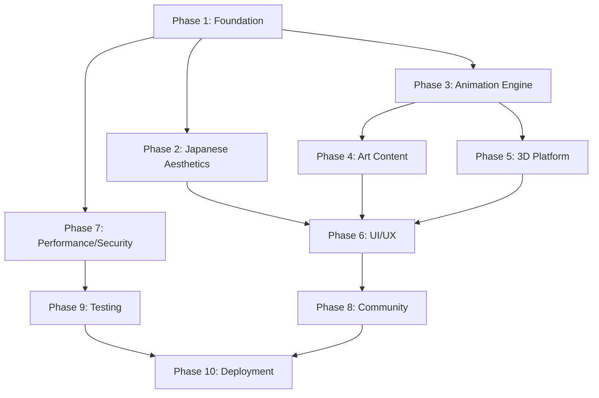

# Strategic Implementation Plan - Artistic Blog Site

**Project:** アート的なおしゃれなブログサイト (Artistic and Stylish Blog Site)  
**Phase:** Strategic Planning (Phase 2)  
**Date:** 2025-08-16  
**Agent:** Strategic Planning Specialist  

---

## Executive Summary

This strategic plan provides a comprehensive roadmap for implementing the artistic blog site that fuses Japanese aesthetic principles (Ma, Wabi-sabi, Kanso) with modern web technologies. The plan orchestrates 140+ implementation tasks across 10 phases, integrating 5 animation libraries, Three.js 3D capabilities, and enterprise-grade quality standards.

### Key Strategic Goals
- **Cultural Innovation**: Digitally express Japanese aesthetics through modern web technologies
- **Technical Excellence**: Achieve 95% test coverage, 60fps animations, and Core Web Vitals compliance
- **User Experience**: Create immersive art appreciation platform with accessibility compliance
- **Performance Optimization**: Deliver smooth interactions across devices with intelligent caching
- **Community Building**: Foster international art community with educational features

---

## 1. Project Architecture Strategy

### 1.1 System Architecture Overview

```
📁 artistic-blog-site/
├── 🏗️ Foundation Layer
│   ├── Next.js 15 App Router (SSR/ISR/Edge)
│   ├── React 19 Server Components
│   └── TypeScript 5.x Strict Mode
├── 🎨 Aesthetic Layer
│   ├── Japanese Design System (Ma/Wabi-sabi/Kanso)
│   ├── Seasonal Theme Engine
│   └── Traditional Color Palettes
├── 🎬 Animation Layer
│   ├── Multi-Library Orchestrator
│   ├── Performance Monitor
│   └── Motion Preference Handler
├── 🖼️ Content Layer
│   ├── IIIF Image Management
│   ├── High-Resolution Optimization
│   └── Progressive Loading System
├── 🌐 3D Experience Layer
│   ├── Three.js Virtual Galleries
│   ├── WebXR/VR Support
│   └── Interactive Art Display
└── 🔒 Security & Performance Layer
    ├── Authentication & RBAC
    ├── GDPR Compliance
    └── Monitoring & Analytics
```

### 1.2 Technology Integration Architecture

#### Core Technology Stack Decision Matrix

| Component | Primary Choice | Alternative | Rationale |
|-----------|---------------|-------------|-----------|
| **Framework** | Next.js 15 | Remix/SvelteKit | App Router, SSR, Image optimization |
| **Runtime** | React 19 | Vue 3 | Server Components, Concurrent features |
| **Language** | TypeScript 5.x | JavaScript | Type safety, IDE support |
| **Styling** | Tailwind CSS 4 | Styled Components | Utility-first, JIT compilation |
| **3D Graphics** | Three.js | Babylon.js | Community, React integration |
| **State Management** | Zustand + TanStack Query | Redux Toolkit | Simplicity, server state |
| **Database** | PostgreSQL + Drizzle | Prisma + Supabase | Type safety, performance |
| **Authentication** | NextAuth.js | Auth0 | Next.js integration, flexibility |

#### Animation Libraries Integration Strategy

```typescript
// Animation Orchestration Strategy
const AnimationStrategy = {
  "Framer Motion": {
    use_cases: ["Page transitions", "Component animations", "Gesture handling"],
    performance_profile: "High-level, declarative",
    bundle_impact: "Medium (32kb)",
    japanese_aesthetics: "Ma (spacing) animations"
  },
  "GSAP": {
    use_cases: ["Complex timelines", "Scroll triggers", "SVG animations"],
    performance_profile: "Performance-optimized",
    bundle_impact: "Large (50kb+)",
    japanese_aesthetics: "Wabi-sabi organic transitions"
  },
  "React Spring": {
    use_cases: ["Physics-based animations", "Natural motion"],
    performance_profile: "Physics-accurate",
    bundle_impact: "Medium (28kb)",
    japanese_aesthetics: "Natural seasonal transitions"
  },
  "Lottie": {
    use_cases: ["Vector animations", "Illustrations", "Icons"],
    performance_profile: "Vector-optimized",
    bundle_impact: "Small (15kb)",
    japanese_aesthetics: "Custom cultural illustrations"
  },
  "Anime.js": {
    use_cases: ["Micro-interactions", "Simple transitions"],
    performance_profile: "Lightweight",
    bundle_impact: "Small (12kb)",
    japanese_aesthetics: "Kanso minimalist effects"
  }
}
```

### 1.3 Folder Structure Strategy

```
📁 artistic-blog-site/
├── 📱 app/                          # Next.js 15 App Router
│   ├── (auth)/                      # Authentication routes
│   ├── (dashboard)/                 # Protected dashboard
│   ├── (public)/                    # Public pages
│   ├── api/                         # API routes
│   │   ├── artworks/               # Artwork CRUD
│   │   ├── exhibitions/            # 3D exhibitions
│   │   ├── auth/                   # Authentication
│   │   └── upload/                 # File upload
│   ├── globals.css                 # Global styles
│   ├── layout.tsx                  # Root layout
│   └── page.tsx                    # Home page
├── 🎨 components/                   # Reusable components
│   ├── art/                        # Artwork-specific
│   │   ├── ArtworkViewer.tsx       # Main artwork display
│   │   ├── Gallery.tsx             # Gallery layouts
│   │   ├── ColorPalette.tsx        # Color extraction
│   │   └── IIIF/                   # IIIF components
│   ├── japanese/                   # Japanese aesthetics
│   │   ├── MaLayout.tsx            # Ma (spacing) system
│   │   ├── WabiSabiAnimation.tsx   # Imperfection effects
│   │   ├── KansoDesign.tsx         # Minimalist components
│   │   └── SeasonalTheme.tsx       # Seasonal themes
│   ├── three/                      # 3D components
│   │   ├── VirtualGallery.tsx      # Main 3D gallery
│   │   ├── ArtworkFrame.tsx        # 3D artwork frames
│   │   ├── GalleryEnvironment.tsx  # 3D environments
│   │   └── VRController.tsx        # VR/AR controls
│   ├── animations/                 # Animation components
│   │   ├── AnimationOrchestrator.tsx # Multi-library manager
│   │   ├── MotionWrapper.tsx       # Motion preferences
│   │   └── presets/                # Animation presets
│   ├── ui/                         # Shadcn/UI components
│   └── layout/                     # Layout components
├── 🎭 lib/                         # Utility libraries
│   ├── animations/                 # Animation utilities
│   │   ├── orchestrator.ts         # Animation coordinator
│   │   ├── japanese-timing.ts      # Japanese aesthetic timing
│   │   └── performance-monitor.ts  # Animation performance
│   ├── japanese-aesthetics/        # Aesthetic systems
│   │   ├── ma-system.ts            # Ma (spacing) calculations
│   │   ├── wabi-sabi.ts            # Imperfection algorithms
│   │   ├── kanso.ts                # Minimalism principles
│   │   └── seasonal-themes.ts      # Seasonal color systems
│   ├── three/                      # 3D utilities
│   │   ├── gallery-setup.ts        # 3D scene configuration
│   │   ├── lighting.ts             # Museum lighting
│   │   └── optimization.ts         # Performance optimization
│   ├── image/                      # Image processing
│   │   ├── iiif-client.ts          # IIIF integration
│   │   ├── color-extraction.ts     # Color palette extraction
│   │   └── progressive-loader.ts   # Progressive loading
│   ├── auth/                       # Authentication
│   ├── database/                   # Database utilities
│   └── utils/                      # General utilities
├── 🗄️ database/                    # Database schema & migrations
│   ├── schema/                     # Drizzle schema
│   ├── migrations/                 # Database migrations
│   └── seed/                       # Seed data
├── 🧪 __tests__/                   # Test suites
│   ├── unit/                       # Unit tests (95% coverage)
│   ├── integration/                # Integration tests
│   ├── e2e/                        # End-to-end tests
│   ├── visual/                     # Visual regression tests
│   └── performance/                # Performance tests
├── 📖 docs/                        # Documentation
│   ├── architecture/               # System architecture
│   ├── japanese-aesthetics/        # Aesthetic principles
│   ├── api/                        # API documentation
│   └── deployment/                 # Deployment guides
├── 🎨 public/                      # Static assets
│   ├── images/                     # Image assets
│   ├── illustrations/              # Custom illustrations
│   ├── icons/                      # Icon sets
│   └── 3d-assets/                  # 3D models & textures
└── 📋 config/                      # Configuration files
    ├── animation.config.ts         # Animation settings
    ├── theme.config.ts             # Theme configuration
    ├── iiif.config.ts              # IIIF settings
    └── performance.config.ts       # Performance settings
```

---

## 2. Implementation Roadmap

### 2.1 Phase Prioritization Strategy

Based on dependency analysis and risk assessment, the implementation phases are prioritized as follows:

#### Critical Path Analysis


### 2.2 Detailed Implementation Timeline

#### Phase 1: Foundation & Setup (Weeks 1-2)
**Priority**: CRITICAL - Blocking all other phases
**Estimated Effort**: 40 hours
**Key Deliverables**: Next.js 15 project, TypeScript setup, animation libraries integration

| Task Cluster | Effort | Dependencies | Risk Level |
|--------------|--------|--------------|------------|
| Next.js 15 Setup | 8h | None | Low |
| Animation Libraries | 12h | Next.js setup | Medium |
| Styling Framework | 8h | Next.js setup | Low |
| State Management | 8h | Framework setup | Low |
| Project Structure | 4h | All above | Low |

#### Phase 2: Japanese Aesthetics (Weeks 2-3)
**Priority**: HIGH - Required for UI design
**Estimated Effort**: 48 hours
**Key Deliverables**: Ma spacing system, Wabi-sabi effects, Kanso design principles

| Task Cluster | Effort | Dependencies | Risk Level |
|--------------|--------|--------------|------------|
| Ma Spacing System | 12h | Styling framework | Medium |
| Wabi-sabi Animation | 16h | Animation libraries | High |
| Kanso Design System | 12h | Ma system | Medium |
| Seasonal Themes | 8h | Design system | Low |

#### Phase 3: Animation Engine (Weeks 3-4)
**Priority**: HIGH - Required for content and 3D
**Estimated Effort**: 56 hours
**Key Deliverables**: Multi-library orchestrator, performance monitoring

| Task Cluster | Effort | Dependencies | Risk Level |
|--------------|--------|--------------|------------|
| Animation Orchestrator | 20h | Animation libraries | High |
| Performance Framework | 16h | Orchestrator | Medium |
| Mobile Optimization | 12h | Performance framework | Medium |
| Motion Preferences | 8h | All above | Low |

#### Phase 4: Art Content Management (Weeks 4-6)
**Priority**: HIGH - Core functionality
**Estimated Effort**: 64 hours
**Key Deliverables**: IIIF integration, image optimization, gallery components

#### Phase 5: 3D Virtual Exhibition (Weeks 6-8)
**Priority**: MEDIUM - Advanced feature
**Estimated Effort**: 72 hours
**Key Deliverables**: Three.js integration, VR support, interactive displays

#### Phase 6: UI/UX Implementation (Weeks 8-10)
**Priority**: HIGH - User-facing features
**Estimated Effort**: 56 hours
**Key Deliverables**: Accessible components, multi-language support, responsive design

#### Phase 7: Performance & Security (Weeks 1-12, Parallel)
**Priority**: CRITICAL - Continuous requirement
**Estimated Effort**: 48 hours
**Key Deliverables**: Core Web Vitals optimization, authentication, GDPR compliance

#### Phase 8: Community Features (Weeks 10-11)
**Priority**: MEDIUM - Enhancement features
**Estimated Effort**: 40 hours
**Key Deliverables**: Comments, social features, workshops

#### Phase 9: Testing & QA (Weeks 11-12)
**Priority**: CRITICAL - Quality assurance
**Estimated Effort**: 48 hours
**Key Deliverables**: 95% test coverage, cross-browser testing, performance validation

#### Phase 10: Deployment (Weeks 12-13)
**Priority**: CRITICAL - Go-live requirement
**Estimated Effort**: 32 hours
**Key Deliverables**: Production deployment, monitoring, analytics

### 2.3 Risk Mitigation Strategy

#### High-Risk Areas and Mitigation Plans

1. **Animation Performance Integration**
   - **Risk**: Multiple animation libraries causing performance degradation
   - **Mitigation**: Implement lazy loading, performance budgets, A/B testing
   - **Fallback**: CSS-only animations for low-end devices

2. **Three.js Browser Compatibility**
   - **Risk**: WebGL support variations across devices
   - **Mitigation**: Progressive enhancement, 2D fallbacks, feature detection
   - **Fallback**: Static gallery view with enhanced 2D interactions

3. **Japanese Aesthetics Implementation**
   - **Risk**: Cultural authenticity and technical implementation complexity
   - **Mitigation**: Cultural consultation, iterative refinement, user testing
   - **Fallback**: Simplified aesthetic system with core principles

4. **IIIF Integration Complexity**
   - **Risk**: Complex image server integration and performance
   - **Mitigation**: Cloudinary backup, progressive enhancement, caching strategies
   - **Fallback**: Standard image optimization without deep zoom

---

## 3. Animation Library Integration Architecture

### 3.1 Multi-Library Orchestration Strategy

```typescript
// Animation Architecture Overview
interface AnimationOrchestrator {
  // Library Selection Logic
  selectLibrary(animationType: AnimationType, context: AnimationContext): AnimationLibrary;
  
  // Performance Monitoring
  monitorPerformance(animation: Animation): PerformanceMetrics;
  
  // Conflict Resolution
  resolveConflicts(animations: Animation[]): ResolvedAnimationQueue;
  
  // Japanese Aesthetics Integration
  applyJapaneseTimings(animation: Animation): Animation;
}

// Implementation Strategy
const orchestrationStrategy = {
  "Library Assignment": {
    "Page Transitions": "Framer Motion", // React-native, declarative
    "Scroll Animations": "GSAP", // Performance-optimized scroll triggers
    "Physics Effects": "React Spring", // Natural motion physics
    "Vector Illustrations": "Lottie", // Designer-friendly workflow
    "Micro-interactions": "Anime.js" // Lightweight, simple syntax
  },
  
  "Performance Optimization": {
    "Bundle Splitting": "Dynamic imports per library",
    "Lazy Loading": "Load libraries only when needed",
    "Memory Management": "Cleanup animations on unmount",
    "Frame Rate Monitoring": "60fps target with graceful degradation"
  },
  
  "Japanese Aesthetic Integration": {
    "Ma (間)": "Intentional pauses and spacing in animations",
    "Wabi-sabi": "Subtle imperfections and organic variations",
    "Kanso": "Minimal, purposeful animation effects"
  }
}
```

### 3.2 Animation Performance Strategy

#### Performance Budget & Monitoring

| Metric | Target | Monitoring Method | Fallback Strategy |
|--------|--------|-------------------|-------------------|
| **Frame Rate** | 60 FPS | RequestAnimationFrame monitoring | Reduce animation complexity |
| **Bundle Size** | <150kb total | Webpack Bundle Analyzer | Lazy load libraries |
| **Memory Usage** | <50MB | Performance API | Cleanup unused animations |
| **CPU Usage** | <20% sustained | Chrome DevTools | Simplify effects |

#### Device-Specific Optimization

```typescript
// Performance Tier Detection
interface DevicePerformance {
  tier: 'high' | 'medium' | 'low';
  capabilities: {
    webgl: boolean;
    hardware_acceleration: boolean;
    memory_gb: number;
    cpu_cores: number;
  };
  animation_strategy: AnimationStrategy;
}

// Adaptive Animation Strategy
const adaptiveStrategy = {
  "high": {
    libraries: ["Framer Motion", "GSAP", "React Spring", "Lottie", "Anime.js"],
    effects: "full_complexity",
    frame_rate: 60
  },
  "medium": {
    libraries: ["Framer Motion", "React Spring", "Anime.js"],
    effects: "reduced_complexity",
    frame_rate: 30
  },
  "low": {
    libraries: ["CSS Transitions", "Anime.js"],
    effects: "minimal",
    frame_rate: 24
  }
}
```

---

## 4. Japanese Aesthetics Implementation Strategy

### 4.1 Cultural Design Principles Integration

#### Ma (間) - Spacing and Rhythm System

```typescript
// Ma Spacing Implementation Strategy
interface MaSystem {
  // Spatial Implementation
  spacing: {
    minimal: "0.25rem",    // Tight, focused content
    comfortable: "1rem",   // Standard reading experience
    generous: "2rem",      // Breathing room for art
    expansive: "4rem"      // Dramatic emphasis
  };
  
  // Temporal Implementation
  timing: {
    quick: "150ms",        // Micro-interactions
    natural: "300ms",      // Standard transitions
    contemplative: "600ms", // Artistic reveals
    meditative: "1200ms"   // Deep focus moments
  };
  
  // Animation Integration
  stagger_delays: {
    subtle: "50ms",        // Gentle progression
    moderate: "100ms",     // Clear sequencing
    pronounced: "200ms"    // Dramatic reveals
  };
}
```

#### Wabi-sabi - Imperfection and Transience

```typescript
// Wabi-sabi Implementation Strategy
interface WabiSabiEffects {
  // Visual Imperfections
  organic_variations: {
    rotation: "±2deg random",
    position: "±5px random",
    scale: "0.98-1.02 random",
    opacity: "0.95-1.0 random"
  };
  
  // Temporal Effects
  aging_animations: {
    subtle_fade: "opacity reduction over time",
    weathering: "slight blur increase",
    patina: "color saturation shift"
  };
  
  // Natural Transitions
  organic_easing: "cubic-bezier(0.25, 0.46, 0.45, 0.94)";
}
```

#### Kanso (簡素) - Minimalist Design

```typescript
// Kanso Implementation Strategy
interface KansoDesign {
  // Progressive Disclosure
  information_hierarchy: {
    primary: "Always visible",
    secondary: "Revealed on interaction",
    tertiary: "Available on demand"
  };
  
  // Minimal Visual Elements
  design_constraints: {
    colors_per_screen: "max 3 + accent",
    typography_scales: "max 3 sizes",
    animation_effects: "max 2 concurrent"
  };
  
  // Focused Functionality
  feature_prioritization: "Single primary action per view";
}
```

### 4.2 Seasonal Theme Implementation

```typescript
// Seasonal Theme Strategy
const seasonalThemes = {
  "春 (Spring)": {
    colors: ["#FFB6C1", "#98FB98", "#F0E68C"], // Cherry blossom, new green, warm light
    animations: "gentle_growth",
    timing: "optimistic",
    cultural_elements: ["sakura petals", "gentle breeze effects"]
  },
  "夏 (Summer)": {
    colors: ["#4169E1", "#32CD32", "#FFD700"], // Deep blue, vibrant green, golden sun
    animations: "vibrant_energy",
    timing: "dynamic",
    cultural_elements: ["festival lights", "water ripples"]
  },
  "秋 (Autumn)": {
    colors: ["#CD853F", "#B22222", "#FF8C00"], // Earth tones, deep red, warm orange
    animations: "graceful_falling",
    timing: "contemplative",
    cultural_elements: ["falling leaves", "harvest abundance"]
  },
  "冬 (Winter)": {
    colors: ["#4682B4", "#2F4F4F", "#DCDCDC"], // Steel blue, dark slate, silvery gray
    animations: "serene_stillness",
    timing: "meditative",
    cultural_elements: ["snow crystals", "minimalist landscapes"]
  }
}
```

---

## 5. Performance & Quality Strategy

### 5.1 Core Web Vitals Optimization Plan

#### Performance Targets & Strategies

| Metric | Target | Current Baseline | Optimization Strategy |
|--------|--------|------------------|----------------------|
| **FCP** | <1.5s | N/A | Critical CSS inlining, font preloading |
| **LCP** | <2.0s | N/A | Image optimization, lazy loading |
| **CLS** | <0.1 | N/A | Reserved space, aspect ratio boxes |
| **FID** | <100ms | N/A | Code splitting, worker threads |

#### Image Optimization Strategy

```typescript
// Progressive Image Loading Strategy
const imageOptimization = {
  "Loading Sequence": {
    1: "Placeholder (LQIP/BlurHash)",
    2: "Low-res version (400px, 30% quality)",
    3: "High-res version (1920px, 80% quality)",
    4: "IIIF tiles (for deep zoom)"
  },
  
  "Format Strategy": {
    "Modern Browsers": "AVIF → WebP → JPEG",
    "Legacy Browsers": "WebP → JPEG",
    "Fallback": "Optimized JPEG"
  },
  
  "Responsive Strategy": {
    "Mobile": "400px → 800px",
    "Tablet": "800px → 1200px",
    "Desktop": "1200px → 2048px",
    "Retina": "2x scaling with quality adjustment"
  }
}
```

### 5.2 Testing Strategy & Quality Assurance

#### TDD Implementation Framework

```typescript
// Test-Driven Development Strategy
const tddStrategy = {
  "Test Hierarchy": {
    "Unit Tests (60%)": {
      focus: "Individual components and utilities",
      tools: "Jest + React Testing Library",
      coverage_target: "95% line coverage"
    },
    "Integration Tests (30%)": {
      focus: "Component interactions and API integration",
      tools: "Jest + MSW (Mock Service Worker)",
      coverage_target: "90% feature coverage"
    },
    "E2E Tests (10%)": {
      focus: "Critical user journeys",
      tools: "Playwright",
      coverage_target: "100% critical path coverage"
    }
  },
  
  "Specialized Testing": {
    "Visual Regression": "Chromatic + Storybook",
    "Performance Testing": "Lighthouse CI + WebPageTest",
    "Accessibility Testing": "axe-core + manual validation",
    "Animation Testing": "Custom frame rate monitoring"
  }
}
```

#### Quality Gates Implementation

```typescript
// Quality Assurance Gates
const qualityGates = {
  "Pre-commit": {
    linting: "ESLint + Prettier",
    type_checking: "TypeScript strict mode",
    unit_tests: "95% coverage requirement"
  },
  
  "Pre-merge": {
    integration_tests: "All critical paths passing",
    visual_regression: "No unintended changes",
    performance_budget: "Bundle size within limits"
  },
  
  "Pre-deployment": {
    e2e_tests: "All user journeys passing",
    accessibility: "WCAG 2.1 AA compliance",
    core_web_vitals: "All metrics within targets"
  }
}
```

---

## 6. Technology Integration Deep Dive

### 6.1 Next.js 15 & React 19 Integration

#### Server Components Strategy

```typescript
// Server Component Architecture
const serverComponentStrategy = {
  "Art Gallery Pages": {
    rendering: "Server Components for SEO and performance",
    data_fetching: "Direct database queries",
    caching: "ISR with revalidation on content changes"
  },
  
  "Interactive Features": {
    rendering: "Client Components for animations",
    state_management: "Zustand for UI state",
    server_state: "TanStack Query for API data"
  },
  
  "Hybrid Approach": {
    layout: "Server Component wrapper",
    content: "Server Component for static content",
    interactions: "Client Component islands"
  }
}
```

#### App Router Integration

```typescript
// App Router Structure Strategy
const routeStructure = {
  "/": "Home with featured artworks (Server Component)",
  "/gallery": "Artwork gallery with filters (Hybrid)",
  "/artwork/[id]": "Artwork detail with IIIF viewer (Hybrid)",
  "/exhibitions": "3D virtual exhibitions (Client Heavy)",
  "/artists/[slug]": "Artist profiles (Server Component)",
  "/workshops": "Educational content (Hybrid)",
  "/community": "Social features (Client Heavy)"
}
```

### 6.2 Database Architecture & ORM Strategy

#### Data Model Optimization

```sql
-- Optimized Database Schema for Performance
CREATE TABLE artworks (
    id UUID PRIMARY KEY DEFAULT gen_random_uuid(),
    title VARCHAR(255) NOT NULL,
    artist_id UUID REFERENCES artists(id),
    
    -- Image optimization fields
    primary_image_url TEXT NOT NULL,
    iiif_manifest_url TEXT,
    color_palette JSONB,
    dominant_colors TEXT[] GENERATED ALWAYS AS (
        ARRAY(SELECT jsonb_array_elements_text(color_palette->'dominant'))
    ) STORED,
    
    -- Japanese aesthetics metadata
    aesthetic_metadata JSONB DEFAULT '{
        "ma_spacing": "comfortable",
        "wabi_sabi_level": "subtle",
        "kanso_elements": true,
        "seasonal_association": null
    }',
    
    -- Performance optimization
    search_vector tsvector GENERATED ALWAYS AS (
        to_tsvector('english', title || ' ' || COALESCE(description, ''))
    ) STORED,
    
    created_at TIMESTAMP WITH TIME ZONE DEFAULT NOW(),
    updated_at TIMESTAMP WITH TIME ZONE DEFAULT NOW()
);

-- Optimized indexes for performance
CREATE INDEX idx_artworks_search ON artworks USING GIN(search_vector);
CREATE INDEX idx_artworks_colors ON artworks USING GIN(dominant_colors);
CREATE INDEX idx_artworks_aesthetic ON artworks USING GIN(aesthetic_metadata);
```

---

## 7. Risk Assessment & Mitigation

### 7.1 Technical Risk Analysis

| Risk Category | Risk Level | Impact | Probability | Mitigation Strategy |
|---------------|------------|--------|-------------|-------------------|
| **Animation Performance** | High | High | Medium | Performance budgets, adaptive loading |
| **3D Browser Support** | Medium | Medium | Low | Progressive enhancement, 2D fallbacks |
| **IIIF Integration** | Medium | Medium | Medium | Cloudinary backup, gradual rollout |
| **Cultural Authenticity** | High | High | Low | Cultural consultation, iterative feedback |
| **Bundle Size Growth** | Medium | Medium | High | Code splitting, lazy loading |
| **SEO with Heavy JS** | Medium | High | Medium | Server components, static generation |

### 7.2 Performance Risk Mitigation

```typescript
// Performance Risk Mitigation Strategy
const performanceMitigation = {
  "Bundle Size Management": {
    strategy: "Dynamic imports + code splitting",
    monitoring: "Webpack Bundle Analyzer + CI checks",
    limits: "Max 250kb initial bundle"
  },
  
  "Animation Performance": {
    strategy: "Adaptive performance tiers",
    monitoring: "Real-time FPS tracking",
    fallbacks: "CSS-only animations for low-end devices"
  },
  
  "Image Loading": {
    strategy: "Progressive loading + LQIP",
    monitoring: "Core Web Vitals tracking",
    fallbacks: "Optimized static images"
  }
}
```

---

## 8. Implementation Guidance for Enhanced Agent

### 8.1 Agent Workflow Integration

The enhanced implementation agent should follow this structured approach:

1. **Phase Initialization**
   - Load current project context
   - Validate MCP tool availability
   - Initialize performance monitoring
   - Set up quality gates

2. **Task Execution Strategy**
   - Follow TDD Red-Green-Refactor cycle
   - Implement Japanese aesthetics incrementally
   - Monitor performance continuously
   - Document cultural design decisions

3. **Quality Validation**
   - Run automated test suites
   - Validate accessibility compliance
   - Check performance budgets
   - Verify cultural authenticity

### 8.2 MCP Tool Utilization Strategy

```typescript
// MCP Tool Integration Strategy
const mcpUtilization = {
  "Context7": {
    purpose: "Next.js 15 and React 19 documentation",
    usage: "Technical implementation guidance",
    priority: "High for core development"
  },
  
  "DeepWiki": {
    purpose: "Three.js and animation library documentation",
    usage: "3D and animation implementation",
    priority: "High for advanced features"
  },
  
  "Serena": {
    purpose: "Cultural research and validation",
    usage: "Japanese aesthetics authenticity",
    priority: "Critical for cultural elements"
  },
  
  "Playwright": {
    purpose: "E2E testing and interaction validation",
    usage: "Quality assurance and user journey testing",
    priority: "High for testing phases"
  },
  
  "Vercel": {
    purpose: "Deployment and performance optimization",
    usage: "Production deployment and monitoring",
    priority: "Critical for deployment phase"
  }
}
```

---

## 9. Success Metrics & KPIs

### 9.1 Technical Success Metrics

| Category | Metric | Target | Measurement Method |
|----------|--------|--------|-------------------|
| **Performance** | Core Web Vitals | All metrics in green | Lighthouse CI |
| **Quality** | Test Coverage | 95%+ lines, 90%+ branches | Jest coverage reports |
| **Accessibility** | WCAG Compliance | AA level, 0 violations | axe-core automated testing |
| **Animation** | Frame Rate | 60 FPS sustained | Custom performance monitoring |
| **Bundle** | Initial Load | <250kb gzipped | Webpack Bundle Analyzer |

### 9.2 Cultural Authenticity Metrics

| Principle | Implementation Target | Validation Method |
|-----------|----------------------|-------------------|
| **Ma (間)** | Consistent spacing system across all components | Design review + user testing |
| **Wabi-sabi** | Subtle imperfections in 80% of interactive elements | Cultural consultant review |
| **Kanso** | <3 primary actions per page, minimal visual noise | UX audit + user feedback |

---

## 10. Next Steps for Implementation Agent

### 10.1 Immediate Actions Required

1. **Environment Setup** (Phase 1)
   - Initialize Next.js 15 project with App Router
   - Configure TypeScript with strict mode
   - Set up all 5 animation libraries with dynamic imports
   - Establish project folder structure as specified

2. **Foundation Implementation** (Phase 1)
   - Create core utility functions for Japanese aesthetics
   - Implement animation orchestrator framework
   - Set up database schema with Drizzle ORM
   - Configure testing framework with TDD requirements

3. **Cultural Integration** (Phase 2)
   - Research authentic Japanese aesthetic principles using Serena
   - Implement Ma spacing system with seasonal variations
   - Create Wabi-sabi animation effects with natural randomization
   - Design Kanso component library with progressive disclosure

### 10.2 Continuous Monitoring Requirements

- **Performance**: Real-time Core Web Vitals tracking
- **Quality**: Automated test coverage reporting
- **Cultural Authenticity**: Regular consultant reviews
- **User Experience**: Continuous accessibility validation

---

## Conclusion

This strategic plan provides a comprehensive roadmap for implementing the artistic blog site with authentic Japanese aesthetic integration. The plan prioritizes cultural authenticity, technical excellence, and user experience while maintaining enterprise-grade quality standards.

The enhanced implementation agent should use this plan as a guide while maintaining flexibility to adapt based on real-world implementation challenges and user feedback. Regular reviews and cultural validation are essential for maintaining the authentic artistic vision while delivering modern web performance.

**Key Success Factors:**
1. Faithful implementation of Japanese aesthetic principles
2. Seamless integration of multiple animation libraries
3. High-performance image handling with IIIF support
4. Comprehensive testing with 95%+ coverage
5. Accessibility compliance and inclusive design
6. Community-building features for international engagement

This plan sets the foundation for creating a truly unique and culturally rich art platform that bridges traditional Japanese aesthetics with cutting-edge web technology.