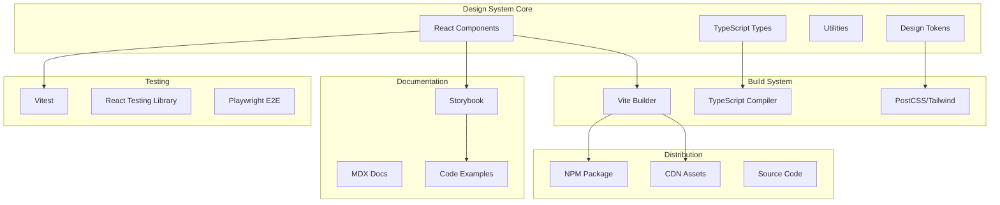

# B2B Design System - Technical Design Document

## 1. System Architecture Overview

### 1.1 High-Level Architecture



### 1.2 Component Architecture

```typescript
// Component Structure Pattern
interface ComponentArchitecture {
  // Core component logic
  component: React.FC<Props>;
  
  // TypeScript types
  types: {
    props: PropsInterface;
    variants: VariantTypes;
    sizes: SizeTypes;
  };
  
  // Styling system
  styles: {
    base: TailwindClasses;
    variants: VariantClasses;
    responsive: ResponsiveClasses;
  };
  
  // Composition patterns
  subcomponents?: {
    [key: string]: React.FC;
  };
  
  // Utilities
  utils: {
    cn: ClassNameMerger;
    validators: ValidationFunctions;
    formatters: FormatFunctions;
  };
}
```

## 2. Technology Stack Details

### 2.1 Core Dependencies

```json
{
  "dependencies": {
    "react": "^18.3.0",
    "react-dom": "^18.3.0",
    "clsx": "^2.1.0",
    "tailwind-merge": "^2.2.0",
    "@radix-ui/react-accordion": "^1.1.2",
    "@radix-ui/react-alert-dialog": "^1.0.5",
    "@radix-ui/react-checkbox": "^1.0.4",
    "@radix-ui/react-dialog": "^1.0.5",
    "@radix-ui/react-dropdown-menu": "^2.0.6",
    "@radix-ui/react-select": "^2.0.0",
    "@radix-ui/react-tabs": "^1.0.4",
    "@radix-ui/react-toast": "^1.1.5",
    "@tanstack/react-table": "^8.11.0",
    "react-hook-form": "^7.48.0",
    "zod": "^3.22.0",
    "date-fns": "^3.0.0",
    "recharts": "^2.10.0"
  },
  "devDependencies": {
    "typescript": "^5.3.0",
    "@types/react": "^18.2.0",
    "@types/react-dom": "^18.2.0",
    "vite": "^5.0.0",
    "@vitejs/plugin-react": "^4.2.0",
    "tailwindcss": "^3.4.0",
    "postcss": "^8.4.0",
    "autoprefixer": "^10.4.0",
    "@storybook/react-vite": "^7.6.0",
    "@storybook/addon-essentials": "^7.6.0",
    "@storybook/addon-a11y": "^7.6.0",
    "vitest": "^1.1.0",
    "@testing-library/react": "^14.1.0",
    "@testing-library/user-event": "^14.5.0",
    "playwright": "^1.40.0",
    "eslint": "^8.56.0",
    "prettier": "^3.1.0"
  }
}
```

### 2.2 Build Configuration

#### Vite Configuration
```typescript
// vite.config.ts
import { defineConfig } from 'vite';
import react from '@vitejs/plugin-react';
import path from 'path';
import { peerDependencies } from './package.json';

export default defineConfig({
  plugins: [react()],
  build: {
    lib: {
      entry: path.resolve(__dirname, 'src/index.ts'),
      name: 'B2BDesignSystem',
      fileName: (format) => `b2b-design-system.${format}.js`,
      formats: ['es', 'cjs', 'umd']
    },
    rollupOptions: {
      external: Object.keys(peerDependencies),
      output: {
        globals: {
          react: 'React',
          'react-dom': 'ReactDOM'
        },
        assetFileNames: 'assets/[name][extname]',
        entryFileNames: '[name].js',
      }
    },
    sourcemap: true,
    minify: 'terser',
  },
  resolve: {
    alias: {
      '@': path.resolve(__dirname, 'src'),
    },
  },
});
```

#### Tailwind Configuration
```typescript
// tailwind.config.ts
import type { Config } from 'tailwindcss';

const config: Config = {
  darkMode: ['class'],
  content: [
    './src/**/*.{ts,tsx}',
    './stories/**/*.{ts,tsx}',
  ],
  theme: {
    extend: {
      colors: {
        border: 'hsl(var(--border))',
        input: 'hsl(var(--input))',
        ring: 'hsl(var(--ring))',
        background: 'hsl(var(--background))',
        foreground: 'hsl(var(--foreground))',
        primary: {
          DEFAULT: 'hsl(var(--primary))',
          foreground: 'hsl(var(--primary-foreground))',
        },
        secondary: {
          DEFAULT: 'hsl(var(--secondary))',
          foreground: 'hsl(var(--secondary-foreground))',
        },
        destructive: {
          DEFAULT: 'hsl(var(--destructive))',
          foreground: 'hsl(var(--destructive-foreground))',
        },
        muted: {
          DEFAULT: 'hsl(var(--muted))',
          foreground: 'hsl(var(--muted-foreground))',
        },
        accent: {
          DEFAULT: 'hsl(var(--accent))',
          foreground: 'hsl(var(--accent-foreground))',
        },
      },
      borderRadius: {
        lg: 'var(--radius)',
        md: 'calc(var(--radius) - 2px)',
        sm: 'calc(var(--radius) - 4px)',
      },
      keyframes: {
        'accordion-down': {
          from: { height: '0' },
          to: { height: 'var(--radix-accordion-content-height)' },
        },
        'accordion-up': {
          from: { height: 'var(--radix-accordion-content-height)' },
          to: { height: '0' },
        },
      },
      animation: {
        'accordion-down': 'accordion-down 0.2s ease-out',
        'accordion-up': 'accordion-up 0.2s ease-out',
      },
    },
  },
  plugins: [require('tailwindcss-animate')],
};

export default config;
```

## 3. Component Implementation Patterns

### 3.1 Base Component Pattern

```typescript
// components/buttons/Button/Button.tsx
import * as React from 'react';
import { Slot } from '@radix-ui/react-slot';
import { cva, type VariantProps } from 'class-variance-authority';
import { cn } from '@/lib/utils';

const buttonVariants = cva(
  'inline-flex items-center justify-center whitespace-nowrap rounded-md text-sm font-medium ring-offset-background transition-colors focus-visible:outline-none focus-visible:ring-2 focus-visible:ring-ring focus-visible:ring-offset-2 disabled:pointer-events-none disabled:opacity-50',
  {
    variants: {
      variant: {
        default: 'bg-primary text-primary-foreground hover:bg-primary/90',
        destructive: 'bg-destructive text-destructive-foreground hover:bg-destructive/90',
        outline: 'border border-input bg-background hover:bg-accent hover:text-accent-foreground',
        secondary: 'bg-secondary text-secondary-foreground hover:bg-secondary/80',
        ghost: 'hover:bg-accent hover:text-accent-foreground',
        link: 'text-primary underline-offset-4 hover:underline',
      },
      size: {
        default: 'h-10 px-4 py-2',
        sm: 'h-9 rounded-md px-3',
        lg: 'h-11 rounded-md px-8',
        icon: 'h-10 w-10',
      },
    },
    defaultVariants: {
      variant: 'default',
      size: 'default',
    },
  }
);

export interface ButtonProps
  extends React.ButtonHTMLAttributes<HTMLButtonElement>,
    VariantProps<typeof buttonVariants> {
  asChild?: boolean;
  loading?: boolean;
  leftIcon?: React.ReactNode;
  rightIcon?: React.ReactNode;
}

const Button = React.forwardRef<HTMLButtonElement, ButtonProps>(
  ({ 
    className, 
    variant, 
    size, 
    asChild = false, 
    loading = false,
    leftIcon,
    rightIcon,
    children,
    disabled,
    ...props 
  }, ref) => {
    const Comp = asChild ? Slot : 'button';
    
    return (
      <Comp
        className={cn(buttonVariants({ variant, size, className }))}
        ref={ref}
        disabled={disabled || loading}
        {...props}
      >
        {loading && (
          <svg
            className="mr-2 h-4 w-4 animate-spin"
            xmlns="http://www.w3.org/2000/svg"
            fill="none"
            viewBox="0 0 24 24"
          >
            <circle
              className="opacity-25"
              cx="12"
              cy="12"
              r="10"
              stroke="currentColor"
              strokeWidth="4"
            />
            <path
              className="opacity-75"
              fill="currentColor"
              d="M4 12a8 8 0 018-8V0C5.373 0 0 5.373 0 12h4zm2 5.291A7.962 7.962 0 014 12H0c0 3.042 1.135 5.824 3 7.938l3-2.647z"
            />
          </svg>
        )}
        {!loading && leftIcon && (
          <span className="mr-2">{leftIcon}</span>
        )}
        {children}
        {!loading && rightIcon && (
          <span className="ml-2">{rightIcon}</span>
        )}
      </Comp>
    );
  }
);

Button.displayName = 'Button';

export { Button, buttonVariants };
```

### 3.2 Complex Component Pattern (Data Table)

```typescript
// components/data-display/DataTable/DataTable.tsx
import * as React from 'react';
import {
  ColumnDef,
  ColumnFiltersState,
  SortingState,
  VisibilityState,
  flexRender,
  getCoreRowModel,
  getFilteredRowModel,
  getPaginationRowModel,
  getSortedRowModel,
  useReactTable,
} from '@tanstack/react-table';

export interface DataTableProps<TData, TValue> {
  columns: ColumnDef<TData, TValue>[];
  data: TData[];
  pageSize?: number;
  enableSorting?: boolean;
  enableFiltering?: boolean;
  enableColumnVisibility?: boolean;
  enableRowSelection?: boolean;
  onRowSelectionChange?: (selectedRows: TData[]) => void;
  loading?: boolean;
  emptyMessage?: string;
}

export function DataTable<TData, TValue>({
  columns,
  data,
  pageSize = 10,
  enableSorting = true,
  enableFiltering = true,
  enableColumnVisibility = true,
  enableRowSelection = false,
  onRowSelectionChange,
  loading = false,
  emptyMessage = 'No results found.',
}: DataTableProps<TData, TValue>) {
  const [sorting, setSorting] = React.useState<SortingState>([]);
  const [columnFilters, setColumnFilters] = React.useState<ColumnFiltersState>([]);
  const [columnVisibility, setColumnVisibility] = React.useState<VisibilityState>({});
  const [rowSelection, setRowSelection] = React.useState({});

  const table = useReactTable({
    data,
    columns,
    state: {
      sorting,
      columnFilters,
      columnVisibility,
      rowSelection,
    },
    enableRowSelection,
    onRowSelectionChange: setRowSelection,
    onSortingChange: setSorting,
    onColumnFiltersChange: setColumnFilters,
    onColumnVisibilityChange: setColumnVisibility,
    getCoreRowModel: getCoreRowModel(),
    getPaginationRowModel: getPaginationRowModel(),
    getSortedRowModel: getSortedRowModel(),
    getFilteredRowModel: getFilteredRowModel(),
    initialState: {
      pagination: {
        pageSize,
      },
    },
  });

  React.useEffect(() => {
    if (onRowSelectionChange && enableRowSelection) {
      const selectedRows = table
        .getFilteredSelectedRowModel()
        .rows.map((row) => row.original);
      onRowSelectionChange(selectedRows);
    }
  }, [rowSelection, onRowSelectionChange, enableRowSelection, table]);

  if (loading) {
    return <DataTableSkeleton columns={columns.length} rows={pageSize} />;
  }

  return (
    <div className="w-full space-y-4">
      {enableFiltering && (
        <DataTableToolbar table={table} />
      )}
      <div className="rounded-md border">
        <Table>
          <TableHeader>
            {table.getHeaderGroups().map((headerGroup) => (
              <TableRow key={headerGroup.id}>
                {headerGroup.headers.map((header) => (
                  <TableHead key={header.id}>
                    {header.isPlaceholder
                      ? null
                      : flexRender(
                          header.column.columnDef.header,
                          header.getContext()
                        )}
                  </TableHead>
                ))}
              </TableRow>
            ))}
          </TableHeader>
          <TableBody>
            {table.getRowModel().rows?.length ? (
              table.getRowModel().rows.map((row) => (
                <TableRow
                  key={row.id}
                  data-state={row.getIsSelected() && 'selected'}
                >
                  {row.getVisibleCells().map((cell) => (
                    <TableCell key={cell.id}>
                      {flexRender(
                        cell.column.columnDef.cell,
                        cell.getContext()
                      )}
                    </TableCell>
                  ))}
                </TableRow>
              ))
            ) : (
              <TableRow>
                <TableCell
                  colSpan={columns.length}
                  className="h-24 text-center"
                >
                  {emptyMessage}
                </TableCell>
              </TableRow>
            )}
          </TableBody>
        </Table>
      </div>
      <DataTablePagination table={table} />
    </div>
  );
}
```

## 4. Design Token System

### 4.1 Token Structure

```typescript
// styles/tokens/index.ts
export const tokens = {
  colors: {
    // Semantic colors
    primary: {
      50: '#eff6ff',
      100: '#dbeafe',
      200: '#bfdbfe',
      300: '#93c5fd',
      400: '#60a5fa',
      500: '#3b82f6',
      600: '#2563eb',
      700: '#1d4ed8',
      800: '#1e40af',
      900: '#1e3a8a',
      950: '#172554',
    },
    // Status colors
    success: {
      light: '#10b981',
      DEFAULT: '#059669',
      dark: '#047857',
    },
    warning: {
      light: '#fbbf24',
      DEFAULT: '#f59e0b',
      dark: '#d97706',
    },
    error: {
      light: '#f87171',
      DEFAULT: '#ef4444',
      dark: '#dc2626',
    },
  },
  typography: {
    fontFamily: {
      sans: ['Inter', 'system-ui', 'sans-serif'],
      mono: ['JetBrains Mono', 'monospace'],
    },
    fontSize: {
      xs: ['0.75rem', { lineHeight: '1rem' }],
      sm: ['0.875rem', { lineHeight: '1.25rem' }],
      base: ['1rem', { lineHeight: '1.5rem' }],
      lg: ['1.125rem', { lineHeight: '1.75rem' }],
      xl: ['1.25rem', { lineHeight: '1.75rem' }],
      '2xl': ['1.5rem', { lineHeight: '2rem' }],
      '3xl': ['1.875rem', { lineHeight: '2.25rem' }],
      '4xl': ['2.25rem', { lineHeight: '2.5rem' }],
    },
    fontWeight: {
      light: 300,
      normal: 400,
      medium: 500,
      semibold: 600,
      bold: 700,
    },
  },
  spacing: {
    px: '1px',
    0: '0px',
    0.5: '0.125rem',
    1: '0.25rem',
    1.5: '0.375rem',
    2: '0.5rem',
    2.5: '0.625rem',
    3: '0.75rem',
    3.5: '0.875rem',
    4: '1rem',
    5: '1.25rem',
    6: '1.5rem',
    7: '1.75rem',
    8: '2rem',
    9: '2.25rem',
    10: '2.5rem',
    11: '2.75rem',
    12: '3rem',
    14: '3.5rem',
    16: '4rem',
    20: '5rem',
    24: '6rem',
    28: '7rem',
    32: '8rem',
    36: '9rem',
    40: '10rem',
    44: '11rem',
    48: '12rem',
    52: '13rem',
    56: '14rem',
    60: '15rem',
    64: '16rem',
    72: '18rem',
    80: '20rem',
    96: '24rem',
  },
  borderRadius: {
    none: '0px',
    sm: '0.125rem',
    DEFAULT: '0.25rem',
    md: '0.375rem',
    lg: '0.5rem',
    xl: '0.75rem',
    '2xl': '1rem',
    '3xl': '1.5rem',
    full: '9999px',
  },
  shadows: {
    sm: '0 1px 2px 0 rgb(0 0 0 / 0.05)',
    DEFAULT: '0 1px 3px 0 rgb(0 0 0 / 0.1), 0 1px 2px -1px rgb(0 0 0 / 0.1)',
    md: '0 4px 6px -1px rgb(0 0 0 / 0.1), 0 2px 4px -2px rgb(0 0 0 / 0.1)',
    lg: '0 10px 15px -3px rgb(0 0 0 / 0.1), 0 4px 6px -4px rgb(0 0 0 / 0.1)',
    xl: '0 20px 25px -5px rgb(0 0 0 / 0.1), 0 8px 10px -6px rgb(0 0 0 / 0.1)',
    '2xl': '0 25px 50px -12px rgb(0 0 0 / 0.25)',
    inner: 'inset 0 2px 4px 0 rgb(0 0 0 / 0.05)',
    none: 'none',
  },
  animation: {
    timing: {
      linear: 'linear',
      ease: 'ease',
      easeIn: 'ease-in',
      easeOut: 'ease-out',
      easeInOut: 'ease-in-out',
    },
    duration: {
      '75': '75ms',
      '100': '100ms',
      '150': '150ms',
      '200': '200ms',
      '300': '300ms',
      '500': '500ms',
      '700': '700ms',
      '1000': '1000ms',
    },
  },
};
```

### 4.2 CSS Variables Implementation

```css
/* styles/globals.css */
@tailwind base;
@tailwind components;
@tailwind utilities;

@layer base {
  :root {
    --background: 0 0% 100%;
    --foreground: 222.2 84% 4.9%;
    
    --card: 0 0% 100%;
    --card-foreground: 222.2 84% 4.9%;
    
    --popover: 0 0% 100%;
    --popover-foreground: 222.2 84% 4.9%;
    
    --primary: 222.2 47.4% 11.2%;
    --primary-foreground: 210 40% 98%;
    
    --secondary: 210 40% 96.1%;
    --secondary-foreground: 222.2 47.4% 11.2%;
    
    --muted: 210 40% 96.1%;
    --muted-foreground: 215.4 16.3% 46.9%;
    
    --accent: 210 40% 96.1%;
    --accent-foreground: 222.2 47.4% 11.2%;
    
    --destructive: 0 84.2% 60.2%;
    --destructive-foreground: 210 40% 98%;
    
    --border: 214.3 31.8% 91.4%;
    --input: 214.3 31.8% 91.4%;
    --ring: 222.2 84% 4.9%;
    
    --radius: 0.5rem;
  }
  
  .dark {
    --background: 222.2 84% 4.9%;
    --foreground: 210 40% 98%;
    
    --card: 222.2 84% 4.9%;
    --card-foreground: 210 40% 98%;
    
    --popover: 222.2 84% 4.9%;
    --popover-foreground: 210 40% 98%;
    
    --primary: 210 40% 98%;
    --primary-foreground: 222.2 47.4% 11.2%;
    
    --secondary: 217.2 32.6% 17.5%;
    --secondary-foreground: 210 40% 98%;
    
    --muted: 217.2 32.6% 17.5%;
    --muted-foreground: 215 20.2% 65.1%;
    
    --accent: 217.2 32.6% 17.5%;
    --accent-foreground: 210 40% 98%;
    
    --destructive: 0 62.8% 30.6%;
    --destructive-foreground: 210 40% 98%;
    
    --border: 217.2 32.6% 17.5%;
    --input: 217.2 32.6% 17.5%;
    --ring: 212.7 26.8% 83.9%;
  }
}
```

## 5. Testing Strategy

### 5.1 Unit Testing Pattern

```typescript
// components/buttons/Button/Button.test.tsx
import { describe, it, expect, vi } from 'vitest';
import { render, screen, fireEvent } from '@testing-library/react';
import { Button } from './Button';

describe('Button Component', () => {
  it('renders with children', () => {
    render(<Button>Click me</Button>);
    expect(screen.getByRole('button')).toHaveTextContent('Click me');
  });

  it('handles click events', () => {
    const handleClick = vi.fn();
    render(<Button onClick={handleClick}>Click me</Button>);
    
    fireEvent.click(screen.getByRole('button'));
    expect(handleClick).toHaveBeenCalledTimes(1);
  });

  it('displays loading state', () => {
    render(<Button loading>Click me</Button>);
    
    const button = screen.getByRole('button');
    expect(button).toBeDisabled();
    expect(button.querySelector('svg')).toBeInTheDocument();
  });

  it('applies variant styles', () => {
    const { rerender } = render(<Button variant="destructive">Delete</Button>);
    expect(screen.getByRole('button')).toHaveClass('bg-destructive');
    
    rerender(<Button variant="outline">Cancel</Button>);
    expect(screen.getByRole('button')).toHaveClass('border');
  });

  it('supports size variations', () => {
    const { rerender } = render(<Button size="sm">Small</Button>);
    expect(screen.getByRole('button')).toHaveClass('h-9');
    
    rerender(<Button size="lg">Large</Button>);
    expect(screen.getByRole('button')).toHaveClass('h-11');
  });

  it('renders with icons', () => {
    const icon = <span data-testid="icon">→</span>;
    render(<Button leftIcon={icon}>With Icon</Button>);
    
    expect(screen.getByTestId('icon')).toBeInTheDocument();
  });

  it('forwards ref correctly', () => {
    const ref = vi.fn();
    render(<Button ref={ref}>Button</Button>);
    
    expect(ref).toHaveBeenCalled();
  });

  it('supports asChild prop', () => {
    render(
      <Button asChild>
        <a href="/test">Link Button</a>
      </Button>
    );
    
    expect(screen.getByRole('link')).toHaveAttribute('href', '/test');
  });
});
```

### 5.2 Integration Testing Pattern

```typescript
// tests/integration/forms/LoginForm.test.tsx
import { describe, it, expect, vi } from 'vitest';
import { render, screen, waitFor } from '@testing-library/react';
import userEvent from '@testing-library/user-event';
import { LoginForm } from '@/patterns/LoginForm';

describe('Login Form Integration', () => {
  it('validates required fields', async () => {
    const user = userEvent.setup();
    render(<LoginForm onSubmit={vi.fn()} />);
    
    const submitButton = screen.getByRole('button', { name: /login/i });
    await user.click(submitButton);
    
    await waitFor(() => {
      expect(screen.getByText(/email is required/i)).toBeInTheDocument();
      expect(screen.getByText(/password is required/i)).toBeInTheDocument();
    });
  });

  it('validates email format', async () => {
    const user = userEvent.setup();
    render(<LoginForm onSubmit={vi.fn()} />);
    
    const emailInput = screen.getByLabelText(/email/i);
    await user.type(emailInput, 'invalid-email');
    await user.tab();
    
    await waitFor(() => {
      expect(screen.getByText(/invalid email address/i)).toBeInTheDocument();
    });
  });

  it('submits form with valid data', async () => {
    const user = userEvent.setup();
    const handleSubmit = vi.fn();
    render(<LoginForm onSubmit={handleSubmit} />);
    
    const emailInput = screen.getByLabelText(/email/i);
    const passwordInput = screen.getByLabelText(/password/i);
    const submitButton = screen.getByRole('button', { name: /login/i });
    
    await user.type(emailInput, 'user@example.com');
    await user.type(passwordInput, 'password123');
    await user.click(submitButton);
    
    await waitFor(() => {
      expect(handleSubmit).toHaveBeenCalledWith({
        email: 'user@example.com',
        password: 'password123',
      });
    });
  });

  it('shows loading state during submission', async () => {
    const user = userEvent.setup();
    const handleSubmit = vi.fn(() => new Promise(resolve => setTimeout(resolve, 100)));
    render(<LoginForm onSubmit={handleSubmit} />);
    
    const emailInput = screen.getByLabelText(/email/i);
    const passwordInput = screen.getByLabelText(/password/i);
    const submitButton = screen.getByRole('button', { name: /login/i });
    
    await user.type(emailInput, 'user@example.com');
    await user.type(passwordInput, 'password123');
    await user.click(submitButton);
    
    expect(submitButton).toBeDisabled();
    expect(screen.getByText(/logging in/i)).toBeInTheDocument();
    
    await waitFor(() => {
      expect(submitButton).not.toBeDisabled();
    });
  });
});
```

### 5.3 E2E Testing Pattern

```typescript
// tests/e2e/dashboard.spec.ts
import { test, expect } from '@playwright/test';

test.describe('Dashboard E2E Tests', () => {
  test.beforeEach(async ({ page }) => {
    await page.goto('/dashboard');
  });

  test('displays dashboard components', async ({ page }) => {
    // Check for main dashboard elements
    await expect(page.locator('h1')).toContainText('Dashboard');
    await expect(page.locator('[data-testid="kpi-cards"]')).toBeVisible();
    await expect(page.locator('[data-testid="data-table"]')).toBeVisible();
    await expect(page.locator('[data-testid="chart-container"]')).toBeVisible();
  });

  test('filters data table', async ({ page }) => {
    // Type in search input
    await page.fill('[data-testid="table-search"]', 'test query');
    
    // Wait for table to update
    await page.waitForTimeout(500);
    
    // Check filtered results
    const rows = await page.locator('[data-testid="table-row"]').count();
    expect(rows).toBeGreaterThan(0);
  });

  test('exports data to CSV', async ({ page }) => {
    // Click export button
    const downloadPromise = page.waitForEvent('download');
    await page.click('[data-testid="export-csv"]');
    
    // Verify download
    const download = await downloadPromise;
    expect(download.suggestedFilename()).toContain('.csv');
  });

  test('toggles dark mode', async ({ page }) => {
    // Get initial theme
    const htmlElement = page.locator('html');
    const initialTheme = await htmlElement.getAttribute('class');
    
    // Toggle theme
    await page.click('[data-testid="theme-toggle"]');
    
    // Check theme changed
    const newTheme = await htmlElement.getAttribute('class');
    expect(newTheme).not.toBe(initialTheme);
    
    // Verify dark mode class
    if (initialTheme?.includes('dark')) {
      expect(newTheme).not.toContain('dark');
    } else {
      expect(newTheme).toContain('dark');
    }
  });

  test('navigates between pages', async ({ page }) => {
    // Navigate to settings
    await page.click('[data-testid="nav-settings"]');
    await expect(page).toHaveURL('/settings');
    
    // Navigate to users
    await page.click('[data-testid="nav-users"]');
    await expect(page).toHaveURL('/users');
    
    // Navigate back to dashboard
    await page.click('[data-testid="nav-dashboard"]');
    await expect(page).toHaveURL('/dashboard');
  });
});
```

## 6. Storybook Configuration

### 6.1 Main Configuration

```typescript
// .storybook/main.ts
import type { StorybookConfig } from '@storybook/react-vite';
import { mergeConfig } from 'vite';

const config: StorybookConfig = {
  stories: [
    '../src/stories/**/*.stories.@(js|jsx|ts|tsx|mdx)',
    '../src/components/**/*.stories.@(js|jsx|ts|tsx)',
  ],
  addons: [
    '@storybook/addon-essentials',
    '@storybook/addon-a11y',
    '@storybook/addon-links',
    '@storybook/addon-interactions',
    '@storybook/addon-coverage',
    'storybook-dark-mode',
  ],
  framework: {
    name: '@storybook/react-vite',
    options: {},
  },
  docs: {
    autodocs: 'tag',
  },
  async viteFinal(config) {
    return mergeConfig(config, {
      resolve: {
        alias: {
          '@': '/src',
        },
      },
    });
  },
};

export default config;
```

### 6.2 Preview Configuration

```typescript
// .storybook/preview.tsx
import type { Preview } from '@storybook/react';
import React from 'react';
import '../src/styles/globals.css';

const preview: Preview = {
  parameters: {
    actions: { argTypesRegex: '^on[A-Z].*' },
    controls: {
      matchers: {
        color: /(background|color)$/i,
        date: /Date$/,
      },
    },
    docs: {
      toc: true,
    },
    layout: 'centered',
    backgrounds: {
      default: 'light',
      values: [
        { name: 'light', value: '#ffffff' },
        { name: 'dark', value: '#09090b' },
        { name: 'gray', value: '#f4f4f5' },
      ],
    },
  },
  decorators: [
    (Story) => (
      <div className="min-h-[200px] flex items-center justify-center p-8">
        <Story />
      </div>
    ),
  ],
  globalTypes: {
    theme: {
      name: 'Theme',
      defaultValue: 'light',
      toolbar: {
        icon: 'circlehollow',
        items: [
          { value: 'light', icon: 'sun', title: 'Light' },
          { value: 'dark', icon: 'moon', title: 'Dark' },
        ],
        showName: true,
      },
    },
  },
};

export default preview;
```

## 7. Performance Optimization

### 7.1 Code Splitting Strategy

```typescript
// src/index.ts - Main entry point with lazy loading
import { lazy } from 'react';

// Core components (always loaded)
export { Button } from './components/buttons';
export { Input } from './components/forms';
export { Card } from './components/data-display';

// Lazy load heavy components
export const DataTable = lazy(() => 
  import('./components/data-display/DataTable').then(m => ({ default: m.DataTable }))
);

export const LineChart = lazy(() => 
  import('./components/charts/LineChart').then(m => ({ default: m.LineChart }))
);

export const FormWizard = lazy(() => 
  import('./components/forms/FormWizard').then(m => ({ default: m.FormWizard }))
);

// Utility exports
export * from './lib/utils';
export * from './lib/hooks';
export * from './types';
```

### 7.2 Bundle Optimization

```javascript
// scripts/analyze-bundle.js
import { visualizer } from 'rollup-plugin-visualizer';
import { build } from 'vite';

async function analyzeBuild() {
  await build({
    plugins: [
      visualizer({
        filename: './dist/stats.html',
        open: true,
        gzipSize: true,
        brotliSize: true,
      }),
    ],
  });
}

analyzeBuild();
```

## 8. Deployment Configuration

### 8.1 NPM Package Configuration

```json
// package.json
{
  "name": "@company/b2b-design-system",
  "version": "1.0.0",
  "description": "Enterprise-grade B2B design system with React, TypeScript, and Tailwind CSS",
  "main": "dist/b2b-design-system.cjs.js",
  "module": "dist/b2b-design-system.es.js",
  "types": "dist/index.d.ts",
  "files": [
    "dist",
    "README.md",
    "LICENSE"
  ],
  "sideEffects": [
    "*.css"
  ],
  "exports": {
    ".": {
      "import": "./dist/b2b-design-system.es.js",
      "require": "./dist/b2b-design-system.cjs.js",
      "types": "./dist/index.d.ts"
    },
    "./styles": {
      "import": "./dist/style.css"
    }
  },
  "scripts": {
    "dev": "vite",
    "build": "tsc && vite build",
    "build:types": "tsc --emitDeclarationOnly --declaration",
    "storybook": "storybook dev -p 6006",
    "build-storybook": "storybook build",
    "test": "vitest",
    "test:coverage": "vitest run --coverage",
    "test:e2e": "playwright test",
    "lint": "eslint . --ext ts,tsx --report-unused-disable-directives --max-warnings 0",
    "format": "prettier --write \"src/**/*.{ts,tsx,css,md}\"",
    "prepare": "husky install",
    "prepublishOnly": "npm run build"
  },
  "peerDependencies": {
    "react": "^18.0.0",
    "react-dom": "^18.0.0"
  },
  "publishConfig": {
    "access": "public",
    "registry": "https://registry.npmjs.org/"
  }
}
```

### 8.2 CI/CD Pipeline

```yaml
# .github/workflows/ci.yml
name: CI/CD Pipeline

on:
  push:
    branches: [main, develop]
  pull_request:
    branches: [main]

jobs:
  test:
    runs-on: ubuntu-latest
    steps:
      - uses: actions/checkout@v3
      - uses: actions/setup-node@v3
        with:
          node-version: '20'
          cache: 'npm'
      
      - run: npm ci
      - run: npm run lint
      - run: npm run test:coverage
      - run: npm run build
      
      - uses: codecov/codecov-action@v3
        with:
          files: ./coverage/lcov.info

  visual-tests:
    runs-on: ubuntu-latest
    steps:
      - uses: actions/checkout@v3
      - uses: actions/setup-node@v3
        with:
          node-version: '20'
          cache: 'npm'
      
      - run: npm ci
      - run: npm run build-storybook
      
      - uses: chromaui/action@v1
        with:
          projectToken: ${{ secrets.CHROMATIC_PROJECT_TOKEN }}
          storybookBuildDir: storybook-static

  deploy-docs:
    needs: [test, visual-tests]
    if: github.ref == 'refs/heads/main'
    runs-on: ubuntu-latest
    steps:
      - uses: actions/checkout@v3
      - uses: actions/setup-node@v3
        with:
          node-version: '20'
          cache: 'npm'
      
      - run: npm ci
      - run: npm run build-storybook
      
      - uses: peaceiris/actions-gh-pages@v3
        with:
          github_token: ${{ secrets.GITHUB_TOKEN }}
          publish_dir: ./storybook-static

  publish:
    needs: [test, visual-tests]
    if: github.ref == 'refs/heads/main'
    runs-on: ubuntu-latest
    steps:
      - uses: actions/checkout@v3
      - uses: actions/setup-node@v3
        with:
          node-version: '20'
          registry-url: 'https://registry.npmjs.org'
      
      - run: npm ci
      - run: npm run build
      
      - run: npm publish
        env:
          NODE_AUTH_TOKEN: ${{ secrets.NPM_TOKEN }}
```

## 9. API Documentation

### 9.1 Component API Example

```typescript
/**
 * Button component for user interactions
 * 
 * @component
 * @example
 * ```tsx
 * <Button variant="primary" size="lg" onClick={handleClick}>
 *   Click me
 * </Button>
 * ```
 */
export interface ButtonProps {
  /**
   * The visual style variant of the button
   * @default 'default'
   */
  variant?: 'default' | 'destructive' | 'outline' | 'secondary' | 'ghost' | 'link';
  
  /**
   * The size of the button
   * @default 'default'
   */
  size?: 'default' | 'sm' | 'lg' | 'icon';
  
  /**
   * Whether the button should render as a child component
   * @default false
   */
  asChild?: boolean;
  
  /**
   * Loading state of the button
   * @default false
   */
  loading?: boolean;
  
  /**
   * Icon to display on the left side of the button
   */
  leftIcon?: React.ReactNode;
  
  /**
   * Icon to display on the right side of the button
   */
  rightIcon?: React.ReactNode;
  
  /**
   * Additional CSS classes to apply
   */
  className?: string;
  
  /**
   * Whether the button is disabled
   * @default false
   */
  disabled?: boolean;
  
  /**
   * Click handler function
   */
  onClick?: (event: React.MouseEvent<HTMLButtonElement>) => void;
  
  /**
   * The content of the button
   */
  children: React.ReactNode;
}
```

## 10. Migration Strategy

### 10.1 From Material-UI

```typescript
// Migration guide example
// Before (Material-UI)
import { Button } from '@mui/material';

<Button variant="contained" color="primary" size="large">
  Click me
</Button>

// After (B2B Design System)
import { Button } from '@company/b2b-design-system';

<Button variant="default" size="lg">
  Click me
</Button>

// Migration mapping
const migrationMap = {
  Button: {
    props: {
      variant: {
        'contained': 'default',
        'outlined': 'outline',
        'text': 'ghost',
      },
      color: {
        'primary': 'default',
        'secondary': 'secondary',
        'error': 'destructive',
      },
      size: {
        'small': 'sm',
        'medium': 'default',
        'large': 'lg',
      },
    },
  },
};
```

This technical design document provides a comprehensive blueprint for implementing the B2B design system with all necessary technical details, patterns, and configurations.