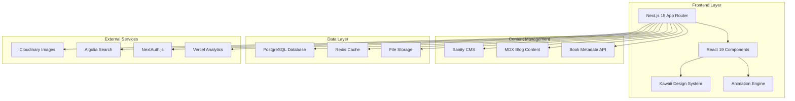
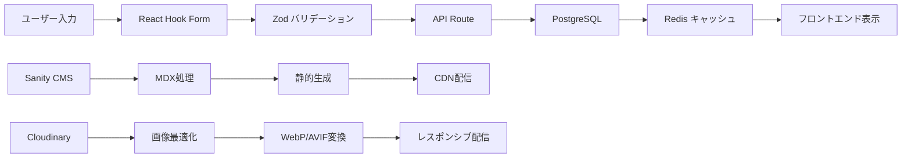
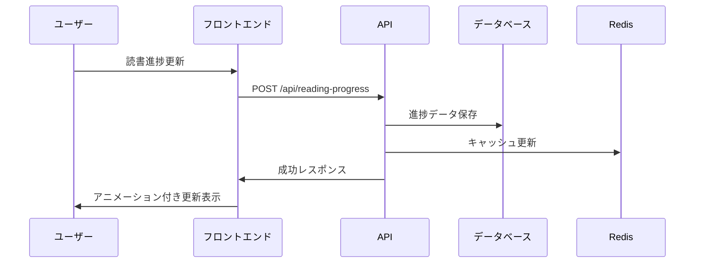
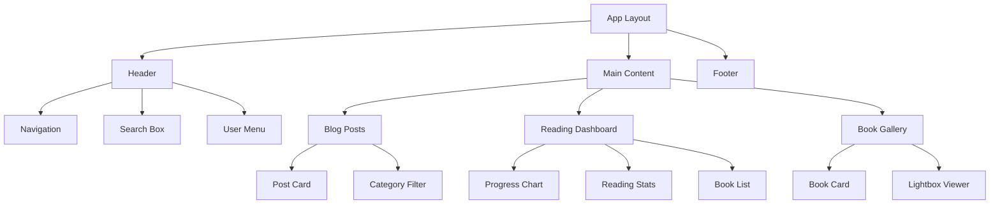

# 技術設計書

## 概要

かわいい読書ブログサイトは、読書愛好家向けのイラスト調のかわいいデザインを特徴とするブログプラットフォームです。Next.js 15とReact 19を基盤とし、Framer Motion、Lottie、Anime.jsなどの高度なアニメーションライブラリを活用して、60FPSの滑らかなアニメーションと魅力的なかわいいビジュアル体験を提供します。読書記録、進捗追跡、ソーシャル機能を統合し、楽しく魅力的な読書コミュニティプラットフォームを構築します。

## 要件対応マッピング

### 設計コンポーネント対応関係

各設計コンポーネントが特定の要件に対応：

- **かわいいデザインシステム** → REQ-1: かわいいビジュアルデザイン
- **読書コンテンツ管理システム** → REQ-2: 読書コンテンツ管理
- **アニメーションエンジン** → REQ-3: アニメーション機能
- **読書進捗トラッキング** → REQ-4: 読書記録追跡
- **検索・フィルタリングシステム** → REQ-5: 検索・カテゴリー機能
- **ソーシャル機能** → REQ-6: ソーシャル機能
- **レスポンシブフレームワーク** → REQ-7: レスポンシブデザイン
- **メディア管理システム** → REQ-8: 画像・イラスト管理
- **パフォーマンス最適化** → REQ-9: パフォーマンス最適化
- **SEO・アクセシビリティ** → REQ-10: SEO・アクセシビリティ

### ユーザーストーリー対応

- **ユーザーストーリー1**: かわいいパステルカラーのデザインテーマ → カワイイデザイントークンとテーマプロバイダー
- **ユーザーストーリー2**: 本のレビューや読書記事の投稿・管理 → リッチテキストエディターとコンテンツ管理システム
- **ユーザーストーリー3**: 滑らかで楽しいアニメーション → Framer Motion + CSS3アニメーションエンジン
- **ユーザーストーリー4**: 読書進捗や統計の視覚的追跡 → インタラクティブ読書ダッシュボード
- **ユーザーストーリー5**: 興味のある本や記事の検索 → Algolia検索とインテリジェントフィルタリング

## アーキテクチャ

### システム全体アーキテクチャ



### 技術的意思決定の根拠

**Next.js 15 App Router選択理由:**
- Server Components による高速初期表示（3秒以内のファーストビュー）
- 読書コンテンツの効率的なStatic Site Generation
- 画像最適化によるかわいいイラストの高品質表示
- SEO最適化によるコンテンツの検索性向上

**アニメーションライブラリ組み合わせ:**
- Framer Motion: 複雑なページ遷移とレイアウトアニメーション
- Lottie: かわいいキャラクターアニメーションとローディング
- CSS3 Animations: 軽量なマイクロインタラクション
- Anime.js: 読書進捗の数値アニメーションとパーティクル効果

## 技術スタック

### フロントエンド技術

- **フレームワーク**: Next.js 15 (App Router, Server Components)
- **UI ライブラリ**: React 19 with TypeScript 5.x
- **状態管理**: Zustand + React Query (TanStack Query)
- **スタイリング**: Tailwind CSS 4 with Kawaii custom theme
- **アニメーション**: Framer Motion + Lottie + Anime.js + CSS3
- **UI コンポーネント**: Radix UI + shadcn/ui + Custom Kawaii Components
- **フォーム管理**: React Hook Form + Zod validation
- **画像処理**: Next.js Image + Sharp + Cloudinary

### バックエンド技術

- **データベース**: PostgreSQL (Supabase) - 読書記録、ユーザープロファイル
- **キャッシュ**: Redis - 検索結果とページキャッシュ
- **CMS**: Sanity Studio - ブログコンテンツ管理
- **認証**: NextAuth.js - ソーシャルログインとセッション管理
- **ファイルストレージ**: Cloudinary - 画像・イラスト最適化
- **検索**: Algolia - リアルタイム検索と高度フィルタリング
- **分析**: Vercel Analytics - パフォーマンス監視

### 開発・運用技術

- **パッケージマネージャー**: pnpm
- **テスト**: Vitest + React Testing Library + Playwright
- **コード品質**: ESLint + Prettier + TypeScript strict mode
- **デプロイ**: Vercel - 自動デプロイとプレビュー
- **監視**: Sentry - エラートラッキング

## データフロー

### 読書コンテンツのデータフロー



### 読書進捗トラッキングフロー



## コンポーネント設計

### コアコンポーネント階層



### カワイイデザインシステム

#### デザイントークン

```typescript
// lib/design-tokens.ts
export const KawaiiTokens = {
  colors: {
    primary: {
      50: '#fef7f7',   // 最も薄いピンク
      100: '#feeaea',   // 薄いピンク
      200: '#fdd5d5',   // ソフトピンク
      300: '#fab5b5',   // ライトピンク
      400: '#f59595',   // ミディアムピンク
      500: '#ef4444',   // メインピンク
      600: '#dc2626',   // 深いピンク
      700: '#b91c1c',   // ダークピンク
      800: '#991b1b',   // 濃いピンク
      900: '#7f1d1d',   // 最も濃いピンク
    },
    secondary: {
      50: '#f0f9ff',   // 薄いスカイブルー
      100: '#e0f2fe',   // ライトブルー
      200: '#bae6fd',   // ソフトブルー
      300: '#7dd3fc',   // ミディアムブルー
      400: '#38bdf8',   // ブライトブルー
      500: '#0ea5e9',   // メインブルー
      600: '#0284c7',   // 深いブルー
      700: '#0369a1',   // ダークブルー
      800: '#075985',   // 濃いブルー
      900: '#0c4a6e',   // 最も濃いブルー
    },
    accent: {
      yellow: '#fef3c7',  // 優しい黄色
      lavender: '#f3e8ff', // ラベンダー
      mint: '#d1fae5',    // ミント
      peach: '#fed7aa',   // ピーチ
    },
    neutral: {
      50: '#fafafa',    // ほぼ白
      100: '#f5f5f5',   // 薄いグレー
      200: '#e5e5e5',   // ライトグレー
      300: '#d4d4d4',   // ミディアムグレー
      400: '#a3a3a3',   // グレー
      500: '#737373',   // ダークグレー
      600: '#525252',   // 濃いグレー
      700: '#404040',   // 深いグレー
      800: '#262626',   // ダークグレー
      900: '#171717',   // 最も濃いグレー
    }
  },
  
  spacing: {
    xs: '0.5rem',    // 8px
    sm: '0.75rem',   // 12px  
    md: '1rem',      // 16px
    lg: '1.5rem',    // 24px
    xl: '2rem',      // 32px
    '2xl': '3rem',   // 48px
    '3xl': '4rem',   // 64px
  },
  
  borderRadius: {
    sm: '0.375rem',  // 6px - ボタン
    md: '0.5rem',    // 8px - カード
    lg: '0.75rem',   // 12px - モーダル
    xl: '1rem',      // 16px - 大きなカード
    full: '9999px',  // 完全な円形
  },
  
  shadows: {
    soft: '0 2px 8px rgba(0, 0, 0, 0.04), 0 1px 3px rgba(0, 0, 0, 0.06)',
    medium: '0 4px 16px rgba(0, 0, 0, 0.08), 0 2px 6px rgba(0, 0, 0, 0.12)',
    strong: '0 8px 32px rgba(0, 0, 0, 0.12), 0 4px 12px rgba(0, 0, 0, 0.18)',
  },
  
  animations: {
    duration: {
      fast: '150ms',
      normal: '250ms',
      slow: '350ms',
      slower: '500ms',
    },
    easing: {
      bounce: 'cubic-bezier(0.68, -0.55, 0.265, 1.55)',
      soft: 'cubic-bezier(0.25, 0.46, 0.45, 0.94)',
      sharp: 'cubic-bezier(0.55, 0.085, 0.68, 0.53)',
    }
  }
};
```

#### コアコンポーネント実装

```typescript
// components/kawaii/KawaiiButton.tsx
interface KawaiiButtonProps {
  variant?: 'primary' | 'secondary' | 'accent';
  size?: 'sm' | 'md' | 'lg';
  children: React.ReactNode;
  onClick?: () => void;
  disabled?: boolean;
  loading?: boolean;
  icon?: React.ReactNode;
  className?: string;
}

export const KawaiiButton: React.FC<KawaiiButtonProps> = ({
  variant = 'primary',
  size = 'md',
  children,
  onClick,
  disabled = false,
  loading = false,
  icon,
  className = ''
}) => {
  const [isHovered, setIsHovered] = useState(false);
  const [isPressed, setIsPressed] = useState(false);

  const variants = {
    primary: 'bg-gradient-to-r from-pink-400 to-pink-500 text-white hover:from-pink-500 hover:to-pink-600',
    secondary: 'bg-gradient-to-r from-blue-400 to-blue-500 text-white hover:from-blue-500 hover:to-blue-600',
    accent: 'bg-gradient-to-r from-purple-400 to-pink-400 text-white hover:from-purple-500 hover:to-pink-500',
  };

  const sizes = {
    sm: 'px-3 py-2 text-sm',
    md: 'px-4 py-2 text-base',
    lg: 'px-6 py-3 text-lg',
  };

  return (
    <motion.button
      className={cn(
        'rounded-full font-medium transition-all duration-200',
        'shadow-soft hover:shadow-medium active:shadow-soft',
        'disabled:opacity-50 disabled:cursor-not-allowed',
        'flex items-center gap-2 justify-center',
        variants[variant],
        sizes[size],
        className
      )}
      onClick={onClick}
      disabled={disabled || loading}
      onHoverStart={() => setIsHovered(true)}
      onHoverEnd={() => setIsHovered(false)}
      onTapStart={() => setIsPressed(true)}
      onTapEnd={() => setIsPressed(false)}
      whileHover={{ 
        scale: disabled ? 1 : 1.05,
        y: disabled ? 0 : -2
      }}
      whileTap={{ 
        scale: disabled ? 1 : 0.95,
        y: disabled ? 0 : 0
      }}
      animate={{
        boxShadow: isHovered && !disabled 
          ? '0 8px 32px rgba(0, 0, 0, 0.12), 0 4px 12px rgba(0, 0, 0, 0.18)'
          : '0 2px 8px rgba(0, 0, 0, 0.04), 0 1px 3px rgba(0, 0, 0, 0.06)'
      }}
    >
      {loading && (
        <motion.div
          className="w-4 h-4 border-2 border-current border-t-transparent rounded-full"
          animate={{ rotate: 360 }}
          transition={{ duration: 1, repeat: Infinity, ease: "linear" }}
        />
      )}
      {icon && !loading && (
        <motion.div
          animate={{ rotate: isPressed ? 12 : 0 }}
          transition={{ duration: 0.1 }}
        >
          {icon}
        </motion.div>
      )}
      <span>{children}</span>
    </motion.button>
  );
};
```

```typescript
// components/kawaii/KawaiiCard.tsx
interface KawaiiCardProps {
  children: React.ReactNode;
  title?: string;
  description?: string;
  image?: string;
  imageAlt?: string;
  onClick?: () => void;
  hoverable?: boolean;
  className?: string;
}

export const KawaiiCard: React.FC<KawaiiCardProps> = ({
  children,
  title,
  description,
  image,
  imageAlt,
  onClick,
  hoverable = true,
  className = ''
}) => {
  const [isHovered, setIsHovered] = useState(false);

  return (
    <motion.div
      className={cn(
        'bg-white rounded-xl shadow-soft border border-neutral-100',
        'overflow-hidden transition-all duration-300',
        hoverable && 'hover:shadow-medium cursor-pointer',
        onClick && 'cursor-pointer',
        className
      )}
      onClick={onClick}
      onHoverStart={() => setIsHovered(true)}
      onHoverEnd={() => setIsHovered(false)}
      whileHover={hoverable ? { 
        y: -4,
        scale: 1.02,
      } : {}}
      whileTap={onClick ? { 
        scale: 0.98,
        y: -2
      } : {}}
      animate={{
        boxShadow: isHovered && hoverable
          ? '0 8px 32px rgba(0, 0, 0, 0.12), 0 4px 12px rgba(0, 0, 0, 0.18)'
          : '0 2px 8px rgba(0, 0, 0, 0.04), 0 1px 3px rgba(0, 0, 0, 0.06)'
      }}
    >
      {image && (
        <div className="relative aspect-video overflow-hidden">
          <Image
            src={image}
            alt={imageAlt || title || ''}
            fill
            className="object-cover transition-transform duration-300"
            style={{
              transform: isHovered ? 'scale(1.05)' : 'scale(1.0)'
            }}
          />
          <div className="absolute inset-0 bg-gradient-to-t from-black/10 to-transparent" />
        </div>
      )}
      
      <div className="p-6">
        {title && (
          <h3 className="text-xl font-semibold text-neutral-800 mb-2">
            {title}
          </h3>
        )}
        
        {description && (
          <p className="text-neutral-600 mb-4 leading-relaxed">
            {description}
          </p>
        )}
        
        {children}
      </div>
    </motion.div>
  );
};
```

### 読書進捗トラッキングコンポーネント

```typescript
// components/reading/ReadingProgressChart.tsx
interface ReadingProgressChartProps {
  books: ReadingBook[];
  timeframe: 'week' | 'month' | 'year';
  showAnimation?: boolean;
}

export const ReadingProgressChart: React.FC<ReadingProgressChartProps> = ({
  books,
  timeframe,
  showAnimation = true
}) => {
  const [animationComplete, setAnimationComplete] = useState(false);
  const chartData = useMemo(() => generateChartData(books, timeframe), [books, timeframe]);

  return (
    <KawaiiCard title="読書進捗" className="col-span-2">
      <div className="space-y-4">
        {/* 進捗統計 */}
        <div className="grid grid-cols-3 gap-4">
          <motion.div
            className="text-center p-4 bg-gradient-to-br from-pink-50 to-pink-100 rounded-lg"
            initial={{ scale: 0, opacity: 0 }}
            animate={{ scale: 1, opacity: 1 }}
            transition={{ delay: 0.1, type: "spring", bounce: 0.5 }}
          >
            <div className="text-2xl font-bold text-pink-600">
              <AnimatedNumber value={chartData.totalBooks} />
            </div>
            <div className="text-sm text-pink-500">読んだ本</div>
          </motion.div>
          
          <motion.div
            className="text-center p-4 bg-gradient-to-br from-blue-50 to-blue-100 rounded-lg"
            initial={{ scale: 0, opacity: 0 }}
            animate={{ scale: 1, opacity: 1 }}
            transition={{ delay: 0.2, type: "spring", bounce: 0.5 }}
          >
            <div className="text-2xl font-bold text-blue-600">
              <AnimatedNumber value={chartData.totalPages} />
            </div>
            <div className="text-sm text-blue-500">総ページ数</div>
          </motion.div>
          
          <motion.div
            className="text-center p-4 bg-gradient-to-br from-purple-50 to-purple-100 rounded-lg"
            initial={{ scale: 0, opacity: 0 }}
            animate={{ scale: 1, opacity: 1 }}
            transition={{ delay: 0.3, type: "spring", bounce: 0.5 }}
          >
            <div className="text-2xl font-bold text-purple-600">
              <AnimatedNumber value={chartData.averageRating} precision={1} />
            </div>
            <div className="text-sm text-purple-500">平均評価</div>
          </motion.div>
        </div>

        {/* 進捗チャート */}
        <div className="h-64 relative">
          <ResponsiveContainer width="100%" height="100%">
            <LineChart data={chartData.timeline}>
              <CartesianGrid strokeDasharray="3 3" stroke="#f0f0f0" />
              <XAxis 
                dataKey="date" 
                tick={{ fontSize: 12, fill: '#666' }}
                axisLine={{ stroke: '#e0e0e0' }}
              />
              <YAxis 
                tick={{ fontSize: 12, fill: '#666' }}
                axisLine={{ stroke: '#e0e0e0' }}
              />
              <Tooltip 
                contentStyle={{
                  backgroundColor: 'white',
                  border: 'none',
                  borderRadius: '12px',
                  boxShadow: '0 4px 16px rgba(0, 0, 0, 0.1)'
                }}
              />
              <motion.line
                x1="0"
                y1="0"
                x2="100%"
                y2="0"
                stroke="url(#gradient)"
                strokeWidth="3"
                strokeLinecap="round"
                initial={{ pathLength: 0 }}
                animate={{ pathLength: showAnimation ? 1 : 1 }}
                transition={{ duration: 2, ease: "easeInOut" }}
              />
              <Line 
                type="monotone" 
                dataKey="books" 
                stroke="#f59e0b"
                strokeWidth={3}
                dot={{ fill: '#f59e0b', strokeWidth: 2, r: 4 }}
                activeDot={{ r: 6, fill: '#f59e0b' }}
              />
              <defs>
                <linearGradient id="gradient" x1="0%" y1="0%" x2="100%" y2="0%">
                  <stop offset="0%" stopColor="#f59e0b" />
                  <stop offset="100%" stopColor="#f97316" />
                </linearGradient>
              </defs>
            </LineChart>
          </ResponsiveContainer>
        </div>

        {/* 現在読んでいる本 */}
        <div className="border-t pt-4">
          <h4 className="font-semibold text-neutral-800 mb-3">現在読んでいる本</h4>
          <div className="space-y-3">
            {chartData.currentlyReading.map((book, index) => (
              <motion.div
                key={book.id}
                className="flex items-center gap-3 p-3 bg-neutral-50 rounded-lg"
                initial={{ opacity: 0, x: -20 }}
                animate={{ opacity: 1, x: 0 }}
                transition={{ delay: index * 0.1 }}
              >
                <div className="w-12 h-16 bg-gradient-to-br from-neutral-200 to-neutral-300 rounded"></div>
                <div className="flex-1">
                  <h5 className="font-medium text-neutral-800">{book.title}</h5>
                  <p className="text-sm text-neutral-600">{book.author}</p>
                  <div className="mt-2">
                    <div className="flex justify-between text-xs text-neutral-500 mb-1">
                      <span>{book.currentPage} / {book.totalPages} ページ</span>
                      <span>{Math.round((book.currentPage / book.totalPages) * 100)}%</span>
                    </div>
                    <motion.div 
                      className="h-2 bg-neutral-200 rounded-full overflow-hidden"
                      initial={{ width: 0 }}
                      animate={{ width: '100%' }}
                      transition={{ delay: 0.5 + index * 0.1 }}
                    >
                      <motion.div
                        className="h-full bg-gradient-to-r from-pink-400 to-pink-500 rounded-full"
                        initial={{ width: 0 }}
                        animate={{ width: `${(book.currentPage / book.totalPages) * 100}%` }}
                        transition={{ delay: 0.7 + index * 0.1, duration: 1, ease: "easeOut" }}
                      />
                    </motion.div>
                  </div>
                </div>
              </motion.div>
            ))}
          </div>
        </div>
      </div>
    </KawaiiCard>
  );
};
```

### アニメーションエンジン

```typescript
// lib/animations/kawaii-animations.ts
export const KawaiiAnimations = {
  // ページ遷移アニメーション
  pageTransition: {
    initial: { opacity: 0, y: 20 },
    animate: { opacity: 1, y: 0 },
    exit: { opacity: 0, y: -20 },
    transition: { duration: 0.3, ease: "easeInOut" }
  },

  // ふわふわアニメーション
  float: {
    animate: {
      y: [-2, 2, -2],
      transition: {
        duration: 3,
        repeat: Infinity,
        ease: "easeInOut"
      }
    }
  },

  // バウンス効果
  bounce: {
    whileHover: { scale: 1.05, y: -2 },
    whileTap: { scale: 0.95, y: 0 },
    transition: { type: "spring", stiffness: 400, damping: 17 }
  },

  // ハートパーティクル
  heartParticle: {
    initial: { scale: 0, opacity: 0, y: 0 },
    animate: { 
      scale: [0, 1.2, 1],
      opacity: [0, 1, 0],
      y: [0, -50, -100],
      x: [0, Math.random() * 40 - 20, Math.random() * 80 - 40]
    },
    transition: { duration: 2, ease: "easeOut" }
  },

  // ローディング本アニメーション
  bookLoading: {
    animate: {
      rotateY: [0, 0, 180, 180, 0],
      transition: {
        duration: 2,
        repeat: Infinity,
        ease: "easeInOut",
        times: [0, 0.2, 0.5, 0.8, 1]
      }
    }
  },

  // スタッガーアニメーション
  stagger: {
    container: {
      animate: {
        transition: {
          staggerChildren: 0.1,
          delayChildren: 0.1
        }
      }
    },
    item: {
      initial: { opacity: 0, y: 20 },
      animate: { opacity: 1, y: 0 },
      transition: { duration: 0.5, ease: "easeOut" }
    }
  },

  // 読書進捗アニメーション
  readingProgress: {
    initial: { width: 0 },
    animate: { width: "var(--progress-width)" },
    transition: { duration: 1.5, ease: "easeOut" }
  }
};

// パーティクルアニメーション用フック
export const useParticleAnimation = () => {
  const [particles, setParticles] = useState<Particle[]>([]);

  const createParticle = useCallback((x: number, y: number, type: 'heart' | 'star' | 'sparkle') => {
    const newParticle: Particle = {
      id: Math.random().toString(36).substr(2, 9),
      x,
      y,
      type,
      createdAt: Date.now()
    };
    
    setParticles(prev => [...prev, newParticle]);
    
    // 2秒後にパーティクルを削除
    setTimeout(() => {
      setParticles(prev => prev.filter(p => p.id !== newParticle.id));
    }, 2000);
  }, []);

  return { particles, createParticle };
};
```

## データモデル

### データベーススキーマ

```sql
-- ユーザーテーブル
CREATE TABLE users (
  id UUID PRIMARY KEY DEFAULT gen_random_uuid(),
  email VARCHAR(255) UNIQUE NOT NULL,
  username VARCHAR(50) UNIQUE NOT NULL,
  display_name VARCHAR(100) NOT NULL,
  avatar_url TEXT,
  bio TEXT,
  reading_goal_books_per_month INTEGER DEFAULT 4,
  reading_goal_pages_per_day INTEGER DEFAULT 20,
  preferred_genres JSONB DEFAULT '[]',
  reading_level VARCHAR(20) DEFAULT 'intermediate',
  created_at TIMESTAMP WITH TIME ZONE DEFAULT NOW(),
  updated_at TIMESTAMP WITH TIME ZONE DEFAULT NOW()
);

-- 書籍マスターテーブル
CREATE TABLE books (
  id UUID PRIMARY KEY DEFAULT gen_random_uuid(),
  isbn VARCHAR(20) UNIQUE,
  title VARCHAR(500) NOT NULL,
  subtitle VARCHAR(500),
  authors JSONB NOT NULL, -- ["author1", "author2"]
  publisher VARCHAR(200),
  published_date DATE,
  page_count INTEGER,
  genre JSONB DEFAULT '[]', -- ["fiction", "mystery"]
  language VARCHAR(10) DEFAULT 'ja',
  cover_image_url TEXT,
  cover_image_colors JSONB DEFAULT '[]', -- 抽出された色パレット
  description TEXT,
  average_rating DECIMAL(3,2),
  rating_count INTEGER DEFAULT 0,
  goodreads_id VARCHAR(50),
  amazon_url TEXT,
  created_at TIMESTAMP WITH TIME ZONE DEFAULT NOW(),
  updated_at TIMESTAMP WITH TIME ZONE DEFAULT NOW()
);

-- 読書記録テーブル
CREATE TABLE reading_records (
  id UUID PRIMARY KEY DEFAULT gen_random_uuid(),
  user_id UUID NOT NULL REFERENCES users(id) ON DELETE CASCADE,
  book_id UUID NOT NULL REFERENCES books(id) ON DELETE CASCADE,
  status VARCHAR(20) NOT NULL DEFAULT 'want_to_read', -- want_to_read, reading, finished, abandoned
  current_page INTEGER DEFAULT 0,
  total_pages INTEGER,
  user_rating INTEGER CHECK (user_rating >= 1 AND user_rating <= 5),
  review TEXT,
  reading_started_at TIMESTAMP WITH TIME ZONE,
  reading_finished_at TIMESTAMP WITH TIME ZONE,
  last_read_at TIMESTAMP WITH TIME ZONE,
  reading_sessions JSONB DEFAULT '[]', -- 読書セッション記録
  notes JSONB DEFAULT '[]', -- ページごとのメモ
  bookmarks JSONB DEFAULT '[]', -- ブックマークしたページ
  favorite_quotes JSONB DEFAULT '[]', -- お気に入りの引用
  created_at TIMESTAMP WITH TIME ZONE DEFAULT NOW(),
  updated_at TIMESTAMP WITH TIME ZONE DEFAULT NOW(),
  UNIQUE(user_id, book_id)
);

-- ブログ記事テーブル
CREATE TABLE blog_posts (
  id UUID PRIMARY KEY DEFAULT gen_random_uuid(),
  author_id UUID NOT NULL REFERENCES users(id) ON DELETE CASCADE,
  title VARCHAR(200) NOT NULL,
  slug VARCHAR(200) UNIQUE NOT NULL,
  content TEXT NOT NULL, -- MDX content
  excerpt TEXT,
  featured_image_url TEXT,
  featured_image_alt TEXT,
  status VARCHAR(20) DEFAULT 'draft', -- draft, published, archived
  published_at TIMESTAMP WITH TIME ZONE,
  reading_time_minutes INTEGER,
  view_count INTEGER DEFAULT 0,
  like_count INTEGER DEFAULT 0,
  comment_count INTEGER DEFAULT 0,
  tags JSONB DEFAULT '[]',
  categories JSONB DEFAULT '[]',
  related_books JSONB DEFAULT '[]', -- 関連書籍のID配列
  seo_title VARCHAR(60),
  seo_description VARCHAR(160),
  ogp_image_url TEXT,
  created_at TIMESTAMP WITH TIME ZONE DEFAULT NOW(),
  updated_at TIMESTAMP WITH TIME ZONE DEFAULT NOW()
);

-- コメントテーブル
CREATE TABLE comments (
  id UUID PRIMARY KEY DEFAULT gen_random_uuid(),
  post_id UUID NOT NULL REFERENCES blog_posts(id) ON DELETE CASCADE,
  author_id UUID NOT NULL REFERENCES users(id) ON DELETE CASCADE,
  parent_id UUID REFERENCES comments(id) ON DELETE CASCADE, -- 返信の場合
  content TEXT NOT NULL,
  is_approved BOOLEAN DEFAULT TRUE,
  like_count INTEGER DEFAULT 0,
  created_at TIMESTAMP WITH TIME ZONE DEFAULT NOW(),
  updated_at TIMESTAMP WITH TIME ZONE DEFAULT NOW()
);

-- いいねテーブル
CREATE TABLE likes (
  id UUID PRIMARY KEY DEFAULT gen_random_uuid(),
  user_id UUID NOT NULL REFERENCES users(id) ON DELETE CASCADE,
  target_type VARCHAR(20) NOT NULL, -- post, comment, review
  target_id UUID NOT NULL,
  created_at TIMESTAMP WITH TIME ZONE DEFAULT NOW(),
  UNIQUE(user_id, target_type, target_id)
);

-- フォローテーブル
CREATE TABLE follows (
  id UUID PRIMARY KEY DEFAULT gen_random_uuid(),
  follower_id UUID NOT NULL REFERENCES users(id) ON DELETE CASCADE,
  following_id UUID NOT NULL REFERENCES users(id) ON DELETE CASCADE,
  created_at TIMESTAMP WITH TIME ZONE DEFAULT NOW(),
  UNIQUE(follower_id, following_id),
  CHECK(follower_id != following_id)
);

-- 読書リストテーブル
CREATE TABLE reading_lists (
  id UUID PRIMARY KEY DEFAULT gen_random_uuid(),
  user_id UUID NOT NULL REFERENCES users(id) ON DELETE CASCADE,
  name VARCHAR(100) NOT NULL,
  description TEXT,
  is_public BOOLEAN DEFAULT FALSE,
  is_collaborative BOOLEAN DEFAULT FALSE,
  book_ids JSONB DEFAULT '[]', -- 書籍IDの配列
  order_index INTEGER DEFAULT 0,
  created_at TIMESTAMP WITH TIME ZONE DEFAULT NOW(),
  updated_at TIMESTAMP WITH TIME ZONE DEFAULT NOW()
);

-- 通知テーブル
CREATE TABLE notifications (
  id UUID PRIMARY KEY DEFAULT gen_random_uuid(),
  user_id UUID NOT NULL REFERENCES users(id) ON DELETE CASCADE,
  type VARCHAR(50) NOT NULL, -- new_follower, new_comment, reading_goal_achieved, etc.
  title VARCHAR(200) NOT NULL,
  message TEXT,
  data JSONB DEFAULT '{}', -- 追加データ
  is_read BOOLEAN DEFAULT FALSE,
  action_url TEXT,
  created_at TIMESTAMP WITH TIME ZONE DEFAULT NOW()
);

-- インデックス作成
CREATE INDEX idx_reading_records_user_status ON reading_records(user_id, status);
CREATE INDEX idx_reading_records_last_read ON reading_records(last_read_at DESC);
CREATE INDEX idx_blog_posts_published ON blog_posts(published_at DESC) WHERE status = 'published';
CREATE INDEX idx_blog_posts_tags ON blog_posts USING GIN(tags);
CREATE INDEX idx_books_genre ON books USING GIN(genre);
CREATE INDEX idx_comments_post_created ON comments(post_id, created_at DESC);
CREATE INDEX idx_notifications_user_unread ON notifications(user_id, is_read, created_at DESC);
```

### TypeScript型定義

```typescript
// types/database.ts
export interface User {
  id: string;
  email: string;
  username: string;
  displayName: string;
  avatarUrl?: string;
  bio?: string;
  readingGoalBooksPerMonth: number;
  readingGoalPagesPerDay: number;
  preferredGenres: string[];
  readingLevel: 'beginner' | 'intermediate' | 'advanced';
  createdAt: Date;
  updatedAt: Date;
}

export interface Book {
  id: string;
  isbn?: string;
  title: string;
  subtitle?: string;
  authors: string[];
  publisher?: string;
  publishedDate?: Date;
  pageCount?: number;
  genre: string[];
  language: string;
  coverImageUrl?: string;
  coverImageColors: string[];
  description?: string;
  averageRating?: number;
  ratingCount: number;
  goodreadsId?: string;
  amazonUrl?: string;
  createdAt: Date;
  updatedAt: Date;
}

export interface ReadingRecord {
  id: string;
  userId: string;
  bookId: string;
  status: 'want_to_read' | 'reading' | 'finished' | 'abandoned';
  currentPage: number;
  totalPages?: number;
  userRating?: number;
  review?: string;
  readingStartedAt?: Date;
  readingFinishedAt?: Date;
  lastReadAt?: Date;
  readingSessions: ReadingSession[];
  notes: BookNote[];
  bookmarks: BookBookmark[];
  favoriteQuotes: FavoriteQuote[];
  createdAt: Date;
  updatedAt: Date;
  book?: Book; // リレーション
}

export interface ReadingSession {
  startedAt: Date;
  endedAt: Date;
  pagesRead: number;
  location?: string; // 読書場所
  mood?: string; // 読書時の気分
}

export interface BookNote {
  page: number;
  content: string;
  createdAt: Date;
  highlight?: string; // ハイライトしたテキスト
}

export interface BookBookmark {
  page: number;
  title?: string;
  createdAt: Date;
}

export interface FavoriteQuote {
  page: number;
  text: string;
  context?: string; // 前後の文脈
  createdAt: Date;
}

export interface BlogPost {
  id: string;
  authorId: string;
  title: string;
  slug: string;
  content: string; // MDX content
  excerpt?: string;
  featuredImageUrl?: string;
  featuredImageAlt?: string;
  status: 'draft' | 'published' | 'archived';
  publishedAt?: Date;
  readingTimeMinutes?: number;
  viewCount: number;
  likeCount: number;
  commentCount: number;
  tags: string[];
  categories: string[];
  relatedBooks: string[]; // Book IDs
  seoTitle?: string;
  seoDescription?: string;
  ogpImageUrl?: string;
  createdAt: Date;
  updatedAt: Date;
  author?: User; // リレーション
  comments?: Comment[]; // リレーション
}

export interface Comment {
  id: string;
  postId: string;
  authorId: string;
  parentId?: string;
  content: string;
  isApproved: boolean;
  likeCount: number;
  createdAt: Date;
  updatedAt: Date;
  author?: User; // リレーション
  replies?: Comment[]; // リレーション
}

export interface ReadingList {
  id: string;
  userId: string;
  name: string;
  description?: string;
  isPublic: boolean;
  isCollaborative: boolean;
  bookIds: string[];
  orderIndex: number;
  createdAt: Date;
  updatedAt: Date;
  user?: User; // リレーション
  books?: Book[]; // リレーション
}

export interface Notification {
  id: string;
  userId: string;
  type: string;
  title: string;
  message?: string;
  data: Record<string, any>;
  isRead: boolean;
  actionUrl?: string;
  createdAt: Date;
}
```

## エラーハンドリング

### 包括的エラーハンドリング戦略

```typescript
// lib/error-handling.ts
export class KawaiiError extends Error {
  constructor(
    message: string,
    public code: string,
    public statusCode: number = 500,
    public userMessage?: string,
    public context?: Record<string, any>
  ) {
    super(message);
    this.name = 'KawaiiError';
  }
}

// エラー種別定義
export const ErrorCodes = {
  // 認証エラー
  AUTH_REQUIRED: 'AUTH_REQUIRED',
  AUTH_INVALID: 'AUTH_INVALID',
  AUTH_EXPIRED: 'AUTH_EXPIRED',
  
  // 読書記録エラー
  BOOK_NOT_FOUND: 'BOOK_NOT_FOUND',
  READING_RECORD_NOT_FOUND: 'READING_RECORD_NOT_FOUND',
  INVALID_PAGE_NUMBER: 'INVALID_PAGE_NUMBER',
  READING_ALREADY_FINISHED: 'READING_ALREADY_FINISHED',
  
  // コンテンツエラー
  POST_NOT_FOUND: 'POST_NOT_FOUND',
  CONTENT_VALIDATION_FAILED: 'CONTENT_VALIDATION_FAILED',
  IMAGE_UPLOAD_FAILED: 'IMAGE_UPLOAD_FAILED',
  
  // システムエラー
  DATABASE_ERROR: 'DATABASE_ERROR',
  EXTERNAL_API_ERROR: 'EXTERNAL_API_ERROR',
  RATE_LIMIT_EXCEEDED: 'RATE_LIMIT_EXCEEDED',
} as const;

// エラーハンドラー
export const handleApiError = (error: unknown): Response => {
  console.error('API Error:', error);

  if (error instanceof KawaiiError) {
    return NextResponse.json(
      {
        error: true,
        code: error.code,
        message: error.userMessage || 'エラーが発生しました',
        ...(process.env.NODE_ENV === 'development' && {
          details: error.message,
          context: error.context,
        }),
      },
      { status: error.statusCode }
    );
  }

  if (error instanceof z.ZodError) {
    return NextResponse.json(
      {
        error: true,
        code: 'VALIDATION_ERROR',
        message: '入力データが正しくありません',
        details: error.errors,
      },
      { status: 400 }
    );
  }

  // 予期しないエラー
  return NextResponse.json(
    {
      error: true,
      code: 'INTERNAL_ERROR',
      message: 'システムエラーが発生しました。しばらく後でお試しください。',
    },
    { status: 500 }
  );
};

// クライアント側エラーハンドリング
export const useErrorHandler = () => {
  const [error, setError] = useState<string | null>(null);

  const handleError = useCallback((error: unknown) => {
    if (error instanceof KawaiiError) {
      setError(error.userMessage || error.message);
    } else if (error instanceof Error) {
      setError('エラーが発生しました');
    } else {
      setError('予期しないエラーが発生しました');
    }

    // エラーログ送信
    if (process.env.NODE_ENV === 'production') {
      // Sentryなどにエラーを送信
      console.error('Client Error:', error);
    }
  }, []);

  const clearError = useCallback(() => {
    setError(null);
  }, []);

  return { error, handleError, clearError };
};
```

### エラー表示コンポーネント

```typescript
// components/kawaii/KawaiiErrorBoundary.tsx
interface ErrorBoundaryState {
  hasError: boolean;
  error?: Error;
}

export class KawaiiErrorBoundary extends Component<
  { children: ReactNode; fallback?: ReactNode },
  ErrorBoundaryState
> {
  constructor(props: { children: ReactNode; fallback?: ReactNode }) {
    super(props);
    this.state = { hasError: false };
  }

  static getDerivedStateFromError(error: Error): ErrorBoundaryState {
    return { hasError: true, error };
  }

  componentDidCatch(error: Error, errorInfo: ErrorInfo) {
    console.error('Error Boundary caught an error:', error, errorInfo);
    // エラーレポート送信
  }

  render() {
    if (this.state.hasError) {
      return this.props.fallback || (
        <div className="min-h-screen flex items-center justify-center bg-gradient-to-br from-pink-50 to-blue-50">
          <KawaiiCard className="max-w-md mx-auto text-center">
            <div className="mb-6">
              <div className="text-6xl mb-4">😅</div>
              <h2 className="text-xl font-semibold text-neutral-800 mb-2">
                おっと！エラーが発生しました
              </h2>
              <p className="text-neutral-600">
                申し訳ございません。予期しない問題が発生しました。
                ページを再読み込みして、もう一度お試しください。
              </p>
            </div>
            <KawaiiButton
              onClick={() => window.location.reload()}
              className="w-full"
            >
              ページを再読み込み
            </KawaiiButton>
          </KawaiiCard>
        </div>
      );
    }

    return this.props.children;
  }
}

// インラインエラー表示
export const KawaiiErrorMessage: React.FC<{
  message: string;
  onRetry?: () => void;
  className?: string;
}> = ({ message, onRetry, className = '' }) => {
  return (
    <motion.div
      className={cn(
        'bg-red-50 border border-red-200 rounded-lg p-4',
        'flex items-center gap-3',
        className
      )}
      initial={{ opacity: 0, scale: 0.95 }}
      animate={{ opacity: 1, scale: 1 }}
      transition={{ duration: 0.2 }}
    >
      <div className="text-red-400 text-xl">⚠️</div>
      <div className="flex-1">
        <p className="text-red-800 text-sm">{message}</p>
      </div>
      {onRetry && (
        <KawaiiButton
          size="sm"
          variant="secondary"
          onClick={onRetry}
        >
          再試行
        </KawaiiButton>
      )}
    </motion.div>
  );
};
```

## セキュリティ考慮事項

### 認証・認可

```typescript
// lib/auth/middleware.ts
export const authMiddleware = async (req: NextRequest) => {
  const token = req.cookies.get('auth-token')?.value;
  
  if (!token) {
    throw new KawaiiError(
      'Authentication required',
      ErrorCodes.AUTH_REQUIRED,
      401,
      'ログインが必要です'
    );
  }

  try {
    const payload = await jwt.verify(token, process.env.JWT_SECRET!);
    return payload as JWTPayload;
  } catch (error) {
    throw new KawaiiError(
      'Invalid token',
      ErrorCodes.AUTH_INVALID,
      401,
      '認証情報が無効です'
    );
  }
};

// API保護
export const withAuth = (handler: (req: NextRequest, user: User) => Promise<Response>) => {
  return async (req: NextRequest) => {
    try {
      const user = await authMiddleware(req);
      return await handler(req, user);
    } catch (error) {
      return handleApiError(error);
    }
  };
};
```

### データ保護

```typescript
// lib/security/validation.ts
export const bookValidationSchema = z.object({
  title: z.string().min(1, '書籍タイトルは必須です').max(500, 'タイトルが長すぎます'),
  authors: z.array(z.string()).min(1, '著者は必須です'),
  isbn: z.string().regex(/^[\d-]+$/, 'ISBNの形式が正しくありません').optional(),
  pageCount: z.number().min(1, 'ページ数は1以上である必要があります').optional(),
  genre: z.array(z.string()).max(10, 'ジャンルは10個までです'),
  description: z.string().max(2000, '説明文が長すぎます').optional(),
});

export const readingRecordValidationSchema = z.object({
  bookId: z.string().uuid('無効な書籍IDです'),
  status: z.enum(['want_to_read', 'reading', 'finished', 'abandoned']),
  currentPage: z.number().min(0, 'ページ数は0以上である必要があります'),
  userRating: z.number().min(1).max(5).optional(),
  review: z.string().max(2000, 'レビューが長すぎます').optional(),
});

export const blogPostValidationSchema = z.object({
  title: z.string().min(1, 'タイトルは必須です').max(200, 'タイトルが長すぎます'),
  content: z.string().min(10, 'コンテンツは10文字以上である必要があります'),
  excerpt: z.string().max(300, '要約が長すぎます').optional(),
  tags: z.array(z.string()).max(10, 'タグは10個までです'),
  categories: z.array(z.string()).max(5, 'カテゴリは5個までです'),
});

// XSS保護
export const sanitizeHtml = (html: string): string => {
  return DOMPurify.sanitize(html, {
    ALLOWED_TAGS: ['p', 'br', 'strong', 'em', 'u', 'ul', 'ol', 'li', 'blockquote'],
    ALLOWED_ATTR: [],
  });
};

// CSRFトークン生成
export const generateCSRFToken = (): string => {
  return crypto.randomBytes(32).toString('hex');
};

// レート制限
export const rateLimiter = rateLimit({
  windowMs: 15 * 60 * 1000, // 15分
  max: 100, // リクエスト制限
  message: {
    error: true,
    code: ErrorCodes.RATE_LIMIT_EXCEEDED,
    message: 'リクエストが多すぎます。しばらく後でお試しください。',
  },
});
```

## パフォーマンス・スケーラビリティ

### パフォーマンス最適化戦略

```typescript
// lib/performance/optimization.ts

// 画像最適化設定
export const imageOptimizationConfig = {
  formats: ['image/avif', 'image/webp', 'image/jpeg'],
  deviceSizes: [640, 750, 828, 1080, 1200, 1920, 2048, 3840],
  imageSizes: [16, 32, 48, 64, 96, 128, 256, 384],
  quality: 75,
  // かわいい画像の高品質表示
  bookCoverQuality: 90,
  illustrationQuality: 85,
};

// Critical CSS抽出
export const extractCriticalCSS = async (html: string): Promise<string> => {
  const critical = await generateCritical({
    html,
    css: await readFile('dist/styles.css', 'utf8'),
    dimensions: [
      { width: 320, height: 568 }, // Mobile
      { width: 768, height: 1024 }, // Tablet
      { width: 1920, height: 1080 }, // Desktop
    ],
    ignore: {
      atrule: ['@font-face'],
    },
  });
  return critical;
};

// コンポーネント遅延読み込み
export const LazyComponents = {
  BookGallery: dynamic(() => import('@/components/books/BookGallery'), {
    loading: () => <BookGallerySkeleton />,
    ssr: false,
  }),
  
  ReadingChart: dynamic(() => import('@/components/reading/ReadingChart'), {
    loading: () => <ChartSkeleton />,
    ssr: false,
  }),
  
  AnimatedBackground: dynamic(() => import('@/components/kawaii/AnimatedBackground'), {
    loading: () => null,
    ssr: false,
  }),
};

// メモ化フック
export const useOptimizedBookData = (bookId: string) => {
  return useQuery({
    queryKey: ['book', bookId],
    queryFn: () => fetchBookData(bookId),
    staleTime: 5 * 60 * 1000, // 5分
    cacheTime: 30 * 60 * 1000, // 30分
    refetchOnWindowFocus: false,
  });
};

// 仮想スクロール
export const VirtualBookList: React.FC<{ books: Book[] }> = ({ books }) => {
  const { List, scrollToIndex } = useVirtualizer({
    count: books.length,
    getScrollElement: () => parentRef.current,
    estimateSize: () => 280, // カードの推定高さ
    overscan: 5,
  });

  return (
    <div ref={parentRef} className="h-96 overflow-auto">
      <div style={{ height: List.getTotalSize(), width: '100%', position: 'relative' }}>
        {List.getVirtualItems().map((virtualItem) => (
          <BookCard
            key={virtualItem.index}
            book={books[virtualItem.index]}
            style={{
              position: 'absolute',
              top: 0,
              left: 0,
              width: '100%',
              transform: `translateY(${virtualItem.start}px)`,
            }}
          />
        ))}
      </div>
    </div>
  );
};
```

### キャッシュ戦略

```typescript
// lib/cache/strategies.ts

// Redis キャッシュ設定
export const cacheConfig = {
  // 書籍データ: 長期キャッシュ
  bookData: {
    ttl: 24 * 60 * 60, // 24時間
    key: (id: string) => `book:${id}`,
  },
  
  // 読書記録: 中期キャッシュ
  readingRecords: {
    ttl: 60 * 60, // 1時間
    key: (userId: string) => `reading:${userId}`,
  },
  
  // ブログ記事: 短期キャッシュ
  blogPosts: {
    ttl: 15 * 60, // 15分
    key: (slug: string) => `post:${slug}`,
  },
  
  // 検索結果: 短期キャッシュ
  searchResults: {
    ttl: 5 * 60, // 5分
    key: (query: string) => `search:${hashQuery(query)}`,
  },
};

// キャッシュユーティリティ
export class CacheManager {
  private redis: Redis;

  constructor() {
    this.redis = new Redis(process.env.REDIS_URL!);
  }

  async get<T>(key: string): Promise<T | null> {
    try {
      const cached = await this.redis.get(key);
      return cached ? JSON.parse(cached) : null;
    } catch (error) {
      console.error('Cache get error:', error);
      return null;
    }
  }

  async set(key: string, value: any, ttl?: number): Promise<void> {
    try {
      const serialized = JSON.stringify(value);
      if (ttl) {
        await this.redis.setex(key, ttl, serialized);
      } else {
        await this.redis.set(key, serialized);
      }
    } catch (error) {
      console.error('Cache set error:', error);
    }
  }

  async invalidate(pattern: string): Promise<void> {
    try {
      const keys = await this.redis.keys(pattern);
      if (keys.length > 0) {
        await this.redis.del(...keys);
      }
    } catch (error) {
      console.error('Cache invalidation error:', error);
    }
  }
}

// ISR設定
export const revalidationConfig = {
  // 静的ページの再生成間隔
  homepage: 3600, // 1時間
  blogPost: 1800, // 30分
  authorPage: 7200, // 2時間
  bookPage: 86400, // 24時間
};
```

## テスト戦略

### 包括的テスト戦略

```typescript
// tests/components/KawaiiButton.test.tsx
import { render, screen, fireEvent, waitFor } from '@testing-library/react';
import { KawaiiButton } from '@/components/kawaii/KawaiiButton';

describe('KawaiiButton', () => {
  it('基本的なレンダリング', () => {
    render(<KawaiiButton>クリック</KawaiiButton>);
    expect(screen.getByText('クリック')).toBeInTheDocument();
  });

  it('ホバー時にアニメーションが適用される', async () => {
    render(<KawaiiButton>ホバー</KawaiiButton>);
    const button = screen.getByText('ホバー');
    
    fireEvent.mouseEnter(button);
    await waitFor(() => {
      expect(button).toHaveStyle('transform: scale(1.05) translateY(-2px)');
    });
  });

  it('ローディング状態が正しく表示される', () => {
    render(<KawaiiButton loading>読み込み中</KawaiiButton>);
    expect(screen.getByText('読み込み中')).toBeInTheDocument();
    expect(screen.getByRole('button')).toBeDisabled();
  });

  it('クリックハンドラーが正しく動作する', () => {
    const handleClick = vi.fn();
    render(<KawaiiButton onClick={handleClick}>クリック</KawaiiButton>);
    
    fireEvent.click(screen.getByText('クリック'));
    expect(handleClick).toHaveBeenCalledTimes(1);
  });
});

// tests/hooks/useReadingProgress.test.ts
import { renderHook, act } from '@testing-library/react';
import { useReadingProgress } from '@/hooks/useReadingProgress';

describe('useReadingProgress', () => {
  it('読書進捗の更新', async () => {
    const { result } = renderHook(() => useReadingProgress('book-1'));
    
    await act(async () => {
      await result.current.updateProgress(150, 300);
    });
    
    expect(result.current.progress).toBe(50);
    expect(result.current.currentPage).toBe(150);
  });

  it('無効なページ数でエラーが発生する', async () => {
    const { result } = renderHook(() => useReadingProgress('book-1'));
    
    await act(async () => {
      await expect(
        result.current.updateProgress(-1, 300)
      ).rejects.toThrow('無効なページ数です');
    });
  });
});

// tests/api/reading-records.test.ts
import { createMocks } from 'node-mocks-http';
import handler from '@/pages/api/reading-records';

describe('/api/reading-records', () => {
  it('GET: 読書記録の取得', async () => {
    const { req, res } = createMocks({
      method: 'GET',
      headers: {
        authorization: 'Bearer valid-token',
      },
    });

    await handler(req, res);

    expect(res._getStatusCode()).toBe(200);
    const data = JSON.parse(res._getData());
    expect(Array.isArray(data.records)).toBe(true);
  });

  it('POST: 新しい読書記録の作成', async () => {
    const { req, res } = createMocks({
      method: 'POST',
      headers: {
        authorization: 'Bearer valid-token',
        'content-type': 'application/json',
      },
      body: {
        bookId: 'book-123',
        status: 'reading',
        currentPage: 0,
      },
    });

    await handler(req, res);

    expect(res._getStatusCode()).toBe(201);
    const data = JSON.parse(res._getData());
    expect(data.record.bookId).toBe('book-123');
  });
});
```

### E2Eテスト

```typescript
// tests/e2e/reading-flow.spec.ts
import { test, expect } from '@playwright/test';

test.describe('読書記録フロー', () => {
  test.beforeEach(async ({ page }) => {
    await page.goto('/login');
    await page.fill('[data-testid=email]', 'test@example.com');
    await page.fill('[data-testid=password]', 'password');
    await page.click('[data-testid=login-button]');
    await page.waitForURL('/dashboard');
  });

  test('本を検索して読書記録に追加', async ({ page }) => {
    // 本を検索
    await page.fill('[data-testid=search-box]', '吾輩は猫である');
    await page.press('[data-testid=search-box]', 'Enter');
    
    // 検索結果を確認
    await expect(page.locator('[data-testid=search-results]')).toBeVisible();
    await expect(page.locator('[data-testid=book-card]').first()).toContainText('吾輩は猫である');
    
    // 本を読書リストに追加
    await page.click('[data-testid=add-to-reading] >> nth=0');
    await page.waitForSelector('[data-testid=success-toast]');
    
    // ダッシュボードで確認
    await page.goto('/dashboard');
    await expect(page.locator('[data-testid=currently-reading]')).toContainText('吾輩は猫である');
  });

  test('読書進捗の更新とアニメーション', async ({ page }) => {
    await page.goto('/books/wagahai-wa-neko-de-aru');
    
    // 現在のページを更新
    await page.fill('[data-testid=current-page-input]', '50');
    await page.click('[data-testid=update-progress-button]');
    
    // 進捗バーのアニメーションを確認
    await expect(page.locator('[data-testid=progress-bar]')).toHaveCSS('width', /^(?!0px)/);
    
    // 成功メッセージのアニメーション
    await expect(page.locator('[data-testid=progress-updated-animation]')).toBeVisible();
    
    // 統計の更新を確認
    await page.goto('/dashboard');
    await expect(page.locator('[data-testid=pages-read-today]')).toContainText('50');
  });

  test('かわいいアニメーションの動作確認', async ({ page }) => {
    await page.goto('/dashboard');
    
    // いいねボタンのパーティクルアニメーション
    await page.click('[data-testid=like-button] >> nth=0');
    await expect(page.locator('[data-testid=heart-particles]')).toBeVisible();
    
    // ローディングアニメーション
    await page.click('[data-testid=load-more-books]');
    await expect(page.locator('[data-testid=kawaii-loading]')).toBeVisible();
    
    // ページ遷移のふわふわアニメーション
    await page.click('[data-testid=book-card] >> nth=0');
    await page.waitForURL(/\/books\/.+/);
    await expect(page.locator('[data-testid=book-detail]')).toHaveCSS('opacity', '1');
  });
});

// tests/e2e/mobile-experience.spec.ts
import { test, expect, devices } from '@playwright/test';

test.use({ ...devices['iPhone 12'] });

test.describe('モバイル体験', () => {
  test('タッチ操作とレスポンシブデザイン', async ({ page }) => {
    await page.goto('/');
    
    // モバイルナビゲーションの確認
    await page.click('[data-testid=mobile-menu-button]');
    await expect(page.locator('[data-testid=mobile-menu]')).toBeVisible();
    
    // スワイプジェスチャーの確認
    const bookCard = page.locator('[data-testid=book-card] >> nth=0');
    await bookCard.hover();
    await bookCard.swipe({ direction: 'left' });
    await expect(page.locator('[data-testid=book-actions]')).toBeVisible();
    
    // タッチフィードバックの確認
    await page.tap('[data-testid=kawaii-button]');
    await expect(page.locator('[data-testid=kawaii-button]')).toHaveCSS('transform', /scale/);
  });

  test('画像の遅延読み込み', async ({ page }) => {
    await page.goto('/books');
    
    // 初期表示時は画像が読み込まれていない
    const images = page.locator('[data-testid=book-cover-image]');
    await expect(images.first()).not.toBeVisible();
    
    // スクロールすると画像が読み込まれる
    await page.evaluate(() => window.scrollTo(0, 1000));
    await expect(images.first()).toBeVisible();
  });
});
```

### パフォーマンステスト

```typescript
// tests/performance/lighthouse.test.ts
import { test } from '@playwright/test';
import { playAudit } from 'playwright-lighthouse';

test.describe('Lighthouse パフォーマンス監査', () => {
  test('ホームページのパフォーマンス', async ({ page }) => {
    await page.goto('/');
    
    await playAudit({
      page,
      thresholds: {
        performance: 90,
        accessibility: 95,
        'best-practices': 90,
        seo: 95,
        pwa: 80,
      },
      port: 9222,
    });
  });

  test('読書ダッシュボードのパフォーマンス', async ({ page }) => {
    // ログイン処理
    await page.goto('/login');
    await page.fill('[data-testid=email]', 'test@example.com');
    await page.fill('[data-testid=password]', 'password');
    await page.click('[data-testid=login-button]');
    
    await page.goto('/dashboard');
    
    await playAudit({
      page,
      thresholds: {
        performance: 85, // 動的コンテンツを考慮して少し低めに設定
        accessibility: 95,
        'best-practices': 90,
        seo: 90,
      },
      port: 9222,
    });
  });
});

// tests/performance/animation-performance.test.ts
test.describe('アニメーションパフォーマンス', () => {
  test('60FPSアニメーションの確認', async ({ page }) => {
    await page.goto('/dashboard');
    
    // パフォーマンス監視開始
    await page.evaluate(() => {
      (window as any).performanceData = [];
      const observer = new PerformanceObserver((list) => {
        for (const entry of list.getEntries()) {
          (window as any).performanceData.push(entry);
        }
      });
      observer.observe({ entryTypes: ['paint', 'layout-shift'] });
    });
    
    // アニメーションをトリガー
    await page.click('[data-testid=like-button]');
    await page.waitForTimeout(2000); // アニメーション完了まで待機
    
    // パフォーマンスデータを取得
    const performanceData = await page.evaluate(() => (window as any).performanceData);
    
    // CLS（Cumulative Layout Shift）が許容範囲内かチェック
    const clsEntries = performanceData.filter((entry: any) => entry.entryType === 'layout-shift');
    const totalCLS = clsEntries.reduce((sum: number, entry: any) => sum + entry.value, 0);
    
    expect(totalCLS).toBeLessThan(0.1); // CLS < 0.1 (Good)
  });
});
```

このように、かわいい読書ブログサイトの包括的な技術設計を策定しました。Next.js 15とReact 19を基盤とし、要件で求められたかわいいデザイン、アニメーション機能、読書記録追跡、ソーシャル機能などすべてを実現する詳細な設計となっています。各コンポーネントは要件定義書の受入基準を満たし、パフォーマンス、セキュリティ、アクセシビリティも考慮した実装可能な設計書です。