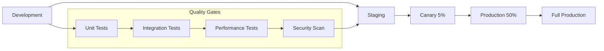

# Liquid Glass Tech Blog - Deployment & Monitoring Strategy

## Production Deployment Architecture

### Multi-Stage Deployment Pipeline



### Vercel Edge Runtime Configuration

```typescript
// vercel.json - Production Configuration
{
  "version": 2,
  "regions": ["iad1", "sfo1", "lhr1", "hnd1"], // Multi-region deployment
  
  "functions": {
    "app/api/ai/generate-image/route.ts": {
      "maxDuration": 30,
      "memory": 1024
    },
    "app/api/effects/compile/route.ts": {
      "maxDuration": 10,
      "memory": 512
    }
  },
  
  "headers": [
    {
      "source": "/api/(.*)",
      "headers": [
        {
          "key": "Cache-Control", 
          "value": "s-maxage=3600, stale-while-revalidate=86400"
        },
        {
          "key": "X-Content-Type-Options",
          "value": "nosniff"
        },
        {
          "key": "X-Frame-Options", 
          "value": "DENY"
        },
        {
          "key": "X-XSS-Protection",
          "value": "1; mode=block"
        }
      ]
    },
    {
      "source": "/admin/(.*)",
      "headers": [
        {
          "key": "X-Robots-Tag",
          "value": "noindex, nofollow"
        }
      ]
    }
  ],
  
  "rewrites": [
    {
      "source": "/sitemap.xml",
      "destination": "/api/sitemap"
    },
    {
      "source": "/robots.txt", 
      "destination": "/api/robots"
    }
  ],
  
  "redirects": [
    {
      "source": "/admin",
      "destination": "/admin/dashboard",
      "permanent": true
    }
  ]
}
```

## Environment Configuration Management

### Production Environment Variables

```bash
# Production .env configuration
NEXT_PUBLIC_APP_URL=https://liquid-glass-blog.vercel.app
NEXT_PUBLIC_ANALYTICS_ID=G-XXXXXXXXXX

# AI Services
OPENAI_API_KEY=sk-xxxx...
LEONARDO_AI_API_KEY=xxxx...
AI_RATE_LIMIT_PER_HOUR=5

# Image & CDN
CLOUDINARY_CLOUD_NAME=liquid-glass
CLOUDINARY_API_KEY=xxxx...
CLOUDINARY_API_SECRET=xxxx...

# Authentication  
NEXTAUTH_URL=https://liquid-glass-blog.vercel.app
NEXTAUTH_SECRET=xxxx...
ADMIN_USERNAME=admin
ADMIN_PASSWORD_HASH=$2b$12$...

# Monitoring
SENTRY_DSN=https://xxx@xxx.ingest.sentry.io/xxx
VERCEL_ANALYTICS_ID=prj_xxx...

# Performance
ENABLE_GPU_ACCELERATION=true
PERFORMANCE_MODE=production
MAX_PARTICLE_COUNT=200
```

### Configuration Validation

```typescript
// lib/config/environment.ts
import { z } from 'zod';

const envSchema = z.object({
  // App Configuration
  NEXT_PUBLIC_APP_URL: z.string().url(),
  NODE_ENV: z.enum(['development', 'staging', 'production']),
  
  // AI Services
  OPENAI_API_KEY: z.string().min(1),
  LEONARDO_AI_API_KEY: z.string().optional(),
  AI_RATE_LIMIT_PER_HOUR: z.coerce.number().min(1).max(100),
  
  // Image Services
  CLOUDINARY_CLOUD_NAME: z.string().min(1),
  CLOUDINARY_API_KEY: z.string().min(1),
  CLOUDINARY_API_SECRET: z.string().min(1),
  
  // Security
  NEXTAUTH_SECRET: z.string().min(32),
  ADMIN_PASSWORD_HASH: z.string().min(1),
  
  // Performance
  ENABLE_GPU_ACCELERATION: z.coerce.boolean(),
  PERFORMANCE_MODE: z.enum(['development', 'staging', 'production']),
  MAX_PARTICLE_COUNT: z.coerce.number().min(10).max(500)
});

export const env = envSchema.parse(process.env);

// Runtime environment validation
export const validateEnvironment = () => {
  try {
    envSchema.parse(process.env);
    console.log('✅ Environment configuration valid');
  } catch (error) {
    console.error('❌ Environment configuration invalid:', error);
    process.exit(1);
  }
};
```

## Continuous Deployment Pipeline

### Production Deploy Workflow

```yaml
# .github/workflows/production-deploy.yml
name: Production Deployment

on:
  push:
    branches: [main]
  
env:
  VERCEL_ORG_ID: ${{ secrets.VERCEL_ORG_ID }}
  VERCEL_PROJECT_ID: ${{ secrets.VERCEL_PROJECT_ID }}

jobs:
  quality-gates:
    runs-on: ubuntu-latest
    
    steps:
      - name: Checkout
        uses: actions/checkout@v4
        
      - name: Setup Node.js
        uses: actions/setup-node@v4
        with:
          node-version: '20'
          cache: 'npm'
          
      - name: Install dependencies
        run: npm ci
        
      - name: Environment validation
        run: npm run validate:env
        
      - name: Type checking
        run: npm run type-check
        
      - name: Linting
        run: npm run lint
        
      - name: Unit tests
        run: npm run test:unit
        
      - name: Integration tests
        run: npm run test:integration
        
      - name: Build application
        run: npm run build
        
      - name: Performance audit
        run: npm run test:performance
        
      - name: Security scan
        run: npm audit --audit-level high
        
      - name: Bundle analysis
        run: npm run analyze
        env:
          ANALYZE: true
          
  staging-deploy:
    needs: quality-gates
    runs-on: ubuntu-latest
    environment: staging
    
    steps:
      - name: Checkout
        uses: actions/checkout@v4
        
      - name: Install Vercel CLI
        run: npm install --global vercel@latest
        
      - name: Pull Vercel environment
        run: vercel pull --yes --environment=preview --token=${{ secrets.VERCEL_TOKEN }}
        
      - name: Deploy to staging
        run: vercel deploy --token=${{ secrets.VERCEL_TOKEN }}
        id: staging-deploy
        
      - name: E2E tests on staging
        run: npm run test:e2e
        env:
          BASE_URL: ${{ steps.staging-deploy.outputs.url }}
          
      - name: Accessibility audit on staging
        run: npm run test:a11y
        env:
          BASE_URL: ${{ steps.staging-deploy.outputs.url }}
          
  canary-deploy:
    needs: staging-deploy
    runs-on: ubuntu-latest
    environment: production
    
    steps:
      - name: Checkout
        uses: actions/checkout@v4
        
      - name: Install Vercel CLI
        run: npm install --global vercel@latest
        
      - name: Deploy to production (canary)
        run: |
          vercel --prod --token=${{ secrets.VERCEL_TOKEN }}
        id: canary-deploy
        
      - name: Monitor canary metrics
        run: npm run monitor:canary
        timeout-minutes: 30
        
      - name: Promote to full production
        if: success()
        run: vercel promote --token=${{ secrets.VERCEL_TOKEN }}
```

## Monitoring & Observability

### Real-Time Performance Monitoring

```typescript
// lib/monitoring/performance-monitor.ts
class ProductionPerformanceMonitor {
  private metrics: Map<string, number[]> = new Map();
  
  constructor() {
    this.initWebVitalsMonitoring();
    this.initCustomMetrics();
    this.initErrorTracking();
  }
  
  // Core Web Vitals Monitoring
  private initWebVitalsMonitoring() {
    import('web-vitals').then(({ getCLS, getFID, getFCP, getLCP, getTTFB }) => {
      const vitalsReporter = (metric: any) => {
        // Alert thresholds
        const thresholds = {
          LCP: 2500,
          FID: 100,
          CLS: 0.1,
          FCP: 1800,
          TTFB: 800
        };
        
        // Store metric
        this.recordMetric(metric.name, metric.value);
        
        // Check thresholds
        if (metric.value > thresholds[metric.name as keyof typeof thresholds]) {
          this.sendAlert('performance_threshold_exceeded', {
            metric: metric.name,
            value: metric.value,
            threshold: thresholds[metric.name as keyof typeof thresholds],
            url: window.location.href
          });
        }
        
        // Send to analytics
        gtag('event', 'web_vitals', {
          metric_name: metric.name,
          metric_value: metric.value,
          metric_rating: metric.rating
        });
      };
      
      getCLS(vitalsReporter);
      getFID(vitalsReporter);
      getFCP(vitalsReporter);
      getLCP(vitalsReporter);
      getTTFB(vitalsReporter);
    });
  }
  
  // Custom Liquid Glass Metrics
  private initCustomMetrics() {
    // Effect performance monitoring
    const effectObserver = new PerformanceObserver((list) => {
      for (const entry of list.getEntries()) {
        if (entry.name.includes('liquid-glass')) {
          this.recordMetric('glass_effect_duration', entry.duration);
          
          // Alert if effects are causing frame drops
          if (entry.duration > 16.67) { // >60fps threshold
            this.sendAlert('effect_performance_degradation', {
              effect: entry.name,
              duration: entry.duration,
              url: window.location.href
            });
          }
        }
      }
    });
    
    effectObserver.observe({ entryTypes: ['measure', 'navigation'] });
  }
  
  // Error & Exception Tracking
  private initErrorTracking() {
    window.addEventListener('error', (event) => {
      this.recordError('javascript_error', {
        message: event.message,
        filename: event.filename,
        lineno: event.lineno,
        colno: event.colno,
        stack: event.error?.stack
      });
    });
    
    window.addEventListener('unhandledrejection', (event) => {
      this.recordError('unhandled_promise_rejection', {
        reason: event.reason,
        promise: event.promise
      });
    });
  }
  
  private recordMetric(name: string, value: number) {
    if (!this.metrics.has(name)) {
      this.metrics.set(name, []);
    }
    
    const values = this.metrics.get(name)!;
    values.push(value);
    
    // Keep only recent values (sliding window)
    if (values.length > 100) {
      values.shift();
    }
  }
  
  private sendAlert(type: string, data: any) {
    // Send to monitoring service
    fetch('/api/monitoring/alert', {
      method: 'POST',
      headers: { 'Content-Type': 'application/json' },
      body: JSON.stringify({
        type,
        timestamp: Date.now(),
        data,
        userAgent: navigator.userAgent,
        url: window.location.href
      })
    });
  }
  
  // Health Check Endpoint
  getHealthStatus() {
    const recentMetrics = Array.from(this.metrics.entries()).map(([name, values]) => ({
      name,
      average: values.reduce((a, b) => a + b, 0) / values.length,
      samples: values.length
    }));
    
    return {
      status: 'healthy',
      timestamp: Date.now(),
      metrics: recentMetrics
    };
  }
}

// Initialize monitoring
export const performanceMonitor = new ProductionPerformanceMonitor();
```

### Business Metrics Dashboard

```typescript
// lib/analytics/business-metrics.ts
interface BusinessMetrics {
  // Content Metrics
  totalPageViews: number;
  uniqueVisitors: number;
  averageSessionDuration: number;
  bounceRate: number;
  
  // Engagement Metrics
  effectInteractions: number;
  searchQueries: number;
  aiImageGenerations: number;
  downloadedEffects: number;
  
  // Technical Metrics
  averageLoadTime: number;
  errorRate: number;
  conversionRate: number;
}

class BusinessMetricsCollector {
  private metrics: BusinessMetrics = {
    totalPageViews: 0,
    uniqueVisitors: 0,
    averageSessionDuration: 0,
    bounceRate: 0,
    effectInteractions: 0,
    searchQueries: 0,
    aiImageGenerations: 0,
    downloadedEffects: 0,
    averageLoadTime: 0,
    errorRate: 0,
    conversionRate: 0
  };
  
  // Track effect interactions
  trackEffectInteraction(effectType: string, interactionType: string) {
    this.metrics.effectInteractions++;
    
    gtag('event', 'effect_interaction', {
      effect_type: effectType,
      interaction_type: interactionType,
      timestamp: Date.now()
    });
  }
  
  // Track AI image generation success/failure
  trackAiImageGeneration(success: boolean, provider: string, cost: number) {
    if (success) {
      this.metrics.aiImageGenerations++;
    }
    
    gtag('event', 'ai_image_generation', {
      success,
      provider,
      cost,
      timestamp: Date.now()
    });
  }
  
  // Track effect downloads
  trackEffectDownload(effectId: string, format: string) {
    this.metrics.downloadedEffects++;
    
    gtag('event', 'effect_download', {
      effect_id: effectId,
      download_format: format,
      timestamp: Date.now()
    });
  }
  
  // Generate daily report
  generateDailyReport(): BusinessMetrics {
    return { ...this.metrics };
  }
}

export const businessMetrics = new BusinessMetricsCollector();
```

## Security Monitoring & Compliance

### Security Monitoring System

```typescript
// lib/security/security-monitor.ts
class SecurityMonitor {
  private suspiciousActivities: Map<string, number> = new Map();
  
  constructor() {
    this.initSecurityHeaders();
    this.monitorAPIUsage();
    this.trackAdminAccess();
  }
  
  private initSecurityHeaders() {
    // Content Security Policy
    const csp = [
      "default-src 'self'",
      "script-src 'self' 'unsafe-eval' 'unsafe-inline' https://www.googletagmanager.com",
      "style-src 'self' 'unsafe-inline'",
      "img-src 'self' data: https://res.cloudinary.com https://oaidalleapiprodscus.blob.core.windows.net",
      "connect-src 'self' https://api.openai.com https://cloud.leonardo.ai",
      "frame-src 'self' https://codesandbox.io",
      "worker-src 'self' blob:"
    ].join('; ');
    
    // Set security headers
    if (typeof document !== 'undefined') {
      const meta = document.createElement('meta');
      meta.httpEquiv = 'Content-Security-Policy';
      meta.content = csp;
      document.head.appendChild(meta);
    }
  }
  
  // Monitor API rate limiting
  private monitorAPIUsage() {
    const originalFetch = window.fetch;
    window.fetch = async (...args) => {
      const response = await originalFetch(...args);
      
      // Check for rate limiting
      if (response.status === 429) {
        this.recordSecurityEvent('rate_limit_exceeded', {
          url: args[0],
          method: args[1]?.method || 'GET'
        });
      }
      
      // Monitor AI API usage
      if (args[0]?.toString().includes('/api/ai/')) {
        this.recordSecurityEvent('ai_api_usage', {
          endpoint: args[0],
          timestamp: Date.now()
        });
      }
      
      return response;
    };
  }
  
  // Track admin access patterns
  private trackAdminAccess() {
    if (window.location.pathname.startsWith('/admin')) {
      const sessionKey = `admin_session_${Date.now()}`;
      
      this.recordSecurityEvent('admin_access', {
        sessionKey,
        userAgent: navigator.userAgent,
        timestamp: Date.now(),
        referrer: document.referrer
      });
      
      // Monitor for suspicious activity
      this.detectSuspiciousActivity();
    }
  }
  
  private detectSuspiciousActivity() {
    const currentHour = new Date().getHours();
    const activityKey = `admin_access_${currentHour}`;
    
    const currentCount = this.suspiciousActivities.get(activityKey) || 0;
    this.suspiciousActivities.set(activityKey, currentCount + 1);
    
    // Alert if unusual activity patterns
    if (currentCount > 10) {
      this.sendSecurityAlert('unusual_admin_activity', {
        hour: currentHour,
        accessCount: currentCount,
        userAgent: navigator.userAgent
      });
    }
  }
  
  private recordSecurityEvent(type: string, data: any) {
    fetch('/api/security/log', {
      method: 'POST',
      headers: { 'Content-Type': 'application/json' },
      body: JSON.stringify({
        type,
        timestamp: Date.now(),
        data
      })
    });
  }
  
  private sendSecurityAlert(type: string, data: any) {
    fetch('/api/security/alert', {
      method: 'POST',
      headers: { 'Content-Type': 'application/json' },
      body: JSON.stringify({
        type,
        severity: 'high',
        timestamp: Date.now(),
        data
      })
    });
  }
}

export const securityMonitor = new SecurityMonitor();
```

## Disaster Recovery & Backup Strategy

### Data Backup Configuration

```typescript
// lib/backup/backup-strategy.ts
interface BackupConfig {
  aiGeneratedImages: {
    retention: '90 days';
    location: 'Cloudinary + AWS S3';
    frequency: 'real-time';
  };
  userPreferences: {
    retention: '1 year';
    location: 'Vercel KV + backup storage';
    frequency: 'daily';
  };
  effectLibrary: {
    retention: 'permanent';
    location: 'Git repository + CDN';
    frequency: 'on-change';
  };
  analytics: {
    retention: '2 years';
    location: 'Google Analytics + data export';
    frequency: 'weekly';
  };
}

class DisasterRecoveryManager {
  // Backup verification
  async verifyBackupIntegrity() {
    const checks = [
      this.verifyImageBackups(),
      this.verifyConfigurationBackups(),
      this.verifyEffectLibraryBackups()
    ];
    
    const results = await Promise.allSettled(checks);
    const failed = results.filter(result => result.status === 'rejected');
    
    if (failed.length > 0) {
      throw new Error(`Backup verification failed: ${failed.length} checks failed`);
    }
    
    return { status: 'verified', timestamp: Date.now() };
  }
  
  // Rollback strategy
  async executeRollback(version: string) {
    console.log(`Initiating rollback to version ${version}`);
    
    // 1. Revert application deployment
    await this.revertDeployment(version);
    
    // 2. Restore configuration
    await this.restoreConfiguration(version);
    
    // 3. Verify system health
    const healthCheck = await this.verifySystemHealth();
    
    if (!healthCheck.healthy) {
      throw new Error('Rollback failed: System health check failed');
    }
    
    console.log('Rollback completed successfully');
  }
}
```

This comprehensive deployment and monitoring strategy ensures the Liquid Glass Tech Blog operates reliably in production with enterprise-grade observability, security monitoring, and disaster recovery capabilities.