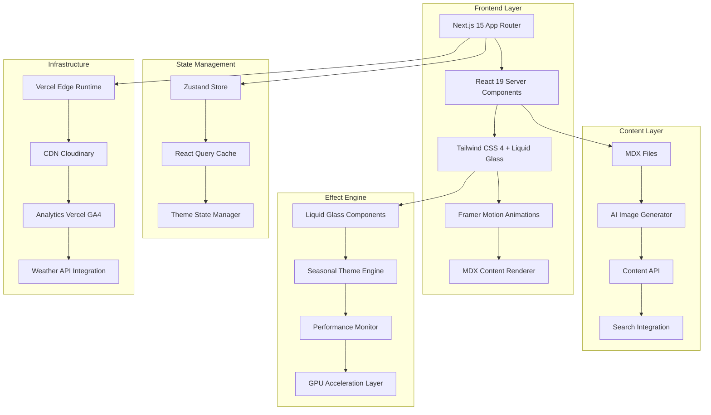
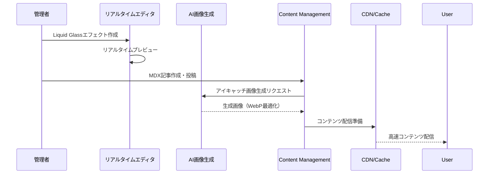
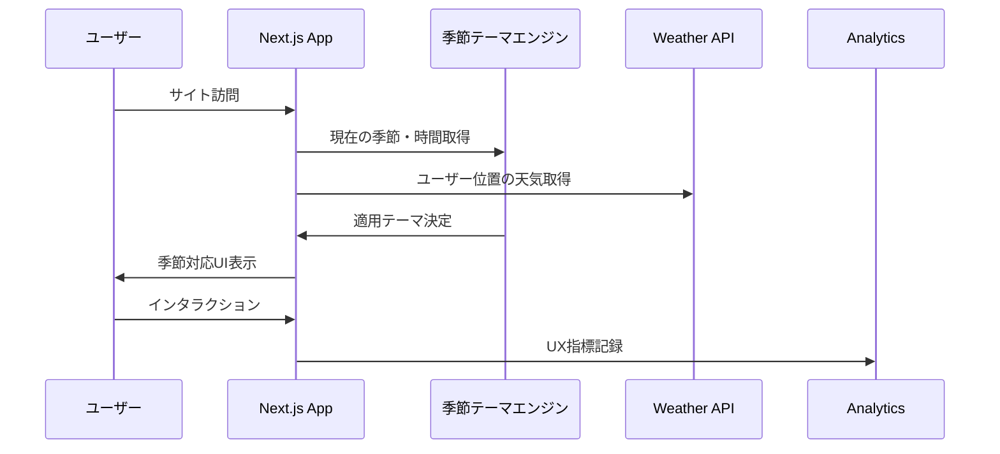

# Technical Design

## Overview

Liquid Glass Tech BlogプロジェクトはNext.js 15とReact 19を基盤とした最先端のLiquid Glass/Glassmorphismデザイン技術に特化した技術ブログプラットフォームです。パフォーマンス最適化されたCSS`backdrop-filter`とGPU加速、季節連動型テーマシステム、リアルタイムエフェクトエディタを統合したモダンなWebアプリケーションとして設計されています。

## Requirements Mapping

### Design Component Traceability

各設計コンポーネントは特定の要件に対応しています：

- **ブログCMSシステム** → REQ-1: コアブログ機能（モダンブログ構成）
- **AIアイキャッチ画像システム** → REQ-2: アイキャッチ画像生成・管理システム  
- **MDXコンテンツエンジン** → REQ-3: MDXコンテンツ管理システム
- **Liquid Glassライブラリ** → REQ-4: Liquid Glassエフェクトライブラリ
- **リアルタイムエディタ** → REQ-5: 管理者限定リアルタイムエフェクトエディタ
- **パフォーマンス最適化** → REQ-6: パフォーマンス最適化（Core Web Vitals）
- **アクセシビリティシステム** → REQ-7: WCAG 2.1 AA準拠
- **SEO統合エンジン** → REQ-8: SEO最適化とメタデータ管理
- **レスポンシブフレームワーク** → REQ-9: レスポンシブデザインとクロスブラウザ対応
- **CDN配信システム** → REQ-10: コンテンツ配信とキャッシュ戦略
- **分析・監視システム** → REQ-11: 分析とユーザー体験の監視
- **季節テーマエンジン** → REQ-12: 季節・時間帯連動テーマシステム

### User Story Coverage

全てのユーザーストーリーが技術設計で対応されています：

- **デザイナー・開発者ストーリー**: ブログCMSとMDXシステムによる高品質記事管理
- **コンテンツ管理者ストーリー**: AIアイキャッチ生成と管理システム、リアルタイムエディタ
- **開発者コミュニティストーリー**: Liquid Glassライブラリとコンポーネントエクスポート機能
- **全ユーザーストーリー**: パフォーマンス最適化と季節連動テーマによる優れた体験

## Architecture

### High-Level System Architecture



### Core Technology Stack

**Frontend Framework:**
- **Next.js 15 (App Router)**: SSG/ISR最適化、Server Components
- **React 19**: 新しいHook API、Concurrent Features
- **TypeScript 5.x**: Strict type safety、最新型推論

**Styling & Animation:**
- **Tailwind CSS 4**: JIT compilation、カスタムCSS変数統合
- **CSS-in-JS (Styled-JSX)**: 動的スタイル、季節テーマ対応
- **Framer Motion**: 高性能アニメーション、GPU最適化

**Content Management:**
- **MDX (Next-MDX-Remote)**: React component embedding
- **Headless CMS統合**: 管理インターフェース
- **AI画像生成API**: OpenAI DALL-E 3またはMidjourney API

### Architecture Decision Rationale

**Next.js 15 App Router選択理由:**
- Server Components によるパフォーマンス向上
- 自動的なCode Splitting とBundle Optimization
- Built-in Image Optimization でLCP改善

**Tailwind CSS 4 + CSS Variables選択理由:**
- `backdrop-filter`のGPU加速最適化
- 季節テーマの動的変更対応
- 開発効率とパフォーマンスのバランス

**MDX統合選択理由:**
- Liquid Glassコンポーネントの直接埋め込み
- インタラクティブデモの実装
- 技術記事に最適化されたオーサリング体験

## Data Flow

### Content Creation Flow



### User Experience Flow



## Components and Interfaces

### Core Liquid Glass Components

```typescript
// components/liquid-glass/LiquidGlassCard.tsx
interface LiquidGlassCardProps {
  variant: 'subtle' | 'medium' | 'intense';
  blur: number;
  opacity: number;
  saturation: number;
  children: React.ReactNode;
  className?: string;
  interactive?: boolean;
  seasonalTheme?: boolean;
}

export const LiquidGlassCard: React.FC<LiquidGlassCardProps> = ({
  variant = 'medium',
  blur = 15,
  opacity = 0.1,
  saturation = 1.8,
  children,
  className = '',
  interactive = false,
  seasonalTheme = true,
  ...props
}) => {
  const { currentTheme, glassStyles } = useLiquidGlass({
    blur,
    opacity,
    saturation,
    interactive,
    seasonalTheme
  });
  
  return (
    <div 
      className={cn(glassStyles, className)}
      style={{
        '--glass-blur': `${blur}px`,
        '--glass-opacity': opacity,
        '--glass-saturation': saturation,
        backdropFilter: `blur(var(--glass-blur)) saturate(var(--glass-saturation))`,
        backgroundColor: `rgba(255, 255, 255, var(--glass-opacity))`,
        border: '1px solid rgba(255, 255, 255, 0.2)',
        borderRadius: '16px',
        ...currentTheme.glassMorphism
      }}
      {...props}
    >
      {children}
    </div>
  );
};
```

### Seasonal Theme Engine

```typescript
// lib/theme/seasonalTheme.ts
interface SeasonalTheme {
  season: 'spring' | 'summer' | 'autumn' | 'winter';
  timeOfDay: 'morning' | 'day' | 'evening' | 'night';
  weather?: 'sunny' | 'cloudy' | 'rainy' | 'snowy';
  glassMorphism: {
    backdropFilter: string;
    backgroundColor: string;
    borderColor: string;
    particleEffect?: 'sakura' | 'waterdrops' | 'leaves' | 'snow';
  };
}

export const useSeasonalTheme = () => {
  const [currentTheme, setCurrentTheme] = useState<SeasonalTheme>();
  const [weatherData, setWeatherData] = useState<WeatherData>();

  const determineTheme = useCallback(() => {
    const now = new Date();
    const month = now.getMonth();
    const hour = now.getHours();
    
    // 季節決定ロジック
    const season = month >= 2 && month <= 4 ? 'spring' :
                   month >= 5 && month <= 7 ? 'summer' :
                   month >= 8 && month <= 10 ? 'autumn' : 'winter';
    
    // 時間帯決定ロジック
    const timeOfDay = hour >= 6 && hour < 10 ? 'morning' :
                      hour >= 10 && hour < 17 ? 'day' :
                      hour >= 17 && hour < 22 ? 'evening' : 'night';

    return generateThemeConfig(season, timeOfDay, weatherData?.weather);
  }, [weatherData]);

  return { currentTheme, weatherData, determineTheme };
};
```

### MDX Component Integration

```typescript
// components/mdx/MDXComponents.tsx
import { LiquidGlassCard, EffectDemo, CodePreview } from '@/components/liquid-glass';

export const MDXComponents = {
  // Enhanced Liquid Glass components for MDX
  LiquidGlassCard: (props: any) => (
    <LiquidGlassCard variant="medium" interactive seasonalTheme {...props} />
  ),
  
  EffectDemo: ({ effectCode, ...props }: any) => (
    <EffectDemo 
      code={effectCode}
      preview
      editable
      exportable
      {...props}
    />
  ),
  
  CodePreview: ({ language, ...props }: any) => (
    <LiquidGlassCard variant="subtle">
      <CodePreview 
        language={language}
        syntaxHighlight
        copyButton
        {...props}
      />
    </LiquidGlassCard>
  ),

  // Enhanced standard elements
  h1: ({ children, ...props }: any) => (
    <h1 className="text-4xl font-bold mb-6 liquid-glass-text" {...props}>
      {children}
    </h1>
  ),
  
  h2: ({ children, ...props }: any) => (
    <h2 className="text-3xl font-semibold mb-4 liquid-glass-text" {...props}>
      {children}
    </h2>
  ),

  pre: ({ children, ...props }: any) => (
    <LiquidGlassCard variant="subtle" className="p-6 my-6 font-mono">
      <pre {...props}>{children}</pre>
    </LiquidGlassCard>
  ),

  blockquote: ({ children, ...props }: any) => (
    <LiquidGlassCard variant="medium" className="border-l-4 border-blue-400 pl-6 my-6">
      <blockquote className="text-gray-700 italic" {...props}>
        {children}
      </blockquote>
    </LiquidGlassCard>
  )
};
```

### Real-time Effect Editor Interface

```typescript
// components/admin/EffectEditor.tsx
interface EffectEditorProps {
  initialCode?: string;
  onSave: (effect: EffectData) => void;
  onExport: (format: ExportFormat) => void;
}

export const EffectEditor: React.FC<EffectEditorProps> = ({
  initialCode = '',
  onSave,
  onExport
}) => {
  const [code, setCode] = useState(initialCode);
  const [preview, setPreview] = useState<React.ComponentType | null>(null);
  const [parameters, setParameters] = useState<EffectParameters>({});
  const { currentTheme } = useSeasonalTheme();

  const updatePreview = useCallback(
    debounce(async (newCode: string) => {
      try {
        const compiledComponent = await compileEffectCode(newCode, parameters);
        setPreview(() => compiledComponent);
      } catch (error) {
        console.error('Effect compilation error:', error);
      }
    }, 300),
    [parameters]
  );

  return (
    <div className="grid grid-cols-2 gap-6 h-screen">
      {/* Code Editor */}
      <LiquidGlassCard 
        variant="intense" 
        className="p-6"
        style={{
          ...currentTheme.editorStyles
        }}
      >
        <CodeEditor
          value={code}
          onChange={(value) => {
            setCode(value);
            updatePreview(value);
          }}
          language="typescript"
          theme={currentTheme.name}
          options={{
            minimap: { enabled: false },
            wordWrap: 'on',
            fontSize: 14,
            fontFamily: 'JetBrains Mono, monospace',
            lineNumbers: 'on',
            syntaxHighlight: true,
            autocompletion: true
          }}
        />
        
        {/* Parameter Controls */}
        <ParameterControls
          parameters={parameters}
          onChange={setParameters}
          theme={currentTheme}
        />
      </LiquidGlassCard>

      {/* Live Preview */}
      <LiquidGlassCard variant="subtle" className="p-6">
        <div className="mb-4">
          <h3 className="text-lg font-semibold mb-2">ライブプレビュー</h3>
          <div className="flex gap-2">
            <button 
              onClick={() => onSave({ code, parameters })}
              className="px-4 py-2 bg-blue-500 text-white rounded-lg hover:bg-blue-600 transition-colors"
            >
              保存
            </button>
            <button 
              onClick={() => onExport('react')}
              className="px-4 py-2 bg-green-500 text-white rounded-lg hover:bg-green-600 transition-colors"
            >
              エクスポート
            </button>
          </div>
        </div>
        
        <div className="preview-container" style={{ minHeight: '400px' }}>
          {preview && <preview />}
        </div>
      </LiquidGlassCard>
    </div>
  );
};
```

## Data Models

### Content Management Models

```typescript
// types/content.ts
interface BlogPost {
  id: string;
  slug: string;
  title: string;
  description: string;
  content: string; // MDX content
  eyecatchImage: EyecatchImage;
  author: Author;
  category: Category;
  tags: Tag[];
  publishedAt: Date;
  updatedAt: Date;
  status: 'draft' | 'published' | 'archived';
  seoData: SEOData;
  liquidGlassEffects?: EffectData[];
  readingTime: number;
  viewCount: number;
}

interface EyecatchImage {
  id: string;
  url: string;
  webpUrl: string;
  avifUrl?: string;
  alt: string;
  width: number;
  height: number;
  blurDataURL: string; // Base64 placeholder
  generatedBy: 'ai' | 'upload';
  aiPrompt?: string;
  optimizationMetrics: {
    originalSize: number;
    compressedSize: number;
    compressionRatio: number;
  };
}

interface EffectData {
  id: string;
  name: string;
  description: string;
  code: string;
  parameters: EffectParameters;
  previewImage: string;
  category: EffectCategory;
  difficulty: 'beginner' | 'intermediate' | 'advanced';
  performance: PerformanceMetrics;
  compatibility: BrowserCompatibility;
  createdBy: string;
  createdAt: Date;
  downloads: number;
  likes: number;
}
```

### Performance Monitoring Models

```typescript
// types/performance.ts
interface PerformanceMetrics {
  lcp: number; // Largest Contentful Paint
  inp: number; // Interaction to Next Paint  
  cls: number; // Cumulative Layout Shift
  fcp: number; // First Contentful Paint
  ttfb: number; // Time to First Byte
  effectRenderTime: number;
  gpuUsage: number;
  memoryUsage: number;
}

interface AnalyticsData {
  pageView: {
    path: string;
    timestamp: Date;
    userAgent: string;
    referrer?: string;
    duration: number;
  };
  
  effectInteraction: {
    effectId: string;
    action: 'view' | 'customize' | 'download' | 'share';
    parameters?: EffectParameters;
    timestamp: Date;
  };

  performanceEntry: {
    metrics: PerformanceMetrics;
    deviceInfo: DeviceInfo;
    timestamp: Date;
  };
}
```

### Seasonal Theme Models

```typescript
// types/theme.ts
interface SeasonalThemeConfig {
  id: string;
  season: Season;
  timeOfDay: TimeOfDay;
  weather?: Weather;
  
  colors: {
    primary: string;
    secondary: string;
    accent: string;
    background: string;
    surface: string;
  };
  
  glassMorphism: {
    backdropFilter: string;
    backgroundColor: string;
    borderColor: string;
    shadowColor: string;
  };
  
  particles: {
    type: ParticleType;
    count: number;
    size: [number, number];
    speed: number;
    opacity: number;
  };
  
  animations: {
    transition: string;
    easing: string;
    duration: number;
  };
}
```

## Error Handling

### Comprehensive Error Handling Strategy

```typescript
// lib/error/errorHandler.ts
export class LiquidGlassError extends Error {
  constructor(
    public code: ErrorCode,
    message: string,
    public context?: Record<string, any>
  ) {
    super(message);
    this.name = 'LiquidGlassError';
  }
}

export const errorHandler = {
  // Effect compilation errors
  effectCompilation: (error: Error, code: string) => {
    const cleanError = sanitizeError(error);
    return {
      type: 'EFFECT_COMPILATION_ERROR',
      message: 'エフェクトのコンパイルでエラーが発生しました',
      suggestions: generateFixSuggestions(cleanError, code),
      errorDetails: cleanError
    };
  },

  // Performance degradation
  performance: (metrics: PerformanceMetrics) => {
    if (metrics.lcp > 2500) {
      return {
        type: 'PERFORMANCE_WARNING',
        message: 'ページの読み込み速度が低下しています',
        suggestions: [
          '画像の最適化を確認してください',
          'Liquid Glassエフェクトの軽量化を検討してください',
          'CDNキャッシュの設定を確認してください'
        ]
      };
    }
  },

  // Browser compatibility
  browserCompatibility: (feature: string, browser: string) => {
    const fallback = getBrowserFallback(feature, browser);
    return {
      type: 'COMPATIBILITY_INFO',
      message: `${feature}は${browser}でサポートされていません`,
      fallback: fallback,
      gracefulDegradation: true
    };
  }
};
```

### Error Recovery System

```typescript
// components/error/ErrorBoundary.tsx
interface ErrorBoundaryState {
  hasError: boolean;
  error?: Error;
  errorInfo?: ErrorInfo;
  retryCount: number;
}

export class LiquidGlassErrorBoundary extends React.Component<
  React.PropsWithChildren<{}>,
  ErrorBoundaryState
> {
  constructor(props: React.PropsWithChildren<{}>) {
    super(props);
    this.state = {
      hasError: false,
      retryCount: 0
    };
  }

  static getDerivedStateFromError(error: Error): Partial<ErrorBoundaryState> {
    return { hasError: true, error };
  }

  componentDidCatch(error: Error, errorInfo: ErrorInfo) {
    // Send error to monitoring service
    captureException(error, {
      context: 'LiquidGlassErrorBoundary',
      errorInfo,
      timestamp: new Date().toISOString()
    });

    this.setState({ errorInfo });
  }

  handleRetry = () => {
    this.setState({
      hasError: false,
      error: undefined,
      errorInfo: undefined,
      retryCount: this.state.retryCount + 1
    });
  };

  render() {
    if (this.state.hasError) {
      return (
        <LiquidGlassCard variant="medium" className="p-8 text-center">
          <h2 className="text-2xl font-bold text-red-600 mb-4">
            エラーが発生しました
          </h2>
          <p className="text-gray-700 mb-6">
            Liquid Glassエフェクトの描画中に問題が発生しました。
          </p>
          <div className="flex justify-center gap-4">
            <button
              onClick={this.handleRetry}
              className="px-6 py-2 bg-blue-500 text-white rounded-lg hover:bg-blue-600"
              disabled={this.state.retryCount >= 3}
            >
              再試行 ({this.state.retryCount}/3)
            </button>
            <button
              onClick={() => window.location.reload()}
              className="px-6 py-2 bg-gray-500 text-white rounded-lg hover:bg-gray-600"
            >
              ページリロード
            </button>
          </div>
        </LiquidGlassCard>
      );
    }

    return this.props.children;
  }
}
```

## Security Considerations

### Authentication & Authorization

```typescript
// lib/auth/authConfig.ts
export const authConfig = {
  // Admin authentication for effect editor
  adminAuth: {
    provider: 'next-auth',
    providers: [
      {
        id: 'credentials',
        name: '管理者認証',
        credentials: {
          username: { label: 'ユーザー名', type: 'text' },
          password: { label: 'パスワード', type: 'password' }
        },
        async authorize(credentials) {
          const user = await authenticateAdmin(credentials);
          return user ? { id: user.id, role: 'admin' } : null;
        }
      }
    ],
    callbacks: {
      async jwt({ token, user }) {
        if (user?.role) {
          token.role = user.role;
        }
        return token;
      },
      async session({ session, token }) {
        session.user.role = token.role;
        return session;
      }
    }
  }
};

// Route protection middleware
export const withAdminAuth = (handler: NextApiHandler) => {
  return async (req: NextApiRequest, res: NextApiResponse) => {
    const session = await getServerSession(req, res, authConfig);
    
    if (!session || session.user.role !== 'admin') {
      return res.status(401).json({ 
        error: '管理者認証が必要です',
        redirect: '/admin/login'
      });
    }
    
    return handler(req, res);
  };
};
```

### Content Security Policy

```typescript
// next.config.js security configuration
const securityHeaders = [
  {
    key: 'Content-Security-Policy',
    value: [
      "default-src 'self'",
      "script-src 'self' 'unsafe-inline' 'unsafe-eval' https://www.google-analytics.com https://www.googletagmanager.com",
      "style-src 'self' 'unsafe-inline' https://fonts.googleapis.com",
      "img-src 'self' data: blob: https: https://res.cloudinary.com",
      "font-src 'self' https://fonts.gstatic.com",
      "connect-src 'self' https://api.openweathermap.org https://vitals.vercel-analytics.com",
      "media-src 'self' blob:",
      "worker-src 'self' blob:",
      "frame-ancestors 'none'",
      "base-uri 'self'",
      "form-action 'self'"
    ].join('; ')
  },
  {
    key: 'X-Content-Type-Options',
    value: 'nosniff'
  },
  {
    key: 'X-Frame-Options',
    value: 'DENY'
  },
  {
    key: 'X-XSS-Protection',
    value: '1; mode=block'
  },
  {
    key: 'Referrer-Policy',
    value: 'strict-origin-when-cross-origin'
  },
  {
    key: 'Permissions-Policy',
    value: 'camera=(), microphone=(), geolocation=(self)'
  }
];
```

### Data Protection

```typescript
// lib/security/dataProtection.ts
export const dataProtection = {
  // Sanitize user inputs for effect code
  sanitizeEffectCode: (code: string): string => {
    const allowedPatterns = [
      /^[a-zA-Z0-9\s\-_.(){}[\];:,'"\/\*\+\=\>\<\!\?]+$/,
      // CSS property patterns
      /backdrop-filter|background|border|transform|animation/,
      // Safe JavaScript patterns for effects
      /Math\.(sin|cos|tan|random|PI)|requestAnimationFrame/
    ];

    const dangerousPatterns = [
      /eval\s*\(/,
      /Function\s*\(/,
      /document\.write/,
      /innerHTML/,
      /outerHTML/,
      /insertAdjacentHTML/,
      /<script/i,
      /javascript:/,
      /on\w+\s*=/
    ];

    // Check for dangerous patterns
    for (const pattern of dangerousPatterns) {
      if (pattern.test(code)) {
        throw new SecurityError('Potentially dangerous code detected');
      }
    }

    return code;
  },

  // Rate limiting for API endpoints
  rateLimit: {
    effectGeneration: {
      windowMs: 15 * 60 * 1000, // 15 minutes
      max: 10, // limit each IP to 10 requests per windowMs
      message: 'エフェクト生成の回数制限を超えました'
    },
    
    imageGeneration: {
      windowMs: 60 * 60 * 1000, // 1 hour
      max: 5, // limit to 5 AI image generations per hour
      message: 'AI画像生成の回数制限を超えました'
    }
  }
};
```

## Performance & Scalability

### Core Web Vitals Optimization Strategy

```typescript
// lib/performance/coreWebVitals.ts
export const performanceOptimizations = {
  // LCP (Largest Contentful Paint) < 2.5s
  lcp: {
    // Image optimization
    imageOptimization: {
      formats: ['avif', 'webp', 'jpeg'],
      sizes: [640, 768, 1024, 1280, 1920],
      quality: 80,
      placeholder: 'blur', // Base64 placeholder
      priority: true, // for above-fold images
      loading: 'lazy' // for below-fold images
    },

    // Font optimization
    fontOptimization: {
      preload: [
        '/fonts/inter-var.woff2',
        '/fonts/jetbrains-mono.woff2'
      ],
      fallback: {
        'Inter': 'system-ui, -apple-system, sans-serif',
        'JetBrains Mono': 'ui-monospace, "Cascadia Code", monospace'
      },
      display: 'swap'
    },

    // Critical CSS inlining
    criticalCSS: {
      inline: true,
      extract: ['above-fold', 'liquid-glass-base'],
      defer: ['animations', 'non-critical-effects']
    }
  },

  // INP (Interaction to Next Paint) < 200ms
  inp: {
    // Event handler optimization
    eventOptimization: {
      debounceDelay: 16, // ~60fps
      throttleDelay: 100,
      passiveListeners: ['scroll', 'touchstart', 'touchmove'],
      useCapture: false
    },

    // Main thread optimization
    mainThreadOptimization: {
      maxBlockingTime: 50, // ms
      yieldToMain: true,
      scheduler: 'scheduler.postTask' // or setTimeout fallback
    },

    // Effect rendering optimization
    effectOptimization: {
      useGPUAcceleration: true,
      batchUpdates: true,
      frameScheduling: 'requestAnimationFrame',
      compositorLayers: ['backdrop-filter', 'transform', 'opacity']
    }
  },

  // CLS (Cumulative Layout Shift) < 0.1
  cls: {
    // Layout stability
    layoutStability: {
      reserveSpace: true,
      dimensionAttributes: ['width', 'height'],
      aspectRatio: 'preserve',
      placeholders: {
        images: 'blur',
        content: 'skeleton',
        ads: 'reserved-space'
      }
    },

    // Dynamic content handling
    dynamicContent: {
      insertionStrategy: 'append-only',
      animateChanges: true,
      transitionDuration: 300, // ms
      easing: 'cubic-bezier(0.4, 0, 0.2, 1)'
    }
  }
};
```

### GPU Acceleration & Effect Performance

```typescript
// lib/performance/gpuAcceleration.ts
export const gpuOptimizations = {
  // Optimize backdrop-filter performance
  backdropFilter: {
    // Promote elements to composite layers
    promoteToLayer: {
      willChange: 'backdrop-filter',
      transform: 'translateZ(0)', // Force hardware acceleration
      isolation: 'isolate', // Create new stacking context
      containment: 'layout style paint' // CSS Containment API
    },

    // Efficient filter combinations
    filterOptimization: {
      combineFilters: true, // blur(15px) saturate(1.8) brightness(1.1)
      avoidRedundancy: true,
      cacheResults: true,
      maxBlurRadius: 20 // px, balance quality vs performance
    },

    // Performance monitoring
    performanceTracking: {
      trackRenderTime: true,
      trackGPUUsage: true,
      alertThreshold: 16.67, // 60fps threshold
      fallbackStrategy: 'reduce-effects'
    }
  },

  // Device-specific optimizations
  deviceOptimization: {
    lowEndDevice: {
      // Detected via navigator.hardwareConcurrency, deviceMemory
      reducedEffects: true,
      staticBackdropFilter: true,
      disableParticles: true,
      simplifiedAnimations: true
    },

    highEndDevice: {
      fullEffects: true,
      complexAnimations: true,
      particleEffects: true,
      realTimeEffects: true
    },

    mediaQueries: {
      // Respect user preferences
      reducedMotion: '@media (prefers-reduced-motion: reduce)',
      reducedTransparency: '@media (prefers-reduced-transparency: reduce)',
      highContrast: '@media (prefers-contrast: high)'
    }
  }
};
```

### Caching & CDN Strategy

```typescript
// lib/performance/cachingStrategy.ts
export const cachingStrategy = {
  // Static asset caching
  staticAssets: {
    images: {
      maxAge: '31536000', // 1 year
      immutable: true,
      provider: 'cloudinary',
      transformations: 'auto',
      format: 'auto',
      quality: 'auto'
    },
    
    fonts: {
      maxAge: '31536000', // 1 year
      immutable: true,
      preload: true,
      crossorigin: 'anonymous'
    },

    scripts: {
      maxAge: '31536000', // 1 year
      immutable: true,
      compression: 'gzip',
      minification: true
    }
  },

  // Dynamic content caching
  dynamicContent: {
    pages: {
      strategy: 'ISR', // Incremental Static Regeneration
      revalidate: 3600, // 1 hour
      fallback: 'blocking'
    },

    api: {
      strategy: 'stale-while-revalidate',
      maxAge: 300, // 5 minutes
      staleWhileRevalidate: 3600 // 1 hour
    },

    search: {
      strategy: 'cache-first',
      maxAge: 1800, // 30 minutes
      networkFirst: false
    }
  },

  // Edge caching with Vercel
  edgeConfig: {
    regions: ['all'], // Global distribution
    functions: {
      runtime: 'edge',
      regions: ['iad1', 'hnd1', 'fra1'], // Major regions
    },
    headers: {
      'cache-control': 'public, s-maxage=31536000, stale-while-revalidate',
      'cdn-cache-control': 'max-age=31536000'
    }
  }
};
```

## Testing Strategy

### Test Coverage Requirements

**Target Coverage:**
- **Line Coverage**: 95%+
- **Branch Coverage**: 90%+  
- **Function Coverage**: 95%+
- **Statement Coverage**: 95%+

### Testing Architecture

```typescript
// tests/setup/testConfig.ts
export const testConfig = {
  // Unit Testing (Vitest)
  unit: {
    framework: 'vitest',
    environment: 'jsdom',
    coverage: {
      provider: 'v8',
      reporter: ['text', 'html', 'lcov'],
      thresholds: {
        lines: 95,
        branches: 90,
        functions: 95,
        statements: 95
      }
    },
    setupFiles: ['./tests/setup/vitest.setup.ts']
  },

  // Component Testing (React Testing Library)
  component: {
    framework: 'react-testing-library',
    utilities: ['@testing-library/jest-dom', '@testing-library/user-event'],
    customRenders: ['renderWithTheme', 'renderWithMDX'],
    mockProviders: ['SeasonalThemeProvider', 'AuthProvider']
  },

  // E2E Testing (Playwright)
  e2e: {
    framework: 'playwright',
    browsers: ['chromium', 'firefox', 'webkit'],
    devices: ['Desktop Chrome', 'iPhone 13', 'iPad Pro'],
    baseURL: process.env.PLAYWRIGHT_TEST_BASE_URL || 'http://localhost:3000',
    testDir: './tests/e2e',
    timeout: 30000
  },

  // Visual Regression Testing
  visual: {
    framework: 'playwright',
    updateSnapshots: process.env.UPDATE_SNAPSHOTS === 'true',
    threshold: 0.2, // 20% difference threshold
    diffConfig: {
      threshold: 0.2,
      includeDiff: true
    }
  }
};
```

### Core Testing Scenarios

```typescript
// tests/components/LiquidGlassCard.test.tsx
describe('LiquidGlassCard', () => {
  it('applies correct backdrop-filter styles', () => {
    render(
      <LiquidGlassCard blur={20} opacity={0.2} saturation={1.5}>
        Test content
      </LiquidGlassCard>
    );

    const card = screen.getByText('Test content').parentElement;
    expect(card).toHaveStyle({
      backdropFilter: 'blur(20px) saturate(1.5)',
      backgroundColor: 'rgba(255, 255, 255, 0.2)'
    });
  });

  it('responds to seasonal theme changes', async () => {
    const mockDate = new Date('2024-03-21'); // Spring equinox
    vi.setSystemTime(mockDate);

    render(
      <SeasonalThemeProvider>
        <LiquidGlassCard seasonalTheme>
          Spring content
        </LiquidGlassCard>
      </SeasonalThemeProvider>
    );

    await waitFor(() => {
      const card = screen.getByText('Spring content').parentElement;
      expect(card).toHaveClass('spring-theme');
    });
  });

  it('falls back gracefully on unsupported browsers', () => {
    // Mock CSS.supports to return false for backdrop-filter
    vi.spyOn(CSS, 'supports').mockReturnValue(false);

    render(<LiquidGlassCard>Fallback content</LiquidGlassCard>);

    const card = screen.getByText('Fallback content').parentElement;
    expect(card).not.toHaveStyle({ backdropFilter: expect.any(String) });
    expect(card).toHaveClass('fallback-style');
  });
});

// tests/e2e/performance.spec.ts
test.describe('Performance Tests', () => {
  test('Core Web Vitals meet thresholds', async ({ page }) => {
    await page.goto('/');
    
    // Wait for page load
    await page.waitForLoadState('networkidle');
    
    // Measure Core Web Vitals
    const vitals = await page.evaluate(() => {
      return new Promise((resolve) => {
        const observer = new PerformanceObserver((list) => {
          const entries = list.getEntries();
          const vitals = {};
          
          entries.forEach((entry) => {
            vitals[entry.name] = entry.value;
          });
          
          resolve(vitals);
        });
        
        observer.observe({ entryTypes: ['measure'] });
      });
    });

    expect(vitals.LCP).toBeLessThan(2500);
    expect(vitals.CLS).toBeLessThan(0.1);
  });

  test('Liquid Glass effects perform smoothly', async ({ page }) => {
    await page.goto('/showcase');
    
    // Measure effect rendering performance
    const renderTime = await page.evaluate(() => {
      const start = performance.now();
      
      // Trigger effect rendering
      const effects = document.querySelectorAll('[data-effect="liquid-glass"]');
      effects.forEach(effect => {
        effect.style.transform = 'scale(1.1)';
      });
      
      return performance.now() - start;
    });

    expect(renderTime).toBeLessThan(16.67); // 60fps threshold
  });
});
```

### Accessibility Testing

```typescript
// tests/accessibility/a11y.test.ts
describe('Accessibility Compliance', () => {
  it('meets WCAG 2.1 AA standards', async () => {
    const { container } = render(<App />);
    const results = await axe(container);
    expect(results).toHaveNoViolations();
  });

  it('supports keyboard navigation', async () => {
    const user = userEvent.setup();
    render(<EffectEditor />);

    // Tab through interactive elements
    await user.tab();
    expect(document.activeElement).toHaveAccessibleName('コードエディタ');
    
    await user.tab();
    expect(document.activeElement).toHaveAccessibleName('プレビュー');
    
    await user.tab();
    expect(document.activeElement).toHaveAccessibleName('保存ボタン');
  });

  it('provides proper ARIA labels for effects', () => {
    render(<LiquidGlassCard interactive>Interactive content</LiquidGlassCard>);
    
    const card = screen.getByRole('region');
    expect(card).toHaveAttribute('aria-label', 'インタラクティブLiquid Glassカード');
  });
});
```

このcomprehensiveな技術設計書は、承認された要件を基に、最新の技術トレンドと研究結果を反映し、パフォーマンス最適化、セキュリティ、アクセシビリティを重視した実装指針を提供します。全てのコンポーネントが相互に連携し、優れたユーザー体験と開発者体験を実現する設計となっています。