# Liquid Glass Tech Blog - Development Workflow Guide

## TDD-First Development Methodology

### Red-Green-Refactor-Document Cycle

This project follows a strict **TDD-First** approach with an enhanced **Red-Green-Refactor-Document** cycle:

```mermaid
graph LR
    A[🔴 RED: Write Failing Test] --> B[🟢 GREEN: Make Test Pass]
    B --> C[🔵 REFACTOR: Optimize Code]
    C --> D[🟡 DOCUMENT: Add JSDoc]
    D --> A
```



#### Phase Implementation Pattern

**1. RED Phase: Test Creation**
```typescript
// Example: LiquidGlassCard Component Test
describe('LiquidGlassCard', () => {
  test('should apply backdrop-filter with correct blur value', () => {
    render(<LiquidGlassCard blur={10} />);
    const card = screen.getByTestId('liquid-glass-card');
    
    expect(card).toHaveStyle({
      'backdrop-filter': 'blur(10px)'
    });
  });
  
  test('should handle seasonal theme transitions', () => {
    const { rerender } = render(
      <LiquidGlassCard seasonalTheme season="spring" />
    );
    
    expect(screen.getByTestId('liquid-glass-card')).toHaveClass('spring-theme');
    
    rerender(<LiquidGlassCard seasonalTheme season="winter" />);
    expect(screen.getByTestId('liquid-glass-card')).toHaveClass('winter-theme');
  });
});
```

**2. GREEN Phase: Implementation**
```typescript
// Minimal implementation to pass tests
interface LiquidGlassCardProps {
  blur?: number;
  seasonalTheme?: boolean;
  season?: 'spring' | 'summer' | 'autumn' | 'winter';
}

const LiquidGlassCard: React.FC<LiquidGlassCardProps> = ({
  blur = 8,
  seasonalTheme = false,
  season = 'spring',
  children
}) => {
  const blurValue = `blur(${blur}px)`;
  const themeClass = seasonalTheme ? `${season}-theme` : '';
  
  return (
    <div
      data-testid="liquid-glass-card"
      className={`liquid-glass-base ${themeClass}`}
      style={{ backdropFilter: blurValue }}
    >
      {children}
    </div>
  );
};
```

**3. REFACTOR Phase: Optimization**
```typescript
// Optimized implementation with performance considerations
const LiquidGlassCard: React.FC<LiquidGlassCardProps> = ({
  blur = 8,
  seasonalTheme = false,
  season = 'spring',
  children
}) => {
  // Memoize expensive calculations
  const glassStyles = useMemo(() => ({
    '--glass-blur': `${blur}px`,
    '--glass-opacity': '0.1',
    backdropFilter: `blur(var(--glass-blur))`,
    willChange: 'backdrop-filter, transform'
  }), [blur]);
  
  const themeClass = useMemo(() => 
    seasonalTheme ? `${season}-theme` : '', 
    [seasonalTheme, season]
  );
  
  return (
    <div
      data-testid="liquid-glass-card"
      className={`liquid-glass-optimized ${themeClass}`}
      style={glassStyles}
    >
      {children}
    </div>
  );
};
```

**4. DOCUMENT Phase: JSDoc & Examples**
```typescript
/**
 * LiquidGlassCard - A glassmorphism effect component with seasonal theming
 * 
 * @component
 * @example
 * ```tsx
 * // Basic usage
 * <LiquidGlassCard blur={12}>
 *   <h2>Glass Effect Content</h2>
 * </LiquidGlassCard>
 * 
 * // With seasonal theming
 * <LiquidGlassCard 
 *   blur={15} 
 *   seasonalTheme 
 *   season="winter"
 * >
 *   <p>Winter-themed glass card</p>
 * </LiquidGlassCard>
 * ```
 * 
 * @param {number} blur - Blur intensity in pixels (4-20px recommended)
 * @param {boolean} seasonalTheme - Enable seasonal theme adaptation
 * @param {Season} season - Current season for theming
 * @returns {JSX.Element} Glassmorphism card component
 */
```

## Test-Driven Development Standards

### Coverage Requirements

```typescript
// jest.config.js
module.exports = {
  coverageThreshold: {
    global: {
      lines: 95,      // 95% line coverage
      branches: 90,   // 90% branch coverage  
      functions: 95,  // 95% function coverage
      statements: 95  // 95% statement coverage
    }
  },
  
  // Fail build if coverage drops below threshold
  coverageReporters: ['text', 'html', 'json-summary'],
  collectCoverageFrom: [
    'components/**/*.{ts,tsx}',
    'lib/**/*.{ts,tsx}',
    '!**/*.test.{ts,tsx}',
    '!**/*.stories.{ts,tsx}'
  ]
};
```

### Test Organization Strategy

```
tests/
├── unit/                 # Component & function tests (70%)
│   ├── components/
│   ├── lib/
│   └── utils/
├── integration/          # Feature integration tests (20%)
│   ├── blog-rendering/
│   ├── effect-system/
│   └── ai-integration/
├── e2e/                  # End-to-end user journeys (10%)
│   ├── user-flows/
│   ├── admin-workflows/
│   └── performance/
├── accessibility/        # A11y compliance tests
│   ├── wcag-validation/
│   ├── keyboard-nav/
│   └── screen-reader/
└── performance/          # Performance benchmarks
    ├── core-web-vitals/
    ├── gpu-acceleration/
    └── bundle-analysis/
```

## Quality Gates Framework

### Pre-Implementation Gates

**Phase Entry Requirements:**
- [ ] Test specifications written and peer-reviewed
- [ ] Performance benchmarks established
- [ ] Accessibility requirements documented
- [ ] Security considerations analyzed

**Example Gate Implementation:**
```typescript
// pre-commit hook validation
const preImplementationGate = async () => {
  const checks = [
    () => validateTestSpecifications(),
    () => checkPerformanceBenchmarks(),
    () => verifyAccessibilityRequirements(),
    () => reviewSecurityImplications()
  ];
  
  const results = await Promise.allSettled(checks.map(check => check()));
  const failed = results.filter(result => result.status === 'rejected');
  
  if (failed.length > 0) {
    throw new Error(`Pre-implementation gate failed: ${failed.length} checks failed`);
  }
};
```

### Post-Implementation Gates

**Phase Exit Requirements:**
- [ ] All tests passing (95%+ coverage)
- [ ] Performance targets achieved
- [ ] Accessibility audit passed
- [ ] Code review approved
- [ ] Documentation updated

**Automated Gate Validation:**
```typescript
// CI/CD Pipeline Gates
const postImplementationGate = async () => {
  // Test Coverage Gate
  const coverage = await runCoverageAnalysis();
  if (coverage.lines < 95 || coverage.branches < 90) {
    throw new Error(`Coverage below threshold: ${coverage.lines}% lines, ${coverage.branches}% branches`);
  }
  
  // Performance Gate
  const vitals = await measureCoreWebVitals();
  if (vitals.LCP > 2500 || vitals.INP > 200 || vitals.CLS > 0.1) {
    throw new Error(`Performance targets not met: LCP=${vitals.LCP}, INP=${vitals.INP}, CLS=${vitals.CLS}`);
  }
  
  // Accessibility Gate
  const a11yResults = await runAccessibilityAudit();
  if (a11yResults.violations.length > 0) {
    throw new Error(`Accessibility violations found: ${a11yResults.violations.length}`);
  }
  
  console.log('✅ All quality gates passed');
};
```

## Continuous Integration Workflow

### GitHub Actions Pipeline

```yaml
# .github/workflows/quality-assurance.yml
name: Liquid Glass QA Pipeline

on:
  push:
    branches: [main, develop]
  pull_request:
    branches: [main]

jobs:
  test-suite:
    runs-on: ubuntu-latest
    
    steps:
      - uses: actions/checkout@v4
      
      - name: Setup Node.js
        uses: actions/setup-node@v4
        with:
          node-version: '20'
          cache: 'npm'
          
      - name: Install dependencies
        run: npm ci
        
      - name: Run unit tests
        run: npm run test:unit -- --coverage
        
      - name: Run integration tests  
        run: npm run test:integration
        
      - name: Upload coverage reports
        uses: codecov/codecov-action@v3
        
  performance-audit:
    runs-on: ubuntu-latest
    
    steps:
      - uses: actions/checkout@v4
      
      - name: Build application
        run: npm run build
        
      - name: Run Lighthouse CI
        uses: treosh/lighthouse-ci-action@v10
        with:
          configPath: './lighthouserc.json'
          uploadArtifacts: true
          
      - name: Bundle analysis
        run: npm run analyze
        
  accessibility-audit:
    runs-on: ubuntu-latest
    
    steps:
      - uses: actions/checkout@v4
      
      - name: Start dev server
        run: npm run dev &
        
      - name: Wait for server
        run: npx wait-on http://localhost:3000
        
      - name: Run axe-core tests
        run: npm run test:a11y
        
      - name: Pa11y accessibility scan
        run: npx pa11y http://localhost:3000
        
  e2e-testing:
    runs-on: ubuntu-latest
    
    steps:
      - uses: actions/checkout@v4
      
      - name: Install Playwright
        run: npx playwright install
        
      - name: Run E2E tests
        run: npm run test:e2e
        
      - name: Upload test results
        uses: actions/upload-artifact@v3
        if: always()
        with:
          name: playwright-report
          path: playwright-report/
```

## Code Review Process

### Review Checklist Template

```markdown
## Code Review Checklist

### ✅ TDD Compliance
- [ ] Tests written before implementation
- [ ] All tests pass
- [ ] Coverage thresholds met (95% lines, 90% branches)
- [ ] Edge cases covered

### ✅ Performance Standards
- [ ] GPU acceleration implemented where appropriate
- [ ] No memory leaks in effect animations
- [ ] Bundle size impact analyzed
- [ ] Core Web Vitals maintained

### ✅ Accessibility Compliance
- [ ] WCAG 2.1 AA standards met
- [ ] Keyboard navigation functional
- [ ] Screen reader compatible
- [ ] Color contrast validated (4.5:1 minimum)
- [ ] Motion preferences respected

### ✅ Code Quality
- [ ] TypeScript strict mode compliance
- [ ] JSDoc documentation complete
- [ ] Error handling implemented
- [ ] Security considerations addressed

### ✅ Architecture Alignment
- [ ] Component follows established patterns
- [ ] State management consistent
- [ ] Styling approach coherent
- [ ] Performance optimizations applied
```

### Automated Review Tools

```typescript
// .eslintrc.js - Enhanced linting rules
module.exports = {
  extends: [
    'next/core-web-vitals',
    '@typescript-eslint/recommended',
    'plugin:jsx-a11y/recommended'
  ],
  
  rules: {
    // Performance rules
    'react-hooks/exhaustive-deps': 'error',
    'react/jsx-no-bind': 'warn',
    
    // Accessibility rules
    'jsx-a11y/alt-text': 'error',
    'jsx-a11y/aria-props': 'error',
    'jsx-a11y/heading-has-content': 'error',
    
    // Type safety
    '@typescript-eslint/strict-boolean-expressions': 'error',
    '@typescript-eslint/prefer-nullish-coalescing': 'error',
    
    // Documentation
    'jsdoc/require-jsdoc': ['error', {
      require: {
        FunctionDeclaration: true,
        ClassDeclaration: true,
        ArrowFunctionExpression: true
      }
    }]
  }
};
```

## Development Environment Setup

### Local Development Configuration

```json
// package.json - Development scripts
{
  "scripts": {
    "dev": "next dev --turbo",
    "build": "next build",
    "test": "vitest",
    "test:unit": "vitest run --coverage",
    "test:integration": "vitest run tests/integration",
    "test:e2e": "playwright test",
    "test:a11y": "vitest run tests/accessibility",
    "test:performance": "vitest run tests/performance",
    "lint": "eslint . --ext .ts,.tsx",
    "lint:fix": "eslint . --ext .ts,.tsx --fix",
    "type-check": "tsc --noEmit",
    "analyze": "ANALYZE=true next build",
    "dev:quality": "concurrently \"npm run dev\" \"npm run test\" \"npm run lint\""
  }
}
```

### Pre-commit Hooks

```yaml
# .pre-commit-config.yaml
repos:
  - repo: local
    hooks:
      - id: typescript-check
        name: TypeScript Check
        entry: npx tsc --noEmit
        language: system
        files: \.(ts|tsx)$
        
      - id: test-coverage
        name: Test Coverage Check
        entry: npm run test:unit
        language: system
        pass_filenames: false
        
      - id: accessibility-check
        name: Accessibility Check
        entry: npm run test:a11y
        language: system
        pass_filenames: false
        
      - id: performance-check
        name: Performance Check
        entry: npm run test:performance
        language: system
        pass_filenames: false
```

## Error Handling & Debugging

### Development Error Boundaries

```typescript
// ErrorBoundary for development debugging
class LiquidGlassDevelopmentError extends React.Component<
  { children: React.ReactNode },
  { hasError: boolean; error?: Error }
> {
  constructor(props: any) {
    super(props);
    this.state = { hasError: false };
  }
  
  static getDerivedStateFromError(error: Error) {
    return { hasError: true, error };
  }
  
  componentDidCatch(error: Error, errorInfo: React.ErrorInfo) {
    // Enhanced development logging
    console.group('🚨 Liquid Glass Component Error');
    console.error('Error:', error.message);
    console.error('Component Stack:', errorInfo.componentStack);
    console.error('Props:', this.props);
    console.groupEnd();
    
    // Send to development analytics
    if (process.env.NODE_ENV === 'development') {
      this.reportDevelopmentError(error, errorInfo);
    }
  }
  
  render() {
    if (this.state.hasError) {
      return (
        <div className="error-fallback">
          <h3>Component Error in Development</h3>
          <pre>{this.state.error?.message}</pre>
          <button onClick={() => this.setState({ hasError: false })}>
            Retry Component
          </button>
        </div>
      );
    }
    
    return this.props.children;
  }
}
```

This comprehensive development workflow ensures consistent, high-quality implementation of the Liquid Glass Tech Blog while maintaining strict TDD practices and quality standards throughout the development process.