# Liquid Glass Tech Blog - Strategic Implementation Plan

## Executive Summary

This strategic implementation plan transforms the 77 detailed implementation tasks into an executable development strategy for the Liquid Glass Tech Blog. The project delivers a sophisticated Next.js 15-based blog platform featuring unique glassmorphism effects, seasonal themes, AI-powered image generation, and an admin-only visual effects editor.

**Key Success Metrics:**
- Core Web Vitals: LCP < 2.5s, INP < 200ms, CLS < 0.1
- Test Coverage: 95%+ (line), 90%+ (branch), 95%+ (function) 
- Accessibility: WCAG 2.1 AA compliance
- Performance: 60 FPS for all visual effects

## 1. Architecture & Technology Strategy

### 1.1 Final Technology Stack Decision

**Core Framework Stack:**
```typescript
// Primary Framework
- Next.js 15 (App Router, React Server Components)
- React 19 (Automatic memoization, Concurrent features)
- TypeScript 5.x (Strict mode, Advanced types)

// Styling & UI
- Tailwind CSS 4 (Native CSS-in-JS, Container queries)
- Framer Motion (Liquid glass animations)
- CSS backdrop-filter (Core glassmorphism implementation)

// State & Data Management
- Zustand (Lightweight state management)
- TanStack Query (Server state, caching)
- MDX (Content processing with JSX components)

// AI & Media Services
- OpenAI DALL-E 3 API (Primary image generation)
- Leonardo AI (Fallback provider)
- Cloudinary (Image optimization & CDN)

// Development & Testing
- Vitest (Unit testing, 100% ES modules)
- Playwright (E2E testing)
- React Testing Library (Component testing)
```

**Architecture Rationale:**
- **Next.js 15 + React 19**: Enables automatic memoization reducing manual optimization
- **Tailwind CSS 4**: Native CSS-in-JS eliminates runtime overhead
- **Multi-Provider AI Strategy**: Cost optimization with fallback for reliability
- **Glassmorphism Focus**: backdrop-filter with GPU acceleration for 60fps performance

### 1.2 Project Structure Design

```
liquid-glass-tech-blog/
├── app/                          # Next.js 15 App Router
│   ├── (blog)/                   # Blog routes grouping
│   ├── admin/                    # Admin-only editor routes
│   ├── showcase/                 # Effects library
│   └── api/                      # API routes
├── components/
│   ├── liquid-glass/             # Core effect components
│   ├── mdx/                      # MDX custom components
│   ├── admin/                    # Editor components
│   ├── ui/                       # Reusable UI components
│   └── layout/                   # Layout components
├── lib/
│   ├── theme/                    # Seasonal theme engine
│   ├── ai/                       # Image generation services
│   ├── mdx/                      # MDX processing
│   ├── performance/              # Performance monitoring
│   ├── accessibility/            # A11y utilities
│   └── security/                 # Security utilities
├── types/                        # TypeScript definitions
├── tests/                        # Test suites
└── docs/                         # Technical documentation
```

### 1.3 Performance Optimization Strategy

**GPU Acceleration Approach:**
```css
/* Liquid Glass Optimization */
.liquid-glass {
  will-change: backdrop-filter, transform;
  transform: translateZ(0); /* Force GPU layer */
  isolation: isolate;       /* Create stacking context */
  backdrop-filter: blur(var(--glass-blur));
}
```

**Critical Performance Targets:**
- **First Load JS**: < 85KB (via code splitting)
- **Bundle Size**: < 250KB total
- **LCP**: < 2.5s (image preloading + CDN)
- **GPU Usage**: Monitor via Performance Observer API

### 1.4 Security & Accessibility Strategy

**Security Measures:**
- Content Security Policy (CSP) for XSS prevention
- Sandboxed iframe for effect editor execution
- Rate limiting on AI API calls (5/hour)
- Input sanitization for all user content

**Accessibility Compliance:**
- WCAG 2.1 AA conformance across all components
- 0.85+ opacity for glassmorphism readability
- prefers-reduced-motion support with static fallbacks
- Keyboard navigation and screen reader compatibility

## 2. Development Workflow Strategy

### 2.1 TDD Implementation Approach

**Red-Green-Refactor Cycle:**
```typescript
// Phase Implementation Pattern
1. Test Creation    (Red)   - Write failing tests
2. Implementation   (Green) - Make tests pass  
3. Optimization     (Blue)  - Refactor for performance
4. Documentation    (Gold)  - Add JSDoc and examples
```

**Testing Strategy:**
```typescript
// Test Coverage Requirements
Unit Tests:         95% line coverage
Integration Tests:  90% branch coverage  
E2E Tests:         100% critical user paths
Performance Tests: Core Web Vitals monitoring
```

### 2.2 Quality Gates Framework

**Phase Entry Gates:**
- [ ] Test specifications written and reviewed
- [ ] Architecture design approved
- [ ] Performance benchmarks established
- [ ] Security considerations documented

**Phase Exit Gates:**
- [ ] All tests passing (95%+ coverage)
- [ ] Performance targets met
- [ ] Accessibility audit passed
- [ ] Code review approved
- [ ] Documentation updated

### 2.3 CI/CD Pipeline Configuration

```yaml
# Quality Assurance Pipeline
name: Liquid Glass QA
on: [push, pull_request]

jobs:
  test:
    - Unit tests (Vitest)
    - Integration tests (React Testing Library)
    - E2E tests (Playwright)
    - Accessibility tests (axe-core)
    
  performance:
    - Bundle size analysis
    - Lighthouse CI (90+ score required)
    - Core Web Vitals measurement
    
  security:
    - Dependency vulnerability scan
    - Code security analysis
    - CSP validation
```

## 3. Risk Assessment & Mitigation

### 3.1 Technical Complexity Risks

**High-Risk Areas:**

**Risk: Glassmorphism Browser Compatibility**
- *Impact*: Medium - Safari backdrop-filter limited support
- *Mitigation*: Progressive enhancement with solid color fallbacks
- *Timeline*: Add 2 days for cross-browser testing

**Risk: AI Image Generation Costs**
- *Impact*: High - $0.040 per DALL-E 3 image
- *Mitigation*: Multi-provider strategy (Leonardo AI backup), rate limiting
- *Timeline*: No timeline impact, ongoing cost monitoring

**Risk: 60FPS Performance on Lower-End Devices**
- *Impact*: Medium - User experience degradation
- *Mitigation*: Device performance detection, automatic effect reduction
- *Timeline*: Add 3 days for performance optimization

### 3.2 Performance Bottleneck Analysis

**Critical Performance Risks:**

**Particle System Rendering:**
```typescript
// Risk Mitigation Strategy
const usePerformanceOptimization = () => {
  const [deviceCapability] = useState(() => {
    // GPU benchmark test
    return detectGPUCapability();
  });
  
  return {
    maxParticles: deviceCapability.high ? 200 : 50,
    useGPUAcceleration: deviceCapability.supportsWebGL,
    fallbackToStatic: deviceCapability.low
  };
};
```

### 3.3 Development Resource Risks

**Team Capability Assessment:**
- **React 19 Learning Curve**: 5-day buffer for new features
- **Glassmorphism CSS Expertise**: External consultation budgeted
- **AI Integration Complexity**: Technical lead assignment required

## 4. Phase-by-Phase Implementation Plan

### 4.1 Phase Priority Matrix

```mermaid
graph LR
    A[Phase 1: Foundation] --> B[Phase 2: Effects]
    B --> C[Phase 3: Content]
    C --> D[Phase 4: AI Images]
    D --> E[Phase 5: Editor]
    E --> F[Phase 6: Frontend]
    F --> G[Phase 7: Showcase]
    G --> H[Phase 8: Performance]
    H --> I[Phase 9: A11y/SEO]
    I --> J[Phase 10: Deploy]
```



### 4.2 Critical Path Analysis

**Phase 1-2: Foundation + Effects (Critical Path)**
- Duration: 8 days
- Dependencies: None
- Risk Level: Medium
- Team: 2 developers

**Phase 3-4: Content + AI (Critical Path)**  
- Duration: 10 days
- Dependencies: Phase 1 completion
- Risk Level: High (AI integration)
- Team: 2 developers + AI specialist

**Phase 5-6: Editor + Frontend (Parallel)**
- Duration: 12 days  
- Dependencies: Phases 1-2
- Risk Level: Medium
- Team: 3 developers (can parallelize)

### 4.3 Resource Allocation Timeline

**Sprint 1 (Days 1-14): Core Foundation**
```
Week 1: Phase 1 (Foundation) + Phase 2 (Effects)
Week 2: Phase 3 (Content) + Phase 4 (AI Images)
```

**Sprint 2 (Days 15-28): Feature Development**  
```
Week 3: Phase 5 (Editor) + Phase 6 (Frontend) [Parallel]
Week 4: Phase 7 (Showcase) + Phase 8 (Performance)
```

**Sprint 3 (Days 29-35): Quality & Launch**
```
Week 5: Phase 9 (A11y/SEO) + Phase 10 (Deploy)
```

### 4.4 Milestone Definitions

**Milestone 1 (Day 7): "Liquid Glass MVP"**
- ✅ Basic LiquidGlassCard component functional
- ✅ Seasonal theme engine operational  
- ✅ Test infrastructure 95% coverage
- **Success Criteria**: Effects render at 60fps on desktop

**Milestone 2 (Day 14): "Content Foundation"**
- ✅ MDX processing complete
- ✅ AI image generation integrated
- ✅ Search functionality operational
- **Success Criteria**: Blog posts display with AI images

**Milestone 3 (Day 21): "Editor Launch"**
- ✅ Admin authentication system
- ✅ Live effect editor functional
- ✅ Export system operational
- **Success Criteria**: Create and export custom effects

**Milestone 4 (Day 28): "Production Ready"**
- ✅ Full blog platform operational
- ✅ Performance targets achieved
- ✅ Accessibility compliance verified
- **Success Criteria**: Lighthouse score 90+, WCAG AA compliance

## 5. Quality Assurance Strategy

### 5.1 Automated Testing Framework

**Testing Pyramid Implementation:**
```typescript
// Unit Tests (70% of test suite)
describe('LiquidGlassCard', () => {
  test('renders with correct backdrop-filter', () => {
    // Component behavior testing
  });
  
  test('handles seasonal theme transitions', () => {
    // Theme engine testing
  });
});

// Integration Tests (20% of test suite)  
describe('Blog Post Rendering', () => {
  test('MDX with embedded effects renders correctly', () => {
    // Full component interaction testing
  });
});

// E2E Tests (10% of test suite)
describe('User Journey', () => {
  test('complete blog reading experience', () => {
    // Full user flow testing
  });
});
```

### 5.2 Performance Monitoring Setup

**Real-Time Performance Tracking:**
```typescript
// Core Web Vitals Monitoring
import { getCLS, getFID, getFCP, getLCP, getTTFB } from 'web-vitals';

const vitalsReporter = (metric) => {
  // Alert if thresholds exceeded
  if (metric.name === 'LCP' && metric.value > 2500) {
    console.warn('LCP threshold exceeded:', metric.value);
  }
  
  // Send to analytics
  gtag('event', metric.name, {
    value: Math.round(metric.name === 'CLS' ? metric.value * 1000 : metric.value),
    event_category: 'Web Vitals',
  });
};
```

### 5.3 Accessibility Compliance Validation

**Automated A11y Testing:**
```typescript
// Accessibility Test Suite
import { axe } from '@axe-core/react';

describe('Accessibility Compliance', () => {
  test('all pages meet WCAG 2.1 AA standards', async () => {
    const results = await axe(document.body);
    expect(results.violations).toHaveLength(0);
  });
  
  test('glassmorphism maintains readable contrast', () => {
    // Color contrast validation for glass effects
  });
});
```

### 5.4 User Acceptance Testing Plan

**UAT Scenarios:**
1. **Content Creator Journey**: Write post → Generate AI image → Preview → Publish
2. **Reader Experience**: Browse posts → Search content → View effects → Share
3. **Admin Workflow**: Login → Create effect → Test performance → Export code
4. **Accessibility User**: Navigate with keyboard → Use screen reader → Adjust preferences

## Implementation Success Framework

### Key Performance Indicators (KPIs)
- **Technical Excellence**: 95%+ test coverage, 0 critical bugs
- **Performance Achievement**: Core Web Vitals green, 60fps effects
- **Accessibility Compliance**: WCAG 2.1 AA verification, axe-core pass
- **User Experience**: Lighthouse 90+ score, smooth interactions

### Risk Monitoring Dashboard
- Daily performance metric tracking
- Weekly accessibility audit reports  
- Continuous dependency vulnerability scanning
- Real-time error monitoring and alerting

This strategic implementation plan provides a comprehensive roadmap for delivering the Liquid Glass Tech Blog while maintaining the highest standards of quality, performance, and accessibility. The phased approach allows for iterative development with continuous validation against success criteria.