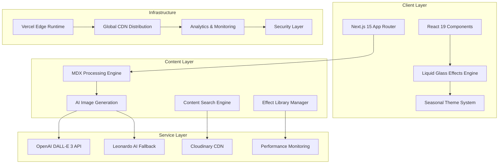
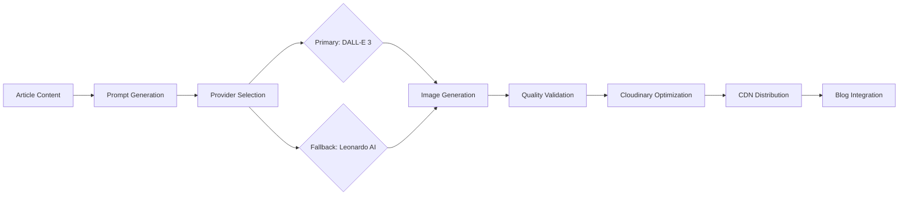

# Liquid Glass Tech Blog - Technical Architecture

## System Architecture Overview



## Core Component Architecture

### 1. Liquid Glass Effects System

```typescript
// Core Effect Component Architecture
interface LiquidGlassCard {
  // Visual Properties
  variant: 'subtle' | 'medium' | 'intense';
  blur: number;           // 4px - 20px
  opacity: number;        // 0.1 - 0.9
  saturation: number;     // 0.8 - 1.5
  
  // Interaction Properties  
  interactive: boolean;   // Hover/focus enhancements
  seasonalTheme: boolean; // Dynamic seasonal adaptation
  
  // Performance Properties
  gpuAcceleration: boolean;
  performanceMode: 'high' | 'medium' | 'low';
}

// GPU Acceleration Strategy
const gpuOptimization = {
  willChange: 'backdrop-filter, transform',
  transform: 'translateZ(0)',
  isolation: 'isolate',
  backfaceVisibility: 'hidden'
};
```

### 2. Seasonal Theme Engine

```typescript
// Seasonal Theme System Architecture
interface SeasonalTheme {
  season: 'spring' | 'summer' | 'autumn' | 'winter';
  timeOfDay: 'dawn' | 'morning' | 'afternoon' | 'evening' | 'night';
  weather: WeatherCondition;
  
  // Visual Properties
  primaryColor: HSLColor;
  gradientColors: HSLColor[];
  particleType: ParticleEffect;
  glassIntensity: number;
}

// Dynamic Theme Calculation
const calculateSeasonalTheme = (
  date: Date,
  location: GeoLocation,
  weather: WeatherData
): SeasonalTheme => {
  const season = determineSeason(date, location);
  const timeOfDay = determineTimeOfDay(date, location);
  
  return {
    season,
    timeOfDay,
    weather: weather.condition,
    primaryColor: SEASONAL_PALETTES[season][timeOfDay],
    gradientColors: generateGradient(season, timeOfDay, weather),
    particleType: PARTICLE_EFFECTS[season],
    glassIntensity: calculateGlassIntensity(weather, timeOfDay)
  };
};
```

### 3. AI Image Generation Pipeline



```typescript
// AI Image Generation Architecture
interface ImageGenerationService {
  generateEyecatch(
    title: string,
    content: string,
    category: string
  ): Promise<GeneratedImage>;
  
  optimizeImage(
    image: GeneratedImage
  ): Promise<OptimizedImage>;
  
  fallbackStrategy(
    error: GenerationError
  ): Promise<FallbackImage>;
}

// Multi-Provider Strategy
const imageGenerationPipeline = async (article: BlogPost) => {
  try {
    // Primary: DALL-E 3
    const image = await dalleClient.generate({
      prompt: generatePrompt(article),
      size: "1024x576", // 16:9 aspect ratio
      quality: "hd"
    });
    
    return await optimizeImage(image);
  } catch (error) {
    // Fallback: Leonardo AI
    return await leonardoFallback(article);
  }
};
```

## Performance Architecture

### 1. Core Web Vitals Optimization

```typescript
// Performance Monitoring System
class PerformanceMonitor {
  private vitals: Map<string, number> = new Map();
  
  // LCP Optimization (Target: < 2.5s)
  optimizeLCP() {
    // Preload critical resources
    this.preloadCriticalImages();
    this.optimizeFontLoading();
    this.prioritizeAboveFold();
  }
  
  // INP Optimization (Target: < 200ms)  
  optimizeINP() {
    // Debounce user interactions
    this.debounceInteractions(300);
    this.optimizeEventHandlers();
    this.reduceMainThreadBlocking();
  }
  
  // CLS Optimization (Target: < 0.1)
  optimizeCLS() {
    // Reserve space for dynamic content
    this.reserveImageSpace();
    this.avoidDynamicContent();
    this.optimizeWebFontLoading();
  }
}
```

### 2. GPU Acceleration Strategy

```css
/* GPU Layer Promotion */
.liquid-glass-accelerated {
  /* Force GPU layer creation */
  will-change: backdrop-filter, transform;
  transform: translateZ(0);
  
  /* Optimize compositing */
  isolation: isolate;
  contain: layout style paint;
  
  /* Reduce repaints */
  backface-visibility: hidden;
}

/* Performance-based Effect Scaling */
@media (prefers-reduced-motion: reduce) {
  .liquid-glass-accelerated {
    backdrop-filter: none;
    background: rgba(255, 255, 255, 0.1);
    transition: none;
  }
}
```

### 3. Bundle Optimization Strategy

```javascript
// next.config.js - Advanced Optimization
module.exports = {
  experimental: {
    optimizePackageImports: [
      'framer-motion',
      '@monaco-editor/react'
    ]
  },
  
  webpack: (config) => {
    // Dynamic imports for admin features
    config.optimization.splitChunks = {
      chunks: 'all',
      cacheGroups: {
        admin: {
          test: /[\\/]components[\\/]admin[\\/]/,
          name: 'admin',
          chunks: 'async'
        },
        effects: {
          test: /[\\/]components[\\/]liquid-glass[\\/]/,
          name: 'effects',
          priority: 10
        }
      }
    };
    
    return config;
  }
};
```

## Security Architecture

### 1. Content Security Policy

```typescript
// CSP Configuration
const securityHeaders = {
  'Content-Security-Policy': [
    "default-src 'self'",
    "script-src 'self' 'unsafe-eval' 'unsafe-inline'", // Monaco Editor requirement
    "style-src 'self' 'unsafe-inline'",                // Tailwind requirement  
    "img-src 'self' data: https://res.cloudinary.com",
    "connect-src 'self' https://api.openai.com https://cloud.leonardo.ai",
    "frame-src 'self' https://codesandbox.io",         // Effect previews
    "worker-src 'self' blob:"                          // Web Workers
  ].join('; ')
};
```

### 2. Effect Editor Security

```typescript
// Sandboxed Effect Execution
interface SecureEffectRunner {
  executeEffect(code: string): Promise<EffectResult>;
  validateCode(code: string): ValidationResult;
  sanitizeOutput(result: any): SafeResult;
}

// Sandboxed iframe implementation
const createSecurePreview = (effectCode: string) => {
  const sandbox = document.createElement('iframe');
  sandbox.setAttribute('sandbox', 'allow-scripts allow-same-origin');
  sandbox.srcdoc = `
    <!DOCTYPE html>
    <html>
      <head>
        <style>${sanitizeCSS(effectCode)}</style>
      </head>
      <body>
        <div id="effect-preview">${sanitizeHTML(effectCode)}</div>
      </body>
    </html>
  `;
  
  return sandbox;
};
```

## Accessibility Architecture

### 1. WCAG 2.1 AA Compliance Framework

```typescript
// Accessibility Utility System
class AccessibilityManager {
  // Color Contrast Validation
  validateContrast(foreground: string, background: string): boolean {
    const ratio = calculateContrastRatio(foreground, background);
    return ratio >= 4.5; // WCAG AA requirement
  }
  
  // Glassmorphism A11y Optimization
  optimizeGlassEffectA11y(glassConfig: GlassConfig): GlassConfig {
    return {
      ...glassConfig,
      opacity: Math.max(glassConfig.opacity, 0.85), // Readability minimum
      blur: this.reduceMotion ? 0 : glassConfig.blur,
      contrast: this.enhanceContrast(glassConfig.contrast)
    };
  }
  
  // Motion Preference Handling
  handleMotionPreferences(): MotionSettings {
    const prefersReduced = window.matchMedia('(prefers-reduced-motion: reduce)').matches;
    
    return {
      enableParticles: !prefersReduced,
      enableTransitions: !prefersReduced,
      animationDuration: prefersReduced ? 0 : 300,
      fallbackToStatic: prefersReduced
    };
  }
}
```

### 2. Keyboard Navigation System

```typescript
// Comprehensive Keyboard Navigation
interface KeyboardNavigationManager {
  // Focus Management
  manageFocus(element: HTMLElement): void;
  createFocusTrap(container: HTMLElement): FocusTrap;
  
  // Skip Links
  addSkipLinks(): void;
  
  // ARIA Integration
  enhanceWithAria(component: ReactComponent): ReactComponent;
}

// Implementation Example
const enhancedLiquidGlassCard = (props: LiquidGlassProps) => {
  const focusRef = useRef<HTMLDivElement>(null);
  
  return (
    <div
      ref={focusRef}
      className="liquid-glass-card"
      role="article"
      aria-labelledby="card-title"
      aria-describedby="card-description"
      tabIndex={props.interactive ? 0 : -1}
      onKeyDown={handleKeyboardInteraction}
    >
      {props.children}
    </div>
  );
};
```

## Testing Architecture

### 1. Comprehensive Testing Strategy

```typescript
// Testing Pyramid Implementation
describe('Liquid Glass System', () => {
  // Unit Tests (70%)
  describe('LiquidGlassCard Component', () => {
    test('renders with correct styles', () => {
      const { getByTestId } = render(<LiquidGlassCard variant="medium" />);
      expect(getByTestId('glass-card')).toHaveStyle({
        'backdrop-filter': 'blur(10px)'
      });
    });
  });
  
  // Integration Tests (20%)
  describe('Seasonal Theme Integration', () => {
    test('adapts glass effects based on season', () => {
      mockDate('2024-03-15'); // Spring
      const { container } = render(<ThemedBlogPost />);
      expect(container).toHaveClass('spring-theme');
    });
  });
  
  // E2E Tests (10%)
  describe('Complete User Journey', () => {
    test('blog reading experience', async () => {
      await page.goto('/posts/liquid-glass-intro');
      await expect(page.locator('.liquid-glass-card')).toBeVisible();
      await expect(page.locator('.seasonal-particles')).toBeVisible();
    });
  });
});
```

### 2. Performance Testing Framework

```typescript
// Performance Test Suite
describe('Performance Benchmarks', () => {
  test('maintains 60fps during glass effects', async () => {
    const performanceObserver = new PerformanceObserver((list) => {
      const entries = list.getEntries();
      const frameRates = entries.map(entry => 1000 / entry.duration);
      const avgFrameRate = frameRates.reduce((a, b) => a + b) / frameRates.length;
      
      expect(avgFrameRate).toBeGreaterThan(58); // Allow 2fps tolerance
    });
    
    performanceObserver.observe({ entryTypes: ['frame'] });
    
    // Trigger glass effect animations
    await triggerEffectAnimations();
  });
  
  test('Core Web Vitals within thresholds', async () => {
    const vitals = await measureWebVitals();
    
    expect(vitals.LCP).toBeLessThan(2500);
    expect(vitals.INP).toBeLessThan(200);
    expect(vitals.CLS).toBeLessThan(0.1);
  });
});
```

## Deployment Architecture

### 1. Vercel Edge Runtime Configuration

```typescript
// vercel.json
{
  "functions": {
    "app/api/generate-image/route.ts": {
      "maxDuration": 30
    }
  },
  "regions": ["iad1", "sfo1", "lhr1"], // Multi-region deployment
  "headers": [
    {
      "source": "/api/(.*)",
      "headers": [
        {
          "key": "Cache-Control",
          "value": "s-maxage=3600, stale-while-revalidate=86400"
        }
      ]
    }
  ]
}
```

### 2. Monitoring & Observability

```typescript
// Comprehensive Monitoring System
class ProductionMonitor {
  // Error Tracking
  initErrorTracking() {
    Sentry.init({
      dsn: process.env.SENTRY_DSN,
      integrations: [
        new BrowserTracing(),
        new Replay()
      ],
      tracesSampleRate: 0.1,
      replaysSessionSampleRate: 0.01
    });
  }
  
  // Performance Monitoring
  initPerformanceMonitoring() {
    // Real User Monitoring
    const observer = new PerformanceObserver((list) => {
      for (const entry of list.getEntries()) {
        this.sendMetric(entry.name, entry.value);
      }
    });
    
    observer.observe({ entryTypes: ['navigation', 'paint', 'layout-shift'] });
  }
  
  // Custom Business Metrics
  trackBusinessMetrics() {
    // Effect usage analytics
    this.trackEvent('effect_interaction', {
      effect_type: 'liquid_glass_card',
      interaction_type: 'hover',
      performance_mode: 'high'
    });
  }
}
```

This technical architecture provides the foundation for implementing the Liquid Glass Tech Blog with enterprise-grade performance, security, and maintainability standards.