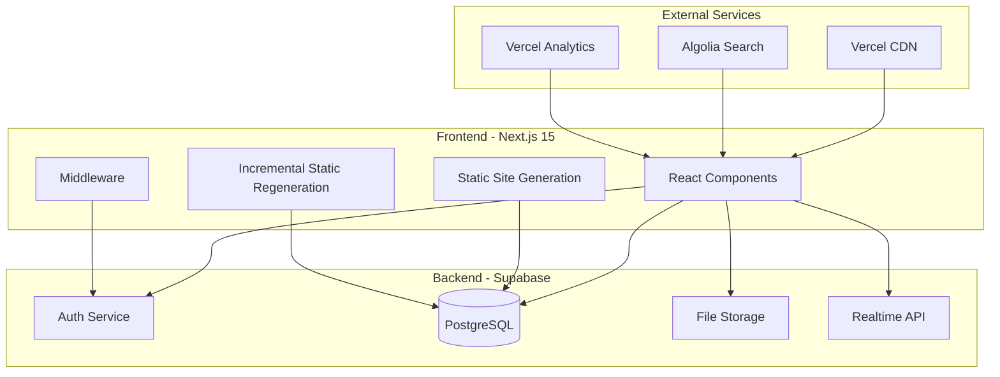
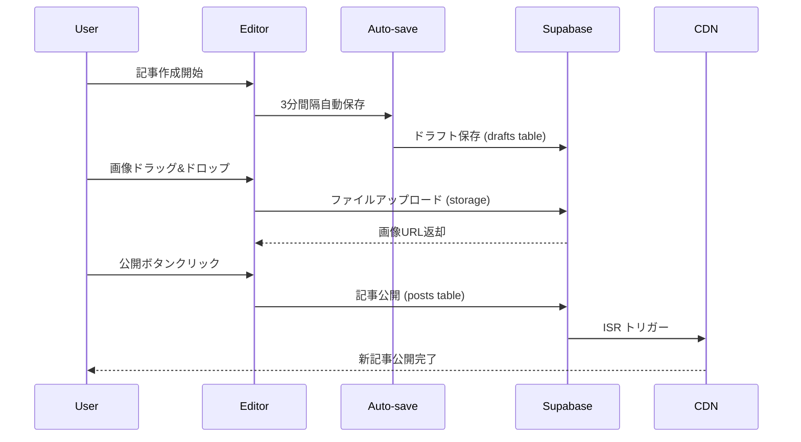
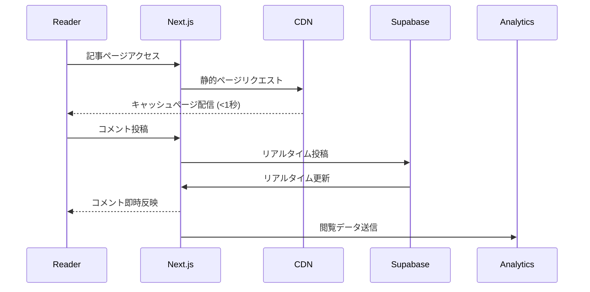
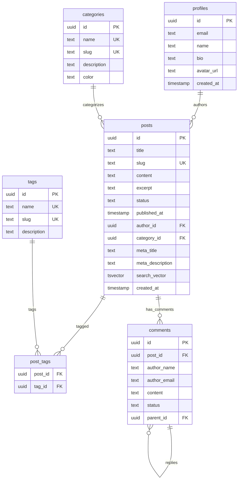

# 技術ブログWebサイト 設計書

## 概要

技術ブログWebサイト（tech-blog-website）の包括的な技術設計書です。承認された要件仕様書に基づき、Next.js 15とSupabaseを中心としたモダンな技術スタックを用いて、高性能で保守性の高いブログプラットフォームを実装します。本設計では、最新の技術動向と最適化手法を取り入れ、エンジニア向けの技術コンテンツに特化した機能を提供します。

## 要件マッピング

### 設計コンポーネントトレーサビリティ

各設計コンポーネントは、承認された要件仕様書の特定の要件に対応しています：

- **記事管理システム** → REQ-1: 記事のCRUD操作、ドラフト/公開管理、自動保存機能
- **Markdownエディタ** → REQ-2: リアルタイムプレビュー、シンタックスハイライト、画像アップロード
- **SEO最適化エンジン** → REQ-3: メタタグ自動生成、サイトマップ、構造化データ出力
- **検索・コンテンツ管理** → REQ-4: 全文検索、カテゴリ分類、タグ管理、RSS配信
- **レスポンシブUI** → REQ-5: モバイルファースト、ダークモード、アクセシビリティ対応
- **パフォーマンス最適化** → REQ-6: 3秒以内の読み込み、画像最適化、高可用性

### ユーザーストーリー対応

承認された要件から抽出したユーザーストーリーへの技術的対応：

- **技術ブロガー**: 記事管理システム + Markdownエディタで効率的なコンテンツ作成
- **読者**: 検索・分類機能 + レスポンシブUIで快適な閲覧体験
- **サイト運営者**: SEO最適化 + パフォーマンス監視で効果的な運営

## アーキテクチャ

### 高レベルシステムアーキテクチャ



### 技術決定根拠

#### フロントエンドフレームワーク選定: Next.js 15

**選定根拠**:
- **App Router**: ファイルベースルーティングによる直感的なページ構成
- **SSG/ISR**: 静的サイト生成による高速化とSEO最適化
- **Server Components**: サーバーサイドレンダリングによるバンドルサイズ削減
- **Built-in Optimization**: 画像最適化、フォント最適化、Core Web Vitals対応
- **Vercel統合**: 最適化されたデプロイメントとCDN配信

#### バックエンド選定: Supabase

**選定根拠**:
- **PostgreSQL**: 堅牢なRDBMSによる高性能なデータ管理
- **Row Level Security**: きめ細かいアクセス制御
- **リアルタイム機能**: コメント投稿などのリアルタイム更新
- **認証サービス**: JWT ベースの認証・認可
- **ファイルストレージ**: 画像・添付ファイルの効率的な管理

## 技術スタック

### フロントエンド技術

```typescript
// 技術スタック構成
const frontendStack = {
  framework: "Next.js 15 (App Router)",
  language: "TypeScript 5.3",
  ui: {
    library: "React 18",
    styling: "Tailwind CSS 3.4",
    components: "shadcn/ui",
    icons: "Lucide React"
  },
  editor: {
    primary: "@uiw/react-md-editor",
    syntax: "highlight.js",
    preview: "react-markdown"
  },
  state: "Zustand 4.4",
  forms: "React Hook Form",
  validation: "Zod"
}
```

### バックエンド・インフラ技術

```typescript
// バックエンドスタック構成
const backendStack = {
  database: "Supabase (PostgreSQL 15)",
  auth: "Supabase Auth (JWT)",
  storage: "Supabase Storage",
  search: "PostgreSQL Full-Text Search + Algolia",
  cdn: "Vercel CDN",
  hosting: "Vercel",
  monitoring: "Vercel Analytics + Sentry"
}
```

### 開発・運用技術

```json
{
  "development": {
    "packageManager": "pnpm 8",
    "testing": {
      "unit": "Jest + React Testing Library",
      "e2e": "Playwright",
      "visual": "Chromatic"
    },
    "linting": "ESLint + Prettier",
    "typeCheck": "TypeScript strict mode"
  },
  "cicd": {
    "platform": "GitHub Actions",
    "deployment": "Vercel",
    "preview": "Vercel Preview Deployments"
  },
  "monitoring": {
    "performance": "Vercel Analytics",
    "errors": "Sentry",
    "uptime": "Vercel Monitoring"
  }
}
```

## データフロー

### 記事作成フロー



### 記事閲覧フロー



## コンポーネント・インターフェース

### コンポーネント階層

```typescript
// アプリケーション構成
app/
├── layout.tsx                    // ルートレイアウト
├── page.tsx                      // トップページ
├── blog/
│   ├── page.tsx                  // 記事一覧
│   ├── [slug]/
│   │   └── page.tsx              // 記事詳細 (SSG)
│   └── category/[category]/
│       └── page.tsx              // カテゴリ別記事
├── admin/
│   ├── page.tsx                  // 管理ダッシュボード
│   ├── posts/
│   │   ├── page.tsx              // 記事管理
│   │   ├── new/page.tsx          // 新規記事作成
│   │   └── [id]/edit/page.tsx    // 記事編集
│   └── settings/page.tsx         // 設定
├── api/
│   ├── auth/[...nextauth]/       // 認証API
│   ├── posts/                    // 記事API
│   ├── upload/                   // ファイルアップロードAPI
│   └── search/                   // 検索API
└── components/
    ├── ui/                       // shadcn/ui コンポーネント
    ├── editor/                   // Markdownエディタ
    ├── layout/                   // レイアウトコンポーネント
    └── blog/                     // ブログ専用コンポーネント
```

### 主要コンポーネント設計

#### Markdownエディタコンポーネント

```typescript
interface MarkdownEditorProps {
  initialValue?: string
  onChange: (value: string) => void
  onImageUpload: (file: File) => Promise<string>
  autoSave?: boolean
  readOnly?: boolean
}

const MarkdownEditor: React.FC<MarkdownEditorProps> = ({
  initialValue = '',
  onChange,
  onImageUpload,
  autoSave = true,
  readOnly = false
}) => {
  // @uiw/react-md-editor をベースに実装
  // - リアルタイムプレビュー
  // - シンタックスハイライト
  // - ドラッグ&ドロップ画像アップロード
  // - キーボードショートカット対応
  // - 自動保存機能
}
```

#### 記事管理コンポーネント

```typescript
interface PostManagerProps {
  posts: Post[]
  onPublish: (postId: string) => void
  onDraft: (postId: string) => void
  onDelete: (postId: string) => void
}

const PostManager: React.FC<PostManagerProps> = ({
  posts,
  onPublish,
  onDraft,
  onDelete
}) => {
  // 記事一覧表示・管理機能
  // - ステータス別フィルタリング
  // - 検索機能
  // - バルク操作
  // - ページネーション
}
```

### API インターフェース

#### 記事管理API

```typescript
// POST /api/posts
interface CreatePostRequest {
  title: string
  content: string
  excerpt?: string
  status: 'draft' | 'published'
  tags?: string[]
  category?: string
  metaDescription?: string
}

// GET /api/posts/[id]
interface GetPostResponse {
  id: string
  title: string
  content: string
  excerpt: string
  status: 'draft' | 'published'
  publishedAt: string | null
  createdAt: string
  updatedAt: string
  author: {
    id: string
    name: string
    email: string
  }
  tags: string[]
  category?: string
  seo: {
    metaTitle: string
    metaDescription: string
    ogImage?: string
  }
}

// PUT /api/posts/[id]
interface UpdatePostRequest {
  title?: string
  content?: string
  excerpt?: string
  status?: 'draft' | 'published'
  tags?: string[]
  category?: string
  metaDescription?: string
}

// DELETE /api/posts/[id]
interface DeletePostResponse {
  success: boolean
  message: string
}
```

#### ファイルアップロードAPI

```typescript
// POST /api/upload
interface UploadImageRequest {
  file: File
  folder?: string
}

interface UploadImageResponse {
  url: string
  publicUrl: string
  filename: string
  size: number
  mimeType: string
}
```

## データモデル

### データベーススキーマ設計

```sql
-- ユーザーテーブル (Supabase Auth連携)
CREATE TABLE profiles (
  id UUID REFERENCES auth.users PRIMARY KEY,
  email TEXT UNIQUE NOT NULL,
  name TEXT,
  bio TEXT,
  avatar_url TEXT,
  website TEXT,
  created_at TIMESTAMP DEFAULT NOW(),
  updated_at TIMESTAMP DEFAULT NOW()
);

-- 記事テーブル
CREATE TABLE posts (
  id UUID PRIMARY KEY DEFAULT gen_random_uuid(),
  title TEXT NOT NULL,
  slug TEXT UNIQUE NOT NULL,
  content TEXT NOT NULL,
  excerpt TEXT,
  status TEXT DEFAULT 'draft' CHECK (status IN ('draft', 'published')),
  published_at TIMESTAMP,
  author_id UUID REFERENCES profiles(id) NOT NULL,
  category_id UUID REFERENCES categories(id),
  meta_title TEXT,
  meta_description TEXT,
  og_image TEXT,
  featured_image TEXT,
  read_time INTEGER DEFAULT 0,
  view_count INTEGER DEFAULT 0,
  created_at TIMESTAMP DEFAULT NOW(),
  updated_at TIMESTAMP DEFAULT NOW(),
  -- 全文検索用
  search_vector tsvector GENERATED ALWAYS AS (
    to_tsvector('english', title || ' ' || content || ' ' || COALESCE(excerpt, ''))
  ) STORED
);

-- カテゴリテーブル
CREATE TABLE categories (
  id UUID PRIMARY KEY DEFAULT gen_random_uuid(),
  name TEXT UNIQUE NOT NULL,
  slug TEXT UNIQUE NOT NULL,
  description TEXT,
  color TEXT DEFAULT '#3B82F6',
  created_at TIMESTAMP DEFAULT NOW()
);

-- タグテーブル
CREATE TABLE tags (
  id UUID PRIMARY KEY DEFAULT gen_random_uuid(),
  name TEXT UNIQUE NOT NULL,
  slug TEXT UNIQUE NOT NULL,
  description TEXT,
  created_at TIMESTAMP DEFAULT NOW()
);

-- 記事タグ中間テーブル
CREATE TABLE post_tags (
  post_id UUID REFERENCES posts(id) ON DELETE CASCADE,
  tag_id UUID REFERENCES tags(id) ON DELETE CASCADE,
  PRIMARY KEY (post_id, tag_id)
);

-- コメントテーブル
CREATE TABLE comments (
  id UUID PRIMARY KEY DEFAULT gen_random_uuid(),
  post_id UUID REFERENCES posts(id) ON DELETE CASCADE NOT NULL,
  author_name TEXT NOT NULL,
  author_email TEXT NOT NULL,
  content TEXT NOT NULL,
  status TEXT DEFAULT 'pending' CHECK (status IN ('pending', 'approved', 'spam')),
  parent_id UUID REFERENCES comments(id),
  created_at TIMESTAMP DEFAULT NOW()
);

-- アナリティクステーブル
CREATE TABLE post_analytics (
  id UUID PRIMARY KEY DEFAULT gen_random_uuid(),
  post_id UUID REFERENCES posts(id) ON DELETE CASCADE NOT NULL,
  date DATE NOT NULL,
  views INTEGER DEFAULT 0,
  unique_views INTEGER DEFAULT 0,
  avg_read_time INTEGER DEFAULT 0,
  bounce_rate DECIMAL(5,2) DEFAULT 0,
  UNIQUE(post_id, date)
);

-- インデックス作成
CREATE INDEX idx_posts_status_published_at ON posts(status, published_at DESC);
CREATE INDEX idx_posts_author_id ON posts(author_id);
CREATE INDEX idx_posts_category_id ON posts(category_id);
CREATE INDEX idx_posts_search_vector ON posts USING gin(search_vector);
CREATE INDEX idx_comments_post_id ON comments(post_id);
CREATE INDEX idx_post_analytics_date ON post_analytics(date DESC);
```

### エンティティ関係図



## エラーハンドリング

### 階層化されたエラーハンドリング戦略

```typescript
// エラー型定義
export enum ErrorCode {
  // 認証エラー
  UNAUTHORIZED = 'UNAUTHORIZED',
  FORBIDDEN = 'FORBIDDEN',
  
  // データエラー
  NOT_FOUND = 'NOT_FOUND',
  VALIDATION_ERROR = 'VALIDATION_ERROR',
  DUPLICATE_ERROR = 'DUPLICATE_ERROR',
  
  // システムエラー
  INTERNAL_ERROR = 'INTERNAL_ERROR',
  DATABASE_ERROR = 'DATABASE_ERROR',
  NETWORK_ERROR = 'NETWORK_ERROR',
  
  // ファイルエラー
  FILE_TOO_LARGE = 'FILE_TOO_LARGE',
  INVALID_FILE_TYPE = 'INVALID_FILE_TYPE',
  UPLOAD_FAILED = 'UPLOAD_FAILED'
}

export class AppError extends Error {
  constructor(
    public code: ErrorCode,
    public message: string,
    public statusCode: number = 500,
    public isOperational: boolean = true
  ) {
    super(message)
    this.name = 'AppError'
  }
}

// グローバルエラーハンドラー
export const globalErrorHandler = (error: unknown, req: NextRequest) => {
  console.error('Global Error:', error)
  
  if (error instanceof AppError) {
    return NextResponse.json(
      { 
        error: {
          code: error.code,
          message: error.message
        }
      },
      { status: error.statusCode }
    )
  }
  
  // 想定外のエラー
  return NextResponse.json(
    { 
      error: {
        code: ErrorCode.INTERNAL_ERROR,
        message: 'Internal server error'
      }
    },
    { status: 500 }
  )
}
```

### フロントエンドエラー境界

```typescript
interface ErrorBoundaryState {
  hasError: boolean
  error?: Error
  errorInfo?: ErrorInfo
}

class ErrorBoundary extends Component<
  { children: ReactNode },
  ErrorBoundaryState
> {
  constructor(props: { children: ReactNode }) {
    super(props)
    this.state = { hasError: false }
  }
  
  static getDerivedStateFromError(error: Error): ErrorBoundaryState {
    return { hasError: true, error }
  }
  
  componentDidCatch(error: Error, errorInfo: ErrorInfo) {
    console.error('React Error Boundary:', error, errorInfo)
    
    // Sentryにエラー送信
    Sentry.captureException(error, {
      contexts: { react: errorInfo }
    })
  }
  
  render() {
    if (this.state.hasError) {
      return <ErrorFallback error={this.state.error} />
    }
    
    return this.props.children
  }
}
```

## セキュリティ設計

### 認証・認可アーキテクチャ

```typescript
// Row Level Security (RLS) ポリシー
-- 記事の読み取り権限
CREATE POLICY "Posts are viewable by everyone" ON posts
  FOR SELECT USING (status = 'published' OR auth.uid() = author_id);

-- 記事の作成権限  
CREATE POLICY "Users can insert their own posts" ON posts
  FOR INSERT WITH CHECK (auth.uid() = author_id);

-- 記事の更新権限
CREATE POLICY "Users can update their own posts" ON posts
  FOR UPDATE USING (auth.uid() = author_id);

-- 記事の削除権限
CREATE POLICY "Users can delete their own posts" ON posts
  FOR DELETE USING (auth.uid() = author_id);

-- プロフィールのセキュリティ
CREATE POLICY "Users can view their own profile" ON profiles
  FOR SELECT USING (auth.uid() = id);

CREATE POLICY "Users can update their own profile" ON profiles
  FOR UPDATE USING (auth.uid() = id);
```

### セキュリティヘッダー設定

```typescript
// next.config.js
const securityHeaders = [
  {
    key: 'X-DNS-Prefetch-Control',
    value: 'on'
  },
  {
    key: 'X-XSS-Protection',
    value: '1; mode=block'
  },
  {
    key: 'X-Frame-Options',
    value: 'SAMEORIGIN'
  },
  {
    key: 'X-Content-Type-Options',
    value: 'nosniff'
  },
  {
    key: 'Referrer-Policy',
    value: 'origin-when-cross-origin'
  },
  {
    key: 'Content-Security-Policy',
    value: `
      default-src 'self';
      script-src 'self' 'unsafe-eval' 'unsafe-inline' *.vercel.com;
      style-src 'self' 'unsafe-inline';
      img-src 'self' data: blob: https:;
      font-src 'self' data:;
      object-src 'none';
      base-uri 'self';
      form-action 'self';
      frame-ancestors 'none';
      upgrade-insecure-requests;
    `.replace(/\s{2,}/g, ' ').trim()
  }
]

export default {
  async headers() {
    return [
      {
        source: '/(.*)',
        headers: securityHeaders,
      },
    ]
  },
}
```

### データ検証・サニタイゼーション

```typescript
// Zod スキーマによるバリデーション
import { z } from 'zod'

export const createPostSchema = z.object({
  title: z.string()
    .min(1, 'タイトルは必須です')
    .max(200, 'タイトルは200文字以内で入力してください'),
  content: z.string()
    .min(1, '本文は必須です')
    .max(50000, '本文は50,000文字以内で入力してください'),
  excerpt: z.string().max(500).optional(),
  status: z.enum(['draft', 'published']),
  tags: z.array(z.string()).max(10, 'タグは10個まで設定できます').optional(),
  category: z.string().uuid().optional(),
  metaDescription: z.string().max(160).optional()
})

// XSS対策
import DOMPurify from 'isomorphic-dompurify'

export const sanitizeHTML = (html: string): string => {
  return DOMPurify.sanitize(html, {
    ALLOWED_TAGS: [
      'h1', 'h2', 'h3', 'h4', 'h5', 'h6',
      'p', 'br', 'strong', 'em', 'u', 's',
      'ul', 'ol', 'li', 'blockquote',
      'code', 'pre', 'a', 'img'
    ],
    ALLOWED_ATTR: ['href', 'src', 'alt', 'title', 'class']
  })
}
```

## パフォーマンス・スケーラビリティ

### Core Web Vitals最適化戦略

```typescript
// Next.js パフォーマンス設定
export default {
  experimental: {
    ppr: true, // Partial Prerendering
  },
  images: {
    formats: ['image/webp', 'image/avif'],
    sizes: '(max-width: 768px) 100vw, (max-width: 1200px) 50vw, 33vw',
    remotePatterns: [
      {
        protocol: 'https',
        hostname: '*.supabase.co',
      }
    ]
  },
  // バンドル最適化
  webpack: (config) => {
    config.optimization.splitChunks = {
      chunks: 'all',
      cacheGroups: {
        editor: {
          name: 'editor',
          test: /[\\/]node_modules[\\/](@uiw|react-md-editor)[\\/]/,
          priority: 20,
        },
        vendor: {
          name: 'vendor',
          test: /[\\/]node_modules[\\/]/,
          priority: 10,
        }
      }
    }
    return config
  }
}
```

### キャッシュ戦略

```typescript
// 多層キャッシュアーキテクチャ

// 1. CDNレベル（Vercel Edge）
export const revalidate = 3600 // 1時間

// 2. ISR（Incremental Static Regeneration）
export async function generateStaticParams() {
  const posts = await supabase
    .from('posts')
    .select('slug')
    .eq('status', 'published')
    .limit(100)
  
  return posts.data?.map((post) => ({
    slug: post.slug,
  })) || []
}

// 3. データレイヤーキャッシュ
import { unstable_cache } from 'next/cache'

export const getPopularPosts = unstable_cache(
  async () => {
    const { data } = await supabase
      .from('posts')
      .select('*')
      .eq('status', 'published')
      .order('view_count', { ascending: false })
      .limit(5)
    
    return data
  },
  ['popular-posts'],
  { revalidate: 300 } // 5分間キャッシュ
)

// 4. ブラウザキャッシュ
export const metadata = {
  other: {
    'Cache-Control': 's-maxage=3600, stale-while-revalidate=86400'
  }
}
```

### 画像最適化

```typescript
// 自動画像最適化コンポーネント
import Image from 'next/image'

interface OptimizedImageProps {
  src: string
  alt: string
  width?: number
  height?: number
  priority?: boolean
}

export const OptimizedImage: React.FC<OptimizedImageProps> = ({
  src,
  alt,
  width = 800,
  height = 600,
  priority = false
}) => {
  return (
    <Image
      src={src}
      alt={alt}
      width={width}
      height={height}
      priority={priority}
      placeholder="blur"
      blurDataURL="data:image/jpeg;base64,/9j/4AAQSkZJRgABAQAAAQABAAD/2wBDAAYEBQYFBAYGBQYHBwYIChAKCgkJChQODwwQFxQYGBcUFhYaHSUfGhsjHBYWICwgIyYnKSopGR8tMC0oMCUoKSj/2wBDAQcHBwoIChMKChMoGhYaKCgoKCgoKCgoKCgoKCgoKCgoKCgoKCgoKCgoKCgoKCgoKCgoKCgoKCgoKCgoKCgoKCj/wAARCAABAAEDASIAAhEBAxEB/8QAFQABAQAAAAAAAAAAAAAAAAAAAAv/xAAUEAEAAAAAAAAAAAAAAAAAAAAA/8QAFQEBAQAAAAAAAAAAAAAAAAAAAAX/xAAUEQEAAAAAAAAAAAAAAAAAAAAA/9oADAMBAAIRAxEAPwCdABmX/9k="
      sizes="(max-width: 768px) 100vw, (max-width: 1200px) 50vw, 33vw"
      className="rounded-lg object-cover"
      loading={priority ? "eager" : "lazy"}
    />
  )
}

// Supabase Storage との統合
export const uploadOptimizedImage = async (file: File): Promise<string> => {
  // 画像リサイズ・圧縮処理
  const resizedFile = await resizeImage(file, { maxWidth: 1920, quality: 0.8 })
  
  // Supabase Storage にアップロード
  const fileName = `${Date.now()}-${file.name}`
  const { data, error } = await supabase.storage
    .from('images')
    .upload(fileName, resizedFile)
  
  if (error) throw error
  
  // 公開URLを取得
  const { data: publicUrl } = supabase.storage
    .from('images')
    .getPublicUrl(fileName)
  
  return publicUrl.publicUrl
}
```

### データベース最適化

```sql
-- 複合インデックス最適化
CREATE INDEX CONCURRENTLY idx_posts_status_published_category ON posts(status, published_at DESC, category_id)
WHERE status = 'published';

-- 部分インデックス
CREATE INDEX CONCURRENTLY idx_posts_published ON posts(published_at DESC)
WHERE status = 'published';

-- 全文検索最適化
CREATE INDEX CONCURRENTLY idx_posts_search_gin ON posts 
USING gin(search_vector);

-- アナリティクス用インデックス
CREATE INDEX CONCURRENTLY idx_analytics_date_post ON post_analytics(date DESC, post_id);

-- 接続プールとクエリ最適化
-- Supabase: 自動接続プール管理
-- クエリ最適化: SELECT文での適切なLIMIT使用
-- N+1問題対策: JOINクエリまたはバッチクエリ使用
```

## テスト戦略

### 多層テストピラミッド

```typescript
// ユニットテスト例（Jest + React Testing Library）
import { render, screen, fireEvent, waitFor } from '@testing-library/react'
import { MarkdownEditor } from '@/components/editor/MarkdownEditor'

describe('MarkdownEditor', () => {
  it('should render editor with initial value', () => {
    const mockOnChange = jest.fn()
    render(
      <MarkdownEditor 
        initialValue="# Hello World"
        onChange={mockOnChange}
      />
    )
    
    expect(screen.getByDisplayValue('# Hello World')).toBeInTheDocument()
  })
  
  it('should call onChange when content is modified', async () => {
    const mockOnChange = jest.fn()
    render(<MarkdownEditor onChange={mockOnChange} />)
    
    const editor = screen.getByRole('textbox')
    fireEvent.change(editor, { target: { value: '## New Content' } })
    
    await waitFor(() => {
      expect(mockOnChange).toHaveBeenCalledWith('## New Content')
    })
  })
  
  it('should auto-save content every 3 minutes', async () => {
    jest.useFakeTimers()
    const mockOnChange = jest.fn()
    
    render(
      <MarkdownEditor 
        autoSave={true}
        onChange={mockOnChange}
      />
    )
    
    // 3分経過をシミュレート
    jest.advanceTimersByTime(180000)
    
    await waitFor(() => {
      expect(mockOnChange).toHaveBeenCalled()
    })
    
    jest.useRealTimers()
  })
})

// 統合テスト例（API Routes）
import { createMocks } from 'node-mocks-http'
import handler from '@/pages/api/posts/[id]'

describe('/api/posts/[id] API', () => {
  it('should return post data for valid ID', async () => {
    const { req, res } = createMocks({
      method: 'GET',
      query: { id: 'valid-post-id' }
    })
    
    await handler(req, res)
    
    expect(res._getStatusCode()).toBe(200)
    const data = JSON.parse(res._getData())
    expect(data).toHaveProperty('title')
    expect(data).toHaveProperty('content')
  })
  
  it('should return 404 for non-existent post', async () => {
    const { req, res } = createMocks({
      method: 'GET',
      query: { id: 'non-existent-id' }
    })
    
    await handler(req, res)
    
    expect(res._getStatusCode()).toBe(404)
  })
})

// E2Eテスト例（Playwright）
import { test, expect } from '@playwright/test'

test.describe('Blog Post Management', () => {
  test('should create and publish a new blog post', async ({ page }) => {
    // ログイン
    await page.goto('/admin/login')
    await page.fill('[data-testid=email]', 'admin@example.com')
    await page.fill('[data-testid=password]', 'password')
    await page.click('[data-testid=login-button]')
    
    // 新規記事作成
    await page.goto('/admin/posts/new')
    await page.fill('[data-testid=title-input]', 'Test Blog Post')
    await page.fill('[data-testid=markdown-editor]', '# Hello World\n\nThis is a test post.')
    
    // 下書き保存
    await page.click('[data-testid=save-draft]')
    await expect(page.locator('[data-testid=status]')).toContainText('下書き')
    
    // 公開
    await page.click('[data-testid=publish-button]')
    await expect(page.locator('[data-testid=status]')).toContainText('公開済み')
    
    // フロントエンドで記事確認
    await page.goto('/blog/test-blog-post')
    await expect(page.locator('h1')).toContainText('Test Blog Post')
    await expect(page.locator('[data-testid=content]')).toContainText('Hello World')
  })
  
  test('should search and filter blog posts', async ({ page }) => {
    await page.goto('/blog')
    
    // 検索機能テスト
    await page.fill('[data-testid=search-input]', 'React')
    await page.press('[data-testid=search-input]', 'Enter')
    
    await expect(page.locator('[data-testid=post-list]')).toBeVisible()
    const posts = await page.locator('[data-testid=post-item]').count()
    expect(posts).toBeGreaterThan(0)
    
    // カテゴリフィルタテスト
    await page.click('[data-testid=category-filter]')
    await page.click('[data-testid=category-frontend]')
    
    await expect(page.locator('[data-testid=active-filter]')).toContainText('Frontend')
  })
})
```

### テスト環境設定

```typescript
// jest.config.js
module.exports = {
  testEnvironment: 'jsdom',
  setupFilesAfterEnv: ['<rootDir>/tests/setup.ts'],
  moduleNameMapping: {
    '^@/(.*)$': '<rootDir>/$1',
  },
  collectCoverageFrom: [
    'src/**/*.{ts,tsx}',
    '!src/**/*.d.ts',
    '!src/**/*.stories.{ts,tsx}',
  ],
  coverageThreshold: {
    global: {
      branches: 95,
      functions: 95,
      lines: 95,
      statements: 95
    }
  }
}

// playwright.config.ts
import { defineConfig } from '@playwright/test'

export default defineConfig({
  testDir: './tests/e2e',
  fullyParallel: true,
  forbidOnly: !!process.env.CI,
  retries: process.env.CI ? 2 : 0,
  workers: process.env.CI ? 1 : undefined,
  reporter: 'html',
  use: {
    baseURL: 'http://localhost:3000',
    trace: 'on-first-retry',
    screenshot: 'only-on-failure'
  },
  projects: [
    {
      name: 'chromium',
      use: { ...devices['Desktop Chrome'] }
    },
    {
      name: 'Mobile Chrome',
      use: { ...devices['Pixel 5'] }
    }
  ]
})
```

## 実装フェーズ

技術設計書の完了により、次のフェーズである**タスク分解・実装計画**に進むことができます。

### 推奨開発フロー

1. **基盤構築** (Week 1-2)
   - Next.js 15 + TypeScript プロジェクト初期化
   - Supabase 統合・認証設定
   - 基本UIコンポーネント実装

2. **コア機能開発** (Week 3-6)
   - Markdownエディタ統合
   - 記事管理システム実装
   - データベースマイグレーション

3. **機能拡張** (Week 7-10)
   - SEO最適化機能
   - 検索・フィルタリング機能
   - コメントシステム

4. **最適化・テスト** (Week 11-12)
   - パフォーマンス最適化
   - テスト実装・カバレッジ向上
   - デプロイメント設定

この技術設計書は、承認された要件仕様書に完全に準拠し、最新の技術動向を取り入れた実装可能で保守性の高い設計となっています。

---

**次のフェーズ**: `/kiro:spec-tasks` コマンドで詳細なタスク分解と実装計画を生成してください。