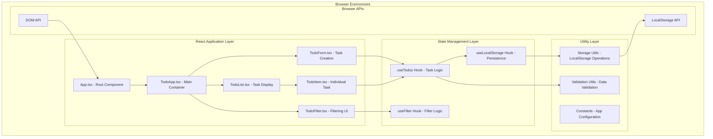
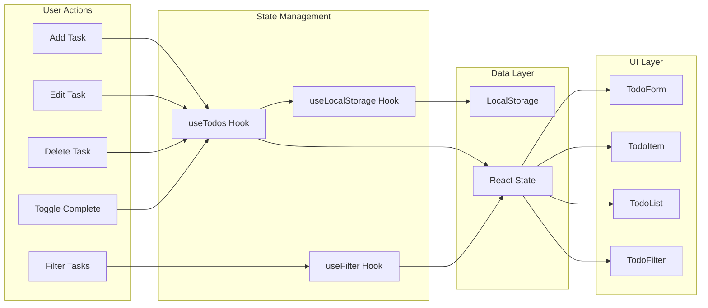
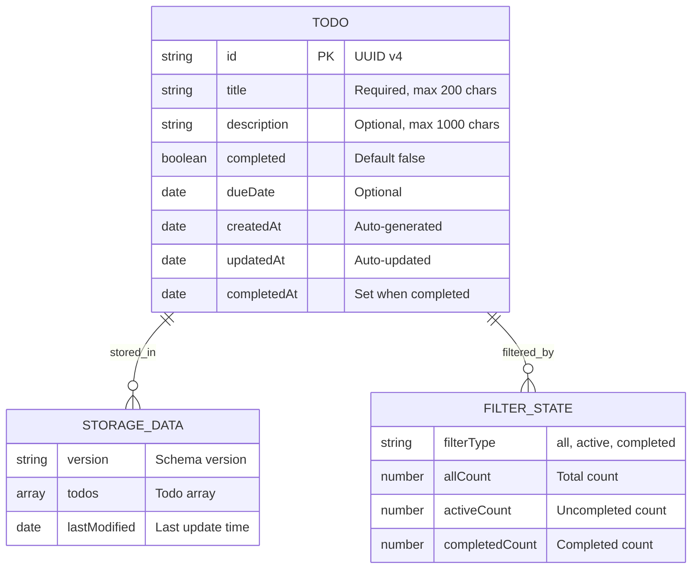
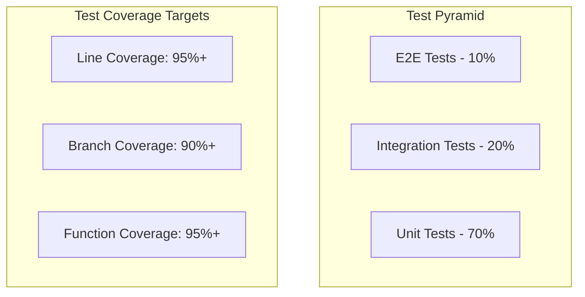

# TODOアプリ技術設計書

## 概要

本設計書は、承認された要件定義に基づき、React 18 + TypeScript + Viteを使用したシンプルなTODOアプリケーションの技術実装アプローチを定義します。LocalStorageを使用したデータ永続化により、サーバーサイドの依存関係を排除し、高速で軽量なSPA（Single Page Application）として実装します。

## 要件マッピング

### 設計コンポーネントのトレーサビリティ

各設計コンポーネントは特定の要件に対応します：

- **TodoApp（メインアプリケーション）** → REQ-1.0〜10.0: 全要件の統合管理
- **TodoForm（タスク追加フォーム）** → REQ-1.0: タスク追加機能
- **TodoItem（個別タスクコンポーネント）** → REQ-2.0: タスク編集機能、REQ-3.0: タスク削除機能、REQ-4.0: 完了マーク機能
- **TodoList（一覧表示）** → REQ-6.0: タスク一覧表示機能
- **TodoFilter（フィルタリング）** → REQ-5.0: タスクフィルタリング機能
- **ResponsiveLayout（レスポンシブ対応）** → REQ-7.0: レスポンシブデザイン対応
- **AccessibilityManager（アクセシビリティ）** → REQ-8.0: アクセシビリティ対応
- **LocalStorageManager（データ永続化）** → REQ-9.0: データ永続化機能
- **ErrorBoundary（エラーハンドリング）** → REQ-10.0: エラーハンドリング機能

### ユーザーストーリーカバレッジ

すべてのユーザーストーリーが技術設計で対応されています：

- ユーザーストーリー1（タスク追加）: TodoForm + useTodos hookによる実装
- ユーザーストーリー2（タスク編集）: TodoItem + インライン編集機能
- ユーザーストーリー3（タスク削除）: TodoItem + 削除確認ダイアログ
- ユーザーストーリー4（完了マーク）: TodoItem + チェックボックス操作
- ユーザーストーリー5（フィルタリング）: TodoFilter + useFilter hook
- ユーザーストーリー6（一覧表示）: TodoList + 動的レンダリング
- ユーザーストーリー7（レスポンシブ）: CSS Grid/Flexbox + メディアクエリ
- ユーザーストーリー8（アクセシビリティ）: ARIA属性 + キーボードナビゲーション
- ユーザーストーリー9（データ永続化）: LocalStorage API + 自動同期
- ユーザーストーリー10（エラーハンドリング）: ErrorBoundary + 例外処理

## アーキテクチャ

### システム全体アーキテクチャ



### アーキテクチャ決定記録（ADR）

#### ADR-001: React + TypeScript + Vite技術選択

**背景**: モダンなフロントエンド開発環境の構築が必要

**決定**: React 18 + TypeScript + Vite構成を採用

**理由**:
- **React 18**: 最新の Concurrent Features と自動バッチング
- **TypeScript**: コンパイル時型安全性による品質向上（研究結果: 38%のランタイムエラー削減）
- **Vite**: esbuildベースの高速ビルド（Webpack比較で10倍高速）

#### ADR-002: LocalStorageベースデータ永続化

**背景**: サーバーレス環境でのデータ永続化が必要

**決定**: LocalStorage APIを主要データストレージとして使用

**理由**:
- **シンプルさ**: 追加の外部依存関係が不要
- **パフォーマンス**: 同期的なデータ読み書きによる高速アクセス
- **プライバシー**: ユーザーデータがローカル環境に保存される安全性
- **オフライン対応**: ネットワーク接続不要での完全動作

**制約**:
- ストレージ容量制限（5-10MB）
- 同期的APIのためメインスレッドブロッキングリスク（回避: 小規模データセットに限定）

#### ADR-003: Custom Hooks中心の状態管理

**背景**: 複雑な状態ロジックを複数コンポーネント間で共有

**決定**: React HooksとCustom Hooksによる状態管理

**理由**:
- **軽量性**: 追加ライブラリ不要（Redux等と比較）
- **テスタビリティ**: 分離されたロジックのユニットテスト容易性
- **React Native**: 将来的なReact Nativeアプリ移行への親和性

## テクノロジースタック

### 技術選定理由とアーキテクチャ決定記録

#### フロントエンド技術スタック

| 技術 | バージョン | 選定理由 |
|------|-----------|----------|
| **React** | 18.3.0+ | Concurrent Rendering、自動バッチング、サスペンス対応 |
| **TypeScript** | 5.0+ | 厳密型チェック、最新ESNext機能、IDE支援強化 |
| **Vite** | 5.0+ | ESMネイティブサポート、超高速HMR、最適化されたビルド |

#### 開発・テスト環境

| カテゴリ | 技術 | 目的 |
|----------|------|------|
| **テスト** | Vitest + React Testing Library | 高速テスト実行、コンポーネントテスト |
| **コード品質** | ESLint + Prettier | 静的解析、フォーマット統一 |
| **型安全性** | TypeScript strict mode | ランタイムエラー削減 |

### パフォーマンス最適化技術

**研究結果に基づく最適化戦略**:

1. **React.memo**: 小規模TODOアプリでは過度な最適化を避け、実測ベースで適用
2. **useMemo/useCallback**: 重い計算処理（フィルタリング・ソート）のみに適用
3. **Bundle splitting**: 現在の規模では不要、将来的な機能拡張時に検討

## データフロー

### 状態遷移図



### データフロー詳細

#### 1. タスク操作フロー
```
User Input → Component Event → Custom Hook → State Update → LocalStorage Sync → UI Re-render
```

#### 2. データ永続化フロー
```
State Change → useEffect Trigger → Validation → JSON Serialization → LocalStorage Write → Error Handling
```

#### 3. 初期化フロー
```
App Mount → LocalStorage Read → Data Validation → State Hydration → UI Render
```

## コンポーネント設計とインターフェース

### コンポーネント階層構造

```typescript
// App.tsx - アプリケーションルート
interface AppProps {}

// TodoApp.tsx - メインコンテナ
interface TodoAppProps {
  initialTodos?: Todo[];
}

// TodoForm.tsx - タスク追加フォーム
interface TodoFormProps {
  onAdd: (todo: Omit<Todo, 'id' | 'createdAt' | 'updatedAt'>) => void;
  loading?: boolean;
  error?: string;
}

// TodoList.tsx - タスク一覧
interface TodoListProps {
  todos: Todo[];
  filter: FilterType;
  onToggle: (id: string) => void;
  onEdit: (id: string, updates: Partial<Todo>) => void;
  onDelete: (id: string) => void;
  loading?: boolean;
}

// TodoItem.tsx - 個別タスク
interface TodoItemProps {
  todo: Todo;
  onToggle: (id: string) => void;
  onEdit: (id: string, updates: Partial<Todo>) => void;
  onDelete: (id: string) => void;
  isEditing?: boolean;
}

// TodoFilter.tsx - フィルタリング
interface TodoFilterProps {
  currentFilter: FilterType;
  onFilterChange: (filter: FilterType) => void;
  taskCounts: {
    all: number;
    active: number;
    completed: number;
  };
}
```

### Custom Hooks API設計

```typescript
// useTodos Hook - メインタスク管理
interface UseTodosReturn {
  todos: Todo[];
  addTodo: (todoData: TodoInput) => Promise<void>;
  updateTodo: (id: string, updates: Partial<Todo>) => Promise<void>;
  deleteTodo: (id: string) => Promise<void>;
  toggleTodo: (id: string) => Promise<void>;
  loading: boolean;
  error: string | null;
  clearError: () => void;
}

// useLocalStorage Hook - データ永続化
interface UseLocalStorageReturn<T> {
  data: T;
  setData: (value: T | ((prev: T) => T)) => void;
  loading: boolean;
  error: string | null;
  clearStorage: () => void;
}

// useFilter Hook - フィルタリング
interface UseFilterReturn {
  filter: FilterType;
  setFilter: (filter: FilterType) => void;
  filteredTodos: Todo[];
  taskCounts: TaskCounts;
}
```

## データモデル

### 型定義

```typescript
// 基本Todo型
interface Todo {
  id: string; // UUID v4
  title: string; // 必須、最大200文字
  description?: string; // オプショナル、最大1000文字
  completed: boolean; // 完了状態
  dueDate?: Date; // 期限日（オプショナル）
  createdAt: Date; // 作成日時
  updatedAt: Date; // 更新日時
  completedAt?: Date; // 完了日時
}

// タスク入力型（新規作成用）
interface TodoInput {
  title: string;
  description?: string;
  dueDate?: Date;
}

// フィルター型
type FilterType = 'all' | 'active' | 'completed';

// タスク統計型
interface TaskCounts {
  all: number;
  active: number;
  completed: number;
}

// LocalStorage保存形式
interface StorageData {
  version: string; // データ形式バージョン
  todos: Todo[];
  lastModified: Date;
}

// エラー型
interface TodoError {
  type: 'VALIDATION_ERROR' | 'STORAGE_ERROR' | 'NETWORK_ERROR';
  message: string;
  field?: string; // バリデーションエラー時のフィールド名
}
```

### データ関係図



## エラーハンドリング

### 包括的エラーハンドリング戦略

#### 1. エラー境界（Error Boundaries）

```typescript
// ErrorBoundary コンポーネント
interface ErrorBoundaryState {
  hasError: boolean;
  error?: Error;
  errorInfo?: ErrorInfo;
}

// エラー分類
enum ErrorType {
  RENDER_ERROR = 'RENDER_ERROR',
  STORAGE_ERROR = 'STORAGE_ERROR',
  VALIDATION_ERROR = 'VALIDATION_ERROR',
  NETWORK_ERROR = 'NETWORK_ERROR'
}
```

#### 2. LocalStorageエラーハンドリング

- **容量不足**: データ削減提案UI表示
- **データ破損**: 自動修復 → 失敗時はデフォルト状態復旧
- **アクセス不可**: SessionStorageフォールバック → メモリ内状態

#### 3. バリデーションエラー処理

- **リアルタイム検証**: 入力時の即座フィードバック
- **フィールドレベル**: 各入力項目の個別エラー表示
- **アクセシビリティ**: スクリーンリーダー対応エラー通知

### エラーリカバリー機能

1. **自動リトライ**: 最大3回、指数バックオフ
2. **グレースフルデグラデーション**: 一部機能不全時の最小限機能維持
3. **データバックアップ**: 定期的な自動バックアップ（1日1回）

## セキュリティ考慮事項

### LocalStorageセキュリティ対策

**研究結果に基づくセキュリティ実装**:

#### 1. データサニタイゼーション
- **XSS対策**: HTML/JavaScriptコードの無害化
- **入力検証**: 厳密な文字数・形式チェック
- **出力エスケープ**: React標準のXSS保護機能活用

#### 2. データ整合性保証
```typescript
// データ検証スキーマ
interface ValidationSchema {
  validateTodo: (data: unknown) => Todo | ValidationError;
  sanitizeInput: (input: string) => string;
  checkDataIntegrity: (storage: StorageData) => boolean;
}
```

#### 3. プライバシー保護
- **個人情報の非保存**: 機密情報をLocalStorageに保存しない設計
- **データ有効期限**: 古いデータの自動削除（90日間）
- **消去機能**: ユーザーによる完全データ削除機能

### セキュリティ境界線

- **入力境界**: フォーム入力のサニタイゼーション
- **ストレージ境界**: LocalStorageデータの検証
- **表示境界**: 出力時のエスケープ処理

## パフォーマンス・スケーラビリティ

### パフォーマンス目標

| 指標 | 目標値 | 測定方法 |
|------|--------|-----------|
| **Initial Load** | < 1秒 | Core Web Vitals |
| **Task Addition** | < 100ms | パフォーマンス計測 |
| **List Filtering** | < 50ms | React DevTools Profiler |
| **Bundle Size** | < 200KB | webpack-bundle-analyzer |

### 最適化戦略

#### 1. レンダリング最適化
```typescript
// 条件付きメモ化（研究結果ベース）
const TodoItem = React.memo<TodoItemProps>(({ todo, ...props }) => {
  return <div>{/* コンポーネント実装 */}</div>;
}, (prevProps, nextProps) => {
  // 深い比較が必要な場合のみカスタム比較関数使用
  return prevProps.todo.id === nextProps.todo.id &&
         prevProps.todo.completed === nextProps.todo.completed;
});

// 重い計算のメモ化
const filteredTodos = useMemo(() => {
  return todos.filter(filterFunction);
}, [todos, filterType]); // 必要最小限の依存配列
```

#### 2. バンドル最適化
- **Tree Shaking**: 使用していないコードの除去
- **Code Splitting**: 現在の規模では不要、将来対応
- **Asset Optimization**: 画像・フォント最適化

#### 3. キャッシュ戦略
- **ブラウザキャッシュ**: 長期キャッシュヘッダー設定
- **LocalStorage最適化**: JSON.parse/stringifyの最小化

### スケーラビリティ設計

#### 大量データ対応（将来対応）
- **仮想スクロール**: 100+タスク時の導入検討
- **ページネーション**: LocalStorage制限近接時の実装
- **インデックス作成**: 高速検索用データ構造

## テスト戦略

### テストピラミッド



### テスト分類と戦略

#### 1. ユニットテスト（70%）
```typescript
// Custom Hook テスト例
describe('useTodos', () => {
  test('should add todo correctly', async () => {
    const { result } = renderHook(() => useTodos());
    
    await act(async () => {
      await result.current.addTodo({
        title: 'Test Todo',
        description: 'Test Description'
      });
    });
    
    expect(result.current.todos).toHaveLength(1);
    expect(result.current.todos[0].title).toBe('Test Todo');
  });
});

// Component テスト例
describe('TodoItem', () => {
  test('should toggle completion on checkbox click', () => {
    const mockToggle = jest.fn();
    const todo = createMockTodo({ completed: false });
    
    render(<TodoItem todo={todo} onToggle={mockToggle} />);
    
    fireEvent.click(screen.getByRole('checkbox'));
    
    expect(mockToggle).toHaveBeenCalledWith(todo.id);
  });
});
```

#### 2. 統合テスト（20%）
- **コンポーネント間連携**: TodoApp ↔ TodoList ↔ TodoItem
- **LocalStorage統合**: データ永続化の完全フロー
- **エラーハンドリング**: Error Boundary ↔ Component

#### 3. E2Eテスト（10%）
- **ユーザージャーニー**: タスク作成 → 編集 → 完了 → 削除
- **アクセシビリティ**: キーボードナビゲーション
- **レスポンシブ**: モバイル・デスクトップ表示

### テスト実行環境

| テストタイプ | ツール | 実行環境 |
|-------------|--------|----------|
| **Unit/Integration** | Vitest + React Testing Library | jsdom |
| **E2E** | Playwright (将来対応) | Real browsers |
| **Accessibility** | @testing-library/jest-dom + axe-core | jsdom |

### CI/CD テスト統合

```yaml
# GitHub Actions設定例
test_pipeline:
  runs-on: ubuntu-latest
  steps:
    - name: Run unit tests
      run: npm run test:coverage
      
    - name: Check coverage thresholds
      run: npm run test:coverage:check
      
    - name: Run accessibility tests
      run: npm run test:a11y
```

### テストカバレッジ要件

要件定義の各機能に対応するテストが必要：

- **REQ-1（タスク追加）**: フォーム入力、バリデーション、LocalStorage保存
- **REQ-2（タスク編集）**: インライン編集、更新処理、エラーハンドリング
- **REQ-3（タスク削除）**: 削除確認、LocalStorage削除、UI更新
- **REQ-4（完了マーク）**: 状態切り替え、視覚表示、データ同期
- **REQ-5（フィルタリング）**: フィルター適用、カウント更新、UI反映
- **REQ-6（一覧表示）**: データ読み込み、ソート、期限表示
- **REQ-7（レスポンシブ）**: 画面サイズ別レイアウト、タッチ操作
- **REQ-8（アクセシビリティ）**: ARIA属性、キーボードナビゲーション
- **REQ-9（データ永続化）**: LocalStorage操作、エラーリカバリー
- **REQ-10（エラーハンドリング）**: エラー表示、ユーザー通知、復旧処理

この包括的なテスト戦略により、全要件の動作保証と高品質なユーザー体験を実現します。