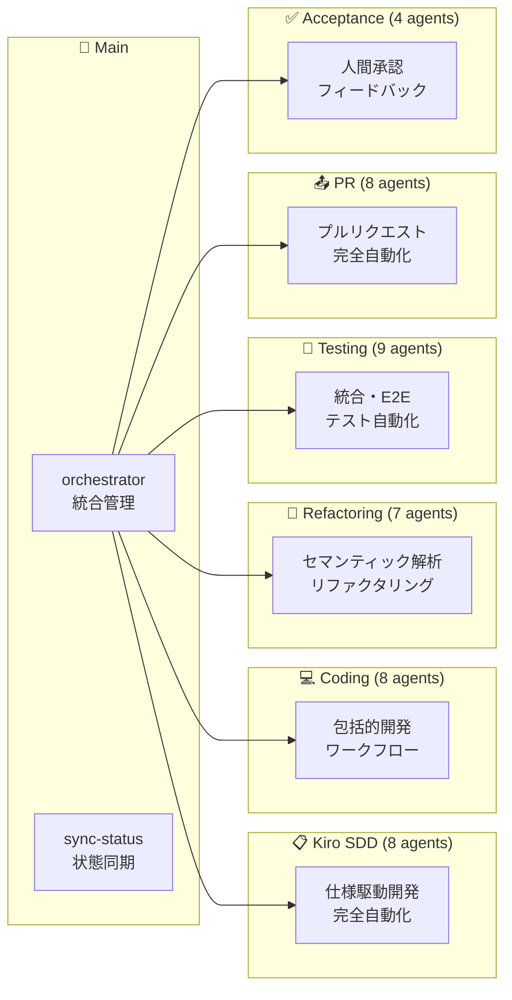

# CC-Deck: AI-Driven Development Platform

**Claude Code Deck** - AI 駆動開発プラットフォーム

## 概要

CC-Deck は、Claude Code を中心とした包括的な開発ワークフローを自動化する AI 駆動開発プラットフォームです。Kiro SDD（Specification-Driven Development）プロセスを採用し、要件定義から実装まで一貫した開発体験を提供します。

> **Kiro SDD について**: 本プロジェクトの仕様駆動開発（SDD）プロセスは [gotalab/claude-code-spec](https://github.com/gotalab/claude-code-spec) を参考に設計・実装されています。

## ✨ 主要機能

### 🎯 インテリジェント・オーケストレーション

- **自動ワークフロー管理**: プロジェクト状態を自動検出し、適切な次のステップを提案
- **状態ベース実行**: 現在のプロジェクト状態に基づいて最適な開発アクションを選択
- **スマートな委任**: 専門エージェントへのタスク自動振り分け

### 📋 タスクベース開発

- **進捗トラッキング**: `.kiro/specs/{feature}/tasks.md`による詳細な進捗管理
- **段階的実装**: 要件定義 → 設計 → タスク分解 → 実装の構造化されたフロー
- **品質ゲート**: 各フェーズでの承認プロセスによる品質保証

### 🤖 人間承認ワークフロー

- **AI 駆動リスク評価**: 変更内容の自動リスク分析
- **3 段階承認システム**: 低リスク（自動）、中リスク（条件付き）、高リスク（人間必須）
- **学習機能**: 人間の判断パターンを学習し、承認精度を継続的に向上

### 🔍 次のタスク自動検出

- **タスク分析**: .kiro/specs/{feature}/tasks.md の進捗状況を自動分析
- **完了検出**: チェックボックスによるタスク完了の自動判定と品質検証
- **自動進行**: 未完了タスクの自動特定と次の実装ステップの提案

### 🔗 MCP 統合

- **DeepWiki**: GitHub リポジトリの包括的ドキュメント分析
- **Context7**: 最新ライブラリドキュメントの自動取得
- **Serena**: セマンティック解析による高度なコードリファクタリング

### 🤖 マルチエージェント・システム

CC-Deck は **43 個の専門サブエージェント** が **6 つのクラスター** で協調動作する高度なマルチエージェント・システムです：

#### 🎯 統合管理

- **/orchestrator**: プロジェクト状態検出・ワークフロー統合管理
- **/sync-status**: Kiro SDD 状態整合性・実装進捗同期

#### 📋 Kiro SDD (8 エージェント)

仕様駆動開発完全自動化クラスター

- **統合管理**: kiro-spec-orchestrator
- **操舵・初期化**: kiro-steering, kiro-spec-init
- **要件・設計**: kiro-spec-requirements (EARS 形式), kiro-spec-design
- **実行管理**: kiro-spec-tasks, kiro-spec-status

#### 💻 Coding (8 エージェント)

包括的開発ワークフロークラスター

- **統合管理**: coding
- **リサーチ・計画**: research-agent, planning-agent
- **実装・TDD**: implementation-agent (Serena MCP 統合), tdd-agent ([t-wada](https://github.com/t-wada) 氏の方法論)
- **品質・文書**: testing-agent, documentation-agent, serena-onboarding-agent

#### 🔧 Refactoring (7 エージェント)

セマンティック解析リファクタリングクラスター

- **統合管理**: refactoring
- **解析**: code-analyzer, pattern-detector
- **実行**: serena-mcp-refactoring, similarity-refactoring ([mizchi/similarity](https://github.com/mizchi/similarity) ベース), refactoring-implementer
- **検証**: quality-validator

#### 🧪 Testing (9 エージェント)

統合・E2E テスト自動化クラスター

- **統合テスト**: integration-test, test-strategy-planner, test-environment-manager, test-executor, test-reporter
- **E2E テスト**: e2e-test, e2e-test-planner, e2e-test-runner

#### 📤 PR (8 エージェント)

プルリクエスト完全自動化クラスター

- **作成**: pr-create, pr-analyzer, pr-generator, pr-validator
- **マージ**: pr-merge, merge-approver, merge-executor, post-merge-manager

#### ✅ Acceptance (4 エージェント)

人間承認・フィードバックループクラスター

- **管理**: acceptance, acceptance-reviewer
- **フィードバック**: feedback-analyzer, phase-coordinator

## 🏗️ アーキテクチャ

CC-Deck は **43 個の専門サブエージェント** が **6 つのクラスター** に組織されたマルチエージェント・アーキテクチャを採用：

### 📊 システム構成

- **総エージェント数**: 43 個の専門サブエージェント
- **クラスター構成**: 6 つの専門クラスター + メインオーケストレーター
- **連携パス**: 248 個の潜在的連携経路
- **MCP 統合**: 4 つの MCP サービス（DeepWiki, Context7, Serena, Playwright）

### 🎯 メインオーケストレーター層

```
┌─────────────────────────────────────────────┐
│  /orchestrator - インテリジェント統合管理     │
│  ├─ プロジェクト状態自動検出                 │
│  ├─ 6つの専門クラスターへの自動委任          │
│  └─ ワークフロー継続性管理                  │
│                                             │
│  /sync-status - 状態整合性管理              │
│  ├─ Kiro SDD状態同期                       │
│  └─ 実装進捗との整合性確保                  │
└─────────────────────────────────────────────┘
```

### 🔄 6 つの専門クラスター



### 🧠 クラスター詳細

#### 📋 Kiro SDD クラスター (8 エージェント)

仕様駆動開発の完全自動化

- **kiro-spec-orchestrator**: 統合管理
- **kiro-steering**: プロジェクト操舵
- **kiro-spec-init**: 仕様初期化
- **kiro-spec-requirements**: EARS 形式要件定義
- **kiro-spec-design**: 技術設計
- **kiro-spec-tasks**: 実装タスク生成
- **kiro-spec-status**: 進捗管理

#### 💻 Coding クラスター (8 エージェント)

包括的開発ワークフロー

- **coding**: 統合管理
- **research-agent**: 技術リサーチ
- **planning-agent**: 戦略的計画
- **implementation-agent**: Serena MCP 統合実装
- **tdd-agent**: Test-Driven Development ([t-wada](https://github.com/t-wada) 氏の方法論)
- **testing-agent**: テスト戦略
- **documentation-agent**: ドキュメント生成
- **serena-onboarding-agent**: Serena プロジェクト初期化

#### 🔧 Refactoring クラスター (7 エージェント)

セマンティック解析による高度リファクタリング

- **refactoring**: 統合管理
- **serena-mcp-refactoring**: Serena MCP 専用
- **similarity-refactoring**: 重複パターン統合 ([mizchi/similarity](https://github.com/mizchi/similarity) ベース)
- **code-analyzer**: 構造・依存関係分析
- **pattern-detector**: パターン検出
- **quality-validator**: 品質検証
- **refactoring-implementer**: 変換実行

#### 🧪 Testing クラスター (9 エージェント)

統合・E2E テスト自動化

- **integration-test**: 統合テスト管理
- **test-strategy-planner**: テスト戦略
- **test-environment-manager**: 環境管理
- **test-executor**: 実行・監視
- **test-reporter**: 結果分析
- **e2e-test**: E2E テスト管理
- **e2e-test-planner**: E2E シナリオ
- **e2e-test-runner**: E2E 実行

#### 📤 PR クラスター (8 エージェント)

プルリクエスト完全自動化

- **pr-create**: PR 作成管理
- **pr-analyzer**: 変更分析
- **pr-generator**: 内容生成
- **pr-validator**: 品質検証
- **pr-merge**: マージ管理
- **merge-approver**: 承認プロセス
- **merge-executor**: 安全実行
- **post-merge-manager**: 後処理

#### ✅ Acceptance クラスター (4 エージェント)

人間承認・フィードバックループ

- **acceptance**: 承認管理
- **acceptance-reviewer**: レビュー支援
- **feedback-analyzer**: フィードバック分析
- **phase-coordinator**: フェーズ調整

### 🔗 MCP 統合サービス

- **DeepWiki MCP**: GitHub 技術文書分析
- **Context7 MCP**: ライブラリドキュメント
- **Serena MCP**: セマンティック解析・リファクタリング
- **Playwright MCP**: E2E テスト実行

詳細なアーキテクチャ図は **[docs/ARCHITECTURE.md](docs/ARCHITECTURE.md)** を参照してください。

## 🚀 クイックスタート

### 基本的な使用方法

1. **メインコマンドを実行**:
   ```bash
   /orchestrator
   ```
2. **プロジェクトを説明**:

   - 新機能の要件や改善したい点を自然言語で記述
   - システムが自動的に適切なワークフローを選択

3. **自動実行**:
   - AI が状態を分析し、必要なタスクを実行
   - 承認が必要な場合は人間に確認を求める

### カスタムスラッシュコマンド

現在利用可能なカスタムコマンド：

- **`/orchestrator`** - インテリジェント・オーケストレーター
  - プロジェクト状態を自動検出し、適切な開発フェーズに移行
  - タスクベース進捗管理とワークフロー継続
  - Serena MCP 統合による高度なコンテキスト管理

### アーカイブ済みコマンド

以下のコマンドは `/orchestrator` に統合されており、直接的な利用は推奨されません：

- `/acceptance` - 人間承認ワークフロー管理
- `/check-issues` - GitHub イシュー分析
- `/coding` - 包括的コーディングワークフロー
- `/create-issues` - GitHub イシュー自動作成
- `/e2e-test` - エンドツーエンドテスト生成
- `/integration-test` - 統合テスト実行
- `/pr-create` - プルリクエスト自動作成
- `/pr-merge` - プルリクエスト安全マージ
- `/refactoring` - セマンティックリファクタリング
- `/spec-driven` - 仕様駆動開発ワークフロー

## 📁 プロジェクト構造

```
cc-deck/
├── .kiro/                    # Kiro SDD作業ディレクトリ
│   ├── specs/               # アクティブな機能仕様
│   └── steering/            # プロジェクト操舵文書
├── docs/                    # プロジェクトドキュメント
│   ├── ARCHITECTURE.md      # アーキテクチャ仕様
│   ├── claude-code/         # Claude Code固有のドキュメント
│   └── kiro/               # Kiro SDD例とリファレンス
├── CLAUDE.md               # プロジェクトコンテキスト
└── README.md              # メインワークフロー
```

## 🔧 開発ワークフロー

CC-Deck は 8 段階の開発プロセスを自動化し、全段階で TDD（Test-Driven Development）を重視します：

1. **プロジェクト分析**: 現在の状態と次のアクションを特定
2. **操舵設定**: プロジェクトの方向性と技術方針を確立
3. **仕様初期化**: 新機能の仕様フレームワークを作成
4. **要件定義**: EARS 形式での詳細な要件記述
5. **技術設計**: アーキテクチャと実装戦略の策定
6. **タスク分解**: TDD 対応の実装可能な粒度でのタスク分割
7. **TDD 実装**: テストファースト・Red-Green-Refactor サイクルでのコード開発
8. **承認・進行**: 品質評価と次ステップの決定

## 🧪 TDD 実践

このプロジェクトでは [t-wada](https://github.com/t-wada) 氏の方法論による TDD を重視しています：

### TDD 特徴

- **専用エージェント**: `tdd-agent`による厳格な TDD ガイダンス
- **Red-Green-Refactor**: 妥協のない 3 段階サイクルの実施
- **テストファースト**: すべての実装は失敗テストから開始
- **設計 emergence**: TDD を通じた自然な設計パターンの発見

### TDD 実行方法

```bash
# TDDを使用した機能実装（coding経由でtdd-agentを自動呼び出し）
/orchestrator "Build OAuth2 authentication system using TDD approach"

# 具体的なTDD指示（coding agent がtdd-agentに委任）
/orchestrator "Implement Payment API with strict Red-Green-Refactor cycle"

# TDD統合開発ワークフロー
/orchestrator "Create User Management system with comprehensive TDD and testing"
```

## 🛠️ 技術スタック

- **AI Platform**: Claude Code with Opus 4
- **Development Process**: Kiro SDD (Specification-Driven Development)
- **Integration**: MCP (Model Context Protocol) servers
- **Documentation**: Markdown-based specifications
- **Version Control**: Git with automated GitHub integration
- **Quality Assurance**: Multi-tier approval workflows

## 📖 ドキュメント

詳細なドキュメントは `docs/` ディレクトリにあります：

- **[ARCHITECTURE.md](docs/ARCHITECTURE.md)**: システムアーキテクチャの詳細
- **[claude-code/](docs/claude-code/)**: Claude Code 統合ガイド
- **[kiro/](docs/kiro/)**: Kiro SDD 方法論とサンプル

## 🎯 使用例

### 新機能の開発

```bash
# 状態自動検出でのワークフロー継続
/orchestrator

# 具体的な機能開発指示
/orchestrator "ユーザー認証システムにソーシャルログイン機能を追加したい"

# TDD approach での開発
/orchestrator "Build real-time chat system with comprehensive TDD implementation"
```

### 既存コードの改善・リファクタリング

```bash
# パフォーマンス改善・リファクタリング
/orchestrator "APIレスポンス時間を改善し、エラーハンドリングを強化したい"

# コード品質向上
/orchestrator "Refactor authentication module to eliminate code duplication and improve maintainability"

# セマンティック解析による改善
/orchestrator "Analyze and optimize database queries for better performance"
```

### テスト・品質保証

```bash
# 統合テスト実行
/orchestrator "Run comprehensive integration tests for payment system"

# E2E テスト生成
/orchestrator "Generate E2E tests for user registration flow"

# 受け入れテスト・承認ワークフロー
/orchestrator "Setup acceptance testing for authentication feature"
```

### PR・デプロイメント

```bash
# PR作成・マージワークフロー
/orchestrator "Create and merge PR for user-management feature"

# 安全なマージ実行
/orchestrator "Safely merge approved authentication PR with post-merge validation"
```

## 🤝 貢献

CC-Deck は継続的に進化するプラットフォームです。新しいエージェントの開発、ワークフローの改善、ドキュメントの拡充などを通じて、AI 駆動開発の可能性を広げていきます。

## 📄 ライセンス

このプロジェクトは [MIT License](LICENSE) の下で公開されています。

---

**CC-Deck** - AI と人間の協調による、次世代の開発体験を提供します。（気持ち的には）
