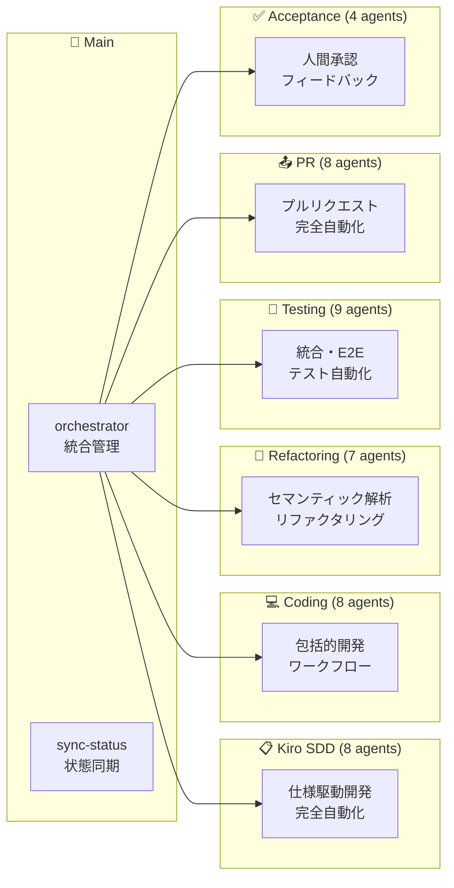

# CC-Deck: AI-Driven Development Platform

**Claude Code Deck** - AI駆動開発プラットフォーム

## 概要

CC-Deck は、Claude Code を中心とした **CC-Deck Workflow Engine** による革新的なAI駆動開発プラットフォームです。40+の専門サブエージェントが6つのYAMLワークフローで協調動作し、TDD統一による高品質開発、人間承認必須による品質保証、Kiro SDD（Specification-Driven Development）の完全自動化を実現します。

> **Kiro SDD について**: 本プロジェクトの仕様駆動開発（SDD）プロセスは [gotalab/claude-code-spec](https://github.com/gotalab/claude-code-spec) のアプローチに大きく基づいています。ディレクトリ構造、フェーズベース開発、仕様ファイル構成などの中核的な概念は同プロジェクトから採用し、Claude Code 統合やマルチエージェントシステムなどの拡張機能を追加しています。

## ✨ 主要機能

### 🔴 TDD統一ポリシー

- **TDD-Only Policy**: 全開発フローがTest-Driven Development必須・選択肢なし
- **TDD Trilogy**: serena-onboarding → tdd-agent → implementation-agent の3段階特化連携
- **95%+テストカバレッジ**: t-wada方法論による完全品質保証
- **Red-Green-Refactor**: 妥協なき厳格サイクルによる設計自然導出

### 🎯 CC-Deck Workflow Engine

- **Workflow Composition Pattern**: YAML定義による宣言的ワークフロー管理と動的実行
- **Smart Context Propagation**: クロスエージェント状態共有とフェーズ間継承
- **6つの専用スラッシュコマンド**: `/kiro-sdd`, `/coding`, `/refactoring`, `/testing`, `/pr`, `/acceptance`
- **Task-Driven Execution**: `.kiro/specs/*/tasks.md`リアルタイム双方向同期

### 🔒 人間承認必須システム

- **Zero Auto-Approval**: AI自動承認完全禁止・全判断人間実行
- **AI-Prepared Materials**: AI包括的承認材料準備・人間最終決定
- **Decision Traceability**: 全承認判断完全記録・監査追跡可能
- **Feedback Integration**: 承認拒否時自動フィードバック分析・フェーズ巻き戻し

### 🔍 次のタスク自動検出

- **タスク分析**: .kiro/specs/{feature}/tasks.md の進捗状況を自動分析
- **完了検出**: チェックボックスによるタスク完了の自動判定と品質検証
- **自動進行**: 未完了タスクの自動特定と次の実装ステップの提案

### 🔗 MCP 統合

- **DeepWiki**: GitHub リポジトリの包括的ドキュメント分析
- **Context7**: 最新ライブラリドキュメントの自動取得
- **Serena**: セマンティック解析による高度なコードリファクタリング

### 🤖 マルチエージェント・システム

CC-Deck は **40+個の専門サブエージェント** が **CC-Deck Workflow Engine** で協調動作する高度なマルチエージェント・システムです：

#### 🎯 統合管理

- **/orchestrator**: プロジェクト状態検出・ワークフロー統合管理
- **/sync-status**: Kiro SDD 状態整合性・実装進捗同期

#### 📋 Kiro SDD (8 エージェント)

仕様駆動開発完全自動化クラスター

- **統合管理**: kiro-spec-orchestrator
- **操舵・初期化**: kiro-steering, kiro-spec-init
- **要件・設計**: kiro-spec-requirements (EARS 形式), kiro-spec-design
- **実行管理**: kiro-spec-tasks, kiro-spec-status

#### 💻 Coding (8 エージェント)

**TDD統一ポリシーによる包括的高品質開発クラスター**

- **TDD Trilogy Core**: 3段階連携特化エージェント
  - serena-onboarding-agent (TDD環境・Serena MCP初期化)
  - tdd-agent ([t-wada](https://github.com/t-wada) 方法論・Red-Green-Refactor厳格実行)
  - implementation-agent (TDD基盤完成・本格実装)
- **Workflow Support**: 5つの支援エージェント
  - coding (統合管理・フロー調整) + research, planning, testing, documentation

#### 🔧 Refactoring (7 エージェント)

セマンティック解析リファクタリングクラスター

- **統合管理**: refactoring
- **解析**: code-analyzer, pattern-detector
- **実行**: serena-mcp-refactoring, similarity-refactoring ([mizchi/similarity](https://github.com/mizchi/similarity) ベース), refactoring-implementer
- **検証**: quality-validator

#### 🧪 Testing (9 エージェント)

統合・E2E テスト自動化クラスター

- **統合テスト**: integration-test, test-strategy-planner, test-environment-manager, test-executor, test-reporter
- **E2E テスト**: e2e-test, e2e-test-planner, e2e-test-runner

#### 📤 PR (8 エージェント)

プルリクエスト完全自動化クラスター

- **作成**: pr-create, pr-analyzer, pr-generator, pr-validator
- **マージ**: pr-merge, merge-approver, merge-executor, post-merge-manager

#### ✅ Acceptance (4 エージェント)

人間承認・フィードバックループクラスター

- **管理**: acceptance, acceptance-reviewer
- **フィードバック**: feedback-analyzer, phase-coordinator

## 🏗️ アーキテクチャ

CC-Deck は **CC-Deck Workflow Engine** を中核とする革新的なワークフロー管理アーキテクチャを採用：

### 📊 システム構成

- **総エージェント数**: 40+個の専門サブエージェント  
- **ワークフロー数**: 6つのYAML定義メインワークフロー
- **TDD統一**: 全開発フローがTest-Driven Developmentで統一
- **人間承認**: 全変更に必須の人間ステークホルダー承認
- **MCP統合**: 4つのMCPサービス（DeepWiki, Context7, Serena, Playwright）

### 🎯 メインオーケストレーター層

```
┌─────────────────────────────────────────────┐
│  /orchestrator - インテリジェント統合管理     │
│  ├─ プロジェクト状態自動検出                 │
│  ├─ 6つの専門クラスターへの自動委任          │
│  └─ ワークフロー継続性管理                  │
│                                             │
│  /sync-status - 状態整合性管理              │
│  ├─ Kiro SDD状態同期                       │
│  └─ 実装進捗との整合性確保                  │
└─────────────────────────────────────────────┘
```

### 🔄 6 つの専門クラスター



### 🧠 クラスター詳細

#### 📋 Kiro SDD クラスター (8 エージェント)

仕様駆動開発の完全自動化

- **kiro-spec-orchestrator**: 統合管理
- **kiro-steering**: プロジェクト操舵
- **kiro-spec-init**: 仕様初期化
- **kiro-spec-requirements**: EARS 形式要件定義
- **kiro-spec-design**: 技術設計
- **kiro-spec-tasks**: 実装タスク生成
- **kiro-spec-status**: 進捗管理

#### 💻 Coding クラスター (8 エージェント)

包括的開発ワークフロー

- **coding**: 統合管理
- **research-agent**: 技術リサーチ
- **planning-agent**: 戦略的計画
- **implementation-agent**: Serena MCP 統合実装
- **tdd-agent**: Test-Driven Development ([t-wada](https://github.com/t-wada) 氏の方法論)
- **testing-agent**: テスト戦略
- **documentation-agent**: ドキュメント生成
- **serena-onboarding-agent**: Serena プロジェクト初期化

#### 🔧 Refactoring クラスター (7 エージェント)

セマンティック解析による高度リファクタリング

- **refactoring**: 統合管理
- **serena-mcp-refactoring**: Serena MCP 専用
- **similarity-refactoring**: 重複パターン統合 ([mizchi/similarity](https://github.com/mizchi/similarity) ライブラリ統合)
- **code-analyzer**: 構造・依存関係分析
- **pattern-detector**: パターン検出
- **quality-validator**: 品質検証
- **refactoring-implementer**: 変換実行

#### 🧪 Testing クラスター (9 エージェント)

統合・E2E テスト自動化

- **integration-test**: 統合テスト管理
- **test-strategy-planner**: テスト戦略
- **test-environment-manager**: 環境管理
- **test-executor**: 実行・監視
- **test-reporter**: 結果分析
- **e2e-test**: E2E テスト管理
- **e2e-test-planner**: E2E シナリオ
- **e2e-test-runner**: E2E 実行

#### 📤 PR クラスター (8 エージェント)

プルリクエスト完全自動化

- **pr-create**: PR 作成管理
- **pr-analyzer**: 変更分析
- **pr-generator**: 内容生成
- **pr-validator**: 品質検証
- **pr-merge**: マージ管理
- **merge-approver**: 承認プロセス
- **merge-executor**: 安全実行
- **post-merge-manager**: 後処理

#### ✅ Acceptance クラスター (4 エージェント)

人間承認・フィードバックループ

- **acceptance**: 承認管理
- **acceptance-reviewer**: レビュー支援
- **feedback-analyzer**: フィードバック分析
- **phase-coordinator**: フェーズ調整

### 🔗 MCP 統合サービス

- **DeepWiki MCP**: GitHub 技術文書分析
- **Context7 MCP**: ライブラリドキュメント
- **Serena MCP**: セマンティック解析・リファクタリング
- **Playwright MCP**: E2E テスト実行

詳細なアーキテクチャ図は **[docs/ARCHITECTURE.md](docs/ARCHITECTURE.md)** を参照してください。

## 🚀 クイックスタート

### セットアップ

1. **依存関係のインストール**:

   ```bash
   npm install
   ```

   または

   ```bash
   yarn install
   ```

2. **Similarity ツールのインストール** (TypeScript プロジェクト用):

   ```bash
   cargo install similarity-ts
   ```

3. **Claude Code 環境**: このプロジェクトは Claude Code 環境で動作します。

### 基本的な使用方法

1. **メインコマンドを実行**:
   ```bash
   /orchestrator
   ```
2. **プロジェクトを説明**:

   - 新機能の要件や改善したい点を自然言語で記述
   - システムが自動的に適切なワークフローを選択

3. **自動実行**:
   - AI が状態を分析し、必要なタスクを実行
   - 承認が必要な場合は人間に確認を求める

### カスタムスラッシュコマンド

現在利用可能なカスタムコマンド：

- **`/orchestrator`** - インテリジェント・オーケストレーター
  - プロジェクト状態を自動検出し、適切な開発フェーズに移行
  - タスクベース進捗管理とワークフロー継続
  - Serena MCP 統合による高度なコンテキスト管理

### アーカイブ済みコマンド

以下のコマンドは `/orchestrator` に統合されており、直接的な利用は推奨されません：

- `/acceptance` - 人間承認ワークフロー管理
- `/check-issues` - GitHub イシュー分析
- `/coding` - 包括的コーディングワークフロー
- `/create-issues` - GitHub イシュー自動作成
- `/e2e-test` - エンドツーエンドテスト生成
- `/integration-test` - 統合テスト実行
- `/pr-create` - プルリクエスト自動作成
- `/pr-merge` - プルリクエスト安全マージ
- `/refactoring` - セマンティックリファクタリング
- `/spec-driven` - 仕様駆動開発ワークフロー

## 📁 プロジェクト構造

```
cc-deck/
├── .cc-deck/                 # CC-Deck Workflow Engine
│   ├── workflows/           # YAML定義ワークフロー (6個)
│   └── context/             # Smart Context状態管理
├── .kiro/                   # Kiro SDD作業ディレクトリ  
│   ├── specs/               # アクティブな機能仕様
│   └── steering/            # プロジェクト操舵文書
├── .claude/                 # Claude Code統合
│   ├── commands/            # カスタムコマンド
│   └── agents/              # 専門サブエージェント (40+個)
├── docs/                    # プロジェクトドキュメント
│   ├── ARCHITECTURE.md      # システムアーキテクチャ
│   ├── claude-code/         # Claude Code固有ドキュメント
│   └── kiro/               # Kiro SDD例とリファレンス
├── CLAUDE.md               # プロジェクトコンテキスト・ポリシー
└── README.md              # メインガイド
```

## 🔧 CC-Deck Workflow Engine 詳細

CC-Deck は **6つのYAMLワークフロー + 6つの専用スラッシュコマンド** で包括的な開発プロセスを自動化します：

### 📋 ワークフロー・コマンド構成

1. **`/kiro-sdd`** → kiro-sdd-workflow: Kiro SDD仕様駆動開発（要件→設計→タスク）
2. **`/coding`** → coding-workflow: TDD統一開発（7段階TDD Trilogy + 支援）
3. **`/refactoring`** → refactoring-workflow: セマンティック解析・パターン検出リファクタリング
4. **`/testing`** → testing-workflow: 統合テスト・E2Eテスト完全自動化
5. **`/pr`** → pr-workflow: プルリクエストライフサイクル完全管理
6. **`/acceptance`** → acceptance-workflow: 人間承認・フィードバック・品質保証

### 🔴 TDD統一開発フロー（`/coding` workflow）

**全実装が以下の7段階TDD統一ポリシーで必須実行されます：**

1. **Research** (research-agent): MCP技術調査・ベストプラクティス収集
2. **Planning** (planning-agent): 戦略的アーキテクチャ設計・実装計画策定
3. **Serena Onboarding** (serena-onboarding-agent): TDD環境・Serena MCP初期化
4. **TDD Cycle** (tdd-agent): Red-Green-Refactor厳格実行 (t-wada方法論)
5. **Full Implementation** (implementation-agent): TDD基盤上での本格実装完成
6. **Testing** (testing-agent): 統合・E2Eテスト包括戦略追加
7. **Documentation** (documentation-agent): API・仕様書自動生成

## 🧪 TDD-First Development Policy

このプロジェクトでは **TDD統一ポリシー** により、すべての開発が [t-wada](https://github.com/t-wada) 氏の方法論に従います：

### 🔴 TDD統一ポリシーの革新性

- **TDD-Only Policy**: 選択肢完全排除・全実装TDD必須・例外なし
- **TDD Trilogy System**: 3段階特化エージェント連携（環境 → サイクル → 完成）
- **100%テスト駆動**: 全プロダクションコードがテスト先行作成
- **t-wada Method Enforcement**: 妥協なき厳格Red-Green-Refactorサイクル
- **95%+カバレッジ**: 定量的品質指標による客観的品質保証

### 🎯 ワークフロー実行方法

#### インテリジェント統合実行
```bash
# 状態自動検出・適切ワークフロー選択
/orchestrator
/orchestrator "ユーザー認証システムを構築したい"
```

#### 直接ワークフロー実行
```bash
# TDD統一開発（推奨メイン）
/coding "Build OAuth2 authentication system with comprehensive TDD"

# 仕様駆動開発から開始
/kiro-sdd "Create specification for e-commerce payment system"

# セマンティック解析リファクタリング
/refactoring "Optimize user service architecture and eliminate code duplication"

# 統合・E2Eテスト実行
/testing "Run comprehensive integration tests for authentication system"

# プルリクエスト完全管理
/pr "Create and merge PR for user-management feature with validation"

# 人間承認・品質保証
/acceptance "Review and approve payment processing implementation"
```

## 🛠️ 技術スタック

- **AI Platform**: Claude Code with Sonnet 4 (40+専門エージェント)
- **Workflow Engine**: CC-Deck Workflow Engine (YAML定義・Smart Context)
- **Development Methodology**: TDD統一ポリシー (t-wada方法論) + Kiro SDD
- **MCP Integration**: DeepWiki, Context7, Serena, Playwright MCP統合
- **Documentation**: 自動生成API仕様・実行可能テスト仕様書
- **Version Control**: Git + GitHub完全自動化 (PR・マージ・品質管理)
- **Quality Assurance**: 人間承認必須・AI自動承認完全禁止

## 📖 ドキュメント

詳細なドキュメントは `docs/` ディレクトリにあります：

- **[ARCHITECTURE.md](docs/ARCHITECTURE.md)**: システムアーキテクチャの詳細
- **[ATTRIBUTION.md](docs/ATTRIBUTION.md)**: 参照プロジェクトと謝辞
- **[INSTALLATION.md](docs/INSTALLATION.md)**: インストールガイド
- **[claude-code/](docs/claude-code/)**: Claude Code 統合ガイド
- **[kiro/](docs/kiro/)**: Kiro SDD 方法論とサンプル

## 🎯 使用例

### 新機能の開発

```bash
# インテリジェント統合 (推奨)
/orchestrator "ユーザー認証システムにソーシャルログイン機能を追加したい"

# TDD統一開発 (直接実行)
/coding "Build real-time chat system with comprehensive TDD implementation"

# 仕様から開始
/kiro-sdd "Create specification for AI-powered recommendation engine"
```

### 既存コードの改善・リファクタリング

```bash
# セマンティック解析リファクタリング
/refactoring "Refactor authentication module to eliminate code duplication and improve maintainability"

# パフォーマンス最適化
/refactoring "Analyze and optimize database queries with semantic pattern detection"

# 高度構造改善
/refactoring "Apply SOLID principles and design patterns to legacy payment system"
```

### テスト・品質保証

```bash
# 統合テスト完全自動化
/testing "Run comprehensive integration tests for payment system with environment setup"

# E2Eテスト・ブラウザ自動化
/testing "Generate E2E tests for user registration flow with cross-browser validation"

# 人間承認・品質保証
/acceptance "Review and approve authentication feature with comprehensive quality checks"
```

### PR・デプロイメント

```bash
# プルリクエストライフサイクル完全管理
/pr "Create comprehensive PR for user-management feature with analysis and validation"

# 安全マージ・後処理自動化
/pr "Safely merge approved authentication PR with conflict resolution and cleanup"
```

## 🤝 貢献

CC-Deck は継続的に進化するプラットフォームです。新しいエージェントの開発、ワークフローの改善、ドキュメントの拡充などを通じて、AI 駆動開発の可能性を広げていきます。

## 📄 ライセンス

このプロジェクトは [MIT License](LICENSE) の下で公開されています。

- **参照プロジェクトの詳細**: [ATTRIBUTION.md](docs/ATTRIBUTION.md)
- **サードパーティライセンス**: [LICENSES.md](LICENSES.md)
- **プロジェクトの独自性**: [ORIGINALITY.md](ORIGINALITY.md)

---

**CC-Deck Workflow Engine** - 40+エージェントの専門性、YAML定義の柔軟性、TDD統一の品質保証、人間承認の信頼性が統合された、次世代AI駆動開発プラットフォーム。従来の単発AI支援を超越し、人間とAIの協調による持続可能で高品質な開発エコシステムを実現します。