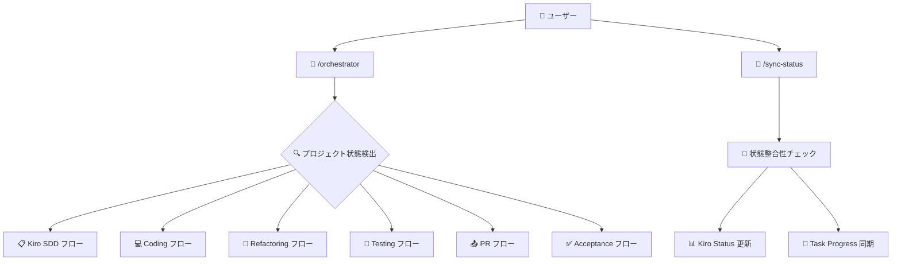
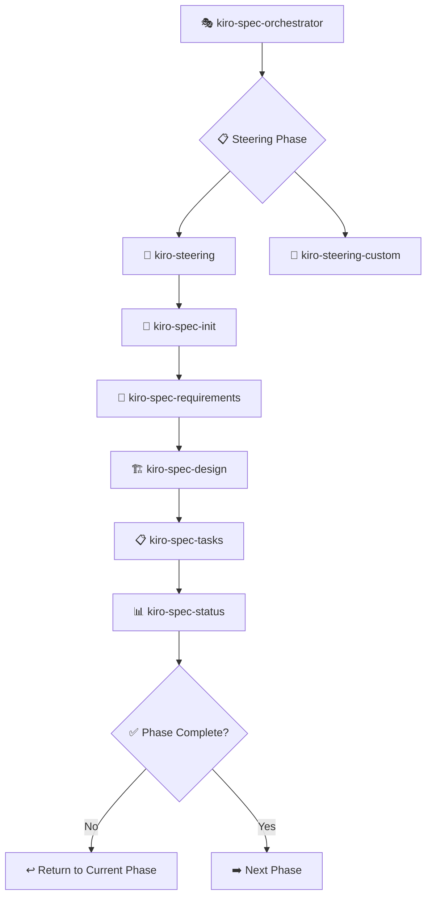
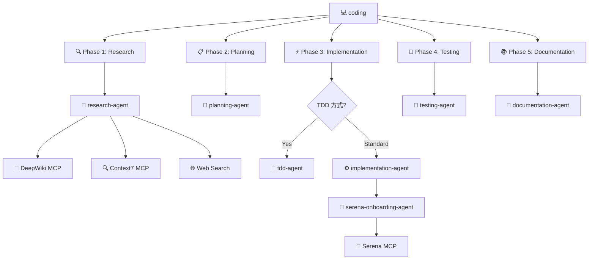
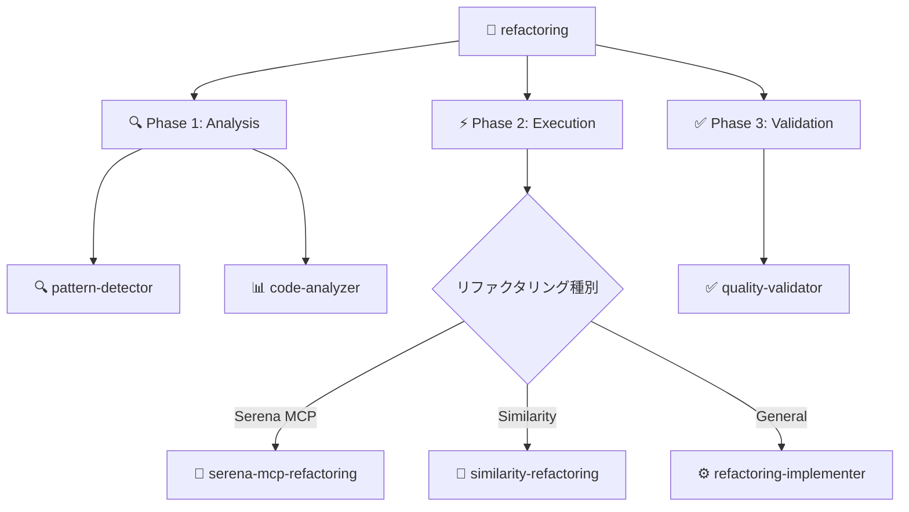
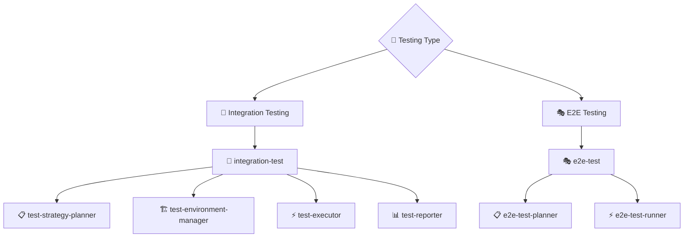
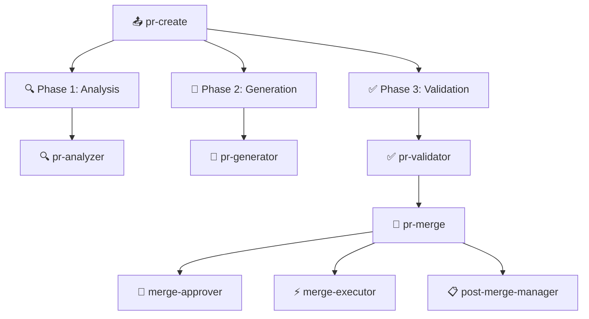
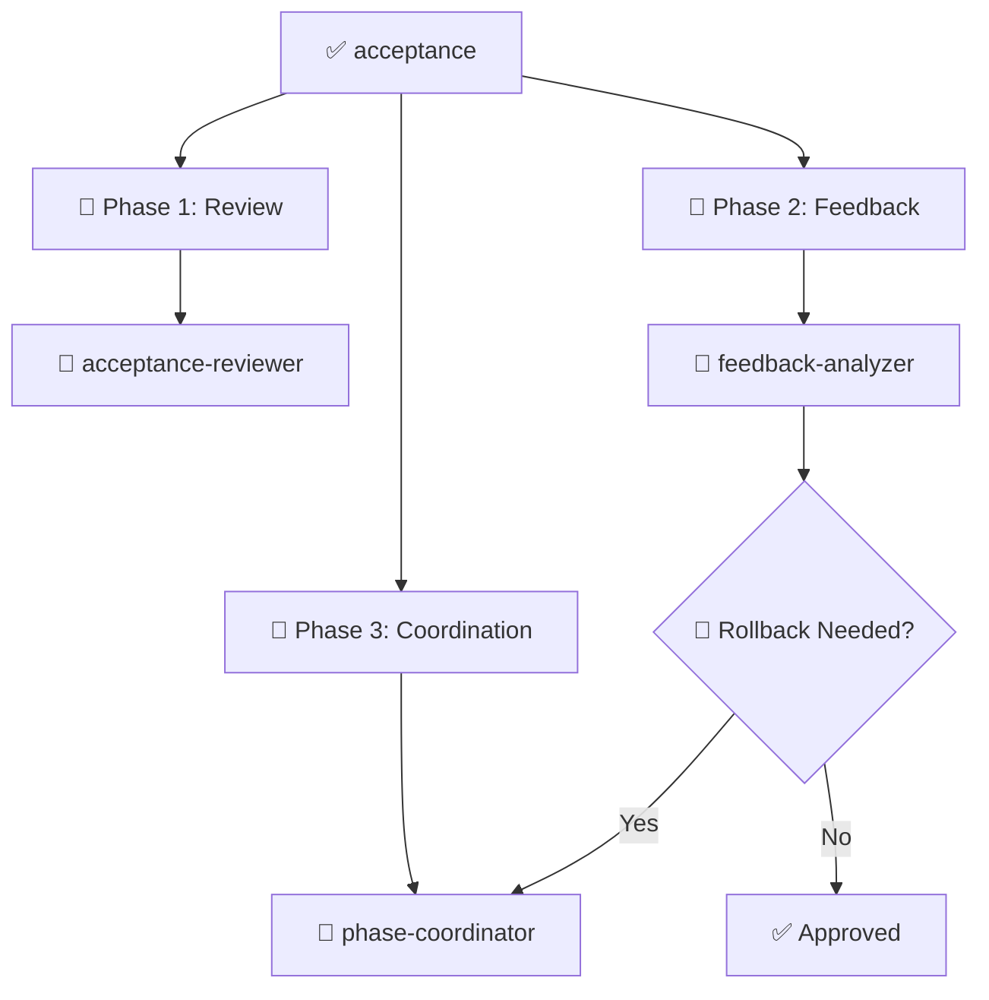
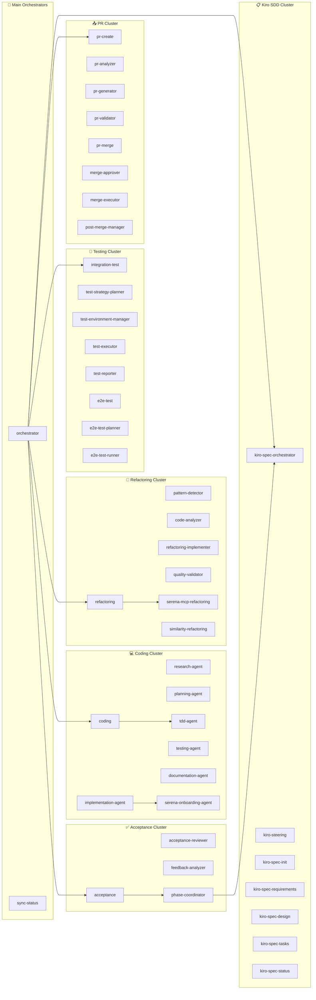
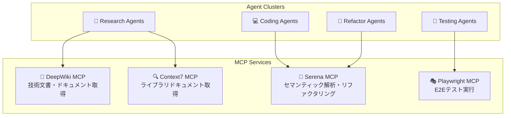

# CC-Deck AI Driven Development アーキテクチャ

## 概要

CC-Deck (Claude Code Deck) は、Claude Code を活用した包括的な AI Driven Development プラットフォームです。43の専門サブエージェントとカスタムコマンドを組み合わせて、仕様駆動開発から実装、テスト、デプロイまで完全自動化された開発ワークフローを提供します。

> **Kiro SDD について**: 本プロジェクトの仕様駆動開発（SDD）プロセスは [gotalab/claude-code-spec](https://github.com/gotalab/claude-code-spec) を参考に設計・実装されています。Claude Code における spec-driven development の実践的な実装例として、要件定義から実装まで一貫したワークフローを自動化しています。

## 完全サブエージェント連携図

### メインオーケストレーター連携フロー



### 1. Kiro SDD (仕様駆動開発) フロー



### 2. Coding (開発統合) フロー



### 3. Refactoring (リファクタリング) フロー



### 4. Testing (テスト) フロー



### 5. PR (プルリクエスト) フロー



### 6. Acceptance (承認) フロー



### サブエージェント間連携マトリックス



## 連携強化のための改善提案

### 1. サブエージェント間通信の標準化

現在のTask()呼び出しに加えて、以下の連携パターンを強化：

```mermaid
graph TD
    subgraph "連携パターン"
        DirectCall[直接呼び出し<br/>Task(subagent_type)]
        StateShare[状態共有<br/>共通ステータス]
        ResultPass[結果受け渡し<br/>出力→入力]
        ParallelExec[並列実行<br/>並行処理]
    end
    
    DirectCall --> StandardPattern[標準的な委任パターン]
    StateShare --> EnhancedSync[状態同期強化]
    ResultPass --> PipelineFlow[パイプライン化]
    ParallelExec --> ConcurrentOps[並行処理最適化]
```

### 2. 提案される連携強化機能

#### A. 状態共有メカニズム
- **共通状態ストア**: 全サブエージェントが参照可能な状態情報
- **リアルタイム同期**: 状態変更の即座反映
- **競合回避**: 同時アクセス制御機構

#### B. 結果受け渡しパイプライン
- **標準化された出力形式**: JSON Schema準拠の結果フォーマット
- **自動変換**: エージェント間のデータ形式変換
- **エラー伝播**: 失敗時の適切なエラー処理

#### C. 並列実行制御
- **依存関係管理**: 前提条件チェックと待機機構
- **リソース管理**: 同時実行数制限
- **進捗監視**: 並列実行タスクの統合監視

#### D. フィードバックループ
- **学習機構**: 連携パターンの最適化
- **パフォーマンス監視**: 実行時間・成功率追跡
- **自動調整**: 負荷に応じた動的調整

### 3. MCP統合による外部サービス連携



## 現在のシステム統計

### 📊 サブエージェント構成
- **総数**: 43個のサブエージェント
- **クラスター**: 6つの専門クラスター + 2つのメインオーケストレーター
- **連携**: 248個の潜在的連携パス

### 🔄 連携フロー統計
- **直接委任**: 18個のメイン委任パス
- **クロス連携**: 5個のクラスター間連携
- **MCP統合**: 4つのMCPサービス統合

### 🛠️ クラスター別詳細

#### 📋 Kiro SDD Cluster (8 agents)
仕様駆動開発の完全自動化
- **Orchestrator**: 1個 (統合管理)
- **Core Agents**: 7個 (仕様作成プロセス)

#### 💻 Coding Cluster (8 agents)  
包括的開発ワークフロー
- **Main Orchestrator**: 1個 (coding)
- **Specialized**: 7個 (research, planning, implementation, testing, documentation, TDD ([t-wada](https://github.com/t-wada) 氏の方法論), Serena onboarding)

#### 🔧 Refactoring Cluster (7 agents)
セマンティック解析による高度リファクタリング
- **Main Orchestrator**: 1個 (refactoring)
- **Analysis**: 2個 (pattern-detector, code-analyzer)
- **Execution**: 3個 (serena-mcp-refactoring, similarity-refactoring ([mizchi/similarity](https://github.com/mizchi/similarity) ベース), refactoring-implementer)
- **Validation**: 1個 (quality-validator)

#### 🧪 Testing Cluster (9 agents)
統合・E2Eテスト自動化
- **Integration**: 5個 (統合テスト完全自動化)
- **E2E**: 3個 (エンドツーエンドテスト)
- **Main Orchestrator**: 1個 (integration-test)

#### 📤 PR Cluster (8 agents)
プルリクエスト自動化
- **Creation**: 4個 (pr-create, pr-analyzer, pr-generator, pr-validator)
- **Merge**: 4個 (pr-merge, merge-approver, merge-executor, post-merge-manager)

#### ✅ Acceptance Cluster (4 agents)
人間承認・フィードバックワークフロー
- **Main**: 1個 (acceptance)
- **Sub-processes**: 3個 (acceptance-reviewer, feedback-analyzer, phase-coordinator)

### 🎯 Main Orchestrators (2 agents)
- **orchestrator**: メインエントリーポイント
- **sync-status**: 状態整合性管理

## データフロー

```
ユーザー入力 → コマンド層 → エージェント選択 → 実行 → 出力生成
     ↑                                              ↓
     └── フィードバック ← 承認フロー ← ステータス確認 ←┘
```

## フェーズ管理

### 必須フェーズ

1. **Steering** (必須・最優先)
2. **Requirements** (承認必須)
3. **Design** (承認必須)
4. **Tasks** (承認必須)
5. **Implementation** (継続的モニタリング)

### 承認ポイント

- **AI駆動インテリジェント承認**: リスク評価に基づく自動承認ルーティング
- **3段階承認システム**: 低リスク（自動）、中リスク（条件付き）、高リスク（人間必須）
- **継続的学習**: 人間判断パターンの学習による精度向上
- **統合通知**: Slack/Email統合による透明性確保

## 技術的特徴

### 専門化

- 各エージェントが特定の責任を持つ
- 専門知識による高品質な出力
- 再利用可能なコンポーネント設計

### 一貫性

- CLAUDE.md による統一されたコンテキスト
- 日本語での応答生成
- 段階的承認によるクオリティ保証

### 拡張性

- MCP server による外部情報統合
- カスタムエージェントの追加可能
- プロジェクト固有の操舵設定

この 4 層アーキテクチャにより、複雑な開発ワークフローを管理しやすい形に分解し、各層が明確な責任を持って連携することで、効率的で品質の高い spec-driven development を実現しています。
