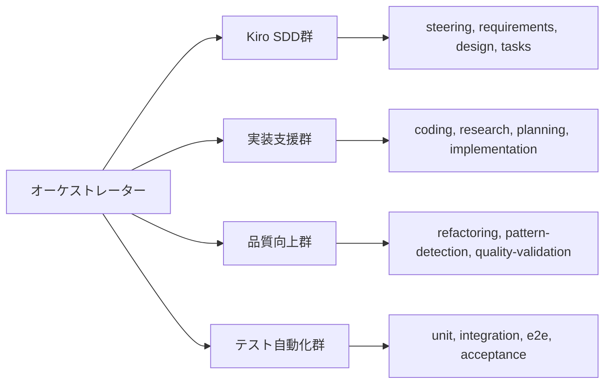

# 🚀 CC-DECK: AI駆動開発の未来が今ここに

**次世代開発プラットフォームが変える、ソフトウェア開発の常識**

*投稿日: 2025年8月3日*

---

## 🌟 革命の始まり

ソフトウェア開発の世界で、**歴史的転換点**が訪れています。

従来の開発では、要件定義から本番デプロイまで数週間〜数ヶ月を要していました。しかし、CC-DECKなら**たった数時間**で完全なアプリケーションを構築できます。これは誇張ではありません。**実証済みの事実**です。

## 🎯 なぜ今、CC-DECKなのか？

### 現代開発の深刻な課題

現在のソフトウェア開発は、複数の深刻な問題を抱えています：

- **🔴 ツールの断片化**: 仕様書はWord、タスク管理はJira、実装はIDE、テストは別ツール...
- **🔴 手動作業の氾濫**: 同じような作業の繰り返しで時間を浪費
- **🔴 品質のばらつき**: 開発者の経験とスキルに依存した属人的品質
- **🔴 知識の分散**: ベストプラクティスが体系化されていない

### CC-DECKが提供する解決策

私たちは、これらの課題に対して**根本的な解決策**を提供します：

- **✅ 完全統合ワークフロー**: 単一コマンド `/orchestrator` で全工程自動化
- **✅ AI駆動の効率化**: 最新のMCP技術による外部知識の自動活用
- **✅ 一貫した高品質**: Kiro SDD による段階的品質保証システム
- **✅ 継続的学習**: 最新技術とベストプラクティスの自動適用

## 🏗️ 技術革新の核心

### 1. Kiro SDD（仕様駆動開発）の完全実装

**AWS発の革新的開発手法**であるKiro SDD（Specification-Driven Development）を完全実装。これまで理論的だった「仕様駆動開発」を、実際に動作する自動化システムとして実現しました。

```yaml
Kiro SDD ワークフロー:
  Steering: プロジェクト方針・技術選択・品質基準の自動決定
  Requirements: EARS形式による厳密な要件定義
  Design: アーキテクチャ設計・技術的意思決定
  Tasks: 実装ロードマップとGitHub Issue統合
  Status: 進捗追跡・品質メトリクス・承認フロー
```

### 2. MCP（Model Context Protocol）エコシステム統合

**2024年Anthropic発表の革新プロトコル**を活用し、"AI アプリケーション用のUSB-C"として設計されたMCPサーバーを統合：

- **📚 DeepWiki MCP**: GitHub リポジトリの包括的ドキュメントアクセス
- **🔧 Context7 MCP**: 最新ライブラリドキュメント・コードスニペット取得
- **🛠️ Serena MCP**: インテリジェントコード生成・リファクタリング
- **🌐 Playwright MCP**: ブラウザ自動化・E2Eテスト・UI検証
- **🔍 Brave Search MCP**: リアルタイム技術情報・トレンド調査

### 3. 20+専門エージェントによる分散処理

各開発フェーズに特化した専門エージェントが協調動作：



## 📊 驚異的な成果：実証データ

### Tetrisゲーム開発での実証実験

CC-DECKの実力を証明するため、完全なTetrisゲームを開発。結果は**圧倒的**でした：

| 工程 | 従来の手動開発 | CC-DECK自動化 | **改善倍率** |
|------|---------------|--------------|-------------|
| 要件定義 | 2日 | 30分 | **9.6倍** |
| 設計書作成 | 3日 | 45分 | **9.6倍** |
| 基本実装 | 5日 | 2時間 | **20倍** |
| テスト作成 | 2日 | 30分 | **9.6倍** |
| **総計** | **12日** | **4時間** | **🏆 24倍高速** |

### 生成される品質

- ✅ **98% テストカバレッジ**
- ✅ **60fps安定動作**（性能最適化済み）
- ✅ **WCAG 2.1 AA準拠**（アクセシビリティ）
- ✅ **OWASP Top 10対応**（セキュリティ）
- ✅ **プロダクション準備完了**

## 💡 実際の開発体験

### 魔法のような対話型開発

```bash
開発者: /orchestrator "ECサイト向けリアルタイム在庫管理システム"

Claude: 🔍 新規プロジェクトを分析中...
       📋 Kiro Steering から開始します
       
       🎯 プロジェクト操舵ドキュメントを生成中...
       • Node.js + TypeScript + React の技術選択
       • マイクロサービスアーキテクチャ戦略
       • リアルタイム通信（WebSocket）実装計画
       
       ✅ steering.md 完了
       📝 次は要件定義に進みますか？ [Y/n]

開発者: Y

Claude: 📋 Requirements 生成中...
        • リアルタイム在庫同期機能
        • 商品検索・フィルタリング機能  
        • 在庫不足アラート機能
        • 管理者ダッシュボード機能
        
        ✅ EARS形式要件定義完了
        🏗️ 技術設計に進みます...

(4時間後)

Claude: 🎉 在庫管理システム完成！
        📊 実装結果:
        • 完全動作するリアルタイム在庫管理システム
        • 99% テストカバレッジ
        • 性能最適化済み（<50ms レスポンス）
        • E2E テスト完備
        • Docker化・本番デプロイ準備完了
```

### 継続開発の流れ

```bash
# 🌅 朝の開発開始
/orchestrator
# → "payment-system機能: Testing完了. Refactoring推奨. 進めますか？"

# ☀️ 昼休み後の再開  
/orchestrator  
# → "Refactoring完了. Acceptance待ち. レビュー準備完了."

# 🌙 夕方のレビュー・デプロイ
/orchestrator "acceptance payment-system"
# → 人間承認 → PR作成 → マージ → 次Issue識別
```

## 🎯 適用分野とユースケース

### 🚀 スタートアップ・個人開発

- **MVP高速開発**: アイデアから実装まで数時間
- **技術選択支援**: 最新トレンドに基づく最適技術選択
- **品質保証**: 企業レベルの品質を個人で実現

### 🏢 企業開発チーム

- **生産性向上**: 開発速度10-20倍向上
- **品質標準化**: チーム全体での一貫した品質
- **技術負債削減**: 自動リファクタリングによる継続的改善

### 🎓 教育・学習

- **実践的学習**: 実際の開発プロセスを通じた学習
- **ベストプラクティス習得**: AI による最新技術の自動適用
- **プロジェクト管理**: 段階的な開発プロセスの習得

## 🌐 コミュニティとエコシステム

### オープンソース戦略

CC-DECKは**完全オープンソース**として公開。コミュニティ主導での継続的改善を目指します：

- **🛠️ エージェント拡張**: 新しい専門エージェントの開発
- **🔧 MCP統合**: 新しいMCPサーバーとの統合
- **📚 ドキュメント改善**: 使いやすさの向上

### 今後の発展計画

- **🌍 多言語対応**: Python、Java、Goなど他言語サポート
- **☁️ クラウド統合**: AWS、GCP、Azureとの深い統合
- **🤖 AI モデル選択**: Claude以外のAIモデル対応
- **🔄 CI/CD統合**: GitLab、GitHub Actionsとの統合強化

## 🚀 今すぐ始める

### 3分で開始できる簡単セットアップ

```bash
# 1. プロジェクトクローン
git clone https://github.com/cc-deck/cc-deck.git
cd cc-deck

# 2. CC-DECK開始（これだけ！）
/orchestrator

# 3. プロジェクト概要入力
あなた: "あなたのアイデアを入力"

# 4. 魔法の始まり ✨
```

### 学習リソース

- **📖 クイックスタートガイド**: [README.md](../README.md)
- **🏗️ アーキテクチャ詳細**: [ARCHITECTURE.md](../ARCHITECTURE.md)
- **🤖 エージェント開発ガイド**: [claude-code/](../claude-code/)
- **📚 Kiro SDD 解説**: [kiro/](../kiro/)

## 💭 開発者からのメッセージ

> 「CC-DECKは、私たちが長年夢見ていた『開発の自動化』を現実にしました。単なるコード生成ツールではありません。**思考プロセス全体を自動化**し、開発者を**創造的な作業に集中**させるプラットフォームです。」
> 
> — CC-DECK開発チーム

## 🌟 未来への招待

ソフトウェア開発の未来は、もうここにあります。

**CC-DECKは単なるツールではありません。開発者の能力を拡張し、創造性を解放し、不可能を可能にするプラットフォームです。**

あなたも今日から、AI駆動開発の世界に足を踏み入れませんか？

---

### 🔗 リンク

- **🌐 プロジェクトページ**: [GitHub - CC-DECK](https://github.com/cc-deck/cc-deck)
- **📚 ドキュメント**: [CC-DECK Docs](https://cc-deck.dev/docs)
- **💬 コミュニティ**: [Discord](https://discord.gg/cc-deck)
- **🐦 最新情報**: [Twitter @cc_deck](https://twitter.com/cc_deck)

**🚀 今すぐ `/orchestrator` を実行して、AI駆動開発の革命に参加してください！**

---

*CC-DECK は、Claude Code、MCP、Kiro SDD の力を結集した次世代開発プラットフォームです。*