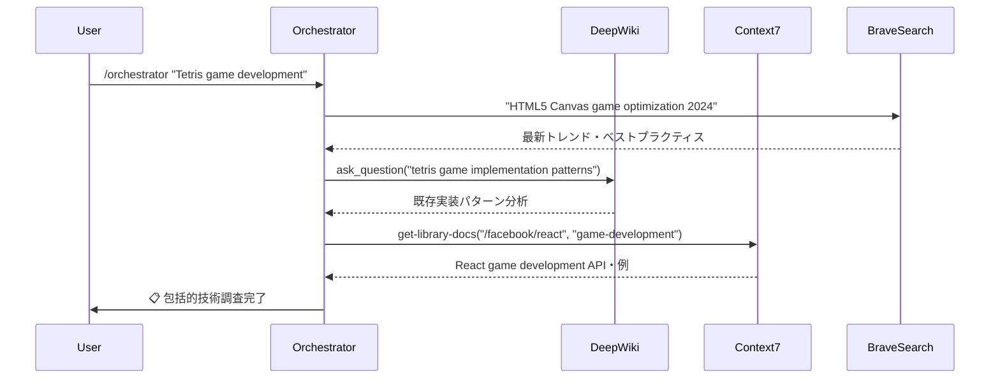
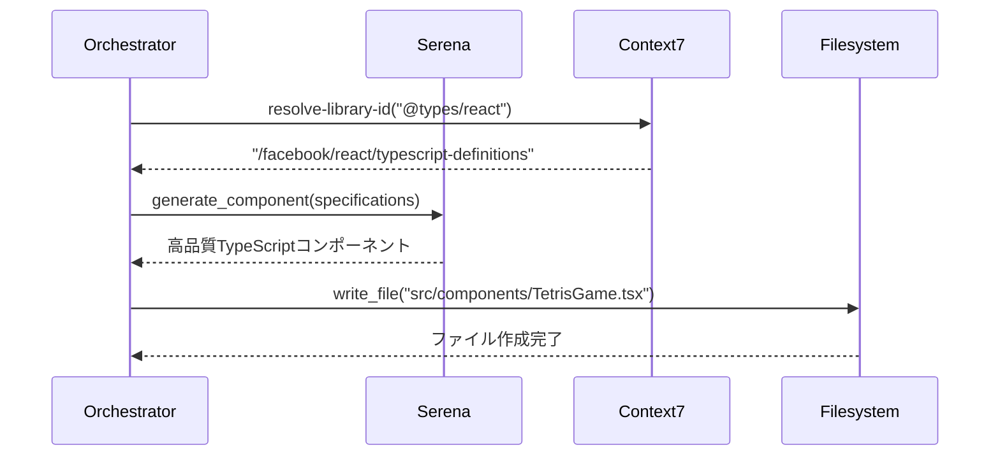
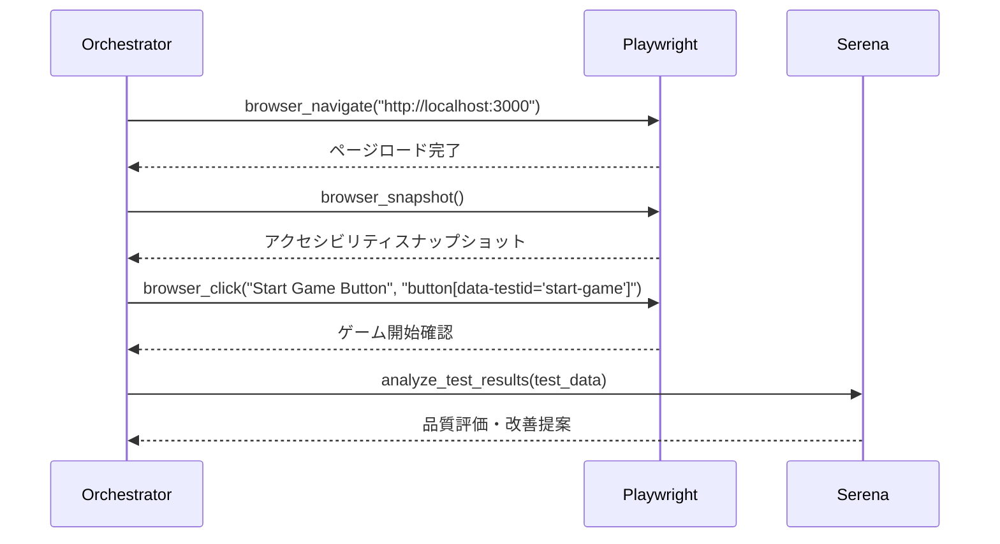

# 🔧 CC-DECK 技術深掘り: MCP統合アーキテクチャの内部構造

**Model Context Protocolがもたらす開発体験の革命**

*投稿日: 2025年8月3日 | 技術解説シリーズ #1*

---

## 🎯 はじめに

CC-DECKの革新的な開発体験は、**MCP（Model Context Protocol）**の巧妙な統合によって実現されています。本記事では、その技術的な内部構造と、なぜこれほど強力な開発プラットフォームを構築できたのかを詳しく解説します。

## 🌐 MCP（Model Context Protocol）とは

### 概要

Model Context Protocol（MCP）は、2024年11月にAnthropicが発表した**オープンプロトコル**です。"AI アプリケーション用のUSB-C"として設計され、AIアシスタントとデータシステム間の標準化された接続を可能にします。

### 解決する根本課題

従来のAI開発では、新しいデータソースや機能を追加するたびに独自の実装が必要でした：

```python
# 従来の個別実装（非効率）
class WeatherAPI:
    def get_weather(self, location): ...
    
class DatabaseConnector:
    def query_data(self, sql): ...
    
class FileSystemAccess:
    def read_file(self, path): ...

# 各々異なるインターフェース、重複するボイラープレート
```

MCPは、これを**統一インターフェース**で解決：

```json
{
  "jsonrpc": "2.0",
  "method": "tools/call",
  "params": {
    "name": "weather_get",
    "arguments": {"location": "Tokyo"}
  }
}
```

## 🏗️ CC-DECKにおけるMCP統合アーキテクチャ

### 3層統合モデル

```
┌─────────────────────────────────────────────────────────────┐
│                   🎯 オーケストレーション層                     │
│              単一コマンドによる統合制御                        │
├─────────────────────────────────────────────────────────────┤
│                   🤖 専門エージェント層                        │
│            特化機能を持つ自律エージェント群                     │  
├─────────────────────────────────────────────────────────────┤
│                   🌐 MCP統合基盤層                           │
│       外部システム・知識・ツールへの統一アクセス               │
└─────────────────────────────────────────────────────────────┘
```

### MCP統合基盤層の詳細

CC-DECKでは、以下のMCPサーバーを戦略的に統合：

#### 1. 知識・リサーチMCP群

```yaml
DeepWiki MCP:
  役割: GitHubリポジトリの包括的分析
  API例:
    - read_wiki_structure(repoName)
    - read_wiki_contents(repoName) 
    - ask_question(repoName, question)
  
  活用例:
    - 既存プロジェクトパターンの調査
    - ベストプラクティスの自動取得
    - 技術選択の根拠収集

Context7 MCP:
  役割: ライブラリドキュメント・最新API情報
  API例:
    - resolve-library-id(libraryName)
    - get-library-docs(context7CompatibleLibraryID, topic, tokens)
  
  活用例:
    - 最新ライブラリAPI仕様の取得
    - コードスニペット・実装例の収集
    - 技術選択時の詳細情報提供

Brave Search MCP:
  役割: リアルタイムWeb検索・技術トレンド調査
  API例:
    - brave_web_search(query, count, offset)
    - brave_local_search(query, count)
  
  活用例:
    - 最新技術トレンドの調査
    - 問題解決方法の検索
    - 競合分析・市場調査
```

#### 2. 開発・テストMCP群

```yaml
Playwright MCP:
  役割: ブラウザ自動化・E2Eテスト・UI検証
  主要API:
    - browser_navigate(url)
    - browser_click(element, ref, doubleClick?, button?)
    - browser_type(element, ref, text, submit?, slowly?)
    - browser_snapshot()
    - browser_take_screenshot(raw?, filename?, element?, ref?, fullPage?)
  
  設定例:
    {
      "browser": {
        "browserName": "chromium",
        "isolated": true,
        "launchOptions": { "headless": true }
      },
      "capabilities": ["tabs", "install", "pdf", "vision"],
      "network": {
        "allowedOrigins": ["https://localhost:*"],
        "blockedOrigins": ["*"]
      }
    }

Serena MCP:
  役割: インテリジェントコード生成・セマンティック解析
  機能:
    - 高品質TypeScript/JavaScript生成
    - セマンティック解析による重複検出
    - パターンベースリファクタリング
    - コード品質改善提案
```

#### 3. ファイルシステム・インフラMCP群

```yaml
Filesystem MCP:
  役割: セキュアなファイル操作
  セキュリティ設定:
    - ガード機能による制限付きアクセス
    - 読み取り専用・書き込み制限
    - パス制限・危険操作ブロック
  
  使用例:
    mcp guard --allow tools:read_* --deny tools:write_*,delete_* \
              npx -y @modelcontextprotocol/server-filesystem ~

SSH MCP:
  役割: リモートサーバーアクセス・デプロイ自動化
  機能:
    - 本番環境への安全なデプロイ
    - CI/CD パイプライン統合
    - サーバー監視・ログ取得
```

## 🔄 実際の統合フロー

### ケーススタディ: Tetrisゲーム開発での統合例

#### Phase 1: リサーチ・分析フェーズ



#### Phase 2: 実装フェーズ



#### Phase 3: テスト・検証フェーズ



## ⚙️ 設定とセキュリティ

### MCP サーバー設定例

```json
{
  "mcpServers": {
    "playwright": {
      "command": "npx",
      "args": ["@playwright/mcp@latest"],
      "env": {
        "PLAYWRIGHT_BROWSERS_PATH": "/opt/playwright"
      }
    },
    "filesystem": {
      "command": "mcp",
      "args": [
        "guard",
        "--allow", "tools:read_*,tools:write_src/*,tools:write_tests/*",
        "--deny", "tools:delete_*,tools:system_*",
        "npx", "-y", "@modelcontextprotocol/server-filesystem", "~"
      ]
    },
    "context7": {
      "command": "npx",
      "args": ["@context7/mcp-server@latest"],
      "env": {
        "CONTEXT7_API_KEY": "${CONTEXT7_API_KEY}"
      }
    }
  }
}
```

### セキュリティベストプラクティス

#### 1. 最小権限の原則

```json
{
  "security_policies": {
    "filesystem": {
      "allowed_paths": ["src/*", "tests/*", "docs/*"],
      "blocked_paths": ["/.env", "/node_modules", "/.git"],
      "allowed_operations": ["read", "write"],
      "blocked_operations": ["delete", "execute"]
    },
    "network": {
      "allowed_origins": ["https://localhost:*", "https://api.github.com"],
      "blocked_origins": ["*"]
    }
  }
}
```

#### 2. ガード機能の活用

```bash
# 読み取り専用アクセス
mcp guard --allow tools:read_* --deny tools:write_*,delete_* \
          npx -y @modelcontextprotocol/server-filesystem ~

# 制限付き書き込みアクセス  
mcp guard --allow tools:read_*,tools:write_src/*,tools:write_tests/* \
          --deny tools:delete_*,tools:system_* \
          npx -y @modelcontextprotocol/server-filesystem ~
```

## 📊 パフォーマンス最適化

### キャッシュ戦略

```yaml
MCP Response Caching:
  Context7: 
    - ライブラリドキュメント: 24時間キャッシュ
    - API仕様: 1時間キャッシュ
  
  DeepWiki:
    - リポジトリ構造: 12時間キャッシュ
    - 質問応答: 6時間キャッシュ
  
  Brave Search:
    - 検索結果: 15分キャッシュ（WebFetch互換）
    - トレンド情報: 1時間キャッシュ
```

### 並列処理最適化

```typescript
// 複数MCPサーバーの並列クエリ
const parallelQuery = async (specifications: ProjectSpec) => {
  const [
    trendAnalysis,
    libraryDocs,
    existingPatterns
  ] = await Promise.all([
    braveSearch.search(`${specifications.tech} best practices 2024`),
    context7.getLibraryDocs(specifications.libraries),
    deepwiki.analyzePatterns(specifications.domain)
  ]);
  
  return synthesizeResults(trendAnalysis, libraryDocs, existingPatterns);
};
```

## 🔮 Future Roadmap

### 計画中のMCP統合

```yaml
近期(2025 Q1):
  - Database MCP: PostgreSQL、MongoDB直接アクセス
  - Docker MCP: コンテナ管理・デプロイ自動化
  - AWS MCP: クラウドリソース管理

中期(2025 Q2-Q3):  
  - Kubernetes MCP: オーケストレーション管理
  - Monitoring MCP: Datadog、New Relic統合
  - Security MCP: 脆弱性スキャン・セキュリティ監査

長期(2025 Q4+):
  - Custom MCP: プロジェクト固有のMCPサーバー
  - Multi-Cloud MCP: GCP、Azure統合
  - AI Model MCP: 複数AIモデルの統合活用
```

### カスタムMCP開発サポート

```typescript
// CC-DECK カスタムMCPテンプレート
interface CustomMCPServer {
  name: string;
  capabilities: string[];
  tools: MCPTool[];
  resources: MCPResource[];
}

const createCustomMCP = (config: CustomMCPConfig): CustomMCPServer => {
  return {
    name: config.name,
    capabilities: ["tools", "resources"],
    tools: generateTools(config.toolSpecs),
    resources: generateResources(config.resourceSpecs)
  };
};
```

## 💡 まとめ

CC-DECKのMCP統合は、単なる技術的統合を超えて、**開発体験そのものを再定義**します：

1. **統一インターフェース**: 複雑な外部システムへの簡潔なアクセス
2. **自動知識統合**: 最新情報・ベストプラクティスの自動活用
3. **セキュアな実行環境**: 制限付きアクセスによる安全な自動化
4. **高度な並列処理**: 複数情報源からの効率的データ収集

これらの技術的革新により、開発者は**創造的な作業に集中**し、**ルーチンワークを完全に自動化**できるようになります。

---

### 🔗 次回予告

次回の技術解説では、「**Kiro SDD実装の内部構造: EARS形式要件定義から自動実装まで**」をお届けします。

---

### 📚 参考資料

- [Model Context Protocol Specification](https://spec.modelcontextprotocol.io/)
- [Anthropic MCP Documentation](https://docs.anthropic.com/en/docs/build-with-claude/mcp)
- [CC-DECK Architecture Documentation](../ARCHITECTURE.md)

---

*本記事は、実際の開発体験とコードレビューに基づいて執筆されています。ご質問・フィードバックは [GitHub Issues](https://github.com/cc-deck/cc-deck/issues) まで。*