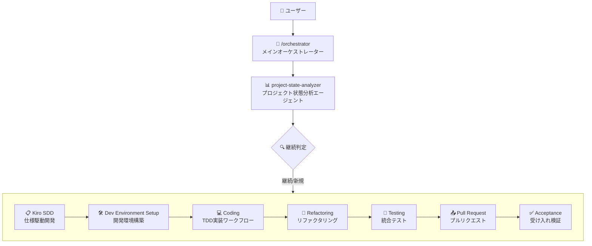
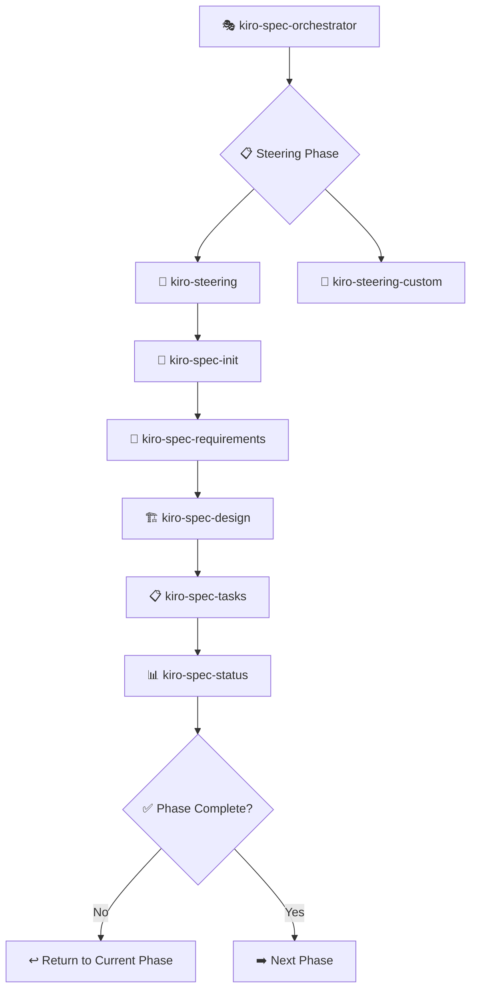
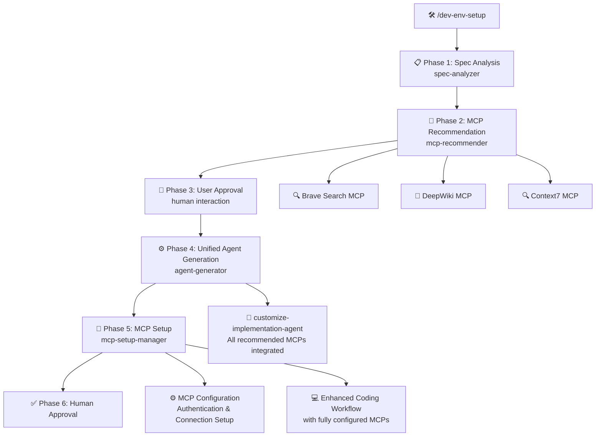
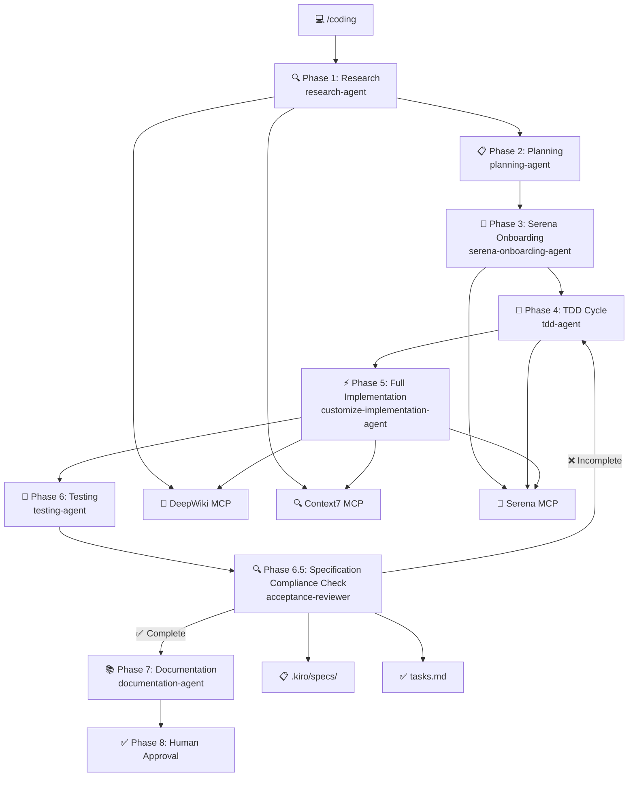
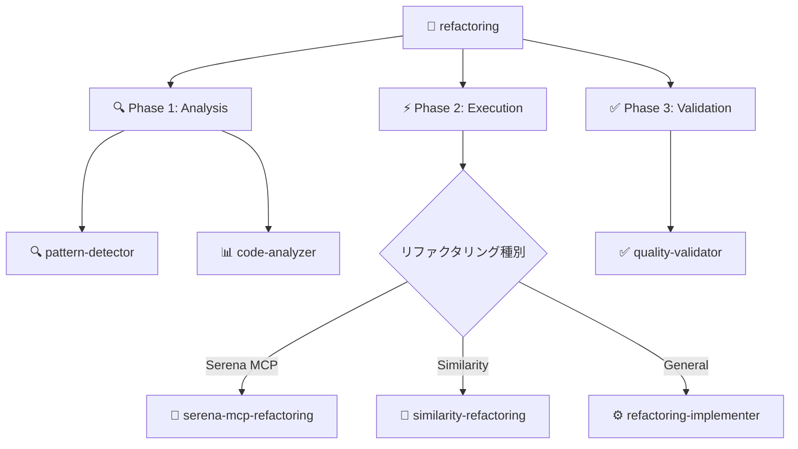
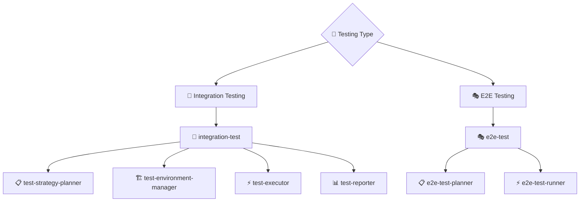
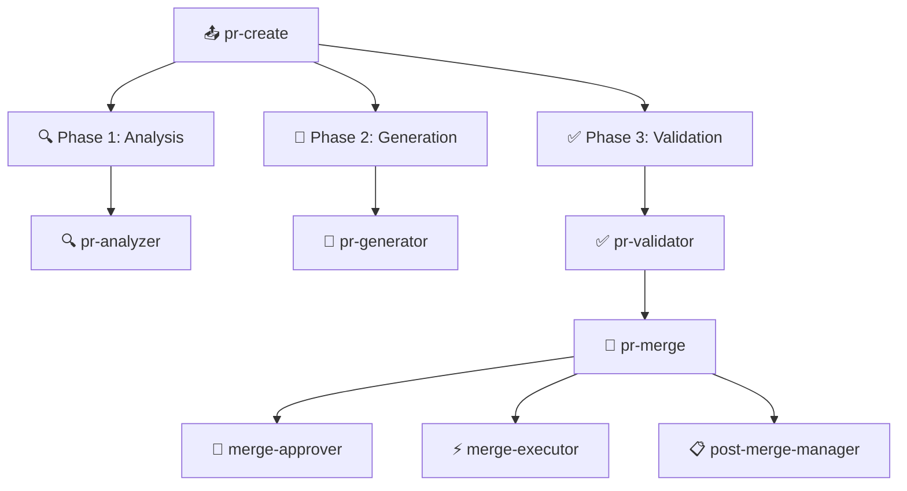
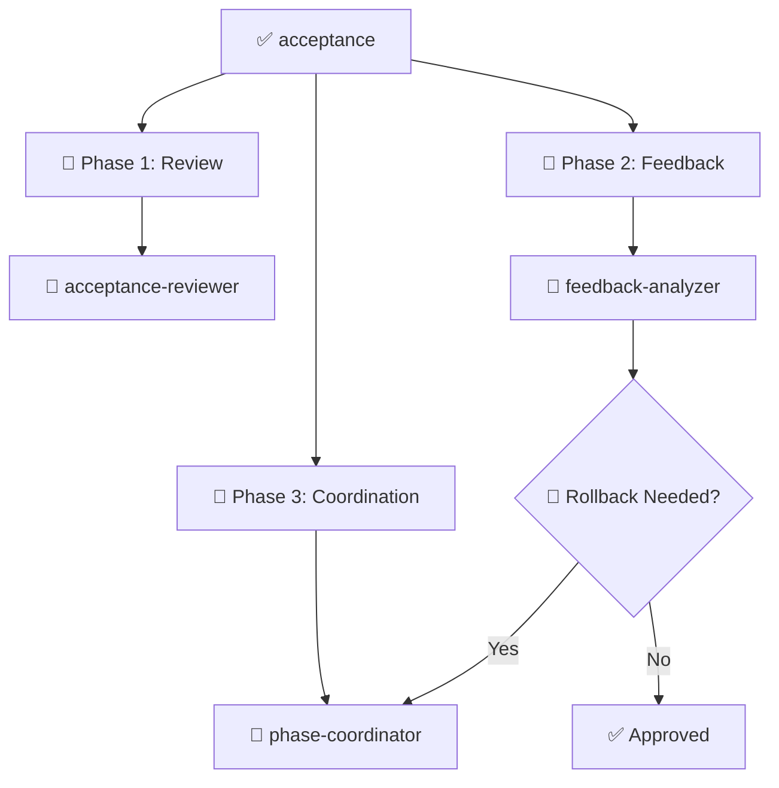
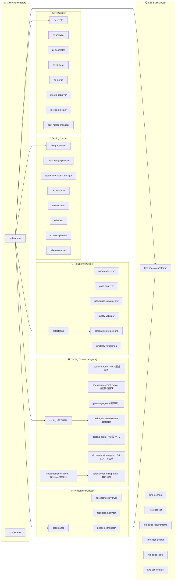
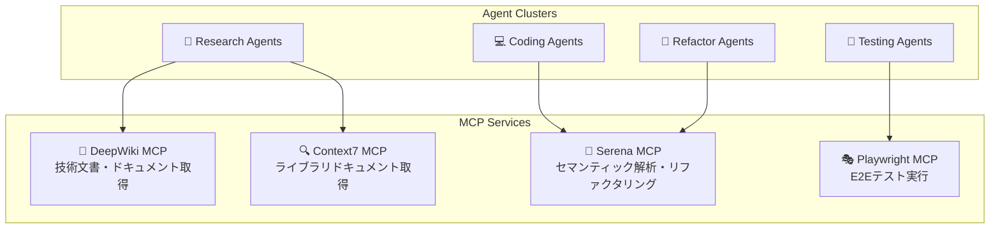

# CC-Deck Workflow Engine アーキテクチャ

## 概要

CC-Deck (Claude Code Deck) は、Claude Code を活用した **CC-Deck Workflow Engine** による革新的なAI駆動開発プラットフォームです。37個の専門サブエージェントが7つのYAMLワークフローで協調動作し、TDD統一による高品質開発、人間承認必須による品質保証、Kiro SDD仕様駆動開発の完全自動化を実現します。

## CC-Deck Workflow Engine の革新的特徴

### 🎯 コアアーキテクチャ原理

- **TDD統一ポリシー**: 全開発がTest-Driven Developmentで統一、95%+テストカバレッジ保証
- **人間承認必須**: 全変更に人間ステークホルダー承認が必須の厳格品質管理
- **Workflow Composition Pattern**: YAML定義による宣言的ワークフロー管理と動的実行
- **Smart Context Propagation**: エージェント間コンテキスト共有とクロスフェーズ状態継承
- **カスタムスラッシュコマンド**: 7つの専用コマンドによる直接ワークフロー実行
- **Task-Driven Execution**: `.kiro/specs/*/tasks.md`ファイルとの完全統合とリアルタイム同期
- **MCP統合エコシステム**: DeepWiki、Context7、Serena、Playwright MCP連携

### メインオーケストレーター連携フロー



## CC-Deck Workflow Engine: 7つのメインワークフロー

### 1. 📋 Kiro SDD Workflow (`/kiro-sdd`)

**仕様駆動開発の完全自動化ワークフロー**



### 2. 🛠️ Development Environment Setup Workflow (`/dev-env-setup`)

**統合MCP実装エージェント構築ワークフロー** - Kiro SDD仕様を基にプロジェクトに最適なMCPツールを選定し、セットアップを実行後、すべてを統合した単一の`customize-implementation-agent`を生成する6段階プロセス。



#### 🏁 DEV-ENV-SETUP完了判定基準

**重要**: DEV-ENV-SETUPワークフローの完了は、以下の成果物が`.cc-deck/runtime/projects/{project_id}/`に作成されることで判定される:

1. **統合MCP実装エージェント** 📄 `agents/customize-implementation-agent.md`
   - 推奨されたすべてのMCPツールを統合した単一エージェント
   - プロジェクト固有の最適化と問題解決機能を包含
   - implementation-agentの代替として機能

2. **MCPセットアップ完了証明** 📄 `config/mcp-setup-complete.json`
   - 推奨MCPツールの認証・接続設定完了状況
   - セットアップエラー情報とフォールバック戦略
   - 実行時MCP利用可能性の検証結果

**✅ 完了検証**: project-state-analyzerは上記2つのアーティファクト存在を確認してDEV-ENV-SETUP完了を判定し、次のCODINGワークフローを推奨する。

**🎯 シンプル化効果**: 複数エージェント管理・ワークフロー拡張・マージプロセスが不要となり、MCPセットアップも含めた包括的な開発環境構築を実現。

### 3. 💻 Coding Workflow (`/coding`) 

**TDD統一による高品質開発ワークフロー** - 全実装がTest-Driven Developmentで統一され、95%+テストカバレッジを保証する8段階プロセス。Phase 5では`customize-implementation-agent`を使用して、推奨MCPツールを統合した効率的な実装を実現。

#### 🚀 統合MCP実装エージェント

**customize-implementation-agent統合戦略** - dev-env-setupで推奨された全MCPツールを単一エージェントに統合：

- **統合MCP機能**: Context7、DeepWiki、Brave Search、Playwright等すべてを一元化
- **プロジェクト特化最適化**: 推奨MCPツールによる効率的な問題解決
- **シンプルな実装フロー**: 複数エージェント管理不要の統一実装プロセス
- **実装品質向上**: MCPツール活用による高品質なコード生成

**Phase 5統合実装**: `customize-implementation-agent`が`implementation-agent`を置き換え、推奨MCPツールを活用した実装を実行



#### 🚀 8段階ワークフロー詳細（仕様適合チェック含む）

**Phase 1: Research** (research-agent)
- MCP統合による技術調査（DeepWiki, Context7, WebSearch）
- 最新技術とベストプラクティスの収集
- セキュリティ考慮事項の調査

**Phase 2: Strategic Planning** (planning-agent)
- アーキテクチャ設計と実装戦略
- 技術スタック決定
- 実装ロードマップ作成

**Phase 3: Serena Onboarding** (serena-onboarding-agent)
- Serena MCPによるTDD環境構築
- AAA・Given-When-Thenパターン設定
- テストファースト開発環境の初期化

**Phase 4: TDD Cycle** (tdd-agent)
- **Red**: 失敗テスト作成（仕様駆動設計）
- **Green**: 最小限実装でテスト通過
- **Refactor**: 品質向上と設計洗練
- t-wada方法論による厳格なTDD実行

**Phase 5: Full Implementation** (implementation-agent)
- TDD基盤上での完全実装展開（Serena + Context7 + DeepWiki MCP統合）
- エッジケース・エラー処理の実装
- パフォーマンス最適化とプロダクション対応

**Phase 6: Testing** (testing-agent)
- 統合テスト・E2Eテストの追加
- テストカバレッジ95%+の達成確認

**Phase 6.5: Specification Compliance Check** (acceptance-reviewer)
- 仕様書(.kiro/specs/)と実装内容の適合性検証
- tasks.mdのタスク完了状況確認
- 実装漏れ・仕様乖離の検出
- **判定結果**: ✅完了→Phase 7へ / ❌不完全→Phase 4へ戻る

**Phase 7: Documentation** (documentation-agent)
- API仕様書・使用例・チュートリアル生成
- 包括的ドキュメント作成

#### 🏆 TDD統一による品質保証

- **100%テスト駆動**: 全実装がテストファーストで作成
- **95%+カバレッジ**: Line 95%+, Branch 90%+, Function 95%+
- **継続的品質**: テストによる設計安全性確保
- **実行可能仕様**: テストが生きたドキュメントとして機能

### 4. 🔧 Refactoring Workflow (`/refactoring`)

**セマンティック解析による高度リファクタリングワークフロー**



### 5. 🧪 Testing Workflow (`/testing`)

**統合テスト・E2Eテスト自動化ワークフロー**



### 6. 📤 PR Workflow (`/pr`)

**プルリクエストライフサイクル完全管理ワークフロー**



### 7. ✅ Acceptance Workflow (`/acceptance`)

**人間承認・フィードバック処理ワークフロー**



## 🤖 37エージェント・マルチクラスター・アーキテクチャ

### エージェント統合連携マトリックス



## CC-Deck Workflow Engine 実装詳細

### 🏗️ Workflow Composition Pattern の実装

**YAML定義ワークフローによる宣言的エージェント連携システム**：

```yaml
# .cc-deck/config/workflows/coding.yaml の構造例
workflow_name: "coding"
description: "TDD統一による包括的開発ワークフロー"
phases:
  - name: research
    agent: research-agent
    description: "技術調査・MCP統合リサーチ"
    next_phase: planning
    
  - name: planning  
    agent: planning-agent
    description: "戦略的アーキテクチャ設計"
    next_phase: serena_onboarding
    
  # TDD Trilogy の開始
  - name: serena_onboarding
    agent: serena-onboarding-agent
    description: "TDD環境構築・Serena MCP初期化"
    next_phase: tdd_cycle
    
  - name: tdd_cycle
    agent: tdd-agent
    description: "Red-Green-Refactorサイクル実行"
    next_phase: full_implementation
    
  - name: full_implementation
    agent: implementation-agent  
    description: "TDD基盤上での完全実装"
    next_phase: testing
```

### 🧠 Smart Context Propagation システム

**クロスエージェント状態共有とコンテキスト継承メカニズム**

#### A. 統合状態管理 (.cc-deck/runtime/global/context/)

- **SmartContext**: 全エージェント共通参照可能な実行状態ストア
- **ContextChain**: フェーズ間でのコンテキスト自動継承とバージョン管理
- **StateCheckpoint**: 実行中断・再開対応のチェックポイントシステム
- **ConflictResolution**: 同期実行時の状態競合回避機構

#### B. Task-Driven Execution 統合

- **TasksSync**: `.kiro/specs/*/tasks.md`ファイルとのリアルタイム双方向同期
- **ProgressTracking**: チェックボックス自動更新と完了状態判定
- **AutoContinuation**: 中断タスクの自動検出と継続実行
- **QualityGate**: タスク完了時の品質チェックと承認フロー連携

#### C. Human Approval Integration

- **MandatoryApproval**: 全変更に対する人間ステークホルダー承認の強制
- **ApprovalMaterial**: AIによる包括的承認材料自動生成
- **FeedbackLoop**: 承認拒否時の自動フィードバック分析とフェーズ巻き戻し
- **DecisionTraceability**: 全承認判断の完全トレーサビリティ確保

#### D. MCP統合エコシステム

- **DeepWiki MCP**: GitHub技術文書・README・Wiki自動分析
- **Context7 MCP**: 最新ライブラリドキュメント・API仕様自動取得
- **Serena MCP**: セマンティックコード解析・高度リファクタリング実行
- **Playwright MCP**: E2Eテスト自動生成・ブラウザ自動化実行

### 🔗 MCP統合による外部サービス連携詳細



## 📊 システム構成統計

### CC-Deck Workflow Engine 完全構成

- **総エージェント数**: 37個の高度専門化サブエージェント
- **メインワークフロー**: 7つのYAML定義宣言的ワークフロー (.cc-deck/config/workflows/)
- **カスタムコマンド**: 8つの専用スラッシュコマンド (/.claude/commands/)
- **TDD統一ポリシー**: 全開発フローがTest-Driven Development必須
- **人間承認必須**: 全変更に人間ステークホルダー承認強制 (品質保証)
- **MCP統合**: 4つのMCPサーバー統合 (DeepWiki, Context7, Serena, Playwright)

### 🎯 ワークフロー実行統計

- **直接実行コマンド**: `/kiro-sdd`, `/coding`, `/refactoring`, `/testing`, `/pr`, `/acceptance`, `/orchestrator`, `/sync-status`
- **インテリジェント統合**: `/orchestrator` による状態検出・自動ワークフロー選択
- **Smart Context**: `.cc-deck/runtime/global/context/` クロスエージェント状態継承システム
- **Task連携**: `.kiro/specs/*/tasks.md` リアルタイム双方向同期
- **品質保証**: 全フェーズでの人間承認・フィードバック統合

### 🛠️ クラスター別詳細

#### 📋 Kiro SDD Cluster (7 agents)

仕様駆動開発の完全自動化

- **Core Agents**: 7 個 (仕様作成プロセス)

#### 💻 Coding Cluster (8 agents)

**TDD統一8段階ワークフローによる高品質開発（仕様適合チェック含む）**

- **コア実装エージェント**: TDD統一プロセスの主要エージェント
  - serena-onboarding-agent (Phase 3: TDD環境・Serena MCP初期化)
  - tdd-agent (Phase 4: t-wada方法論・Red-Green-Refactor厳格実行)
  - implementation-agent (Phase 5: TDD基盤完成・本格実装)
- **支援エージェント**: ワークフロー支援の専門エージェント
  - research-agent (Phase 1: MCP技術調査)
  - deepwiki-research-solver (技術問題解決・DeepWiki特化)
  - planning-agent (Phase 2: 戦略的アーキテクチャ)
  - testing-agent (Phase 6: 統合・E2Eテスト)
  - documentation-agent (Phase 7: API・仕様ドキュメント)

#### 🔧 Refactoring Cluster (6 agents)

**セマンティック解析・パターン検出による高度リファクタリング**

- **解析エンジン**: 2つの分析特化エージェント
  - pattern-detector (重複・類似パターン検出)
  - code-analyzer (構造・依存関係・品質分析)
- **実行エンジン**: 3つの変換特化エージェント  
  - serena-mcp-refactoring (Serena MCP高度セマンティック変換)
  - similarity-refactoring ([mizchi/similarity](https://github.com/mizchi/similarity) ベース重複統合)
  - refactoring-implementer (汎用品質改善・構造最適化)
- **品質保証**: quality-validator (変換結果検証・機能保持確認)

#### 🧪 Testing Cluster (6 agents)

統合・E2E テスト自動化

- **Integration**: 4 個 (統合テスト完全自動化)
- **E2E**: 2 個 (エンドツーエンドテスト)

#### 📤 PR Cluster (6 agents)

プルリクエスト自動化

- **Creation**: 3 個 (pr-analyzer, pr-generator, pr-validator)
- **Merge**: 3 個 (merge-approver, merge-executor, post-merge-manager)

#### ✅ Acceptance Cluster (3 agents)

人間承認・フィードバックワークフロー

- **Sub-processes**: 3 個 (acceptance-reviewer, feedback-analyzer, phase-coordinator)

#### 🛠️ Utility Cluster (2 agents)

システム支援ユーティリティ

- **date-utility**: 日付・時間情報提供エージェント
- **project-state-analyzer**: CC-Deck Workflow Engine状態検出・継続戦略エージェント
  - **DEV-ENV-SETUP完了検出**: 生成された成果物確認
    - `.claude/agents/coding/dynamic/{project_id}-enhanced-implementation-agent.md` （動的生成エージェント）
    - `.cc-deck/runtime/projects/{project_id}/extensions/coding-extension.yaml` （ワークフロー拡張設定）
    - `.cc-deck/runtime/projects/{project_id}/workflows/generated/coding-merged.yaml` （統合済みワークフロー）
  - **インテリジェント継続推奨**: 完了検出に基づく次ワークフロー自動推奨
  - **Dynamic Agent Resolution**: enhanced-implementation-agent可用性検出とimpersonator-agent連携

### 🎯 Main Orchestration System

**Note**: orchestratorとsync-statusはカスタムコマンドとして実装されており、個別のサブエージェントファイルは存在しない

- **orchestrator**: インテリジェント統合管理・状態検出・ワークフロー自動選択
- **sync-status**: Kiro SDD状態整合性・タスク進捗・実装同期管理

## 🔄 CC-Deck データフロー

```
ユーザー入力
    ↓
[/orchestrator OR Custom Commands]
    ↓
CC-Deck Workflow Engine (YAML実行)
    ↓
Smart Context (状態管理・エージェント連携)
    ↓
Multi-Agent Execution (37 agents)
    ↓
Tasks.md Sync (リアルタイム進捗)
    ↓
Human Approval (必須承認)
    ↓
Feedback Loop (承認拒否時巻き戻し)
```

## 🔒 人間承認必須・品質保証システム

### 品質保証フェーズ構造

1. **Steering Phase** (プロジェクト方針・必須承認)
2. **Requirements Phase** (EARS形式要件・承認必須)
3. **Design Phase** (技術設計・アーキテクチャ承認必須)
4. **Tasks Phase** (実装計画・タスク承認必須)
5. **Implementation Phase** (TDD統一実装・継続承認)
6. **Testing Phase** (品質検証・承認必須)
7. **Acceptance Phase** (最終承認・リリース判定)

### 🔒 人間承認必須システム

- **Zero Auto-Approval**: AI自動承認完全禁止・全判断人間実行
- **AI-Prepared Materials**: AI包括的承認材料準備・人間最終判断
- **Decision Traceability**: 全承認判断完全記録・監査追跡可能
- **Feedback Integration**: 承認拒否時自動フィードバック分析・フェーズ巻き戻し
- **Quality Gate Enforcement**: 各フェーズ品質基準未満時進行停止

## 🏆 CC-Deck Workflow Engine 技術的優位性

### 🎯 高度専門化アーキテクチャ

- **Domain Expertise**: 37エージェントが各々高度専門領域を担当
- **Quality Specialization**: TDD・リファクタリング・テスト・承認各領域の深い専門性
- **MCP Integration**: 外部知識ソース統合による最新技術・ドキュメント連携
- **Reusable Components**: エージェント・ワークフローの高い再利用性

### 🔄 システム一貫性保証

- **CLAUDE.md Context**: 全エージェント統一コンテキスト・プロジェクト知識共有
- **Japanese-First**: 日本語ネイティブ開発者向け最適化応答生成
- **Smart Context Continuity**: フェーズ間コンテキスト継承・状態一貫性保証
- **Quality Consistency**: 人間承認による品質基準統一・ブレ防止

### 📈 エンタープライズグレード運用基盤

- **統一監視システム**: 全ワークフロー共通の包括的監視・メトリクス収集
- **高可用性アーキテクチャ**: チェックポイント・サーキットブレーカー・自動復旧
- **品質保証統一基準**: 5次元品質評価による一貫した品質保証
- **包括的エラーハンドリング**: 6カテゴリエラー分類・階層的復旧戦略

### 📊 運用統計・監視機能

- **リアルタイム監視**: フェーズ別パフォーマンス・品質メトリクス・MCP統合状況
- **予防的アラート**: 品質劣化・パフォーマンス異常・統合問題の早期検出
- **包括的レポート**: HTML・JSON・Markdown・CSV形式での多角的分析レポート
- **継続的改善**: データ駆動による品質標準・プロセス最適化

### 🛡️ エンタープライズセキュリティ・コンプライアンス

- **データ保護**: 転送・保存時暗号化、ロールベースアクセス制御
- **監査証跡**: 全承認判断・品質評価・エラー対応の完全追跡可能性
- **コンプライアンス**: GDPR準拠・データ保持ポリシー・規制要件対応
- **インシデント対応**: 重要度別エスカレーション・緊急時対応手順

### 📈 無限拡張可能性

- **MCP Ecosystem**: 新MCPサーバー追加による機能拡張無制限
- **Agent Extensibility**: 新専門エージェント追加・既存ワークフロー統合簡単
- **Workflow Composition**: 新YAML定義による独自ワークフロー構築可能
- **Project Customization**: `.kiro/steering/` プロジェクト固有カスタマイズ完全対応

## 🔧 統一標準アーキテクチャ

### 📋 統一標準ファイル構造

```
.cc-deck/config/
├── monitoring/
│   └── unified-monitoring-standard.yaml    # 統一監視標準
├── quality/
│   └── unified-quality-assurance-standard.yaml    # 品質保証統一基準
├── error-handling/
│   └── unified-error-recovery-standard.yaml    # エラーハンドリング統一標準
└── workflows/
    ├── coding.yaml          # エンタープライズグレード開発ワークフロー
    ├── refactoring.yaml     # 高度リファクタリングワークフロー
    ├── testing.yaml         # 包括的テストワークフロー
    ├── kiro-sdd.yaml       # 仕様駆動開発ワークフロー
    ├── pr.yaml             # プルリクエスト管理ワークフロー
    └── acceptance.yaml      # 人間承認・品質保証ワークフロー
```

### 🎛️ 統一監視システム

**全ワークフローで一貫した監視パターン実装**

- **標準メトリクス**: Phase Performance, Quality Metrics, Resource Utilization, Human Interaction, Integration Performance
- **統一アラート**: Performance Degradation, Quality Regression, Integration Issues (自動重要度判定・エスカレーション)
- **標準レポーティング**: Real-time Dashboard, Hourly Summaries, Daily Quality Reports, Weekly Trend Analysis, Monthly Executive Summaries

### 🔒 品質保証統一基準

**5次元品質評価フレームワーク**

1. **Functional Quality**: 要件適合性・機能完全性 (100%)
2. **Technical Quality**: コード品質・アーキテクチャ準拠 (8.0/10+, 95%+ Coverage)
3. **Process Quality**: ワークフロー準拠・文書化完全性 (95%+)
4. **User Experience Quality**: ユーザビリティ・アクセシビリティ (8.5/10+, WCAG 2.1 AA)
5. **Operational Quality**: 本番運用品質・監視カバレッジ (99.9%+)

### ⚡ エラーハンドリング統一標準

**6カテゴリエラー分類・対応システム**

1. **Transient Errors**: 自動リトライ・指数バックオフ
2. **Configuration Errors**: 即座に人間エスカレーション
3. **Data Errors**: データ修正・バックアップ復元・チェックポイント復帰
4. **Business Logic Errors**: プロセス修正・承認必須
5. **Integration Errors**: フォールバック・サーキットブレーカー
6. **Critical System Errors**: 即座停止・緊急エスカレーション

### 🌟 革新的統合価値

**CC-Deck Workflow Engine は、従来の単発AI支援を超越し、人間とAIの協調による持続可能で高品質な開発エコシステムを実現します。37エージェントの専門性、7つのYAMLワークフローの柔軟性、TDD統一による品質保証、人間承認による信頼性、統一標準による運用基盤が統合され、真のエンタープライズグレードAI駆動開発プラットフォームとして機能します。**

## 📈 運用統計・パフォーマンス指標

### 🎯 品質保証実績

- **Zero Compromise Policy**: 品質に一切の妥協なし・仕様準拠100%
- **TDD統一ポリシー**: 全開発フローでTest-Driven Development必須・95%+テストカバレッジ
- **Human Approval Mandatory**: 全変更で人間ステークホルダー承認強制・品質保証徹底
- **Continuous Monitoring**: リアルタイム品質監視・予防的問題検出

### 📊 システム可用性・信頼性

- **High Availability**: チェックポイント・自動復旧による高可用性設計
- **Fault Tolerance**: サーキットブレーカー・フォールバック・グレースフル劣化
- **Recovery Automation**: 平均復旧時間最小化・自動復旧率最大化
- **Scalability**: 負荷増加・複雑性拡大に対応する拡張可能アーキテクチャ