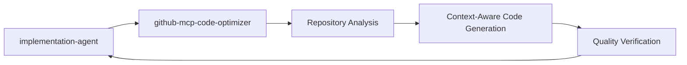
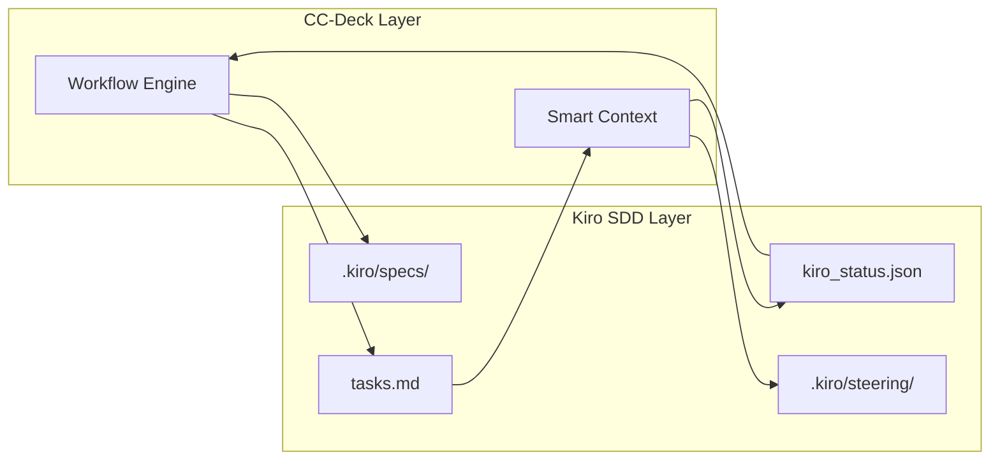

# CC-Deck Workflow Engine 設計書

## 概要

CC-Deck (Claude Code Deck) は、Claude Codeを活用したAI駆動開発プラットフォームのワークフロー制御システムです。`docs/ARCHITECTURE.md`で描かれた理想的なサブエージェント連携を実現するため、**Workflow Composition Pattern** と **Smart Context Propagation** を組み合わせた実装を提供します。

## 設計原則

### 1. 責任分離
- **CC-Deck**: 高レベルなワークフロー管理と Agent間連携制御
- **Kiro SDD**: 仕様駆動開発プロセスの維持（`.kiro/`ディレクトリ）
- **Claude Code**: 個別エージェントの実行とツール操作

### 2. 既存システムとの共存
- Kiro SDDの`tasks.md`ファイルフォーマットを維持
- `.kiro/`ディレクトリ構造に干渉しない
- 既存のサブエージェントをそのまま活用

### 3. 段階的実装
- 既存の`/orchestrator`コマンドを拡張
- 新機能は後方互換性を保ちながら追加
- テストと検証を重視した開発

## アーキテクチャ概要

```mermaid
graph TB
    User[👤 ユーザー] --> Orchestrator[🎯 /orchestrator]
    
    subgraph "CC-Deck Workflow Engine"
        Orchestrator --> WorkflowLoader[📋 Workflow Loader]
        WorkflowLoader --> SmartContext[🧠 Smart Context]
        SmartContext --> PhaseExecutor[⚡ Phase Executor]
        PhaseExecutor --> AgentSelector[🎯 Agent Selector]
    end
    
    subgraph "Workflow Definitions"
        KiroWorkflow[📝 kiro-sdd.yaml]
        DevEnvWorkflow[🛠️ dev-env-setup.yaml] %% NEW
        CodingWorkflow[💻 coding.yaml]
        RefactorWorkflow[🔧 refactoring.yaml]
        TestingWorkflow[🧪 testing.yaml]
    end
    
    subgraph "Execution Layer"
        AgentSelector --> SubAgents[👥 Sub Agents]
        PhaseExecutor --> TaskDriver[📋 Task Driver]
        TaskDriver --> KiroTasks[📁 .kiro/specs/*/tasks.md]
    end
    
    WorkflowLoader --> KiroWorkflow
    WorkflowLoader --> DevEnvWorkflow
    WorkflowLoader --> CodingWorkflow
    WorkflowLoader --> RefactorWorkflow
    WorkflowLoader --> TestingWorkflow
```

## コンポーネント詳細

### 1. Workflow Composition Pattern

#### ワークフロー定義形式
```yaml
# .cc-deck/workflows/kiro-sdd.yaml
name: kiro-sdd-workflow
description: "Kiro SDD完全自動化ワークフロー"

phases:
  - name: steering
    agent: kiro-steering
    required: true
    outputs: [steering_context]
    
  - name: requirements
    agent: kiro-spec-requirements
    inputs: [steering_context]
    approval_required: true
    
  - name: implementation
    type: task_driven  # tasks.mdベースの実行
    source: ".kiro/specs/${feature_name}/tasks.md"
    
  # 完了後のワークフローチェーン
  next_workflow: dev-env-setup  # ✨ NEW: Dev Environment Setup Flow
```

```yaml
# .cc-deck/workflows/dev-env-setup.yaml ✨ NEW
name: dev-env-setup-workflow
description: "動的MCP SubAgent生成による開発環境最適化"

context_schema:
  project_analysis:
    project_id: string
    technology_stack: object
    integration_opportunities: array
  mcp_recommendations:
    recommended_agents: array
    research_summary: object
  generated_configuration:
    extension_config: object
    merged_workflow: object

phases:
  - name: spec_analysis
    agent: spec-analyzer
    description: "仕様分析による技術スタック抽出"
    inputs: []
    outputs: [project_analysis, technology_stack]
    
  - name: mcp_recommendation  
    agent: mcp-recommender
    description: "MCP統合による最適エージェント推奨"
    inputs: [project_analysis, technology_stack]
    outputs: [recommended_mcp_agents, research_summary]
    mcp_integrations: [brave_search, deepwiki, context7]
    
  - name: user_approval
    type: human_interaction
    description: "推奨エージェントの人間承認"
    approval_scope: ["MCP agent relevance", "Resource considerations"]
    decision_options: [approved, approved_with_modifications, rejected]
    
  - name: agent_generation
    agent: agent-generator
    description: "承認されたSubAgentファイルの動的生成"
    inputs: [approved_mcp_agents, project_analysis]
    outputs: [generated_agents, agent_file_list]
    naming_convention: "{project_id}-{agent_purpose}"
    directory: ".claude/agents/coding/dynamic/{project_id}/"
    
  - name: workflow_integration
    agent: workflow-integrator
    description: "Codingワークフローとの統合設定作成"
    inputs: [generated_agents, project_analysis]
    outputs: [extension_config, merged_workflow_config]
    integration_strategy: "array_addition"
    
  # 完了後のワークフローチェーン
  next_workflow: coding  # Enhanced Coding Workflow with generated agents
```

#### 主要機能
- **階層的フェーズ管理**: 複雑なワークフローを明確な段階に分割
- **条件分岐**: 状況に応じた動的なフロー制御
- **並列実行**: 独立したタスクの同時実行サポート
- **エラーハンドリング**: 失敗時の回復戦略
- **🛠️ 動的SubAgent生成**: プロジェクト固有のMCP統合エージェント自動作成 ✨ NEW

#### Dev Environment Setup Workflow の革新的特徴 ✨ NEW

**1. 技術スタック自動検出**
- Kiro SDD仕様からNext.js、Vercel、Supabase等を自動識別
- フレームワークバージョンと互換性分析
- 最適化機会の発見

**2. Triple MCP Research Integration**
- **Brave Search**: 最新ツール・MCP統合技術調査
- **DeepWiki MCP**: 成功プロジェクトパターン分析  
- **Context7 MCP**: 公式ドキュメント検証

**3. Dynamic Agent Generation**
```bash
# 生成される動的ディレクトリ構造
.cc-deck/runtime/projects/{project_id}/
├── extensions/                    # 拡張設定
│   └── coding-extension.yaml     # Coding workflow拡張
├── generated/                     # 統合設定
│   └── coding-merged.yaml        # 最終統合workflow
└── agents/                       # 生成SubAgent
    ├── {project_id}-vercel-agent.md
    ├── {project_id}-nextjs-optimizer.md
    └── {project_id}-tailwind-helper.md
```

**4. Hybrid File Generation Strategy**
- **Extensions**: 手動/自動生成の設定オーバーライド
- **Generated**: 完全統合されたworkflow定義
- **Agents**: プロジェクト固有の最適化エージェント

**5. Graceful Degradation System**
- MCP service障害時の段階的縮退
- 部分的生成でも継続可能
- 標準workflowへのfallback保証

### 2. Smart Context Propagation

#### コンテキスト構造
```json
{
  "workflow_context": {
    "workflow_name": "kiro-sdd",
    "feature_name": "user-auth-system",
    "current_phase": "implementation",
    "completed_phases": ["steering", "init", "requirements", "design"],
    
    "phase_outputs": {
      "steering": {
        "files_created": [".kiro/steering/product.md"],
        "project_context": {...}
      },
      "requirements": {
        "requirements_doc": "requirements.md",
        "user_stories": [...]
      }
    },
    
    "tasks_progress": {
      "total_tasks": 12,
      "completed_tasks": 7,
      "current_task": "3.1",
      "task_outputs": {
        "1.1": {
          "status": "completed",
          "files_created": ["src/auth/login.ts"],
          "test_coverage": 85
        }
      }
    }
  }
}
```

#### 主要機能
- **状態の永続化**: ワークフロー進捗の保存と復元
- **コンテキスト共有**: エージェント間での情報の引き継ぎ
- **進捗追跡**: リアルタイムでのタスク完了状況管理
- **履歴管理**: デバッグと分析のための詳細ログ

### 3. Task-Driven Execution

#### tasks.md統合
```yaml
# implementation フェーズの設定
implementation:
  type: task_driven
  source: ".kiro/specs/${feature_name}/tasks.md"
  execution_strategy:
    type: sequential_with_parallel_groups
    parallel_limit: 3
    dependency_aware: true
  
  task_execution:
    agent_selection_rules:
      - pattern: "test|testing"
        agent: testing-agent
      - pattern: "refactor"
        agent: refactoring
      - default: implementation-agent
```

#### 実行フロー
1. **tasks.md解析**: チェックボックス形式のタスクを読み込み
2. **依存関係検出**: タスク間の前提条件を分析
3. **エージェント選択**: タスク内容に基づく適切なエージェントの選択
4. **進捗更新**: タスク完了時のチェックボックス更新
5. **状態同期**: Smart Contextへの結果反映

### 4. Multi-Agent Collaboration

#### Codingワークフローの支援エージェント

```yaml
# coding.yamlでの実装フェーズ設定
full_implementation:
  primary_agent: implementation-agent
  supporting_agents:
    - research-agent: "技術研究とベストプラクティス"
    - deepwiki-research-solver: "実装問題の解決とパターン分析"
    - github-mcp-code-optimizer: "GitHubリポジトリ分析と最適化されたコード生成"
    - code-quality-validator: "継続的品質監視と検証"
```

#### GitHub MCP Code Optimizer

新しく追加されたエージェントで、以下の機能を提供：

- **リポジトリ分析**: 既存コードベースの構造とパターンの深い理解
- **コンテキスト適応**: 既存アーキテクチャとの整合性を保ったコード生成
- **パターン認識**: 確立されたコーディング規約の識別と遵守
- **最適化提案**: パフォーマンス、保守性、一貫性の改善
- **品質保証**: 互換性検証とインパクトアセスメント



## 実装戦略

### Phase 1: 基盤構築
```bash
# 優先度: 高
- [x] .cc-deck ディレクトリ構造の作成
- [x] ワークフロー定義フォーマットの策定
- [x] 基本的なワークフロー定義の作成
- [ ] orchestrator.mdへの基本エンジンの実装
```

### Phase 2: コア機能実装
```bash
# 優先度: 高
- [ ] Smart Context Manager の実装
- [ ] Workflow Loader の実装
- [ ] Phase Executor の基本機能
- [ ] tasks.md パーサーの実装
```

### Phase 3: 高度な機能
```bash
# 優先度: 中
- [ ] 条件分岐の実装
- [ ] 並列実行のサポート
- [ ] エラーハンドリングと復旧機能
- [ ] 承認ワークフローの実装
```

### Phase 4: 最適化・拡張
```bash
# 優先度: 低
- [ ] パフォーマンス最適化
- [ ] 詳細ログと監視機能
- [ ] ワークフロー可視化
- [ ] 追加ワークフローの定義
```

## Kiro SDD との統合

### 相互運用設計



### 統合ポイント

1. **読み込み専用操作**
   - `.kiro/specs/*/requirements.md` → コンテキスト情報として活用
   - `.kiro/steering/*.md` → プロジェクト設定として参照

2. **更新操作**
   - `tasks.md` → チェックボックスの状態更新
   - `kiro_status.json` → フェーズ進捗の同期

3. **作成操作**
   - 新しい仕様ディレクトリの作成
   - ワークフロー完了レポートの生成

### データフロー例

```
1. User: /orchestrator "user authentication system"
2. CC-Deck: プロジェクト状態分析
3. CC-Deck: kiro-sdd-workflow 選択
4. CC-Deck: kiro-steering エージェント実行
5. Kiro: .kiro/steering/*.md 作成
6. CC-Deck: steering_context 保存
7. CC-Deck: kiro-spec-init エージェント実行
8. Kiro: .kiro/specs/user-auth-system/ 作成
9. CC-Deck: spec_metadata 保存
...
N. CC-Deck: tasks.md ベースの実装フェーズ
N+1. CC-Deck: タスクごとに適切なエージェントを選択・実行
N+2. CC-Deck: 各タスクのチェックボックスを更新
N+3. CC-Deck: 完了レポートの生成
```

## 技術仕様

### ファイル構造
```
.cc-deck/
├── workflows/              # ワークフロー定義
│   ├── kiro-sdd.yaml      # Kiro SDD統合ワークフロー
│   ├── coding.yaml        # 開発統合ワークフロー  
│   ├── refactoring.yaml   # リファクタリングワークフロー
│   └── testing.yaml       # テストワークフロー
│
├── context/               # Smart Context保存
│   ├── active/           # アクティブなワークフロー状態
│   │   ├── kiro-sdd-user-auth.json
│   │   └── coding-api-service.json
│   └── history/          # 完了したワークフローの履歴
│
├── checkpoints/          # 復旧用チェックポイント
│   ├── kiro-sdd-requirements-checkpoint.json
│   └── coding-implementation-checkpoint.json
│
├── engine/               # エンジン実装ドキュメント
│   ├── workflow-engine.md
│   ├── task-integration.md
│   └── context-management.md
│
├── DESIGN.md            # 本ドキュメント
└── README.md            # 概要とクイックスタート
```

### 設定ファイル例

#### ワークフロー定義
```yaml
# .cc-deck/workflows/example.yaml
name: example-workflow
version: "1.0.0"
description: "Example workflow definition"

context_schema:
  project_info:
    name: string
    type: string
  phase_data:
    current: string
    completed: array

phases:
  - name: analysis
    agent: analyzer-agent
    inputs: [project_info]
    outputs: [analysis_results]
    
  - name: implementation  
    type: task_driven
    source: ".kiro/specs/${feature}/tasks.md"
    
error_handling:
  retry_policy:
    max_retries: 3
    retry_delay: 5s
```

#### コンテキスト保存形式
```json
{
  "workflow_id": "kiro-sdd-user-auth-20240120",
  "workflow_name": "kiro-sdd",
  "feature_name": "user-auth-system",
  "created_at": "2024-01-20T10:00:00Z",
  "updated_at": "2024-01-20T15:30:00Z",
  
  "current_state": {
    "phase": "implementation",
    "step": "task_3.1",
    "status": "in_progress"
  },
  
  "phase_history": [
    {
      "name": "steering",
      "started_at": "2024-01-20T10:00:00Z",
      "completed_at": "2024-01-20T10:15:00Z",
      "agent": "kiro-steering",
      "outputs": {...}
    }
  ],
  
  "context_data": {
    "steering_context": {...},
    "spec_metadata": {...},
    "task_progress": {...}
  }
}
```

## 利点と期待効果

### 開発者体験の向上
- **シームレスなワークフロー**: 複雑な手順を単一コマンドで実行
- **状態の可視化**: 現在の進捗と次のステップが明確
- **エラー回復**: 失敗時の自動復旧とロールバック

### 品質の向上
- **一貫性**: 標準化されたワークフローによる品質の均一化
- **追跡可能性**: 全工程の詳細ログと監査証跡
- **自動化**: 人的ミスの削減と効率化

### 拡張性
- **新しいワークフロー**: YAML定義による簡単な追加
- **カスタマイズ**: プロジェクト固有の要件に対応
- **統合**: 外部システムとの連携サポート

## 今後の発展計画

### 短期目標 (1-2週間)
- orchestrator.mdへの基本エンジン実装
- Kiro SDD ワークフローの動作確認
- 基本的なエラーハンドリング

### 中期目標 (1-2ヶ月)
- 全ワークフローの実装完了
- 並列実行とパフォーマンス最適化
- 詳細な監視・ログ機能

### 長期目標 (3-6ヶ月)
- AI駆動のワークフロー最適化
- 外部システム統合（GitHub Actions、CI/CDパイプライン）
- ワークフロー可視化ダッシュボード

## 結論

CC-Deck Workflow Engineは、Claude Codeの力を最大限に活用しながら、既存のKiro SDDシステムと調和する設計となっています。Workflow Composition PatternとSmart Context Propagationの組み合わせにより、`docs/ARCHITECTURE.md`で描かれた理想的なエージェント連携システムを現実的に実装できます。

この設計により、開発者は複雑な開発ワークフローを意識することなく、高品質なソフトウェア開発を進めることが可能になります。