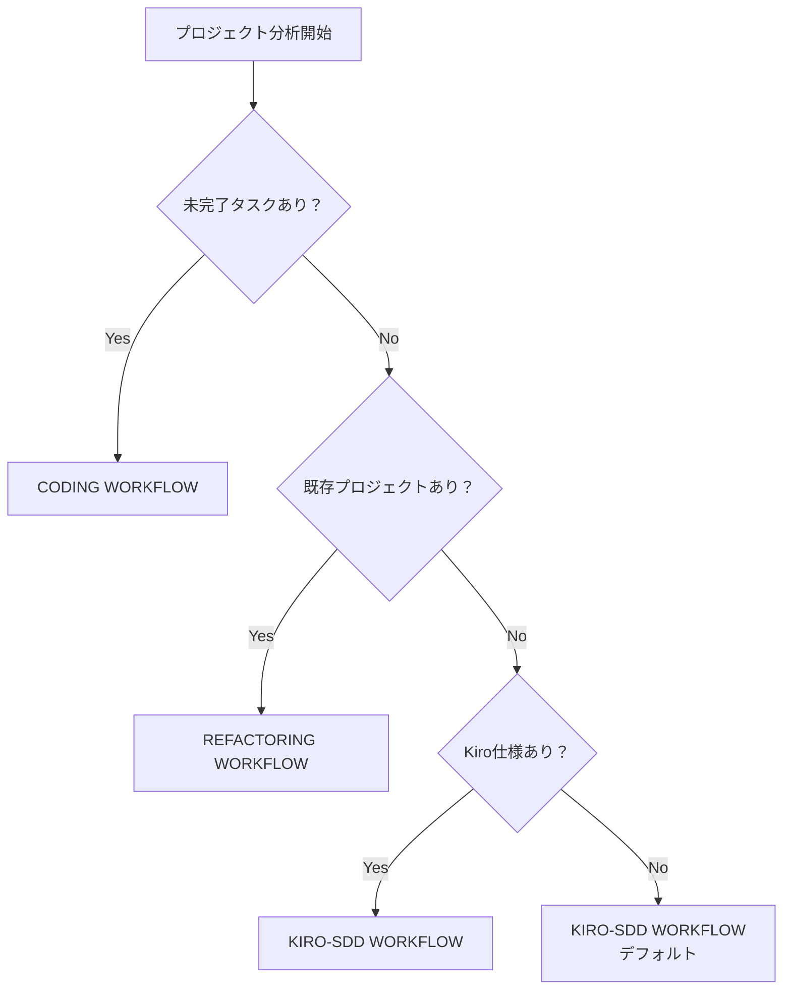

# 🤔 Interactive Workflow Guide

**CC-Deck インテリジェント ワークフロー選択システム 完全ガイド**

## 🎯 概要

CC-Deck の Interactive Workflow システムは、プロジェクトの現在状態を自動分析し、最適なワークフローを **提案・確認** してから実行する革新的な機能です。

### 🌟 従来との違い

| 従来のアプローチ | Interactive Workflow |
|----------------|---------------------|
| ❌ 手動でワークフロー選択 | ✅ AI が自動分析・推奨 |
| ❌ 選択理由が不明確 | ✅ 明確な根拠と説明付き |
| ❌ 間違った選択のリスク | ✅ 代替案も提示して安全 |
| ❌ 学習効果なし | ✅ 判断理由でスキル向上 |

## 🔍 プロジェクト分析エンジン

### 自動検出項目

Interactive Workflow システムは以下の項目を自動で分析します：

#### 📁 既存プロジェクト検出
```bash
# 検出対象ディレクトリ
projects/
├── stylish-cafe-website/     # ← 自動検出
├── todo-app/                 # ← 自動検出
└── e-commerce-site/          # ← 自動検出
```

#### 📄 プロジェクトファイル分析
```javascript
// 検出対象ファイル
[
  "package.json",        // Node.js プロジェクト
  "requirements.txt",    // Python プロジェクト  
  "Cargo.toml",         // Rust プロジェクト
  "go.mod",             // Go プロジェクト
  "pom.xml",            // Java/Maven プロジェクト
  "tailwind.config.js", // フロントエンド設定
  "next.config.js",     // Next.js 設定
  "tsconfig.json"       // TypeScript 設定
]
```

#### 📋 Kiro仕様状態
```bash
# 検出対象
.kiro/specs/
├── user-authentication/
│   ├── requirements.md    # 要件定義
│   ├── design.md         # 技術設計
│   └── tasks.md          # 実装タスク ← 完了状況をチェック
└── payment-system/
    └── tasks.md          # ← 未完了タスクを検出
```

## 🎯 ワークフロー推奨ロジック

### 推奨優先度



### 各ワークフローの推奨理由

#### 🔧 REFACTORING WORKFLOW
**推奨条件**: 既存プロジェクト検出 + 改善要求
```
理由: 既存プロジェクトが検出されました。新機能追加前に
コード品質評価とベースライン確立から始めることを推奨します。

効果:
✅ コード品質の可視化
✅ 技術的負債の特定
✅ リファクタリング機会の発見
✅ 新機能追加の土台作り
```

#### 💻 CODING WORKFLOW  
**推奨条件**: 未完了タスク検出 OR 新機能実装要求
```
理由: アクティブな実装タスクが見つかりました。
TDDワークフローで継続開発を進めることを推奨します。

効果:
✅ 中断されたタスクの継続
✅ TDD品質保証（95%+ カバレッジ）
✅ 段階的機能完成
✅ 実装→テスト→ドキュメント一貫フロー
```

#### 📋 KIRO-SDD WORKFLOW
**推奨条件**: 新規プロジェクト OR 大型機能追加
```
理由: 新規プロジェクトまたは大型機能が検出されました。
包括的な要件定義・設計から始めることを推奨します。

効果:
✅ 明確な要件定義（EARS形式）
✅ 技術設計書の作成
✅ 実装タスクの詳細化
✅ プロジェクト成功率の向上
```

#### 🧪 TESTING WORKFLOW
**推奨条件**: テスト不足 OR 品質検証要求
```
理由: 包括的なテスト戦略が必要です。
品質保証を優先することを推奨します。

効果:
✅ 統合テスト実装
✅ E2Eテスト自動化
✅ パフォーマンステスト
✅ 品質メトリクス可視化
```

## 💡 実際の使用例

### 例1: 既存プロジェクトの改善

```bash
$ /orchestrator "stylish-cafe-website のパフォーマンス改善"

📊 Project Analysis Complete

Current State:
- Existing projects detected: stylish-cafe-website
- Project files found: package.json, next.config.js, tailwind.config.js
- Kiro specs: 1 active specification
- Code quality: Assessment needed

🎯 Recommended Workflow: REFACTORING
Rationale: 既存プロジェクトが検出されました。新機能追加前に
コード品質評価とベースライン確立から始めることを推奨します。

Alternative Options:
1. CODING - 新機能をすぐに追加（品質評価をスキップ）
2. KIRO-SDD - 大型機能追加用の新仕様を作成
3. TESTING - まず包括的テストに焦点を当てる

❓ Which workflow would you like to execute?
[1] Proceed with REFACTORING (recommended)  ← ユーザーが選択
[2] Use CODING workflow
[3] Use KIRO-SDD workflow
[4] Use TESTING workflow
[5] Show detailed analysis

Please select 1-4 or type workflow name: 1

✅ Starting REFACTORING workflow...
```

### 例2: 新規機能開発

```bash
$ /orchestrator "リアルタイムチャット機能を作りたい"

📊 Project Analysis Complete

Current State:
- Existing projects detected: stylish-cafe-website
- Kiro specs: 1 active specification
- Status: Ready for new development

🎯 Recommended Workflow: KIRO-SDD
Rationale: 新規機能開発が検出されました。リアルタイム通信は
複雑な要件があるため、包括的な仕様策定から始めることを推奨します。

Alternative Options:
1. CODING - プロトタイピング重視で即座に実装開始
2. REFACTORING - 既存コード改善後に機能追加
3. TESTING - まず技術検証とパフォーマンステスト

❓ Which workflow would you like to execute?
[1] Proceed with KIRO-SDD (recommended)
[2] Use CODING workflow
[3] Use REFACTORING workflow
[4] Use TESTING workflow
[5] Show detailed analysis

Please select 1-4 or type workflow name: 1

✅ Starting KIRO-SDD workflow...
```

### 例3: 継続開発

```bash
$ /orchestrator "認証システムの実装を続ける"

📊 Project Analysis Complete

Current State:
- Existing projects detected: stylish-cafe-website
- Kiro specs: 1 active specification
- Status: Incomplete implementation tasks found
- Pending tasks: User authentication (67% complete)

🎯 Recommended Workflow: CODING
Rationale: アクティブな実装タスクが見つかりました。
TDDワークフローで継続開発を進めることを推奨します。

Alternative Options:
1. REFACTORING - 実装済み部分の品質改善から
2. TESTING - 既存実装のテスト充実化から
3. KIRO-SDD - 要件・設計の見直しから

❓ Which workflow would you like to execute?
[1] Proceed with CODING (recommended)
[2] Use REFACTORING workflow
[3] Use TESTING workflow
[4] Use KIRO-SDD workflow
[5] Show detailed analysis

Please select 1-4 or type workflow name: 1

✅ Starting CODING workflow...
📋 Loading existing tasks: User authentication (67% complete)
🔄 Continuing from Phase 4: TDD implementation...
```

## 🛠️ 高度な使用方法

### カスタム分析の表示

```bash
Please select 1-4 or type workflow name: 5

📋 Detailed Analysis:

Project Structure:
├── projects/
│   └── stylish-cafe-website/
│       ├── package.json (React 18.2.0, Next.js 13.4.0)
│       ├── src/
│       │   ├── components/ (12 files)
│       │   ├── pages/ (8 files)
│       │   └── lib/ (5 files)
│       └── tests/ (3 files, 45% coverage)

Kiro Specifications:
├── .kiro/specs/
│   └── stylish-cafe-website/
│       ├── requirements.md ✅ Complete
│       ├── design.md ✅ Complete
│       └── tasks.md 🔄 67% complete (8/12 tasks)

Code Quality Metrics:
- Technical debt: Medium (estimated 2-3 days)
- Test coverage: 45% (target: 95%+)
- Performance: Not assessed
- Security: Not assessed

Recommendation Reasoning:
1. REFACTORING: Address technical debt + low test coverage
2. CODING: Complete remaining 33% of implementation tasks
3. TESTING: Focus on coverage improvement (45% → 95%+)
4. KIRO-SDD: Re-evaluate requirements for new features

Please select workflow: coding

✅ Starting CODING workflow...
```

### ワークフロー名での直接指定

```bash
Please select 1-4 or type workflow name: refactoring

✅ Starting REFACTORING workflow...
```

```bash
Please select 1-4 or type workflow name: kiro-sdd

✅ Starting KIRO-SDD workflow...
```

## 🎓 学習効果

### ワークフロー選択スキルの向上

Interactive Workflow システムを使うことで、以下のスキルが自然に身につきます：

#### 📊 プロジェクト状況分析力
- **既存資産の評価**: コード品質・テストカバレッジ・技術的負債
- **開発段階の把握**: 要件定義・設計・実装・テストの完了状況
- **優先順位の判断**: 品質改善 vs 新機能開発の最適バランス

#### 🎯 ワークフロー選択センス
- **REFACTORING**: 品質重視・安定性優先の場面
- **CODING**: 機能実装・納期重視の場面  
- **KIRO-SDD**: 要件不明・大型開発の場面
- **TESTING**: 品質保証・信頼性重視の場面

#### 🔄 開発プロセス理解
- **フェーズ間の依存関係**: なぜその順序で進める必要があるか
- **品質と速度のトレードオフ**: どの場面で何を優先すべきか
- **継続的改善**: 既存資産を活かしながら進化させる方法

### 実践的学習例

```bash
# 初心者の場合
$ /orchestrator "TODOアプリを作りたい"
🎯 Recommended: KIRO-SDD (要件定義から)
💡 学習ポイント: 仕様駆動開発の重要性

# 中級者の場合  
$ /orchestrator "認証機能を追加したい"
🎯 Recommended: CODING (実装重視)
💡 学習ポイント: TDD実装プロセス

# 上級者の場合
$ /orchestrator "パフォーマンス問題を解決したい" 
🎯 Recommended: REFACTORING (品質改善)
💡 学習ポイント: セマンティック解析・最適化手法
```

## 🚀 最適化のヒント

### より正確な推奨を得るコツ

#### 明確な意図の表現
```bash
# Good: 具体的な目的
/orchestrator "既存のECサイトにリアルタイム通知機能を追加"

# Better: 状況も含めて説明
/orchestrator "ECサイト（Next.js）に新規でリアルタイム通知機能を追加したい。パフォーマンスも心配"
```

#### プロジェクト状態の事前整理
```bash
# プロジェクトファイルの整理
projects/
├── my-project/
│   ├── package.json     # ← 正しく配置
│   └── src/
└── legacy-code/         # ← 明確に分離
```

#### タスクファイルの最新化
```bash
# tasks.md の完了状況を正確に更新
- [x] ユーザー登録機能
- [x] ログイン機能  
- [ ] パスワードリセット   # ← 未完了を正確に
- [ ] プロフィール編集
```

### ワークフロー実行の最適化

#### 段階的アプローチ
```bash
# Step 1: 現状分析
/orchestrator "プロジェクトの現状を把握したい"
# → REFACTORING でコード品質分析

# Step 2: 品質向上  
/orchestrator "品質改善された状態で新機能追加"
# → CODING で新機能実装

# Step 3: 総合テスト
/orchestrator "全体的な品質検証"  
# → TESTING で包括的検証
```

#### 効率的な組み合わせ
```bash
# 大型プロジェクトの場合
1. KIRO-SDD → 要件・設計の確立
2. CODING → TDD実装
3. REFACTORING → 品質最適化
4. TESTING → 包括的検証
5. PR → レビュー・マージ
6. ACCEPTANCE → 最終承認
```

## 📚 技術仕様

### 分析エンジンの実装

```python
def analyze_project_state():
    """プロジェクト状態の包括的分析"""
    state = {
        'has_existing_projects': detect_existing_projects(),
        'has_kiro_specs': detect_kiro_specifications(),  
        'has_incomplete_tasks': analyze_task_completion(),
        'code_quality_issues': assess_code_quality(),
        'needs_enhancement': evaluate_enhancement_needs()
    }
    return state

def select_workflow_with_confirmation(workflow_hint, project_state, arguments):
    """インタラクティブワークフロー選択"""
    # 1. プロジェクト分析表示
    display_analysis_summary(project_state)
    
    # 2. 推奨ワークフロー算出
    recommended = calculate_recommendation(project_state)
    
    # 3. 代替案生成
    alternatives = generate_alternatives(recommended, project_state)
    
    # 4. ユーザー確認
    choice = request_user_confirmation(recommended, alternatives)
    
    return process_choice(choice)
```

### カスタマイゼーション

```yaml
# .cc-deck/config/analysis-config.yaml
analysis_preferences:
  default_workflow_bias: "quality_first"  # quality_first | speed_first | balanced
  
  recommendation_weights:
    code_quality: 0.4
    task_completion: 0.3  
    project_maturity: 0.2
    user_preference: 0.1
    
  confirmation_prompts:
    show_detailed_analysis: true
    show_alternative_rationale: true
    allow_workflow_override: true
```

## 🔧 トラブルシューティング

### よくある問題と解決策

#### 推奨が期待と違う場合
```bash
# 問題: 新機能追加なのにREFACTORING推奨
# 原因: 既存コードの品質問題が深刻

# 解決策1: 代替案選択
[2] Use CODING workflow  # ← 直接実装

# 解決策2: 段階的アプローチ  
1. REFACTORINGで品質改善
2. 次回CODINGで新機能追加
```

#### プロジェクト検出が正しくない場合
```bash
# 問題: 既存プロジェクトが検出されない
# 原因: projects/ ディレクトリ構造の問題

# 解決策: 正しい構造に修正
projects/
├── my-project/
│   ├── package.json    # ← 必須ファイル
│   └── src/
```

#### 未完了タスク検出の問題
```bash
# 問題: 完了済みタスクが未完了扱い
# 原因: tasks.md のチェックボックス形式

# 解決策: 正しいマークダウン形式
- [x] 完了済みタスク
- [ ] 未完了タスク     # ← スペース重要
```

---

## 🎯 まとめ

Interactive Workflow システムにより、CC-Deck はさらに使いやすく、学習効果の高いプラットフォームになりました。

### 核心的価値
- 🤖 **AI が分析**: プロジェクト状況の客観的評価
- 🧠 **人間が判断**: 最終的な意思決定は人間が実行
- 📚 **継続学習**: 使うたびにワークフロー選択センスが向上
- ⚡ **効率最適化**: 無駄のない開発プロセス実現

### 次のステップ
1. **基本体験**: `/orchestrator` でシステムの提案を確認
2. **カスタマイズ**: プロジェクトに合わせた設定調整
3. **チーム展開**: チーム全体でのワークフロー標準化

**Interactive Workflow で、AI駆動開発の新次元を体験してください！**