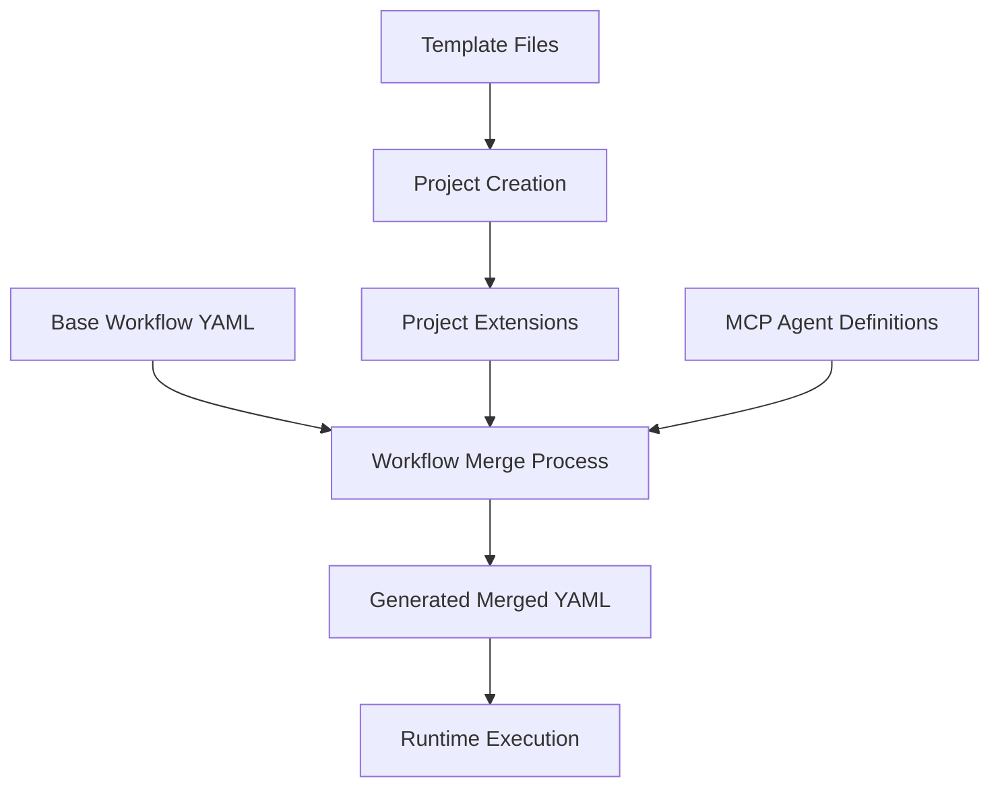

# CC-Deck Directory Organization Design

## 📊 Current State Analysis

### Problems with Current Structure

The current `.cc-deck/` directory has grown organically and now has several organizational issues:

```
Current Structure Issues:
├── config/workflows/dynamic/liquid-glass-tech-blog/ (project-specific)
├── runtime/ (mixed concerns: CLI tools + runtime data)
├── context/ (only schemas, no actual runtime data)
├── docs/ (duplicates main docs structure)
├── templates/ (mostly empty)
└── Mixed file types and responsibilities
```

### Identified Problems:

1. **Mixed Concerns**: Runtime data and source code mixed together
2. **Project-Specific Pollution**: `liquid-glass-tech-blog` hardcoded in system directories
3. **Inconsistent Data Location**: Smart Context data scattered across multiple locations
4. **Documentation Duplication**: `.cc-deck/docs/` duplicates main `docs/` structure
5. **Empty Template Structure**: Unused template directories
6. **Runtime/Source Confusion**: CLI tools mixed with runtime data directories

## 🎯 Proposed Clean Architecture

### Fundamental Design Principles

1. **Separation of Concerns**: Clear distinction between source code, configuration, and runtime data
2. **Project Agnostic**: System directories should not contain project-specific hardcoded paths
3. **Predictable Structure**: Logical hierarchy that scales with complexity
4. **Development vs Runtime**: Clear separation between development tools and runtime execution data
5. **Git-Friendly**: Source code tracked, runtime data excluded appropriately

### Proposed Directory Structure

```
.cc-deck/
├── config/                          # System Configuration (Source Code)
│   ├── workflows/                   # Workflow definitions
│   │   ├── base/                    # Base workflow YAML files
│   │   │   ├── kiro-sdd.yaml
│   │   │   ├── coding.yaml
│   │   │   ├── refactoring.yaml
│   │   │   ├── testing.yaml
│   │   │   ├── pr.yaml
│   │   │   └── acceptance.yaml
│   │   └── templates/               # Workflow templates for dynamic generation
│   │       ├── project-workflow-template.yaml
│   │       └── agent-template.md
│   ├── standards/                   # Unified system standards
│   │   ├── monitoring.yaml
│   │   ├── quality-assurance.yaml
│   │   ├── error-recovery.yaml
│   │   └── workflow-engine.yaml
│   └── schemas/                     # Data validation schemas
│       ├── workflow-schema.json
│       ├── context-schema.json
│       ├── agent-schema.json
│       └── project-schema.json
├── src/                             # Source Code Components
│   ├── runtime/                     # Runtime Management System
│   │   ├── smart-context-manager.js
│   │   ├── context-aware-agent-base.js
│   │   ├── workflow-engine.js
│   │   └── project-manager.js
│   ├── cli/                         # Command Line Tools
│   │   ├── smart-context-cli.js
│   │   ├── workflow-cli.js
│   │   └── project-cli.js
│   └── utils/                       # Utility Functions
│       ├── file-utils.js
│       ├── validation-utils.js
│       └── logger.js
└├── runtime/                         # Runtime Execution Data (Git Ignored)
    ├── projects/                    # Project-specific runtime data
    │   └── {project-id}/            # Dynamic project directories
    │       ├── context/             # Smart Context data
    │       │   ├── project-state.json
    │       │   ├── workflow-history.json
    │       │   ├── agent-memory.json
    │       │   └── user-preferences.json
    │       ├── workflows/           # Dynamic workflow configurations
    │       │   ├── active/          # Currently executing workflows
    │       │   ├── generated/       # Generated workflow configurations
    │       │   └── agents/          # Project-specific generated agents
    │       ├── checkpoints/         # Recovery checkpoints
    │       └── logs/               # Execution logs
    ├── global/                     # System-wide runtime data
    │   ├── sessions/               # CLI session data
    │   ├── cache/                  # System cache
    │   └── metrics/               # System metrics
    └── temp/                       # Temporary files

```

## 🤔 Dynamic YAML Files Strategy

### Understanding Dynamic Generation

The current system generates YAML files dynamically through the workflow process:

**Source Files (Git Tracked)**:

- `config/workflows/base/*.yaml` - Base workflow templates
- `{project}/extensions/*.yaml` - Project-specific extensions

**Generated Files (Runtime, Git Ignored)**:

- `{project}/generated/*-merged.yaml` - Merged workflow configurations
- `{project}/context/smart_context.json` - Runtime context data
- `{project}/agents/*.md` - Project-specific agent definitions

### Dynamic File Categories

1. **Template Files** (Source Code - Git Tracked)

   ```
   config/workflows/templates/
   ├── base-workflow-template.yaml
   ├── extension-template.yaml
   └── agent-template.md
   ```

2. **Extension Files** (Source Code - Git Tracked)

   ```
   runtime/projects/{project-id}/extensions/
   ├── coding-extension.yaml
   ├── testing-extension.yaml
   └── custom-extension.yaml
   ```

3. **Generated Files** (Runtime Data - Git Ignored)
   ```
   runtime/projects/{project-id}/workflows/generated/
   ├── coding-merged.yaml
   ├── testing-merged.yaml
   └── final-workflow.yaml
   ```

### Dynamic Generation Workflow



### File Lifecycle Management

| Phase        | File Type | Location                                     | Git Status | Purpose                         |
| ------------ | --------- | -------------------------------------------- | ---------- | ------------------------------- |
| Development  | Template  | `config/templates/`                          | Tracked    | Source templates                |
| Project Init | Extension | `runtime/projects/{id}/extensions/`          | Tracked    | Project-specific customizations |
| Workflow Gen | Generated | `runtime/projects/{id}/workflows/generated/` | Ignored    | Merged configurations           |
| Execution    | Active    | `runtime/projects/{id}/workflows/active/`    | Ignored    | Runtime state                   |

## 🔄 Migration Strategy

### Phase 1: Create New Structure with Dynamic File Support

1. **Create New Directories**

   - `config/workflows/base/` - Move existing YAML files
   - `config/standards/` - Consolidate unified standards
   - `config/schemas/` - Move schemas
   - `src/runtime/`, `src/cli/`, `src/utils/` - Organize source code
   - `runtime/projects/`, `runtime/global/`, `runtime/temp/` - Runtime data

2. **Preserve Existing Structure** (temporary)
   - Keep old structure until migration complete
   - Update `.gitignore` to exclude new runtime directories

### Phase 2: Migrate Content with Dynamic File Handling

```bash
# Base workflow definitions (Source Code)
config/workflows/*.yaml → config/workflows/base/

# Standards (Source Code)
config/monitoring/unified-monitoring-standard.yaml → config/standards/monitoring.yaml
config/quality/unified-quality-assurance-standard.yaml → config/standards/quality-assurance.yaml
config/error-handling/unified-error-recovery-standard.yaml → config/standards/error-recovery.yaml

# Source code components
runtime/smart-context-manager.js → src/runtime/smart-context-manager.js
runtime/context-aware-agent-base.js → src/runtime/context-aware-agent-base.js
runtime/smart-context-cli.js → src/cli/smart-context-cli.js

# Schemas (Source Code)
context/schemas/context-schema.json → config/schemas/context-schema.json

# Dynamic file migration strategy:
# ====================================

# 1. Extension Files (Source Code - KEEP and TRACK)
config/workflows/dynamic/liquid-glass-tech-blog/extensions/
→ runtime/projects/liquid-glass-tech-blog/extensions/

# 2. Generated Agent Definitions (Source Code - KEEP and TRACK)
config/workflows/dynamic/liquid-glass-tech-blog/agents/
→ runtime/projects/liquid-glass-tech-blog/agents/

# 3. Generated Workflows (Runtime Data - MOVE to IGNORED)
config/workflows/dynamic/liquid-glass-tech-blog/generated/
→ runtime/projects/liquid-glass-tech-blog/workflows/generated/

# 4. Context Data (Runtime Data - MOVE to IGNORED)
config/workflows/dynamic/liquid-glass-tech-blog/context/
→ runtime/projects/liquid-glass-tech-blog/context/
```

### Dynamic File Migration Rules

**Rule 1: Extension Files** (TRACK in Git)

```bash
# These are project-specific customizations - treat as source code
*.extension.yaml → runtime/projects/{project-id}/extensions/
# Git: TRACK these files
# Reason: Project-specific customizations are development artifacts
```

**Rule 2: Generated Agent Definitions** (TRACK in Git)

```bash
# These are generated MCP agents - treat as generated source code
{project}-*.md → runtime/projects/{project-id}/agents/
# Git: TRACK these files
# Reason: Generated agents are valuable development artifacts
```

**Rule 3: Merged Workflows** (IGNORE in Git)

```bash
# These are runtime-generated merged configurations
*-merged.yaml → runtime/projects/{project-id}/workflows/generated/
# Git: IGNORE these files
# Reason: Can be regenerated from base + extensions
```

**Rule 4: Runtime Context** (IGNORE in Git)

```bash
# These are execution state and context data
smart_context.json → runtime/projects/{project-id}/context/
# Git: IGNORE these files
# Reason: Runtime execution data, not source code
```

### Phase 3: Update References

1. **Update Source Code**

   - Update import paths in JavaScript files
   - Update CLI command paths
   - Update schema references

2. **Update Configuration**

   - Update orchestrator.md paths
   - Update agent paths
   - Update workflow YAML references

3. **Update Documentation**
   - Update all path references in documentation
   - Update setup instructions

### Phase 4: Clean Up

1. **Remove Old Structure**

   - Delete empty directories
   - Remove duplicate files
   - Clean up obsolete configurations

2. **Validate Migration**
   - Test all CLI commands
   - Verify workflow execution
   - Validate Smart Context functionality

## 📋 Benefits of New Structure

### 1. Clear Separation of Concerns

```
Source Code (Git Tracked):
├── config/     # System configuration
├── src/        # Application source code
└── docs/       # Documentation

Runtime Data (Git Ignored):
└── runtime/    # All runtime execution data
```

### 2. Project Agnostic Design

```
OLD: config/workflows/dynamic/liquid-glass-tech-blog/
NEW: runtime/projects/{any-project-id}/
```

### 3. Scalable Architecture

```
runtime/projects/
├── project-a/
├── project-b/
└── project-c/
```

### 4. Predictable File Locations

- **Source Code**: Always in `src/`
- **Configuration**: Always in `config/`
- **Runtime Data**: Always in `runtime/projects/{project-id}/`
- **Documentation**: Always in `docs/`

### 5. Git Management

```
.gitignore:
# Runtime data (excluded)
.cc-deck/runtime/

# Source code and configuration (included)
.cc-deck/config/
.cc-deck/src/
.cc-deck/docs/
```

## 🛠️ Implementation Plan

### Enhanced Migration Script with Dynamic File Handling

```bash
#!/bin/bash
# CC-Deck Directory Reorganization Script with Dynamic File Support

echo "🔄 Starting CC-Deck directory reorganization with dynamic file handling..."

# Phase 1: Create new structure
mkdir -p .cc-deck/{config/{workflows/{base,templates},standards,schemas},src/{runtime,cli,utils},runtime/{projects,global/{sessions,cache,metrics},temp},docs/{architecture,api,guides}}

# Phase 2: Move base workflows (Source Code)
echo "📁 Moving base workflows..."
mv .cc-deck/config/workflows/*.yaml .cc-deck/config/workflows/base/ 2>/dev/null || echo "No base workflows to move"

# Phase 3: Move standards (Source Code)
echo "📁 Moving standards..."
mv .cc-deck/config/monitoring/unified-monitoring-standard.yaml .cc-deck/config/standards/monitoring.yaml 2>/dev/null || echo "No monitoring standard"
mv .cc-deck/config/quality/unified-quality-assurance-standard.yaml .cc-deck/config/standards/quality-assurance.yaml 2>/dev/null || echo "No quality standard"
mv .cc-deck/config/error-handling/unified-error-recovery-standard.yaml .cc-deck/config/standards/error-recovery.yaml 2>/dev/null || echo "No error handling standard"

# Phase 4: Move source code components
echo "📁 Moving source code..."
mv .cc-deck/runtime/*.js .cc-deck/src/runtime/ 2>/dev/null || echo "No runtime JS files"
mv .cc-deck/src/runtime/smart-context-cli.js .cc-deck/src/cli/ 2>/dev/null || echo "No CLI file to move"

# Phase 5: Move schemas (Source Code)
echo "📁 Moving schemas..."
mv .cc-deck/context/schemas/* .cc-deck/config/schemas/ 2>/dev/null || echo "No schemas to move"

# Phase 6: Handle dynamic project files with proper categorization
echo "📁 Processing dynamic project files..."
for project_dir in .cc-deck/config/workflows/dynamic/*/; do
    if [ -d "$project_dir" ]; then
        project_name=$(basename "$project_dir")
        target_dir=".cc-deck/runtime/projects/$project_name"

        echo "  📂 Processing project: $project_name"
        mkdir -p "$target_dir"/{extensions,agents,workflows/generated,context,checkpoints,logs}

        # Rule 1: Extension files (Source Code - Git Tracked)
        if [ -d "$project_dir/extensions" ]; then
            echo "    ✅ Moving extensions (Git tracked)"
            mv "$project_dir/extensions" "$target_dir/"
        fi

        # Rule 2: Agent definitions (Generated Source Code - Git Tracked)
        if [ -d "$project_dir/agents" ]; then
            echo "    ✅ Moving agent definitions (Git tracked)"
            mv "$project_dir/agents" "$target_dir/"
        fi

        # Rule 3: Generated workflows (Runtime Data - Git Ignored)
        if [ -d "$project_dir/generated" ]; then
            echo "    ❌ Moving generated workflows (Git ignored)"
            mv "$project_dir/generated"/* "$target_dir/workflows/generated/" 2>/dev/null || echo "    No generated files"
        fi

        # Rule 4: Context data (Runtime Data - Git Ignored)
        if [ -d "$project_dir/context" ]; then
            echo "    ❌ Moving context data (Git ignored)"
            mv "$project_dir/context"/* "$target_dir/context/" 2>/dev/null || echo "    No context files"
        fi

        # Clean up empty source directory
        rmdir "$project_dir"/{extensions,agents,generated,context} 2>/dev/null || true
        rmdir "$project_dir" 2>/dev/null || true
    fi
done

# Phase 7: Update .gitignore
echo "📁 Updating .gitignore..."
cat >> .cc-deck/.gitignore << 'EOF'

# Dynamic File Handling - Updated Organization
# Runtime data exclusions (Generated files)
runtime/projects/*/workflows/generated/
runtime/projects/*/context/
runtime/global/
runtime/temp/

# Keep project development artifacts
!runtime/projects/*/extensions/
!runtime/projects/*/agents/

EOF

# Phase 8: Clean up empty directories
echo "🧹 Cleaning up empty directories..."
find .cc-deck -type d -empty -delete 2>/dev/null || true

echo "✅ CC-Deck directory reorganization complete!"
echo ""
echo "📊 Migration Summary:"
echo "✅ Source code: Moved to src/"
echo "✅ Configuration: Organized in config/"
echo "✅ Extensions: Tracked in runtime/projects/{id}/extensions/"
echo "✅ Agents: Tracked in runtime/projects/{id}/agents/"
echo "❌ Generated workflows: Ignored in runtime/projects/{id}/workflows/generated/"
echo "❌ Context data: Ignored in runtime/projects/{id}/context/"
echo ""
echo "⚠️  Next Steps:"
echo "1. Update import paths in source files"
echo "2. Update orchestrator.md CLI paths"
echo "3. Test Smart Context functionality"
echo "4. Verify MCP agent generation"
echo "5. Run validation tests"
```

### Post-Migration Updates Required

1. **Update orchestrator.md**:

   ```bash
   OLD: node .cc-deck/runtime/smart-context-cli.js
   NEW: node .cc-deck/src/cli/smart-context-cli.js
   ```

2. **Update JavaScript imports**:

   ```javascript
   OLD: require(".cc-deck/runtime/smart-context-manager.js");
   NEW: require(".cc-deck/src/runtime/smart-context-manager.js");
   ```

3. **Update schema paths**:

   ```javascript
   OLD: ".cc-deck/context/schemas/context-schema.json";
   NEW: ".cc-deck/config/schemas/context-schema.json";
   ```

4. **Update .gitignore with Dynamic File Handling**:

   ```
   # Runtime data exclusions (Generated files)
   .cc-deck/runtime/projects/*/workflows/generated/
   .cc-deck/runtime/projects/*/context/
   .cc-deck/runtime/global/
   .cc-deck/runtime/temp/

   # Keep project development artifacts (Extensions and Agents)
   !.cc-deck/runtime/projects/*/extensions/
   !.cc-deck/runtime/projects/*/agents/

   # Keep all source code
   !.cc-deck/config/
   !.cc-deck/src/
   !.cc-deck/docs/
   ```

### Updated Git Tracking Strategy

**Git Tracked Files** (Source Code and Development Artifacts):

```
.cc-deck/
├── config/              # ✅ System configuration
├── src/                # ✅ Source code components
├── docs/               # ✅ Documentation
└── runtime/projects/
    └── {project-id}/
        ├── extensions/  # ✅ Project customizations
        └── agents/      # ✅ Generated MCP agents
```

**Git Ignored Files** (Runtime Data):

```
.cc-deck/runtime/
├── projects/
│   └── {project-id}/
│       ├── workflows/generated/  # ❌ Generated merged YAML
│       ├── context/             # ❌ Smart Context runtime data
│       ├── checkpoints/         # ❌ Recovery checkpoints
│       └── logs/               # ❌ Execution logs
├── global/                     # ❌ System-wide runtime data
└── temp/                       # ❌ Temporary files
```

## 🎯 Success Criteria

### After migration, the system should have:

1. **Clean Separation**: Source code and runtime data clearly separated
2. **Project Agnostic**: No hardcoded project names in system directories
3. **Predictable Paths**: All components in logical, consistent locations
4. **Git Friendly**: Appropriate tracking of source vs. runtime files
5. **Scalable Structure**: Easy to add new projects and components
6. **Functional Integrity**: All existing functionality preserved

### Validation Checklist

- [ ] All CLI commands work with new paths
- [ ] Smart Context system operational
- [ ] Workflow execution functional
- [ ] Agent generation works
- [ ] Project isolation maintained
- [ ] Git tracking appropriate
- [ ] Documentation updated
- [ ] Migration script tested

This organization design provides a clean, scalable, and maintainable structure for the CC-Deck Workflow Engine while preserving all existing functionality.
