# Development Environment Setup Flow Design

## Overview

The Development Environment Setup Flow is a new workflow that bridges the gap between Kiro SDD specification completion and the Coding workflow. This flow dynamically creates project-specific MCP SubAgents to optimize the development process based on the project's technical requirements.

## Workflow Position

```mermaid
graph TD
    A[🎯 Kiro SDD Workflow] --> B[🛠️ Dev Environment Setup] --> C[💻 Coding Workflow]
    D[📋 Specifications] --> B
    B --> E[🤖 Dynamic MCP Agents]
    E --> C
```



**New Flow**: `kiro-sdd → dev-env-setup → coding`

## Core Concept

Instead of using only default MCP integrations (DeepWiki, Context7, Serena), the system will:

1. **Analyze** the project specifications
2. **Recommend** relevant MCP-based SubAgents  
3. **Generate** custom SubAgents for the specific project
4. **Integrate** them into the Coding workflow dynamically

## Implementation Status

### ✅ Phase 1: Infrastructure Complete
- ✅ **Workflow Definition**: `dev-env-setup.yaml` created with 6 phases
- ✅ **SubAgent Creation**: 4 specialized SubAgents implemented
  - `spec-analyzer`: Analyzes Kiro SDD specifications 
  - `mcp-recommender`: Researches and recommends MCP agents
  - `agent-generator`: Generates custom SubAgent files
  - `workflow-integrator`: Creates extension configs and merges workflows
- ✅ **Custom Command**: `/dev-env-setup` command documentation created
- ✅ **Workflow Chain**: `kiro-sdd.yaml` updated to chain to `dev-env-setup`

### ❌ Phase 2: Workflow Engine Missing
- ❌ **YAML Execution Engine**: No engine to read and execute workflow phases
- ❌ **Dynamic Directory Creation**: Directory structure not created at runtime
- ❌ **Agent Orchestration**: SubAgents not being called in sequence
- ❌ **Smart Context**: Context propagation between phases not implemented

### Implementation Steps (Actual Process)

#### ✅ 1. Specification Analysis (spec-analyzer SubAgent)
**Status**: Agent defined, execution engine missing
- Read `.kiro/specs/{project_id}/requirements.md`
- Read `.kiro/specs/{project_id}/design.md`  
- Extract technology stack, frameworks, and tools
- Identify integration points and optimization opportunities

#### ✅ 2. MCP Agent Recommendation (mcp-recommender SubAgent)  
**Status**: Agent defined, execution engine missing
- Use Web Search, DeepWiki MCP, Context7 MCP to research optimal tools
- Generate list of potential MCP SubAgents
- Example recommendations:
  ```yaml
  # For Next.js + Vercel + Supabase project
  recommended_agents:
    - vercel-mcp-agent: "Vercel deployment optimization"
    - supabase-mcp-agent: "Database and auth integration"
    - nextjs-optimizer: "Next.js App Router performance"
    - tailwind-helper: "CSS utility optimization"
  ```

#### ✅ 3. User Approval (human_interaction phase)
**Status**: Defined in YAML, execution engine missing
- Present recommendations to user with clear explanations
- Allow user to approve/reject individual agents  
- Provide rationale for each recommendation

#### ✅ 4. Dynamic Agent Generation (agent-generator SubAgent)
**Status**: Agent defined, execution engine missing
- Create SubAgent files in `.claude/agents/coding/dynamic/{project_id}/`
- Generate with proper naming: `{project_id}-{agent_name}`
- Include appropriate MCP tool integrations and usage patterns

#### ✅ 5. Workflow Integration (workflow-integrator SubAgent)
**Status**: Agent defined, execution engine missing
- Create extension configuration
- Merge with base Coding workflow
- Execute enhanced workflow with project-specific agents

#### ❌ 6. Workflow Engine Implementation
**Status**: Missing - Critical Gap**
- YAML workflow parser and execution engine
- Sequential phase execution with context propagation
- Error handling and recovery mechanisms
- Dynamic directory creation during execution

## File Structure Design

### Directory Layout
```bash
.cc-deck/runtime/projects/{project_id}/
├── extensions/                    # Extension configs (manual/generated)
│   └── coding-extension.yaml     # Coding workflow extensions
├── workflows/generated/           # Merged configs (auto-generated)
│   └── coding-merged.yaml        # Final workflow configuration
└── agents/                       # Generated SubAgents
    ├── {project_id}-vercel-agent.md
    ├── {project_id}-nextjs-optimizer.md
    └── {project_id}-tailwind-helper.md
```

### Configuration Flow
1. **Base Configuration**: `.cc-deck/config/workflows/coding.yaml` (immutable)
2. **Extension Configuration**: `dynamic/{project_id}/extensions/coding-extension.yaml`
3. **Merged Configuration**: `dynamic/{project_id}/generated/coding-merged.yaml`
4. **Workflow Execution**: Uses merged configuration

## Technical Design Decisions

### Q1: Configuration Management - Hybrid File Generation
**Decision**: Generate merged workflow files for persistence and debugging

**Rationale**: 
- Provides clear visibility into final configuration
- Enables debugging and troubleshooting
- Maintains separation between base and project-specific configs
- Avoids complex runtime merging on every execution

### Q2: Agent Discovery - Workflow Integration
**Decision**: Add dynamic agents to workflow definition at load time

**Implementation**:
```yaml
# Base coding.yaml supporting_agents
supporting_agents:
  - research-agent
  - deepwiki-research-solver

# Extended with dynamic agents  
supporting_agents: # After merge
  - research-agent
  - deepwiki-research-solver
  - {project_id}-vercel-agent      # Added dynamically
  - {project_id}-nextjs-optimizer  # Added dynamically
```

### Q3: Dependency Management - Order + Context Sharing
**Decision**: Hybrid approach using execution order + Smart Context

**Implementation**:
- **Simple Dependencies**: Control through array ordering
- **Complex Dependencies**: Agents read previous results from Smart Context
- **Loose Coupling**: No direct agent-to-agent communication

```python
# Example: Vercel agent uses Next.js analysis results
nextjs_analysis = context.get("nextjs_analysis_result")
if nextjs_analysis and nextjs_analysis.get("app_router"):
    # Generate App Router optimized Vercel config
```

### Q4: Error Handling - Graceful Degradation
**Decision**: Continue execution when MCP agents fail

**Implementation**:
```python
try:
    result = Task(dynamic_agent)
    context.store(f"{agent}_result", result)
except Exception as e:
    warning = f"⚠️ {agent} failed: {e}. Continuing without this optimization."
    context.store(f"{agent}_result", None)
    continue  # Skip failed agent, continue workflow
```

## Workflow Definition

### Dev Environment Setup Phases
```yaml
name: dev-env-setup-workflow
description: Dynamic MCP agent generation for project-specific development optimization

phases:
  # Phase 1: Specification Analysis
  - name: spec_analysis
    agent: spec-analyzer
    description: "Analyze project specifications to identify technology stack and requirements"
    inputs: [kiro_specifications]
    outputs: [tech_stack_analysis, integration_opportunities]
    
  # Phase 2: MCP Recommendation  
  - name: mcp_recommendation
    agent: mcp-recommender
    description: "Research and recommend relevant MCP agents for the project"
    inputs: [tech_stack_analysis]
    outputs: [recommended_mcp_agents, usage_rationale]
    mcp_integrations:
      - brave_search: "Research latest MCP tools and integrations"
      - deepwiki: "Analyze successful project patterns"
      - context7: "Validate tool documentation and compatibility"
    
  # Phase 3: User Approval
  - name: user_approval
    type: human_interaction
    description: "User review and approval of recommended MCP agents"
    approval_scope:
      - "MCP agent relevance and utility for the project"
      - "Resource usage and complexity considerations"  
      - "Integration with existing development workflow"
    review_materials:
      - recommended_mcp_agents
      - usage_rationale
      - tech_stack_analysis
    decision_options: [approved, approved_with_modifications, rejected]
    on_approval:
      next_phase: agent_generation
    on_rejection:
      rollback_to_phase: mcp_recommendation
      
  # Phase 4: Dynamic Agent Generation
  - name: agent_generation
    agent: agent-generator
    description: "Generate approved MCP SubAgents with proper configuration"
    inputs: [approved_mcp_agents, tech_stack_analysis]
    outputs: [generated_agents, coding_extension_config]
    
  # Phase 5: Workflow Integration
  - name: workflow_integration
    agent: workflow-integrator
    description: "Integrate generated agents into Coding workflow"
    inputs: [generated_agents, coding_extension_config]
    outputs: [merged_workflow_config]
    
  # Phase 6: Human Approval
  - name: human_approval_dev_env
    type: human_interaction
    description: "Review generated development environment before coding phase"
    approval_scope:
      - "Generated MCP agents functionality and configuration"
      - "Coding workflow integration completeness"
      - "Development environment readiness"
    on_approval:
      next_workflow: coding
    on_rejection:
      rollback_to_phase: agent_generation
```

## Integration Points

### Kiro SDD Integration
```yaml
# kiro-sdd.yaml modification
phases:
  - name: human_approval_kiro_sdd
    on_approval: 
      next_workflow: dev-env-setup  # Changed from 'coding'
```

### Coding Workflow Integration
```yaml
# Coding workflow reads merged configuration
workflow_config_source: 
  - base: ".cc-deck/config/workflows/coding.yaml"
  - dynamic: ".cc-deck/runtime/projects/{project_id}/workflows/generated/coding-merged.yaml"
  - fallback: base_config_only
```

## Agent Examples

### Vercel MCP Agent
```yaml
# {project_id}-vercel-agent.md
---
name: liquid-glass-blog-vercel-agent
description: Vercel deployment optimization and monitoring for Next.js projects
tools: WebSearch, WebFetch
---

Specialized agent for Vercel deployment optimization using Vercel MCP integration.

## Core Responsibilities
- Analyze Next.js configuration for optimal Vercel deployment
- Generate Vercel project settings and environment configurations  
- Optimize build and deployment pipelines
- Monitor deployment performance and suggest improvements

## MCP Integration
- vercel: "Project management, deployment optimization, analytics"

## Usage Context
- Used during implementation phase for deployment optimization
- Integrates with Next.js analysis results from Smart Context
- Provides deployment configs for production readiness
```

### Next.js Optimizer Agent
```yaml
# {project_id}-nextjs-optimizer.md  
---
name: liquid-glass-blog-nextjs-optimizer
description: Next.js App Router performance optimization and best practices
tools: WebSearch, WebFetch
---

Specialized agent for Next.js 15 App Router optimization using Playwright MCP for testing.

## Core Responsibilities
- Analyze App Router structure and optimize routing patterns
- Suggest performance improvements for components and pages
- Optimize bundle size and loading strategies
- Generate Next.js configuration recommendations

## MCP Integration  
- playwright: "Browser automation for performance testing and validation"

## Smart Context Integration
- Stores analysis results for other agents to consume
- Provides component structure data for styling optimization
```

## Benefits

### Developer Experience
- **Personalized Tools**: Each project gets tools tailored to its needs
- **Reduced Setup Time**: Automatic discovery and setup of relevant tools
- **Best Practices**: MCP agents bring framework-specific expertise
- **Consistent Integration**: All tools follow the same SubAgent patterns

### System Architecture  
- **Modular Design**: Base workflows remain unchanged
- **Scalable**: Easy to add support for new MCPs and frameworks
- **Maintainable**: Clear separation between base and dynamic configurations
- **Robust**: Graceful degradation when MCP services are unavailable

### Development Efficiency
- **Context-Aware**: Tools understand the project's specific architecture
- **Specialized Knowledge**: Each MCP brings deep expertise for its domain
- **Seamless Integration**: Generated agents work naturally with existing workflow
- **Progressive Enhancement**: Projects can evolve their tooling over time

## Future Extensions

### Additional Workflow Support
- Add dev-env-setup extensions for other workflows (testing, refactoring)
- Support for environment-specific agents (development, staging, production)

### Advanced Agent Generation
- Template-based agent generation for common patterns
- Agent composition for complex multi-tool integrations
- Dynamic tool discovery and integration

### Cross-Project Learning
- Agent recommendation based on successful patterns from other projects
- Community-driven agent templates and best practices
- Performance analytics for generated agents

## Implementation Timeline

1. **Phase 1**: Create required SubAgents (spec-analyzer, mcp-recommender, etc.)
2. **Phase 2**: Implement workflow merging system
3. **Phase 3**: Create dev-env-setup.yaml workflow definition
4. **Phase 4**: Update kiro-sdd.yaml to chain to dev-env-setup
5. **Phase 5**: Testing and refinement
6. **Phase 6**: Documentation and examples

## Success Metrics

- **Adoption**: Percentage of projects using generated MCP agents
- **Efficiency**: Reduction in manual tool setup and configuration time  
- **Quality**: Improvement in code quality metrics with specialized tools
- **Reliability**: Success rate of generated agents during coding workflow
- **User Satisfaction**: Developer feedback on tool relevance and utility

---

This design establishes a foundation for intelligent, project-specific development environment setup that enhances the CC-Deck platform's capability to provide tailored development experiences.