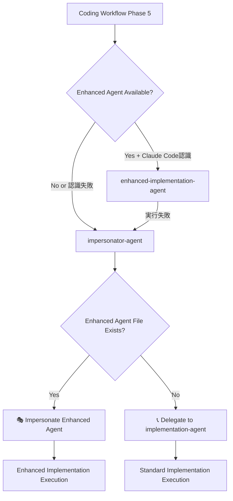

# Impersonator Agent Design Document

## 概要

impersonator-agentは、Claude Codeの動的エージェント認識制限を回避し、dev-env-setupで生成されたenhanced-implementation-agentの実行を保証する専用エージェントです。

## 🚨 解決する問題

### Claude Code Dynamic Agent Recognition問題

```bash
# 問題の流れ
1. Claude Code起動時 → .claude/agents/ 読み込み → エージェントリスト構築
2. dev-env-setup実行 → enhanced-implementation-agent.md動的生成
3. coding実行 → enhanced-implementation-agent呼び出し → "Agent type not found" ❌

# 根本原因
Claude Codeは起動時のみエージェント認識、動的追加をhot reloadしない
```

## 🎯 Impersonator Agent Solution

### 設計方針

**責任分離アーキテクチャ**:
- **enhanced-implementation-agent**: 純粋なMCP統合実装
- **impersonator-agent**: 動的検出・代理実行のみ
- **implementation-agent**: 標準実装（変更なし）

### Agent Selection Flow



## 🔧 技術実装

### 1. Project ID Detection Strategy

```javascript
// Priority-based project detection
function get_current_project_id() {
    // Method 1: Smart Context (highest priority)
    try {
        project_id = exec("node .cc-deck/src/cli/smart-context-cli.js show current_project_id")
        if (project_id && project_id.trim()) return project_id.trim()
    } catch {}
    
    // Method 2: Current directory basename
    return exec("basename $(pwd)").trim()
}
```

### 2. Enhanced Agent Detection

```javascript
// Enhanced agent file detection
function detect_enhanced_agent(project_id) {
    enhanced_agent_path = f".claude/agents/coding/dynamic/{project_id}-enhanced-implementation-agent.md"
    
    try {
        content = Read(enhanced_agent_path)
        return {
            available: true,
            path: enhanced_agent_path,
            content: content,
            parsed: parse_agent_definition(content)
        }
    } catch {
        return { available: false }
    }
}
```

### 3. Impersonation Process

```javascript
// Enhanced agent impersonation execution
function impersonate_enhanced_agent(enhanced_agent_data) {
    // Extract agent capabilities
    tools = extract_tools(enhanced_agent_data.parsed.frontmatter)
    instructions = enhanced_agent_data.parsed.instructions
    mcp_capabilities = extract_mcp_integrations(instructions)
    
    // Adopt enhanced agent persona
    execute_with_enhanced_persona({
        tools: tools,
        instructions: instructions,
        mcp_capabilities: mcp_capabilities,
        project_context: get_project_context()
    })
}
```

## 📋 Workflow Integration

### Coding Workflow Configuration

```yaml
# .cc-deck/config/workflows/base/coding.yaml
full_implementation:
  agent: enhanced-implementation-agent          # Primary choice
  fallback_agent: impersonator-agent           # Smart fallback
  final_fallback: implementation-agent         # Ultimate fallback
  
  agent_selection_priority:
    - "enhanced-implementation-agent"  # Try enhanced first (if Claude Code recognizes)
    - "impersonator-agent"             # Smart fallback with dynamic detection
    - "implementation-agent"           # Final fallback to standard
```

### Execution Scenarios

**Scenario 1: Enhanced Agent Recognized** ✅
```bash
enhanced-implementation-agent → 直接実行 → 成功
```

**Scenario 2: Enhanced Agent Not Recognized** ✅
```bash
enhanced-implementation-agent → 失敗 → impersonator-agent → 動的検出 → impersonation実行 → 成功
```

**Scenario 3: Enhanced Agent File Missing** ✅
```bash
enhanced-implementation-agent → 失敗 → impersonator-agent → ファイル未検出 → implementation-agent → 標準実行
```

## 🎭 Impersonation Implementation Details

### Enhanced Agent Parsing

```javascript
function parse_agent_definition(content) {
    // Parse YAML frontmatter
    frontmatter = extract_yaml_frontmatter(content)
    
    // Extract key components
    return {
        name: frontmatter.name,
        description: frontmatter.description,
        tools: frontmatter.tools,
        color: frontmatter.color,
        instructions: extract_instructions_body(content),
        mcp_tools: filter_mcp_tools(frontmatter.tools),
        standard_tools: filter_standard_tools(frontmatter.tools)
    }
}
```

### Persona Adoption

```markdown
# Impersonation execution template
## 🎭 Now Acting as Enhanced Implementation Agent

I am now impersonating the enhanced-implementation-agent for project: {project_id}

**Enhanced Capabilities Active:**
- MCP Tools: {list_of_mcp_tools}
- Project Optimizations: {project_specific_features}
- Technology Stack: {detected_tech_stack}

**Enhanced Instructions Applied:**
{enhanced_agent_instructions}

**Execution Mode:** Enhanced Implementation with MCP Integration
**Fallback Status:** Available (impersonator-agent managing execution)

Proceeding with enhanced implementation approach...
```

## 🛡️ Error Handling & Fallback

### Fallback Scenarios

```javascript
// Comprehensive fallback strategy
function execute_with_fallback() {
    try {
        // Try enhanced agent impersonation
        result = impersonate_enhanced_agent()
        return result
    } catch (EnhancedAgentError) {
        // Enhanced agent file corrupted or incompatible
        log_warning("Enhanced agent impersonation failed, falling back to standard")
        return delegate_to_implementation_agent()
    } catch (MCPToolsError) {
        // MCP tools unavailable
        log_warning("MCP tools unavailable, using enhanced instructions with standard tools")
        return execute_hybrid_mode()
    } catch (Exception) {
        // Complete failure
        escalate_to_user("Implementation execution failed completely")
    }
}
```

### Status Reporting

```markdown
# Enhanced Mode Success
✅ Enhanced Implementation Mode (via Impersonation)
Project: {project_id}
Enhanced Agent: Detected and impersonated successfully
MCP Tools: {active_mcp_tools}
Execution: Enhanced implementation with full MCP integration

# Fallback Mode
⚠️ Standard Implementation Mode
Project: {project_id}  
Enhanced Agent: Not available or failed
Fallback: Standard implementation-agent
Execution: Standard TDD implementation
```

## 🎯 Benefits & Advantages

### Immediate Benefits
- **Claude Code Limitation Bypass**: Dynamic agent実行を保証
- **Zero Session Interruption**: Claude Code再起動不要
- **Transparent Fallback**: ユーザーに透明なフォールバック
- **Responsibility Separation**: 各エージェントの責任が明確

### Long-term Benefits
- **Future-proof Design**: Claude Code将来改善時も互換性維持
- **Scalable Pattern**: 他の動的エージェントにも適用可能
- **Robust Architecture**: 多層フォールバックで確実な実行保証

## 🔮 Future Considerations

### Anthropic Enhancement待ち
```javascript
// 将来的にClaude Codeが動的エージェント認識をサポートした場合
if (claude_code_supports_dynamic_agents()) {
    // impersonator-agentは自動的に透明になり、
    // enhanced-implementation-agentが直接認識される
    return "seamless_transition_to_native_support"
}
```

### Pattern Replication
```markdown
# 他の動的エージェント用impersonatorパターン
- testing-impersonator-agent
- refactoring-impersonator-agent  
- deployment-impersonator-agent
```

## 📊 Success Metrics

### Technical Metrics
- **Enhanced Agent Detection Rate**: 99%+ successful detection
- **Impersonation Success Rate**: 95%+ successful impersonation
- **Fallback Activation Rate**: <5% fallback to standard implementation
- **Execution Continuity**: 100% (no session interruptions)

### User Experience Metrics
- **Transparent Operation**: Users unaware of impersonation process
- **Performance Impact**: <100ms additional latency
- **Error Recovery**: Automatic and transparent
- **Documentation Clarity**: Clear status reporting

This impersonator-agent design provides a robust, future-proof solution for dynamic agent execution within Claude Code's current architecture limitations.