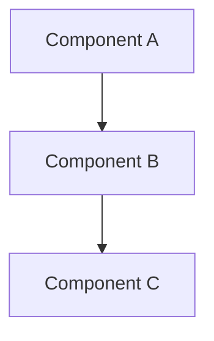
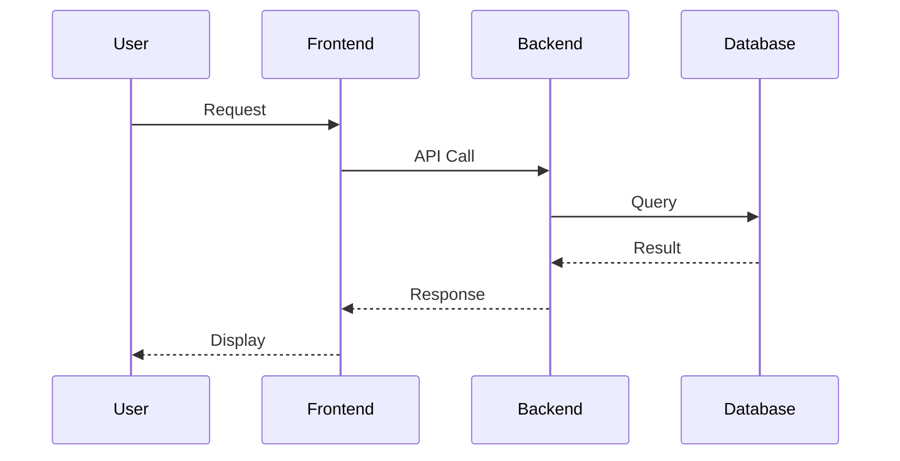
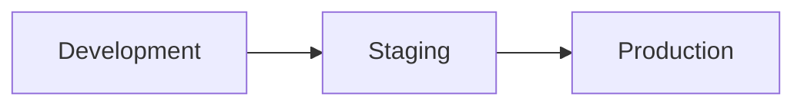

# {Project Name} - System Architecture

> **Document Type**: Architecture Documentation  
> **Last Updated**: {Date}  
> **Review Date**: {Next Review Date}  
> **Authors**: {Author List}

## Table of Contents

1. [System Overview](#system-overview)
2. [Architecture Decisions](#architecture-decisions)
3. [Technology Stack](#technology-stack)
4. [System Components](#system-components)
5. [Data Flow](#data-flow)
6. [Performance Considerations](#performance-considerations)
7. [Security Architecture](#security-architecture)
8. [Deployment Architecture](#deployment-architecture)

## System Overview

### Purpose
Brief description of the system's purpose and goals.

### Key Requirements
- Functional requirements
- Non-functional requirements
- Performance requirements

### Architecture Principles
- Principle 1: Description
- Principle 2: Description
- Principle 3: Description

## Architecture Decisions

### ADR Template
For each major decision, include:
- **Context**: What is the issue that we're seeing?
- **Decision**: What is the change that we're proposing?
- **Status**: Proposed/Accepted/Deprecated/Superseded
- **Consequences**: What becomes easier or more difficult?

## Technology Stack

### Frontend
- Framework: {Framework name and version}
- Styling: {CSS framework/solution}
- Testing: {Testing frameworks}

### Backend
- Runtime: {Runtime and version}
- Framework: {Backend framework}
- Database: {Database technology}

### Infrastructure
- Hosting: {Hosting platform}
- CI/CD: {CI/CD pipeline}
- Monitoring: {Monitoring tools}

## System Components

### Component Diagram

### Component Descriptions
- **Component A**: Purpose and responsibilities
- **Component B**: Purpose and responsibilities
- **Component C**: Purpose and responsibilities

## Data Flow

### Data Flow Diagram

## Performance Considerations

### Performance Requirements
- Load time: < {X} seconds
- Throughput: {X} requests/second
- Availability: {X}% uptime

### Optimization Strategies
- Strategy 1: Description
- Strategy 2: Description

## Security Architecture

### Security Measures
- Authentication: {Method}
- Authorization: {Method}
- Data Protection: {Methods}

### Security Considerations
- Threat modeling results
- Security controls implemented

## Deployment Architecture

### Environment Diagram

### Environment Specifications
- **Development**: Configuration and purpose
- **Staging**: Configuration and purpose
- **Production**: Configuration and purpose