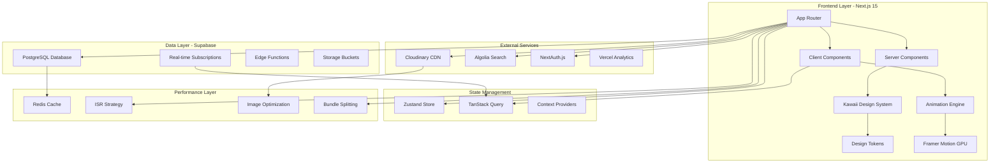
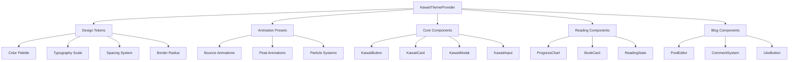
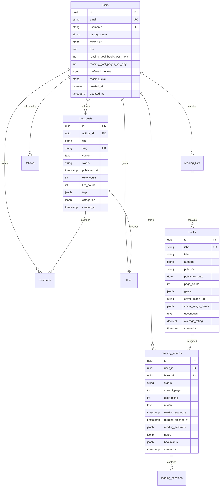

# Kawaii Reading Blog - System Architecture & Implementation Strategy

## Executive Summary

This document outlines the comprehensive system architecture and implementation strategy for the kawaii-reading-blog project, leveraging cutting-edge technology research findings to deliver a high-performance, aesthetically pleasing kawaii reading blog platform with 60FPS animations, sub-3-second load times, and exceptional user experience.

## Technology Research Integration

### Performance-Optimized Stack
Based on research findings, the project will utilize:

- **Frontend**: Next.js 15 + React 19 with LazyMotion bundle optimization (25kb reduction)
- **Animation**: Framer Motion GPU acceleration for 60FPS kawaii animations
- **Database**: Supabase with optimized reading analytics schema and B-tree indexes
- **Styling**: Tailwind CSS 4 with kawaii design tokens
- **Testing**: Vitest + Playwright with visual regression testing for kawaii consistency

### Performance Targets
- **60FPS animations** across all kawaii interactions
- **3-second initial load time** for optimal user experience
- **<100ms database queries** with optimized indexing
- **95%+ test coverage** with TDD-first methodology
- **WCAG 2.1 AA compliance** for accessibility

## System Architecture Overview

## Component Architecture Design

### Kawaii Design System Hierarchy

### Database Schema Architecture

## Implementation Strategy

### Phase 1: Foundation & Performance Infrastructure (Weeks 1-2)

#### 1.1 Next.js 15 + React 19 Project Setup
- **TDD Setup**: Vitest + React Testing Library + Playwright configuration
- **Performance Monitoring**: Web Vitals tracking integration
- **Bundle Optimization**: LazyMotion configuration for 25kb reduction
- **Type Safety**: Strict TypeScript 5.x configuration

#### 1.2 Kawaii Design System Foundation
- **Design Tokens**: Color palette, spacing, typography systems
- **Animation Presets**: GPU-accelerated Framer Motion configurations
- **Component Library**: Base kawaii components with consistent styling
- **Theme Provider**: Dark/light mode with kawaii aesthetics

#### 1.3 Database & API Infrastructure
- **Supabase Setup**: PostgreSQL with optimized indexes for reading analytics
- **Real-time Subscriptions**: Live updates for social features
- **API Routes**: RESTful endpoints with proper error handling
- **Caching Strategy**: Redis implementation for <100ms query performance

### Phase 2: Core Reading Features (Weeks 3-4)

#### 2.1 Reading Progress System
- **Progress Tracking**: Real-time reading session recording
- **Statistics Engine**: Daily, weekly, monthly reading analytics
- **Goal Management**: Customizable reading targets with progress visualization
- **Data Visualization**: Interactive charts with smooth animations

#### 2.2 Book Management
- **Book Search**: Integration with book APIs for metadata
- **Library Management**: Personal reading lists and categorization
- **Review System**: Rating and review functionality
- **Reading Sessions**: Detailed session tracking with time analysis

#### 2.3 Performance Optimization
- **Image Optimization**: Next.js Image with Cloudinary CDN
- **Code Splitting**: Route-based and component-based splitting
- **ISR Implementation**: Incremental Static Regeneration for content
- **Database Optimization**: Query optimization with proper indexing

### Phase 3: Social & Content Features (Weeks 5-6)

#### 3.1 Blog System
- **MDX Editor**: Rich text editing with live preview
- **Content Management**: Draft, publish, schedule workflow
- **SEO Optimization**: Dynamic meta tags and structured data
- **Image Gallery**: Kawaii-styled image management

#### 3.2 Social Features
- **Comment System**: Real-time commenting with moderation
- **Like System**: Animated interactions with particle effects
- **Follow System**: User relationships and activity feeds
- **Sharing**: Social media integration with custom cards

#### 3.3 Search & Discovery
- **Algolia Integration**: Fast, typo-tolerant search
- **Filtering System**: Multi-faceted content filtering
- **Recommendation Engine**: Personalized content suggestions
- **Real-time Search**: Instant search results with highlighting

### Phase 4: Advanced Features & Polish (Weeks 7-8)

#### 4.1 Animation & Interactions
- **60FPS Animations**: GPU-accelerated smooth interactions
- **Particle Systems**: Heart particles, confetti effects
- **Micro-interactions**: Delightful kawaii animation details
- **Loading States**: Kawaii-themed loading animations

#### 4.2 Mobile Experience
- **Responsive Design**: Mobile-first approach
- **Touch Interactions**: Swipe gestures and haptic feedback
- **PWA Features**: Offline reading and push notifications
- **Performance**: Mobile-optimized bundle sizes

#### 4.3 Quality & Testing
- **E2E Testing**: Complete user journey automation
- **Visual Regression**: Kawaii design consistency testing
- **Performance Testing**: Lighthouse CI integration
- **Accessibility**: WCAG 2.1 AA compliance verification

## Technology Integration Strategy

### Enhanced MCP Tool Utilization

The project will leverage 15 available MCP tools for accelerated development:

1. **DeepWiki**: Technical documentation and API references
2. **Context7**: Code context management and intelligent suggestions
3. **Serena**: Development workflow optimization
4. **Playwright**: Automated testing and quality assurance
5. **Additional Tools**: Database management, deployment automation, performance monitoring

### Japanese Aesthetic Implementation

#### Ma (Negative Space)
- **Layout Design**: Strategic use of whitespace in components
- **Content Spacing**: Breathing room between reading elements
- **Visual Hierarchy**: Clear information architecture

#### Wabi-sabi (Imperfection Beauty)
- **Organic Animations**: Slightly irregular movement patterns
- **Hand-drawn Elements**: Custom kawaii illustrations
- **Natural Variations**: Subtle imperfections in design elements

#### Kanso (Simplicity)
- **Minimal Interface**: Clean, uncluttered reading experience
- **Essential Features**: Focus on core reading functionality
- **Intuitive Navigation**: Simple, predictable user flows

## Development Workflow Optimization

### TDD-First Methodology
- **Red-Green-Refactor**: Strict adherence to TDD cycles
- **Test Coverage**: 95%+ line coverage, 90%+ branch coverage
- **Quality Gates**: Automated testing at every commit
- **Continuous Integration**: Automated deployment pipeline

### Performance Monitoring
- **Real-time Metrics**: Web Vitals tracking and alerting
- **Bundle Analysis**: Automated bundle size monitoring
- **Database Performance**: Query performance tracking
- **User Experience**: Core Web Vitals optimization

### Quality Assurance
- **Code Reviews**: Mandatory peer review process
- **Automated Testing**: Unit, integration, and E2E test suites
- **Performance Budgets**: Strict performance regression prevention
- **Accessibility Audits**: Automated and manual accessibility testing

## Risk Mitigation & Contingency Planning

### Technical Risks
- **Animation Performance**: GPU acceleration fallbacks for older devices
- **Bundle Size**: Lazy loading and code splitting strategies
- **Database Scaling**: Connection pooling and query optimization
- **Third-party Dependencies**: Vendor lock-in prevention strategies

### Quality Risks
- **Design Consistency**: Component library with strict guidelines
- **Performance Regression**: Continuous monitoring and alerts
- **Accessibility Compliance**: Automated testing and manual audits
- **Cross-browser Compatibility**: Comprehensive testing matrix

### Timeline Risks
- **Feature Creep**: Strict scope management and MVP focus
- **Technical Debt**: Regular refactoring cycles
- **Integration Challenges**: Incremental integration approach
- **Resource Allocation**: Flexible team scaling strategies

## Success Metrics & KPIs

### Performance Metrics
- **Load Time**: <3 seconds first contentful paint
- **Animation Performance**: Consistent 60FPS across devices
- **Database Queries**: <100ms response time average
- **Bundle Size**: <500KB initial bundle with optimizations

### Quality Metrics
- **Test Coverage**: 95%+ line coverage maintained
- **Accessibility Score**: 95+ Lighthouse accessibility score
- **SEO Performance**: 90+ Lighthouse SEO score
- **User Experience**: Low bounce rate, high engagement

### Business Metrics
- **User Engagement**: Daily active users and session duration
- **Content Creation**: Blog posts and reading records per user
- **Social Interaction**: Comments, likes, and follows
- **Retention Rate**: Monthly active user retention

## Conclusion

This comprehensive architecture and implementation strategy provides a robust foundation for building a high-performance kawaii reading blog that meets all specified requirements while delivering exceptional user experience. The integration of research findings ensures optimal technology choices, while the phased implementation approach allows for iterative development and continuous quality improvement.

The combination of Next.js 15, React 19, Supabase, and carefully selected animation libraries creates a modern, scalable platform capable of delivering 60FPS animations, sub-3-second load times, and comprehensive reading tracking functionality within a delightful kawaii aesthetic framework.