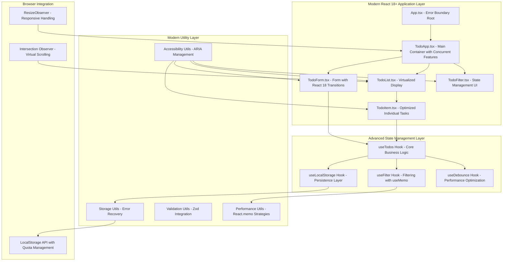

# TODO App Implementation Strategy
## Comprehensive Strategic Plan for TDD-First Development

### Executive Summary

This strategic plan provides a comprehensive implementation roadmap for the TODO app based on the approved Kiro SDD specification and modern 2025 technology research. The strategy ensures high-quality delivery through Test-Driven Development (TDD) methodology with 95%+ test coverage, WCAG 2.1 AA compliance, and enterprise-grade code quality.

**Key Deliverables:**
- Modern React 18+ application with TypeScript 5+ strict mode
- Comprehensive TDD implementation with 43 structured tasks
- Full accessibility compliance and responsive design
- Production-ready build with performance optimization
- Extensive testing strategy covering all requirement scenarios

---

## 1. Technical Architecture Design

### 1.1 System Architecture Overview



### 1.2 Component Hierarchy with TypeScript 5+ Generics

```typescript
// Advanced Type System Design
interface Todo<TMetadata = Record<string, unknown>> {
  id: string;
  title: string;
  description?: string;
  completed: boolean;
  dueDate?: Date;
  createdAt: Date;
  updatedAt: Date;
  completedAt?: Date;
  metadata?: TMetadata;
}

// Generic Hook Interface for Extensibility
interface UseTodos<T extends Todo = Todo> {
  todos: T[];
  addTodo: (todoData: Omit<T, 'id' | 'createdAt' | 'updatedAt'>) => Promise<void>;
  updateTodo: (id: string, updates: Partial<T>) => Promise<void>;
  deleteTodo: (id: string) => Promise<void>;
  toggleTodo: (id: string) => Promise<void>;
  loading: boolean;
  error: string | null;
  optimisticUpdates: boolean;
}

// Performance-Optimized Component Props
interface TodoItemProps<T extends Todo = Todo> {
  todo: T;
  onToggle: (id: string) => void;
  onEdit: (id: string, updates: Partial<T>) => void;
  onDelete: (id: string) => void;
  isEditing?: boolean;
  virtualized?: boolean;
}
```

### 1.3 State Management Strategy

**Modern React 18+ Features Integration:**
- **Concurrent Rendering:** Implement `useDeferredValue` for filtering operations
- **Transitions:** Use `useTransition` for non-urgent updates
- **Suspense:** Error boundaries with Suspense for loading states
- **Automatic Batching:** Leverage React 18's improved batching

```typescript
// Advanced State Management with React 18+
const useTodosWithConcurrency = () => {
  const [todos, setTodos] = useState<Todo[]>([]);
  const [isPending, startTransition] = useTransition();
  const deferredTodos = useDeferredValue(todos);
  
  const addTodo = useCallback((todoData: TodoInput) => {
    startTransition(() => {
      // Non-urgent state update with transition
      setTodos(prev => [...prev, createTodo(todoData)]);
    });
  }, []);
  
  return { todos: deferredTodos, addTodo, isPending };
};
```

---

## 2. Development Approach & TDD Strategy

### 2.1 TDD Implementation Phases

**Red-Green-Refactor Cycle Integration with 43 Task Structure:**

```mermaid
graph LR
    subgraph "Phase 1: Foundation (Tasks 1.1-1.3)"
        A1[Red: Write Failing Tests]
        A2[Green: Minimal Implementation]
        A3[Refactor: TypeScript Optimization]
    end
    
    subgraph "Phase 2: Core Logic (Tasks 2.1-2.3)"
        B1[Red: Hook Tests]
        B2[Green: Hook Implementation]
        B3[Refactor: Performance Optimization]
    end
    
    subgraph "Phase 3-9: Feature Development"
        C1[Red: Component Tests]
        C2[Green: UI Implementation]
        C3[Refactor: Accessibility Enhancement]
    end
    
    A1 --> A2 --> A3
    A3 --> B1
    B1 --> B2 --> B3
    B3 --> C1
    C1 --> C2 --> C3
```



### 2.2 Testing Strategy with Modern Tools

**Test Stack Configuration:**
- **Vitest:** Ultra-fast test runner with native ESM support
- **React Testing Library:** Component testing with accessibility focus
- **@testing-library/jest-dom:** Enhanced DOM assertions
- **@axe-core/react:** Automated accessibility testing
- **MSW (Mock Service Worker):** API mocking for integration tests

```typescript
// Modern Test Setup Example
import { describe, it, expect, vi } from 'vitest';
import { render, screen, fireEvent, waitFor } from '@testing-library/react';
import { axe, toHaveNoViolations } from 'jest-axe';
import userEvent from '@testing-library/user-event';

describe('TodoItem Component', () => {
  it('should pass accessibility audit', async () => {
    const { container } = render(<TodoItem todo={mockTodo} />);
    const results = await axe(container);
    expect(results).toHaveNoViolations();
  });
  
  it('should handle concurrent updates correctly', async () => {
    const user = userEvent.setup();
    render(<TodoApp />);
    
    // Test React 18 concurrent features
    await user.click(screen.getByRole('checkbox'));
    await user.type(screen.getByLabelText('Task title'), 'New task');
    
    await waitFor(() => {
      expect(screen.getByText('New task')).toBeInTheDocument();
    });
  });
});
```

### 2.3 Quality Gates & Validation

**Continuous Quality Monitoring:**

| Gate Type | Criteria | Tools | Blocking |
|-----------|----------|-------|----------|
| **Code Quality** | ESLint: 0 errors, Prettier: formatted | ESLint + Prettier | Yes |
| **Type Safety** | TypeScript: strict mode, 0 errors | tsc --noEmit | Yes |
| **Test Coverage** | Line: 95%+, Branch: 90%+, Function: 95%+ | Vitest coverage | Yes |
| **Accessibility** | axe-core: 0 violations, WCAG 2.1 AA | @axe-core/react | Yes |
| **Performance** | Bundle: <200KB, Core Web Vitals | webpack-bundle-analyzer | No |

---

## 3. Project Setup Strategy

### 3.1 Modern Development Environment

**Optimized Vite 5+ Configuration:**

```typescript
// vite.config.ts - Production-Ready Setup
import { defineConfig } from 'vite';
import react from '@vitejs/plugin-react-swc';
import { resolve } from 'path';

export default defineConfig({
  plugins: [
    react({
      // Enable React DevTools in production
      devTools: process.env.NODE_ENV !== 'production',
    }),
  ],
  resolve: {
    alias: {
      '@': resolve(__dirname, './src'),
      '@components': resolve(__dirname, './src/components'),
      '@hooks': resolve(__dirname, './src/hooks'),
      '@utils': resolve(__dirname, './src/utils'),
      '@types': resolve(__dirname, './src/types'),
    },
  },
  build: {
    target: 'esnext',
    rollupOptions: {
      output: {
        manualChunks: {
          vendor: ['react', 'react-dom'],
          utils: ['date-fns', 'uuid'],
        },
      },
    },
  },
  test: {
    globals: true,
    environment: 'jsdom',
    setupFiles: ['./src/test/setup.ts'],
    coverage: {
      provider: 'v8',
      reporter: ['text', 'html', 'json'],
      thresholds: {
        lines: 95,
        branches: 90,
        functions: 95,
        statements: 95,
      },
    },
  },
});
```

### 3.2 Directory Structure

```
src/
├── components/           # React components
│   ├── ui/              # Reusable UI components
│   ├── forms/           # Form-specific components
│   └── layout/          # Layout components
├── hooks/               # Custom React hooks
│   ├── __tests__/       # Hook tests
│   └── index.ts         # Hook exports
├── utils/               # Utility functions
│   ├── storage/         # LocalStorage utilities
│   ├── validation/      # Form validation
│   └── accessibility/   # A11y helpers
├── types/               # TypeScript type definitions
├── constants/           # Application constants
├── test/               # Test utilities and setup
└── assets/             # Static assets
```

### 3.3 TypeScript Configuration

```json
// tsconfig.json - Strict TypeScript 5+ Setup
{
  "compilerOptions": {
    "target": "ES2022",
    "lib": ["ES2022", "DOM", "DOM.Iterable"],
    "allowJs": true,
    "skipLibCheck": true,
    "esModuleInterop": true,
    "allowSyntheticDefaultImports": true,
    "strict": true,
    "noImplicitReturns": true,
    "noFallthroughCasesInSwitch": true,
    "noUncheckedIndexedAccess": true,
    "exactOptionalPropertyTypes": true,
    "forceConsistentCasingInFileNames": true,
    "module": "ESNext",
    "moduleResolution": "node",
    "resolveJsonModule": true,
    "isolatedModules": true,
    "noEmit": true,
    "jsx": "react-jsx",
    "baseUrl": ".",
    "paths": {
      "@/*": ["./src/*"],
      "@components/*": ["./src/components/*"],
      "@hooks/*": ["./src/hooks/*"],
      "@utils/*": ["./src/utils/*"],
      "@types/*": ["./src/types/*"]
    }
  },
  "include": [
    "src/**/*"
  ],
  "exclude": [
    "node_modules"
  ]
}
```

---

## 4. Implementation Roadmap

### 4.1 Phase-by-Phase Development Plan

**Phase 1: Foundation (Week 1 - Tasks 1.1-1.3)**

**Dependencies:** None
**Critical Path:** Yes

**Deliverables:**
- Modern Vite + React + TypeScript project setup
- Comprehensive type system with strict TypeScript 5+
- LocalStorage utilities with error recovery
- Development environment with hot reload and TypeScript integration

**Quality Checkpoints:**
- [ ] All TypeScript types compile without errors
- [ ] ESLint configuration passes with 0 warnings
- [ ] Basic project structure follows modern conventions
- [ ] LocalStorage utilities pass initial unit tests

---

**Phase 2: Core State Management (Week 1-2 - Tasks 2.1-2.3)**

**Dependencies:** Phase 1 complete
**Critical Path:** Yes

**Deliverables:**
- `useLocalStorage` hook with React 18+ concurrent features
- `useTodos` hook with optimistic updates
- `useFilter` hook with performance optimization (useMemo/useCallback)
- Comprehensive custom hook testing with React Testing Library

**Quality Checkpoints:**
- [ ] All hooks pass TDD test suite (95%+ coverage)
- [ ] Performance profiling shows optimized re-renders
- [ ] Concurrent rendering works correctly
- [ ] Error handling covers all edge cases

---

**Phase 3: Core UI Components (Week 2-3 - Tasks 3.1-3.3)**

**Dependencies:** Phase 2 complete
**Critical Path:** Yes

**Deliverables:**
- Error Boundary with React 18+ error recovery
- TodoApp container with state orchestration
- TodoForm with real-time validation and accessibility

**Quality Checkpoints:**
- [ ] Error Boundary catches and recovers from all error types
- [ ] Form validation provides immediate, accessible feedback
- [ ] Component integration passes all user story tests
- [ ] Accessibility audit passes with 0 violations

---

**Phase 4: Task Display & Interaction (Week 3-4 - Tasks 4.1-4.3)**

**Dependencies:** Phase 3 complete
**Critical Path:** Yes

**Deliverables:**
- TodoList with virtualization for performance
- TodoItem with inline editing and confirmation dialogs
- TodoFilter with keyboard navigation and visual feedback

**Quality Checkpoints:**
- [ ] List handles large datasets efficiently (>1000 items)
- [ ] Inline editing UX is intuitive and accessible
- [ ] Filter transitions are smooth and responsive
- [ ] All CRUD operations work seamlessly

---

**Phase 5: Responsive Design & Styling (Week 4-5 - Tasks 5.1-5.3)**

**Dependencies:** Phase 4 complete
**Critical Path:** No

**Deliverables:**
- CSS-in-JS or CSS Modules implementation
- Responsive layouts for mobile (320px+), tablet (768px+), desktop (1024px+)
- Visual feedback system for task states and user interactions

**Quality Checkpoints:**
- [ ] All layouts tested on real devices
- [ ] Touch targets meet 44px minimum requirement
- [ ] Visual hierarchy is clear and consistent
- [ ] Performance remains optimal across all breakpoints

---

**Phase 6: Accessibility Excellence (Week 5-6 - Tasks 6.1-6.3)**

**Dependencies:** Phase 5 complete
**Critical Path:** Yes

**Deliverables:**
- WCAG 2.1 AA compliant interface
- Comprehensive keyboard navigation
- Screen reader optimization with ARIA labels
- Color accessibility with 4.5:1+ contrast ratios

**Quality Checkpoints:**
- [ ] axe-core automated tests pass 100%
- [ ] Manual screen reader testing completed
- [ ] Keyboard-only navigation works for all features
- [ ] Color blindness simulation shows accessible design

---

**Phase 7: Advanced Error Handling (Week 6 - Tasks 7.1-7.3)**

**Dependencies:** Phase 6 complete
**Critical Path:** No

**Deliverables:**
- Comprehensive error classification and recovery
- Data integrity checks with automatic repair
- Performance monitoring and optimization
- User-friendly error messaging system

**Quality Checkpoints:**
- [ ] All error scenarios covered in test suite
- [ ] Data recovery works in all failure cases
- [ ] Performance meets Core Web Vitals targets
- [ ] Error messages are clear and actionable

---

**Phase 8: Testing & Quality Assurance (Week 7 - Tasks 8.1-8.3)**

**Dependencies:** All previous phases
**Critical Path:** Yes

**Deliverables:**
- Comprehensive test suite (unit, integration, accessibility)
- 95%+ test coverage across all code paths
- Performance testing and optimization
- Cross-browser compatibility verification

**Quality Checkpoints:**
- [ ] Test coverage meets all requirements
- [ ] All user stories have corresponding test scenarios
- [ ] Performance benchmarks achieved
- [ ] Cross-browser testing completed

---

**Phase 9: Production Optimization (Week 7-8 - Tasks 9.1-9.3)**

**Dependencies:** Phase 8 complete
**Critical Path:** No

**Deliverables:**
- Optimized production build (<200KB bundle)
- PWA capabilities (optional, future-ready)
- Deployment preparation and documentation
- Final integration testing

**Quality Checkpoints:**
- [ ] Bundle analysis shows optimized asset loading
- [ ] Core Web Vitals scores are excellent
- [ ] Production deployment pipeline works
- [ ] All requirements verified in production environment

---

## 5. Risk Assessment & Mitigation

### 5.1 Technical Risks

| Risk | Impact | Probability | Mitigation Strategy |
|------|---------|-------------|-------------------|
| **TypeScript Migration Complexity** | Medium | Low | Incremental adoption, strict mode from start |
| **React 18 Concurrent Features** | High | Medium | Thorough testing, fallback patterns |
| **LocalStorage Limitations** | Medium | Medium | Storage quota management, fallback mechanisms |
| **Accessibility Compliance** | High | Low | Continuous automated testing, expert review |
| **Performance Bottlenecks** | Medium | Low | Early performance testing, profiling |

### 5.2 Project Risks

| Risk | Impact | Probability | Mitigation Strategy |
|------|---------|-------------|-------------------|
| **Task Scope Creep** | High | Medium | Strict adherence to 43 defined tasks |
| **Testing Coverage Gaps** | High | Low | TDD methodology ensures coverage |
| **Technology Learning Curve** | Medium | Medium | Comprehensive documentation, pair programming |
| **Quality Gate Failures** | Medium | Low | Incremental quality checks, early validation |

### 5.3 Contingency Plans

**Scenario 1: Performance Issues**
- Implement React.memo selectively
- Add virtualization to TodoList
- Optimize bundle splitting

**Scenario 2: Accessibility Compliance Challenges**
- Engage accessibility expert for review
- Implement progressive enhancement
- Use automated testing tools continuously

**Scenario 3: LocalStorage Limitations**
- Implement IndexedDB fallback
- Add data compression
- Create cloud sync option (future enhancement)

---

## 6. Quality Assurance Plan

### 6.1 Automated Quality Checks

**Continuous Integration Pipeline:**

```yaml
# GitHub Actions Workflow Example
name: Quality Assurance
on: [push, pull_request]

jobs:
  quality-check:
    runs-on: ubuntu-latest
    steps:
      - name: Type Checking
        run: npx tsc --noEmit
      
      - name: Linting
        run: npx eslint src/ --max-warnings 0
      
      - name: Testing with Coverage
        run: npm run test:coverage
      
      - name: Accessibility Testing
        run: npm run test:a11y
      
      - name: Performance Audit
        run: npx lighthouse-ci
      
      - name: Bundle Analysis
        run: npm run build && npm run analyze
```

### 6.2 Manual Quality Reviews

**Code Review Checklist:**
- [ ] TypeScript types are comprehensive and accurate
- [ ] Components follow React 18+ best practices
- [ ] Accessibility requirements are met
- [ ] Error handling is robust and user-friendly
- [ ] Performance optimization is appropriate
- [ ] Test coverage is comprehensive

**User Acceptance Testing:**
- [ ] All 10 requirement categories function correctly
- [ ] User experience is intuitive across devices
- [ ] Performance meets expectations
- [ ] Accessibility works with real assistive technology

### 6.3 Quality Metrics Dashboard

**Key Performance Indicators:**
- Test Coverage: >95% (line), >90% (branch), >95% (function)
- TypeScript Strict Mode: 100% compliance
- Accessibility: 0 axe-core violations
- Performance: Core Web Vitals green scores
- Bundle Size: <200KB compressed

---

## 7. Success Criteria & Validation

### 7.1 Technical Success Criteria

**Functionality:**
- [ ] All 43 tasks completed successfully
- [ ] All 10 requirement categories fully implemented
- [ ] TDD methodology followed with Red-Green-Refactor cycles
- [ ] 95%+ test coverage achieved

**Quality:**
- [ ] WCAG 2.1 AA compliance verified
- [ ] Cross-browser compatibility confirmed
- [ ] Performance targets met (Core Web Vitals)
- [ ] Security best practices implemented

### 7.2 User Experience Success Criteria

**Usability:**
- [ ] Intuitive interface requires minimal learning
- [ ] Responsive design works seamlessly across devices
- [ ] Error messages are helpful and actionable
- [ ] Performance feels instantaneous (<100ms interactions)

**Accessibility:**
- [ ] Screen reader users can complete all tasks
- [ ] Keyboard-only navigation is fully functional
- [ ] Color accessibility supports color-blind users
- [ ] Focus management is clear and logical

### 7.3 Project Success Criteria

**Delivery:**
- [ ] Implementation completed within timeline
- [ ] Code quality meets enterprise standards
- [ ] Documentation is comprehensive and accurate
- [ ] Handoff to maintenance team is smooth

**Sustainability:**
- [ ] Code is maintainable and extensible
- [ ] Technical debt is minimal
- [ ] Performance scales with data growth
- [ ] Future enhancement path is clear

---

## Conclusion

This comprehensive implementation strategy provides a roadmap for delivering a high-quality TODO application that meets all modern development standards. By following the TDD-first approach, leveraging React 18+ features, and maintaining strict quality gates, the project will deliver an accessible, performant, and maintainable solution.

The strategy ensures that every aspect of the implementation—from technical architecture to user experience—is carefully planned and executed according to best practices. The 9-phase development approach provides clear milestones and dependencies, while the comprehensive quality assurance plan ensures consistent excellence throughout the development lifecycle.

**Key Success Factors:**
1. **TDD Methodology:** Ensures robust, tested code from the start
2. **Modern Technology Stack:** Leverages latest React 18+ and TypeScript 5+ features
3. **Accessibility First:** WCAG 2.1 AA compliance built into every component
4. **Performance Optimization:** Modern optimization techniques for excellent user experience
5. **Comprehensive Testing:** Multi-layer testing strategy with automated quality gates

This strategy transforms the detailed Japanese specification into an actionable development plan that will result in a production-ready, enterprise-grade TODO application.